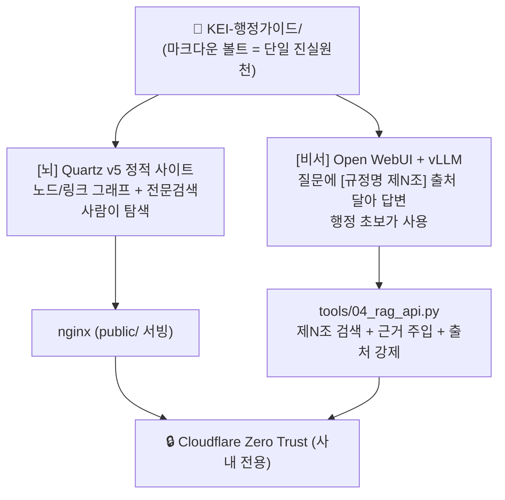
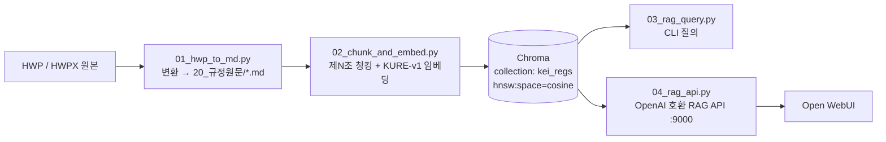
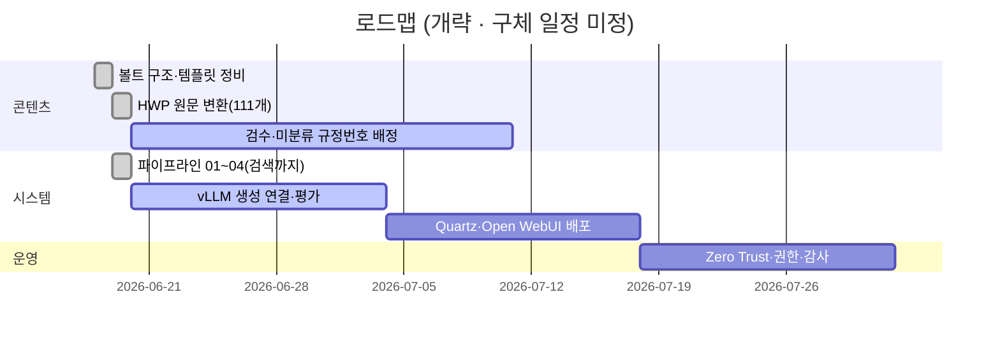

# KEI 행정 가이드 · 행정 비서

> 행정 초보(신입·전입자)가 "이 업무 어떻게 처리하지?"를 **사내 규정 근거로** 빠르게 해결하도록 돕는 온프레미스 지식베이스 + 로컬 LLM 비서.
>
> 단일 진실원천(Source of Truth)인 마크다운 볼트 하나를, 사람이 탐색하는 **[뇌] Quartz 그래프**와 신입이 물어보는 **[비서] Open WebUI + vLLM** 두 화면으로 동시에 서빙합니다. 모델·임베딩은 전부 사내 GPU(Quadro RTX 6000 24GB×2)에서 돌고, 두 화면 모두 Cloudflare Zero Trust 뒤(사내 전용)에 둡니다.

| 항목 | 상태 |
| --- | --- |
| 상태 | 🟢 파이프라인 동작 — 변환·임베딩·검색 검증 완료(답변 생성은 vLLM 연결 대기) |
| 코퍼스 | 규정 원문 **111개** 변환 · **3,044** 조문·머리말 청크 임베딩(KURE-v1) |
| 배포 | 🔒 사내 전용 (인터넷 공개 금지) |
| 모델 | 🖥️ 온프레미스 GPU (Quadro RTX 6000 24GB×2, 총 48GB) |
| 조직 | KEI · 한국환경연구원 (Korea Environment Institute) |
| 레포 | github.com/mooner92/KEIAdminSuperv |

---

## 누구를 위한 것

- **주 사용자 — 행정 초보(신입·전입자):** 출장 정산, 비품 구매, 휴가·복무 같은 행정 업무를 처음 맡았을 때 "어느 규정의 무슨 조항을 봐야 하나?"를 채팅으로 물어보고, **출처가 붙은 답변**을 받습니다.
- **탐색이 필요한 담당자:** 규정들이 어떻게 연결되는지 그래프로 둘러보고, 전문검색으로 원문을 직접 확인합니다.
- **이 시스템을 만드는 개발자/운영자:** 이 README에서 출발해 `docs/`의 설계·계획 문서로 들어갑니다.

> [!note]
> 비서가 주는 답은 **출발점**입니다. 답변 끝에는 항상 사용한 출처(`[규정명 제N조]`)와 "최종 판단은 원문과 담당 부서 확인 바랍니다."가 붙습니다.

---

## 핵심 개념 — 하나의 볼트, 두 개의 화면

단일 진실원천은 레포 안의 마크다운 볼트 `KEI-행정가이드/` 하나뿐입니다. 같은 마크다운을 두 화면이 각자의 방식으로 "먹습니다".

볼트는 **핵심 2-layer**(가치층 `10_업무가이드/` ↔ 진실원천 `20_규정원문/`)에 **보조 2폴더**(`30_용어집/`·`90_관리/`)가 더해진 구조입니다. 즉 폴더가 4개라고 해서 별개의 4계층이 아니라, 같은 볼트를 "4폴더 = 핵심 2-layer + 보조 2폴더"로 보는 같은 구조입니다(정본 표현은 [CLAUDE.md](CLAUDE.md)의 "2-layer").



핵심: **그래프와 채팅은 같은 마크다운을 먹는 두 화면**입니다. 채팅은 그림(그래프)이 아니라 **텍스트 + 임베딩 검색**으로 답합니다.

---

## 빠른 시작 (Quickstart)

> [!warning] 전제 조건
> - **HWP 원본** 규정 파일(`.hwp` / `.hwpx`)이 한 폴더에 모여 있어야 합니다.
> - **GPU 서버**(Quadro RTX 6000 24GB×2, 예: `data05lx` / Ubuntu)에서 임베딩·LLM을 구동합니다.
> - **vLLM**(OpenAI 호환, 기본 `http://localhost:8000/v1`)이 이미 떠 있어야 03/04 단계가 동작합니다.
> - Quartz 빌드에는 **Node v22+**, 비서 화면에는 **Docker**가 필요합니다.

### 1) 파이프라인 (tools/)

```bash
git clone https://github.com/mooner92/KEIAdminSuperv.git
cd KEIAdminSuperv

python -m venv tools/.venv && source tools/.venv/bin/activate
pip install -r tools/requirements.txt
# torch는 드라이버에 맞는 CUDA 빌드로 (드라이버가 CUDA 12.x면 cu124 휠):
pip install torch --index-url https://download.pytorch.org/whl/cu124

# 01) HWP/HWPX → 마크다운 (볼트 20_규정원문/ 아래로). 깨진 파일은 --timeout 으로 격리
python tools/01_hwp_to_md.py --src rule_files --vault KEI-행정가이드

# 02) 제N조 청킹 + KURE-v1 임베딩 + Chroma 적재 (GPU 권장)
python tools/02_chunk_and_embed.py --vault KEI-행정가이드 --db tools/chroma

# 03) 검색만 점검 (LLM 불필요) → 정확한 규정·제N조 회수 확인
python tools/03_rag_query.py --db tools/chroma --q "출장 여비는 어떻게 정산하나요?" --retrieve-only
# 03) 전체 RAG (vLLM 필요)
python tools/03_rag_query.py --db tools/chroma --q "법인카드로 주말에 비품 사도 되나요?"

# 04) OpenAI 호환 RAG API (Open WebUI 백엔드) — tools/ 에서 실행
cd tools && uvicorn 04_rag_api:app --host 0.0.0.0 --port 9000
```

> [!note] 실측 (2026-06-19)
> 규정 원문 **111개** 변환(+1개는 파서 무한루프로 `--timeout` 격리 → LibreOffice fallback 대상), **3,044 청크** 임베딩, 검색 정확(예: "출장 여비 정산" → 여비규정 제9조). **답변 생성**은 vLLM 엔드포인트 연결 시 동작합니다. 파이프라인 상세는 [docs/04-pipeline.md](docs/04-pipeline.md).

### 2) [뇌] Quartz 그래프 사이트 (deploy/)

```bash
# Node v22+ 필요
git clone https://github.com/jackyzha0/quartz.git && cd quartz
npm i && npx quartz create
ln -s /path/to/KEI-행정가이드 content   # 볼트를 content로 심볼릭 링크
npx quartz build --serve                # 로컬 미리보기 :8080
npx quartz build                        # → public/ 정적 산출물 → nginx
```

### 3) [비서] Open WebUI (deploy/)

```bash
cd KEIAdminSuperv/deploy
docker compose up -d        # open-webui + (선택)임베딩 컨테이너
```

이후 Open WebUI 설정 > 연결 > OpenAI API 에 RAG API를 등록합니다.

| 항목 | 값 |
| --- | --- |
| Base URL | `http://<서버 실제 IP>:9000/v1` |
| API Key | `EMPTY` |
| Model ID | `kei-admin-rag` |

> [!note]
> **Base URL은 RAG API를 어떻게 띄웠느냐에 따라 다릅니다.** 같은 `docker compose` 네트워크의 컨테이너로 띄우면 호스트명 `kei-rag-api`를 쓰세요(`http://kei-rag-api:9000/v1`). 이 경우 `deploy/docker-compose.yml`의 `OPENAI_API_BASE_URL=http://kei-rag-api:9000/v1`가 곧 등록값이므로 위 표 대신 그 값을 그대로 사용합니다. 반면 호스트에서 `uvicorn`으로 직접 띄우면(빠른 시작 1)의 04 단계) 위 표처럼 **서버의 실제 IP**(`http://<서버 실제 IP>:9000/v1`)를 씁니다.

> [!warning]
> 연결 URL에 `localhost` / `host.docker.internal` 대신 **서버의 실제 IP**를 쓰세요(흔한 Docker 네트워크 함정). 배포 절차 전체는 [deploy/README.md](deploy/README.md).

---

## 레포 구조

```text
KEIAdminSuperv/
├── KEI-행정가이드/            # 🔒 내부 전용 볼트 — git 비추적(.gitignore)·Syncthing 동기화. 공개 구조 예시는 vault-example/
│   ├── 10_업무가이드/          #   가치층(사람 작성, 항상 [[규정명#제N조]] 원문링크)
│   ├── 20_규정원문/            #   진실원천(HWP 변환, 의역 금지, 규정번호 1000~7999)
│   ├── 30_용어집/              #   개념 1개 = 노트 1개
│   └── 90_관리/                #   템플릿·개정이력·Dataview 인덱스 (_templates는 청킹 제외)
├── tools/                     # 🛠️ 파이프라인
│   ├── 01_hwp_to_md.py        #   변환: HWP → 마크다운
│   ├── 02_chunk_and_embed.py  #   청킹(제N조) + 임베딩 + Chroma 적재
│   ├── 03_rag_query.py        #   CLI 질의
│   ├── 04_rag_api.py          #   OpenAI 호환 RAG API (FastAPI)
│   ├── requirements.txt
│   └── chroma/                #   벡터DB (gitignore)
├── deploy/                    # 🚀 배포
│   ├── setup_ubuntu_hwp.sh    #   HWP 변환 환경(LibreOffice + H2Orestart) 셋업
│   ├── docker-compose.yml     #   Open WebUI (+ 선택 임베딩)
│   └── README.md
├── vault-example/             # 🧪 공개용 합성 볼트 예시(실데이터 0) — 구조 시연
├── docs/                      # 📚 설계·계획 문서 (+ adr/)
├── SECURITY.md                # 🔒 데이터 분류·위협모델·통제
├── README.md                  # ← 지금 이 문서
├── CLAUDE.md                  # 작업 규칙·절대 규칙
├── WORKPLAN.md                # 작업 계획·진행 상황
└── .gitignore
```

위 볼트의 네 폴더는 **핵심 2-layer**(`10_업무가이드/` ↔ `20_규정원문/`)에 **보조 2폴더**(`30_용어집/`·`90_관리/`)를 더한 같은 구조입니다 — "4폴더"와 "2-layer"는 동일한 볼트를 가리키는 다른 호칭입니다.

> [!tip]
> 콘텐츠는 한국어이고 **한글 파일명**을 씁니다. git이 한글 경로를 깨뜨리지 않도록 `git config core.quotepath false`를 적용하세요.

---

## 파이프라인 한눈에



- **01 변환:** `hwp-hwpx-parser`로 본문 추출, 표는 본문 끝 `## (부록) 표`로 처리. 표/별표가 깨지면 LibreOffice + H2Orestart로 PDF를 만들고 그 페이지를 VLM(`Qwen2.5-VL`)에 넘겨 **표만** 마크다운으로 재추출.
- **02 청킹:** **조문 1개 = 청크 1개**(`제N조` 단위). 고정 길이 청킹 금지. 가이드/용어는 노트 전체 1청크.
- **03/04 질의:** 검색 → `[규정명 제N조]` 블록으로 근거 컨텍스트 구성 → 로컬 LLM이 답하고 출처를 강제 표기.

---

## 문서 지도

설계·계획 문서는 모두 `docs/`에 있습니다. 시작은 [docs/README.md](docs/README.md)(인덱스).

| # | 제목 | 한 줄 요약 | 링크 |
| --- | --- | --- | --- |
| 01 | 개요 | 프로젝트 배경·목표·범위 | [01-overview.md](docs/01-overview.md) |
| 02 | 아키텍처 | 하나의 볼트, 두 개의 화면 | [02-architecture.md](docs/02-architecture.md) |
| 03 | 콘텐츠 모델 | 볼트 구조(핵심 2-layer + 보조 2폴더)·프론트매터 스키마 | [03-content-model.md](docs/03-content-model.md) |
| 04 | 파이프라인 | 변환·청킹·임베딩 흐름 | [04-pipeline.md](docs/04-pipeline.md) |
| 05 | RAG 설계 | 검색·근거 주입·가드레일 | [05-rag-design.md](docs/05-rag-design.md) |
| 06 | 배포 | Quartz·Open WebUI·nginx | [06-deployment.md](docs/06-deployment.md) |
| 07 | 보안·거버넌스 | Zero Trust·검수·권한 | [07-security-governance.md](docs/07-security-governance.md) |
| 08 | 로드맵 | 단계별 계획·우선순위 | [08-roadmap.md](docs/08-roadmap.md) |
| 09 | 기여 가이드 | 협업·커밋·검수 절차 | [09-contributing.md](docs/09-contributing.md) |
| 10 | 운영 | 재빌드·갱신·장애 대응 | [10-operations.md](docs/10-operations.md) |
| 11 | 용어집 | 프로젝트 용어 정의 | [11-glossary.md](docs/11-glossary.md) |

**아키텍처 결정 기록(ADR):** [docs/adr/README.md](docs/adr/README.md) — 임베딩 모델, 조문 단위 청킹, 통제형 RAG API, Quartz 그래프, 온프레미스 Zero Trust 등 주요 결정의 근거.

> [!tip] 독자별 추천 경로
> - **신입·행정 담당자:** 01 → 03 → 11
> - **개발자:** 02 → 04 → 05 → ADR
> - **운영자:** 06 → 07 → 10

---

## 기술 스택

| 영역 | 선택 | 비고 |
| --- | --- | --- |
| 변환 | `hwp-hwpx-parser` | `.hwp`/`.hwpx` 모두. 표 깨지면 LibreOffice + H2Orestart + `Qwen2.5-VL` |
| 임베딩 | `nlpai-lab/KURE-v1` | 대안 `BAAI/bge-m3`. 양자화 안 함, `normalize_embeddings=True` |
| 벡터DB | Chroma `PersistentClient` | collection `kei_regs`, 메타 `hnsw:space=cosine` |
| LLM 서빙 | vLLM (OpenAI 호환) | 기본 `http://localhost:8000/v1`, 모델 `Qwen/Qwen2.5-14B-Instruct` 등 일반 instruct. 14B fp16(약 28GB)은 RTX 6000 단일 24GB 초과 → 2장 텐서병렬(`--tensor-parallel-size 2`) 또는 더 작은 instruct(7B/3B)·양자화 서빙. 임베딩(KURE-v1)은 1장으로 충분(실측) |
| 한국어 LLM 대안 | EXAONE / Kanana | 코더·VL 모델 아님 |
| RAG API | FastAPI + uvicorn | `04_rag_api.py`, `MODEL_ID=kei-admin-rag`, 포트 9000 |
| 비서 UI | Open WebUI (Docker) | 포트 3000:8080, `WEBUI_AUTH=true` |
| 그래프 사이트 | Quartz v5 (Node v22+) | `public/` 산출 → nginx |
| 청킹 보조 | `kss`(선택) | 한국어 문장 분리 |
| 런타임 | Python venv `tools/.venv` | deps `tools/requirements.txt` |

---

## ⛔ 절대 규칙 (요약)

전체 규칙과 근거는 [CLAUDE.md](CLAUDE.md)에 있습니다. 본문·예시 어디서도 약화시키지 마세요.

1. **규정 내용을 지어내지 않는다.** 금액·한도·기한·조건을 추측해 쓰지 않는다. 원문이 없으면 `「TODO: 원문 확인」` placeholder를 둔다.
2. **원문층(`20_규정원문/`)은 의역 금지.** HWP 원문을 그대로 옮긴다.
3. **모든 가이드/답변에 출처를 단다.** 가이드는 `[[규정명#제N조]]` 위키링크, RAG 답변은 끝에 `[규정명 제N조]` + 면책 문구.
4. **RAG 가드레일을 약화시키지 않는다.** 근거에 없는 내용(특히 금액·한도·기한)은 "규정에서 확인되지 않습니다"라고 답한다.
5. **내부 규정 — 어떤 화면도 인터넷 공개 금지.** 공개를 권하는 서술을 하지 않는다.

---

## 보안 / 내부 전용

> [!warning]
> KEI 내부 규정입니다. **[뇌] Quartz와 [비서] Open WebUI 두 화면 모두 인터넷 공개 금지.**

- 두 화면 모두 **Cloudflare Zero Trust Access** 정책 뒤에 둡니다.
- Open WebUI 자체 인증(RBAC/SSO)으로 한 겹 더 보호합니다.
- 모델·임베딩·벡터DB가 전부 **온프레미스(Quadro RTX 6000 24GB×2)**라 데이터는 망 밖으로 나가지 않습니다.

자세한 정책은 [07-security-governance.md](docs/07-security-governance.md) 및 [ADR 0005](docs/adr/0005-on-prem-zero-trust.md).

> [!todo] 확인 필요: Cloudflare 팀/도메인명, 서버 호스트명·IP, GPU 수량 등 운영 환경의 구체 값은 미정. 배포 전 확정해 [06-deployment.md](docs/06-deployment.md)에 반영.

---

## 상태 & 로드맵

- 프로젝트 시작: **2026-06-18**
- 현재 단계: **파이프라인 동작** — P1 변환·P2 임베딩·P3 검색/API 검증 완료(답변 생성은 vLLM 연결 대기). 다음: 검수 · 미분류 37개 규정번호 배정 · vLLM 생성 검증 · 배포(P4)



> [!note]
> 위 간트는 순서를 보여주는 개략도입니다. 구체 날짜·인원은 미정 — 진행 상황은 [WORKPLAN.md](WORKPLAN.md), 단계별 계획은 [08-roadmap.md](docs/08-roadmap.md)에서 관리합니다.

---

## 내부 전용 고지

본 저장소와 모든 산출물은 **KEI(한국환경연구원) 내부 전용**입니다. 별도 오픈소스 라이선스를 부여하지 않으며, 조직 외부로의 배포·공개·재사용을 금합니다. 협업은 권한이 부여된 계정에 한합니다.

---

## 관련 문서

**문서 인덱스:** [docs/README.md](docs/README.md) · **작업 규칙:** [CLAUDE.md](CLAUDE.md) · **작업 계획:** [WORKPLAN.md](WORKPLAN.md)

| 이전 | 다음 |
| --- | --- |
| — (최상위 진입 문서) | [docs/01-overview.md →](docs/01-overview.md) |

---

최종 수정: 2026-06-19
