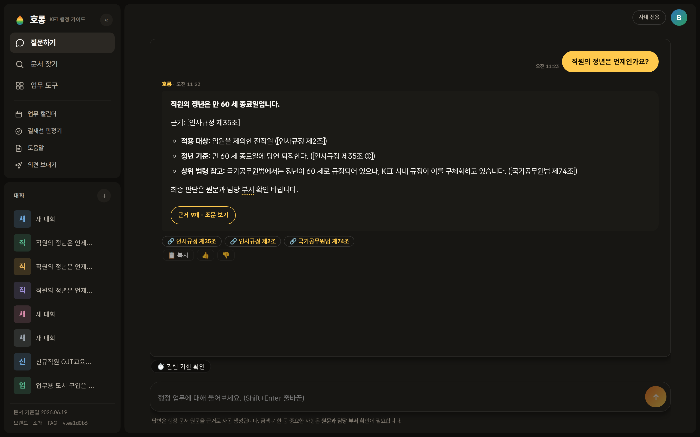
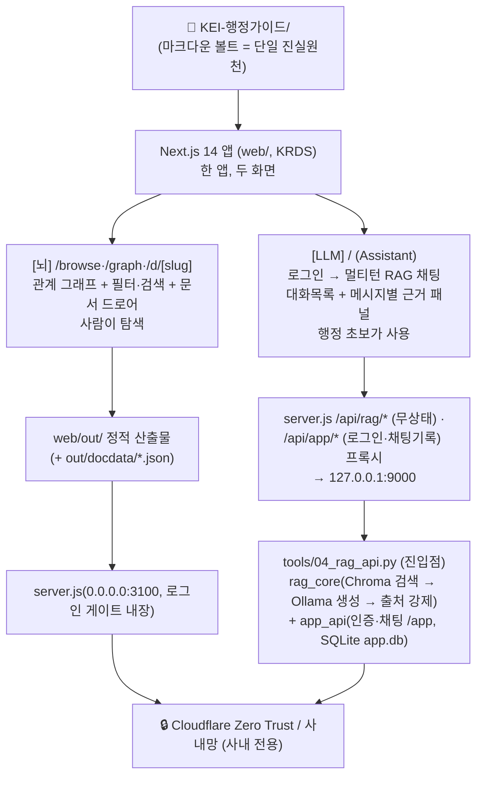
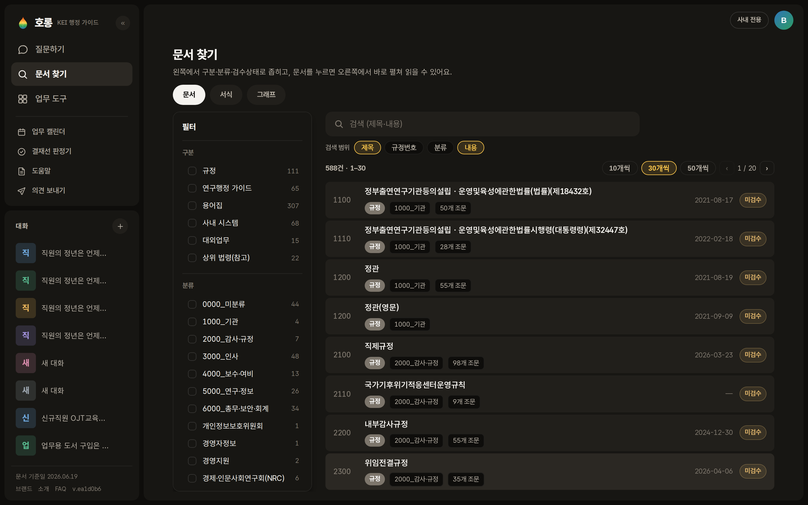
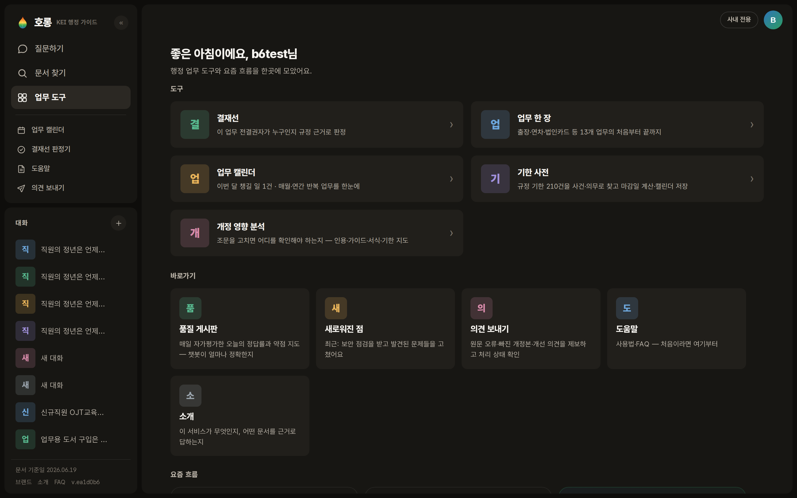
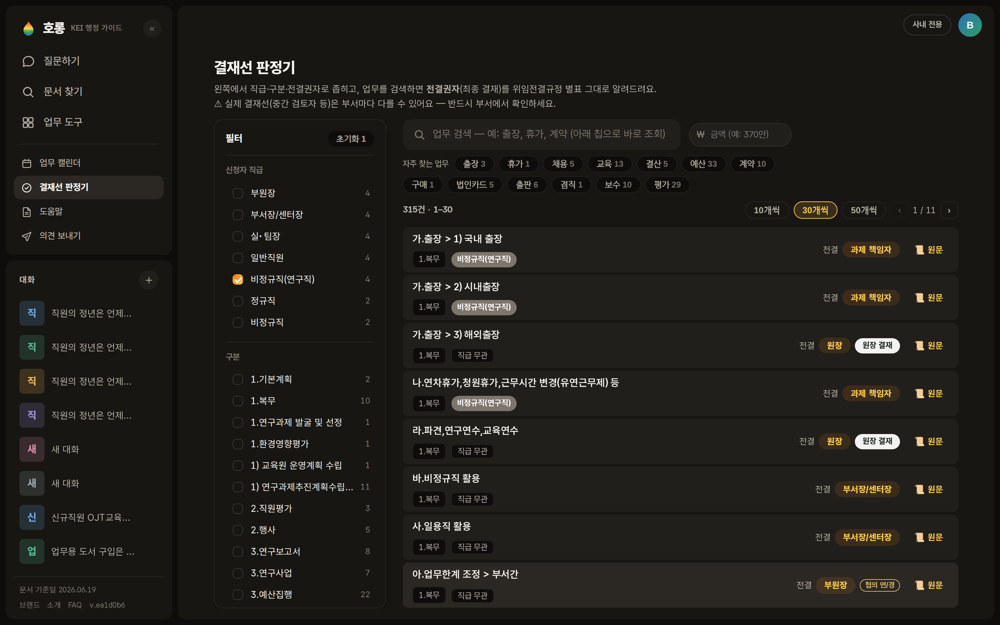
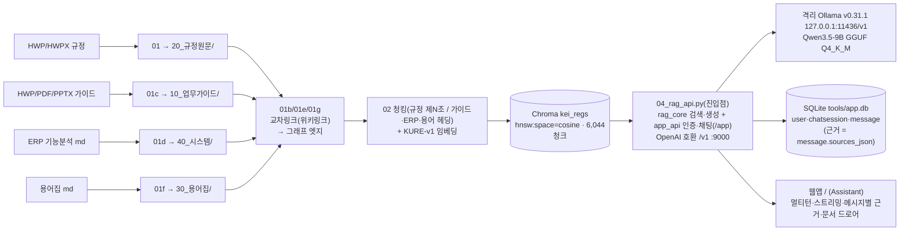
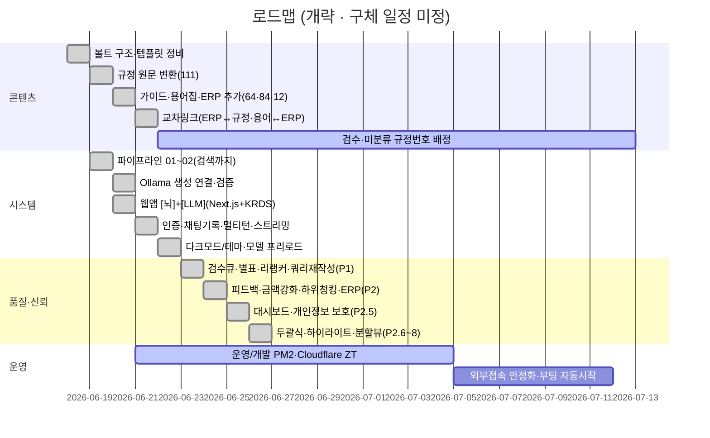

<div align="center">

# 🏮 호롱 · KEI 행정 가이드

**사내 규정을 근거로 답하는 온프레미스 RAG 챗봇 + 지식베이스**<br/>
행정 초보가 "이 업무 어떻게 처리하지?"를 물으면, `[규정명 제N조]` 출처를 달아 답합니다.

[](#보안--내부-전용)
[](#기술-스택)
[](#기술-스택)
[](#기술-스택)
[](#기술-스택)
[](#2-웹앱--뇌와-llm을-한-앱으로-web)
[](#내부-전용-고지)

<p align="center">
  <a href="README.md">English</a> &bull;
  <b>한국어</b>
</p>



<sub>규정 근거 답변 · 인용 조문 칩 · 근거 열람 · 면책 고지 · 👍/👎 피드백<br/>
⚠️ 게재 화면의 근거는 <b>ALIO 공개 규정집과 국가 법령만</b> — 내부 가이드·ERP 문서는 스크린샷에 담지 않습니다.</sub>

</div>

---

## 왜 이걸 만들었나

행정·회계·감사 영역에서 **틀린 답은 실제 사고**가 됩니다. 그래서 "그럴듯한 답"보다 **틀리지 않는 것**을 우선했습니다.

- **지어내지 않는다.** 근거에 없으면 "규정에서 확인되지 않습니다"라고 답합니다. 금액·%·기간·날짜가 근거에 없으면 ⚠️ 경고를 **결정적으로**(LLM 재량이 아니라 코드로) 붙입니다.
- **모든 답에 조문 출처.** `[규정명 제N조]`를 달고, 근거 카드를 누르면 그 조문이 그 자리에서 열립니다.
- **삭제된 조문은 근거에서 강등.** 개정 이력을 색인해 폐지 조문이 답의 근거가 되지 못하게 막습니다.
- **깨진 표는 수치 인용 금지.** HWP 변환에서 무너진 표를 감지해 그 표의 숫자를 인용하지 않습니다.
- **인터넷에 나가지 않는다.** 생성·임베딩·리랭킹 전부 사내 GPU, 화면은 사내망 전용.
- **스스로 채점한다.** 매일 자동 출제·채점(평일 200·주말 500×3회차)해 정답률·약점 지도를 게시판에 남깁니다.

## 목차

[누구를 위한 것](#누구를-위한-것) · [핵심 개념](#핵심-개념--하나의-볼트-두-개의-화면) · [화면](#화면) · [빠른 시작](#빠른-시작-quickstart) · [레포 구조](#레포-구조) · [파이프라인](#파이프라인-한눈에) · [품질·신뢰 루프](#검수--피드백--운영-대시보드-품질--신뢰--자기개선) · [운영 버전](#운영-버전--운영prod--개발dev) · [문서 지도](#문서-지도) · [기술 스택](#기술-스택) · [⛔ 절대 규칙](#-절대-규칙-요약) · [보안](#보안--내부-전용) · [상태 & 로드맵](#상태--로드맵)

---

> 행정 초보(신입·전입자)가 "이 업무 어떻게 처리하지?"를 **사내 규정 근거로** 빠르게 해결하도록 돕는 온프레미스 지식베이스 + 로컬 LLM.
>
> 단일 진실원천(Source of Truth)인 마크다운 볼트 하나를, 사람이 탐색하는 **[뇌] 그래프·문서**와 신입이 물어보는 **[LLM] RAG 채팅**으로 동시에 서빙합니다. 두 화면 모두 한 개의 **Next.js 14 앱(`web/`, KRDS 기반 자체 토큰·Pretendard GOV — TDS는 라이선스 이슈로 제거, docs/37)**에 통합되어 있습니다 — LLM은 별도 Open WebUI가 아니라 우리 RAG API를 호출하는 앱 내 채팅 화면입니다. LLM에는 **로그인·회원가입, 채팅기록 영속화, 멀티턴 기억, 답변(메시지)별 근거 저장, 응답 스트리밍(SSE)**이 들어 있고, **검색 품질**은 리랭커(P1.4)·멀티턴 쿼리 재작성(P1.5)으로, **신뢰**는 답변 피드백(👍/👎, P2.1)·금액 신뢰 강화(P2.2)·운영자 대시보드(P2.5)로 보강했습니다. 답변 생성은 **격리 Ollama v0.31.1**(Qwen3.5-9B GGUF Q4_K_M, OpenAI 호환), 검색 임베딩은 **KURE-v1**로 모두 사내 GPU(Quadro RTX 6000 24GB×2)에서 돌고, 화면은 Cloudflare Zero Trust 뒤(사내 전용)에 둡니다.

| 항목 | 상태 |
| --- | --- |
| 상태 | 🟢 파이프라인 + LLM 가동 · 검색(리랭커·쿼리 재작성)·신뢰(피드백·금액·신뢰게이트) 보강 · 화면 9종(채팅·둘러보기·그래프·결재선·업무 한 장·캘린더·서식·허브·소개) + 용어 툴팁 · KRDS 디자인 통일 · 서식찾기 별지 **PDF↓/HWP↓ 다운로드**(별지 288건, docs/50) · 모바일 개편(GNB 3탭, docs/48) |
| 코퍼스 | **599 문서**(규정집·연구행정 가이드·용어집 307+·사내 시스템·대외업무·상위법령(참고)) · **6,192 청크** 임베딩(KURE-v1, `kei_regs`) + 상위법령 4,116(`kei_uplaw`, 물리 분리) — 2026-08-12 실측, v1.11.0 승격으로 **prod 동일** |
| 배포 | 🔒 사내 전용 · dev 3101/9001(`feat/krds`, **정착 확정** — 이전 시에도 이 포트 유지, manual/) · prod 3100/9000(`feat/0620`, 동결) · **서버 로그인 게이트**(비로그인은 랜딩만, docs/44) — 랜딩(`/about`) 외부 공개 대비 |
| 모델 | 🖥️ 온프레미스 GPU (Quadro RTX 6000 24GB×2, 총 48GB) · 답변 격리 Ollama v0.31.1(Qwen3.5-9B GGUF Q4_K_M) |
| 조직 | KEI · 한국환경연구원 (Korea Environment Institute) |
| 레포 | github.com/mooner92/KEIAdminSuperv |

---

## 누구를 위한 것

- **주 사용자 — 행정 초보(신입·전입자):** 출장 정산, 비품 구매, 휴가·복무 같은 행정 업무를 처음 맡았을 때 "어느 규정의 무슨 조항을 봐야 하나?"를 채팅으로 물어보고, **출처가 붙은 답변**을 받습니다. 로그인하면 **이전 대화가 그대로 남고**(채팅기록), 같은 대화 안에서 **앞선 답변을 이어 물을 수 있으며**(멀티턴), 지난 답변을 클릭하면 **그때 사용한 근거**를 다시 볼 수 있습니다.
- **탐색이 필요한 담당자:** 규정들이 어떻게 연결되는지 그래프로 둘러보고, 전문검색으로 원문을 직접 확인합니다.
- **이 시스템을 만드는 개발자/운영자:** 이 README에서 출발해 `docs/`의 설계·계획 문서로 들어갑니다.

> [!note]
> LLM이 주는 답은 **출발점**입니다. 답변 끝에는 항상 사용한 출처(`[규정명 제N조]`)와 "최종 판단은 원문과 담당 부서 확인 바랍니다."가 붙습니다.

---

## 핵심 개념 — 하나의 볼트, 두 개의 화면

단일 진실원천은 레포 안의 마크다운 볼트 `KEI-행정가이드/` 하나뿐입니다. 같은 마크다운을 두 화면이 각자의 방식으로 "먹습니다".

볼트는 **핵심 2-layer**(가치층 `10_업무가이드/` ↔ 진실원천 `20_규정원문/`)에 **보조 폴더**(`30_용어집/`·`40_시스템/`(사내 시스템)·`50_대외업무/`(대외요구자료 반복업무 3개년 운영 통계·가이드, ⛔규정 아님 — '(운영 통계)' 라벨)·`90_관리/`)가 더해진 구조입니다. 화면의 '구분' 섹션은 **규정집 · 연구행정 가이드 · 용어집 · 사내 시스템 · 대외업무** 5개이며, 진실원천 2-layer 위에 용어/시스템/대외업무가 보조로 얹힌 같은 볼트입니다(정본 표현은 [CLAUDE.md](CLAUDE.md)의 "2-layer").



핵심: **그래프와 채팅은 같은 마크다운을 먹는 두 화면**입니다. 채팅은 그림(그래프)이 아니라 **텍스트 + 임베딩 검색**으로 답합니다.

---

## 화면

한 앱에 **질문하기(RAG 채팅) · 문서 찾기(문서·서식·그래프) · 업무 도구**가 들어 있습니다.

<table>
<tr>
<td width="50%" valign="top">

<br/><sub><b>문서 찾기</b> — 구분·분류·검수상태 필터(패싯 카운트) + 제목·내용 전문검색. 행을 누르면 페이지 이동 없이 우측 드로어로 원문이 열립니다.</sub>
</td>
<td width="50%" valign="top">

<br/><sub><b>업무 도구</b> — 결재선 판정기 · 업무 한 장(여정) · 업무 캘린더 · 기한 사전. 규정에서 뽑아낸 인덱스로 계산하며, 값을 추측하지 않습니다.</sub>
</td>
</tr>
<tr>
<td width="50%" valign="top">

<br/><sub><b>결재선 판정기</b> — 업무·직급·금액을 고르면 위임전결규정 별표(335규칙)를 근거로 전결권자를 판정합니다. 공식 전결기준과 "부서 확인" 면책을 함께 표시합니다.</sub>
</td>
<td width="50%" valign="top">

**그 밖의 화면**

- **업무 한 장** — 출장·연차·법인카드 등 13종 업무를 처음부터 끝까지 한 장으로
- **업무 캘린더** — 이번 달 히어로 + 4×3 연간 그리드
- **기한 사전** — 규정 기한을 기준일→마감일로 계산하고 `.ics`로 저장
- **서식 찾기** — 별지 서식 PDF·HWP 다운로드
- **관계 그래프** — 규정 간 상호참조를 노드·링크로 탐색
- **관리자** — 정답률·거부율·👍/👎·콘텐츠 갭 대시보드

</td>
</tr>
</table>

> [!note]
> 위 이미지는 `web/shots-readme.mjs`가 실제 화면을 렌더해 만듭니다. 이 스크립트는 **근거에 비공개 층(내부 가이드·ERP 문서)이 섞이면 실패**하도록 가드를 두고 있어, 공개해선 안 되는 화면이 README에 들어가지 않습니다.

---

## 빠른 시작 (Quickstart)

> [!warning] 전제 조건
> - **HWP 원본** 규정 파일(`.hwp` / `.hwpx`)이 한 폴더에 모여 있어야 합니다.
> - **GPU 서버**(Quadro RTX 6000 24GB×2, 예: `data05lx` / Ubuntu)에서 임베딩·LLM을 구동합니다.
> - **격리 Ollama v0.31.1**(OpenAI 호환, `http://127.0.0.1:11436/v1`, PM2 `kei-ollama-v031`, ctx 8K, 모델 `hf.co/unsloth/Qwen3.5-9B-GGUF:Q4_K_M` ~5.7GB)가 이미 떠 있어야 03/04 단계가 동작합니다. (모델 pull은 Ollama 레지스트리 차단으로 `hf.co/` 프리픽스 사용.)
> - 웹앱(`web/`, Next.js 14, KRDS) 빌드·실행에는 **Node v22+**가 필요합니다. ⚠️ **반드시 nvm Node 22**로 빌드하세요 — 기본 node18에서는 `out/docdata/*.json` emit이 조용히 실패해 문서 드로어가 깨집니다("문서를 불러오지 못했습니다").

### 1) 파이프라인 (tools/)

```bash
git clone https://github.com/mooner92/KEIAdminSuperv.git
cd KEIAdminSuperv
git config core.hooksPath .githooks   # 내부 콘텐츠 커밋 차단 훅 활성화 (1회)

python -m venv tools/.venv && source tools/.venv/bin/activate
pip install -r tools/requirements.txt
# torch는 드라이버에 맞는 CUDA 빌드로 (드라이버가 CUDA 12.x면 cu124 휠):
pip install torch --index-url https://download.pytorch.org/whl/cu124

# 01) 규정 HWP/HWPX → 20_규정원문/ (깨진 파일은 --timeout 으로 격리)
python tools/01_hwp_to_md.py --src rule_files --vault KEI-행정가이드
# 01c) 가이드 HWP/HWPX/PDF/PPTX → 10_업무가이드/   ·   01d) ERP → 40_시스템/   ·   01f) 용어집 → 30_용어집/
python tools/01c_guides_to_md.py --src research_rule_files --vault KEI-행정가이드
python tools/01d_erp_to_md.py --src KEI_ERP_entire_features.md --vault KEI-행정가이드
python tools/01f_terms_to_md.py --src KEI_admin_terms.md --vault KEI-행정가이드
# 01e/01g) 교차링크(ERP·용어↔규정)   ·   01b) 규정 상호참조 → [[ ]] (그래프 엣지)
python tools/01e_erp_crosslink.py --vault KEI-행정가이드
python tools/01g_terms_crosslink.py --vault KEI-행정가이드
python tools/01h_defs_to_terms.py --vault KEI-행정가이드   # 규정 정의(제2조 등)에서 용어 추출 → 30_용어집/ 확충(88→119, docs/49)
python tools/01b_autolink.py --vault KEI-행정가이드

# 01i·01j·01k) 조문 정제(Track A) — 원문 재마이닝 → tools/index/*.json (삭제·개정·준용·정의어, 재임베딩 불필요)
python tools/01i_clause_xref.py --vault KEI-행정가이드     # 조문↔조문 준용·인용 그래프
python tools/01j_defterms.py --vault KEI-행정가이드        # 정의어 사전 + 교차 정의충돌
python tools/01k_article_status.py --vault KEI-행정가이드  # 삭제 조문·개정 시계열(삭제 근거 강등)
python tools/01l_graph_analytics.py                       # (Track C) 개정 파급·함께 보는 조문·고립노드
python tools/01m_deadlines.py --vault KEI-행정가이드       # (Track B) 상대기한 → 기준일→마감일 계산+.ics
python tools/01n_approval.py --vault KEI-행정가이드        # (Track B) 위임전결 별표 → 업무·직급→전결권자

# 01p·01q) 별지 서식(docs/50) — HWP→ODT(서체·줄간격 보정)→PDF → 별지별 분리 PDF+PNG+원본 HWP 사본+manifest(재색인 훅이 증분 실행)
python tools/01p_byeolji_pdf.py            # → web/public/forms-pdf/ (HWP 처리 110규정 → 별지 보유 61규정·288건)
python tools/01q_byeolji_audit.py          # 별지 A/B/C/D 감사 리포트(복원은 사람이 PNG 대조 전사)

# 02) 청킹(규정 제N조 / 가이드·ERP·용어 헤딩) + KURE-v1 임베딩 + Chroma 적재 (GPU 권장)
python tools/02_chunk_and_embed.py --vault KEI-행정가이드 --db tools/chroma

# 03) 검색만 점검 (LLM 불필요) → 정확한 규정·제N조 회수 확인
python tools/03_rag_query.py --db tools/chroma --q "출장 여비는 어떻게 정산하나요?" --retrieve-only
# 03) 전체 RAG (Ollama 필요)
python tools/03_rag_query.py --db tools/chroma --q "법인카드로 주말에 비품 사도 되나요?"

# 04) OpenAI 호환 RAG API + 로그인·채팅기록 API (웹앱 LLM 백엔드) — 운영은 PM2로 상시 가동
#     127.0.0.1:9000(로컬 전용, LAN 비노출). env(Ollama 연결)는 tools/ecosystem.config.js 참조
#     기동 시 SQLite(tools/app.db) 자동 init, JWT 서명키(tools/.app_secret 0600)는 없으면 자동 생성
pm2 start tools/ecosystem.config.js          # 프로세스 kei-rag-api 기동
# (수동 실행이 필요하면) cd tools && uvicorn 04_rag_api:app --host 127.0.0.1 --port 9000
```

> [!note] 실측 (2026-07-16)
> 코퍼스 **599 문서** → **6,044 청크** 임베딩(`kei_regs`, 2026-07-31 실측 — 긴 조문 하위분할(P2.3)·정의어 노트(specs/02)·검색 라벨(specs/01) 반영). 검색 정확(예: "출장 여비 정산" → 여비규정 해당 조 · "재직증명서 어느 메뉴" → ERP 인사관리 제증명서신청 `gen_3015M`). **답변 생성**은 격리 Ollama v0.31.1(Qwen3.5-9B GGUF Q4_K_M)로 한국어까지 검증. 변환 실패 2건(타임아웃 1·이미지PDF 1)은 LibreOffice/OCR 폴백 대상. 파이프라인 상세는 [docs/04-pipeline.md](docs/04-pipeline.md).

### 2) 웹앱 — [뇌]와 [LLM]을 한 앱으로 (web/)

이전 방식(Quartz)을 대체하는 현재 웹앱은 레포의 `web/`(Next.js 14, **KRDS 참고 자체 토큰 + Pretendard GOV self-host** — TDS는 라이선스 이슈로 제거, docs/37)입니다. [뇌](그래프·문서)와 [LLM](RAG 채팅)이 같은 앱·같은 KRDS 디자인 안에 통합되어 있습니다. 볼트는 빌드타임에 read-only로 읽습니다(`VAULT_DIR`, 기본값은 레포 루트).

페이지·컴포넌트:

- **`/` = 통합 랜딩 + LLM(Assistant):** 비로그인 시 **소개 슬라이드(스냅 스크롤) + 우측 고정 로그인 시트**(docs/47)이고, 로그인하면 같은 주소가 멀티턴 RAG 채팅으로 전환됩니다. 게이트는 클라이언트가 아니라 **server.js가 JWT(`kei_session`)를 서버에서 검증**합니다(docs/44, fail-closed — 비로그인은 랜딩 셸(`/`·`/about`)만, 문서·docdata·검색인덱스·`/api/rag/chat` 전부 차단). 로그인하면 `ChatApp`은 **좌측 대화목록 사이드바**(새 대화·선택·삭제), **중앙 멀티턴 채팅**, 우측 **'메시지별' 근거 패널**, Notion형 **문서 드로어**로 구성됩니다. 지난 답변을 클릭하면 그때 저장된 근거를 우측에 다시 표시하고, 근거 카드를 클릭하면 드로어가 해당 조(제N조 앵커)로 펼쳐집니다. 근거 카드에는 출처 성격 배지(📜규정 공식 / 📘가이드 참고, `source_type_badges` 플래그)가 붙습니다. 같은 오리진 `/api/app/*`(로그인·채팅기록)와 `/api/rag/chat`(무상태)을 plain fetch(React hooks, React Query 미도입)로 호출합니다. 답변은 **SSE 스트리밍**(`POST /app/chats/{id}/messages?stream=1` → `meta`→`delta`…→`done`)으로 토큰을 순차 표시하며, 답변마다 **👍/👎 피드백**(+사유)을 남길 수 있습니다(P2.1). 금액·한도가 포함된 답변은 "원문에서 수치 확인" 경고 + 근거 스니펫 수치 강조(`<mark>`) + 근거별 검수상태 배지로 신뢰를 보강합니다(P2.2).
- **`/browse` = 둘러보기(Explorer):** 좌측 체크박스 **필터**(구분=규정집/가이드/용어집/사내 시스템, 분류, 검수상태) + 검색(제목·번호·분류에 더해 **원문 내용 전문검색** — `content_search` 플래그, `search-index.json` lazy-load) + 결과 목록. 행을 클릭하면 페이지 이동 없이 우측 Notion형 드로어로 본문이 열립니다. 패싯 카운트(다른 필터 반영) 제공.
- **`/graph` = 관계 그래프:** 기존 react-force-graph-2d.
- **`/forms` = 서식찾기:** 별지 서식 검색 + **페이지네이션(10/30/50)** + **PDF↓/HWP↓ 다운로드 컬럼**(별지 분리 PDF 288건·원본 HWP, 폐지 서식은 다운로드 미제공, docs/50).
- **`/calendar` = 업무 캘린더:** 이번달 히어로 + 4×3 연간 그리드(docs/43).
- **`/approval` 결재선 · `/journey` 업무 한 장(여정 13종) · `/now` 추가 기능 허브 · `/about` 소개(랜딩과 동일 디자인, 로그인 폼 없음) · `/admin` 운영자.** 본문·답변의 행정 용어에는 **인라인 툴팁**(점선 밑줄→정의 팝오버, 용어집 119개, flag `term_tooltips`, docs/45)이 붙고, 모바일은 **GNB 3탭 + 사이드바 드로어**로 재구성됩니다(docs/48).
- **`/d/[slug]` = 전체화면 문서:** 드로어의 '전체화면' 폴백(기존 SSG 페이지 유지).
- **DocDrawer:** 우측 슬라이드인. `out/docdata/<slug>.json`을 지연 로드합니다(빌드 산출물). 빌드 시 `web/scripts/emit-docdata.mts`가 `lib/vault.ts`를 그대로 재사용(`node --experimental-strip-types`)해 문서별 JSON을 만들어, 드로어와 `/d/[slug]` 페이지가 동일한 본문·링크를 보장합니다.

```bash
# Node v22+ 필요
cd web
npm install
VAULT_DIR=/path/to/KEI-행정가이드 npm run dev    # 로컬 미리보기 http://127.0.0.1:3100
VAULT_DIR=/path/to/KEI-행정가이드 npm run build  # → web/out/ 정적 산출물(next export) + out/docdata/*.json
# 운영:
#  - server.js(의존성0 Node 정적서버, out/ 서빙 + 로그인 게이트(docs/44) + trailingSlash 라우팅 + /api/rag/*·/api/app/* → 127.0.0.1:9000 프록시, 0.0.0.0:3100)
#  - ⛔ nginx 단독 서빙 금지(로그인 게이트 소멸) → Cloudflare Zero Trust 뒤(사내 전용)
```

> [!note] 실측 (2026-07-16)
> `next build` 성공 — 정적 export(**문서 599** — 규정집·가이드·용어집·사내 시스템·대외업무·상위법령) + `out/docdata/*.json`. 한글 mojibake 0, 위키링크 내부 네비 + 제N조 앵커 동작, 관계 그래프(6색 섹션 · ERP↔규정 · 용어↔ERP 교차링크), **다크모드/테마**(라이트·다크·시스템). `/` first-load JS는 TDS 제거 후 재측정 예정. 임베딩 청크 **6,044**(2026-07-31 실측). ⚠️ 빌드는 반드시 **nvm Node 22**로 — 기본 node18은 `out/docdata/*.json` emit이 조용히 실패해 드로어가 깨집니다("문서를 불러오지 못했습니다"). 디자인 원칙·토큰·컴포넌트 규약은 [docs/design-system.md](docs/design-system.md).

### 3) 서빙 — PM2로 상시 가동

LLM은 별도 앱이 아니라 위 웹앱 `/` 화면입니다. 운영은 PM2가 두 프로세스를 관리합니다.

```bash
# kei-guide  : web/server.js — out/ 정적 서빙 + /api/rag/*·/api/app/* → 127.0.0.1:9000 리버스 프록시 (0.0.0.0:3100)
#              + 서버 로그인 게이트 내장(docs/44): JWT(kei_session, HS256) 검증 — 비로그인은 랜딩 셸(/·/about)만,
#              콘텐츠(문서·docdata·search-index·/api/rag/chat) 전부 차단(fail-closed, 해제는 REQUIRE_LOGIN=0 비상용만).
#              CSP 등 보안 헤더·프록시 본문 상한 포함(로그인 레이트리밋·[SECURITY] 로그는 백엔드 app_api와 한 세트).
#              별지 원문 web/public/forms-pdf/* 도 게이트 뒤에서 직결 서빙(docs/50).
# kei-rag-api: tools/04_rag_api.py(uvicorn) — Chroma 검색 + Ollama 생성 + 인증·채팅기록(SQLite app.db) (127.0.0.1:9000, 로컬 전용)
pm2 start tools/ecosystem.config.js                   # 운영(prod, 3100/9000)
# 개발(dev 브랜치 worktree ~/kei-dev-0703, 3101/9001)을 나란히 굴리려면:
pm2 start deploy/ecosystem.dev-0703.config.js         # kei-guide-dev · kei-rag-api-dev
pm2 save                                # 현재 프로세스 목록 저장
# 부팅 자동시작은 'pm2 startup'(systemd) 별도 1회 필요 (아직 미설정일 수 있음)
# 백업 대상: tools/app.db(사용자·채팅·근거·피드백·플래그) + tools/.app_secret(JWT 키). pm2 restart 해도 디스크 영속 → 사용자/기록 유지

# 사내망 접근 허용 (ufw active). RAG API(9000)는 열지 않습니다.
sudo ufw allow 3100/tcp                  # 또는 192.168.1.0/24 한정 허용
```

같은 오리진 프록시(`/api/rag/*`·`/api/app/*`, 쿠키·set-cookie와 쿼리 보존)라 **CORS가 불필요**하고, RAG API(9000)는 LAN에 직접 노출되지 않습니다. 로그인 세션은 **httpOnly 쿠키**(samesite=lax, 내부망 HTTP라 secure=False — Cloudflare ZT/HTTPS 도입 시 secure=True 권장)에 담깁니다. ⛔ **nginx 단독 서빙 금지**(로그인 게이트 소멸) — nginx auth_request로 게이트를 재현하기 전까지 server.js를 유지합니다.

> [!note] 선택적 Open WebUI 폴백
> Open WebUI는 기본 채택하지 않습니다(브랜딩 보호 라이선스 이슈). 필요 시 같은 RAG API를 쓰는 **관리자용 폴백**으로만 둘 수 있으며, 설정 > 연결 > OpenAI API 에 Base URL `http://<서버 실제 IP>:9000/v1` · API Key `EMPTY` · Model ID `kei-admin-rag`를 등록합니다(연결 URL에 `localhost`/`host.docker.internal` 대신 실제 IP 사용). 배포 절차 전체는 [deploy/README.md](deploy/README.md).

---

## 레포 구조

```text
KEIAdminSuperv/
├── KEI-행정가이드/            # 🔒 내부 전용 볼트 — git 비추적(.gitignore)·Syncthing 동기화. 공개 구조 예시는 vault-example/
│   ├── 10_업무가이드/          #   가치층 — 연구행정 가이드(HWP/PDF/PPTX 변환 + 사람 작성)
│   ├── 20_규정원문/            #   진실원천(HWP 변환, 의역 금지, 규정번호 1000~7999)
│   ├── 30_용어집/              #   개념 1개 = 노트 1개 (행정/시스템 용어)
│   ├── 40_시스템/              #   사내 시스템 7종(ERP·통합정보(EIP)·연구관리(PMS)·웹메일·그룹웨어·웹디스크·전자도서관) 모듈별 노트(섹션 '시스템'·보라)
│   ├── 50_대외업무/            #   대외요구자료 반복업무 3개년 운영 통계·가이드(docs/39, ⛔규정 아님)
│   └── 90_관리/                #   템플릿·개정이력·Dataview 인덱스 (_templates는 청킹 제외)
├── tools/                     # 🛠️ 파이프라인
│   ├── 01_hwp_to_md.py        #   규정 변환: HWP/HWPX → 20_규정원문/
│   ├── 01b_autolink.py        #   규정 상호참조 → [[ ]] (그래프 엣지)
│   ├── 01c_guides_to_md.py    #   가이드 변환: HWP/HWPX/PDF(PyMuPDF)/PPTX → 10_업무가이드/
│   ├── 01d_erp_to_md.py       #   ERP 기능분석 → 40_시스템/ 모듈별 노트(type:system)
│   ├── 01e_erp_crosslink.py   #   ERP 모듈↔관련 규정 교차링크
│   ├── 01f_terms_to_md.py     #   용어집 → 30_용어집/ 용어별 노트(type:term)
│   ├── 01g_terms_crosslink.py #   용어↔ERP 모듈/규정 교차링크
│   ├── 01h_defs_to_terms.py   #   규정 정의문 → 용어집 확충(88→119, docs/49)
│   ├── 01p_byeolji_pdf.py     #   별지 분리 PDF+PNG+HWP 사본+manifest → web/public/forms-pdf/ (docs/50)
│   ├── 01q_byeolji_audit.py   #   별지 A/B/C/D 감사(리포트만 — 복원은 사람)
│   ├── 02_chunk_and_embed.py  #   청킹(규정 제N조 / 가이드·ERP·용어 헤딩) + KURE-v1 임베딩 + Chroma
│   ├── 03_rag_query.py        #   CLI 질의
│   ├── rag_core.py            #   검색·생성 공용 코어: backend()·retrieve()(리랭커 P1.4·쿼리 재작성 P1.5·ERP 라벨 P2.4)·answer()/answer_stream()(SSE)·면책 강제
│   ├── bm25_index.py          #   하이브리드(BM25+RRF) opt-in 인프라(평가상 이득 없어 기본 off)
│   ├── app_api.py             #   SQLModel 모델 + bcrypt/PyJWT 인증 + 채팅·피드백(P2.1)·플래그·통계(P2.5) 라우터(prefix=/app) + init_db()
│   ├── 04_rag_api.py          #   진입점(FastAPI): OpenAI 호환 /v1 + app_api(/app) include + init_db()
│   ├── review_queue.py        #   검수 우선순위 큐(읽기전용, P1.2) — --feedback 으로 👎 신호 가산
│   ├── review_tool.py         #   검수 도구(검수 '완료'는 사람만 — 자동 확정 금지)
│   ├── feedback_export.py     #   app.db Feedback → .feedback_signals.json(gitignore) → review_queue 우선순위
│   ├── reembed_note.py        #   노트 1건 재임베딩(검수 반영용)
│   ├── test_feedback.py · test_stats.py · test_rag_core.py  #   백엔드 테스트(FastAPI TestClient+임시DB, LLM 불필요)
│   ├── ecosystem.config.js    #   PM2 설정(kei-guide·kei-rag-api, env로 Ollama 연결)
│   ├── requirements.txt
│   ├── app.db                 #   🔒 SQLite 사용자·채팅·근거·피드백·플래그 (gitignore)
│   ├── .app_secret            #   🔒 JWT 서명키 0600, 없으면 자동 생성 (gitignore)
│   ├── .feedback_signals.json #   🔒 피드백 신호(규정 스니펫 포함) (gitignore)
│   ├── byeolji_png/·.byeolji_cache/ #   🔒 별지 렌더 PNG·변환 캐시 (gitignore)
│   └── chroma/                #   벡터DB (gitignore)
├── web/                       # 🧠 [뇌]+[LLM] Next.js 14 앱(KRDS) (Pages Router·SSG, output:export)
│   ├── lib/vault.ts           #   볼트를 빌드타임 read-only로 읽음(VAULT_DIR, 기본 레포 루트)
│   ├── lib/api.ts             #   LLM API 타입 클라이언트(plain fetch)
│   ├── components/Login.tsx   #   로그인·회원가입 화면
│   ├── components/ChatApp.tsx #   대화목록 사이드바 + 멀티턴(SSE 스트리밍) 채팅 + 👍/👎 피드백 + 금액 경고·수치 강조 + 메시지별 근거 패널 + 문서 드로어
│   ├── lib/flags.tsx          #   기능 플래그 런타임 fetch(useFlag, 안전기본값+localStorage캐시)
│   ├── lib/site.ts            #   단일 출처 CORPUS_AS_OF(규정집 기준일, footer 표기)
│   ├── pages/admin.tsx        #   운영자 대시보드(P2.5)·기능 플래그 토글(관리자 전용)
│   ├── scripts/emit-docdata.mts #  빌드 시 lib/vault.ts 재사용해 out/docdata/<slug>.json 생성
│   ├── server.js              #   의존성0 Node 정적서버: out/ 서빙 + 로그인 게이트(JWT 검증·CSP, docs/44) + /forms-pdf 직결 서빙 + /api/rag/*·/api/app/* → :9000 프록시(0.0.0.0:3100)
│   ├── styles/globals.css     #   KEI 시맨틱 토큰(CSS 변수, 라이트/다크 분기) — KEI 메인 컬러는 이 한 블록만 교체
│   ├── verify-*.mjs           #   Playwright 실렌더 검증(스크린샷+픽셀)
│   └── (node_modules·.next·out·out/docdata/*.json·public/forms-pdf/ 는 .gitignore)
├── eval/                      # 📊 평가 하베스트: run.sh·run_eval.py(Hit/Recall/MRR, --rerank/--rewrite/--hybrid/--judge), golden.jsonl(gitignore)
├── deploy/                    # 🚀 배포
│   ├── setup_ubuntu_hwp.sh    #   HWP 변환 환경(LibreOffice + H2Orestart) 셋업
│   ├── ecosystem.dev-0703.config.js   #   개발(dev) PM2(kei-*-dev, 3101/9001 → worktree feat/krds)
│   ├── docker-compose.yml     #   Open WebUI (선택적 관리자 폴백)
│   └── README.md
│                              # (개발 dev는 별도 worktree /home/mhchoi/kei-dev-0703, feat/krds)
├── vault-example/             # 🧪 공개용 합성 볼트 예시(실데이터 0) — 구조 시연
├── docs/                      # 📚 설계·계획 문서 (+ adr/)
├── SECURITY.md                # 🔒 데이터 분류·위협모델·통제
├── README.md                  # 영문(기본) · README_ko.md ← 지금 이 문서
├── CLAUDE.md                  # 작업 규칙·절대 규칙
├── WORKPLAN.md                # 작업 계획·진행 상황
└── .gitignore
```

위 볼트는 **핵심 2-layer**(`10_업무가이드/` ↔ `20_규정원문/`)에 **보조 4폴더**(`30_용어집/`·`40_시스템/`·`50_대외업무/`(대외요구자료 반복업무 3개년 운영 통계·가이드, ⛔규정 아님 — '(운영 통계)' 라벨)·`90_관리/`)를 더한 구조입니다. 화면의 '구분' 섹션은 **규정집 · 연구행정 가이드 · 용어집 · 사내 시스템 · 대외업무** 5개입니다.

> [!tip]
> 콘텐츠는 한국어이고 **한글 파일명**을 씁니다. git이 한글 경로를 깨뜨리지 않도록 `git config core.quotepath false`를 적용하세요.

---

## 파이프라인 한눈에



- **01 변환:** `hwp-hwpx-parser`로 본문 추출, 표는 `extract_text`가 본문에 인라인 마크다운으로 삽입(제N조 청킹과 정합). 가이드는 PDF(PyMuPDF)·PPTX(python-pptx)도 처리(`01c`), 스캔 이미지 PDF는 `image-pdf` 플레이스홀더. 표/별표가 깨지면 LibreOffice + H2Orestart로 PDF를 만들고 그 페이지를 VLM(`Qwen2.5-VL`)에 넘겨 **표만** 재추출.
- **02 청킹:** 규정은 **조문 1개 = 청크 1개**(`제N조`), 가이드·ERP·용어는 **헤딩(####/##) 단위**(없으면 문단 패킹). 고정 길이 청킹 금지. **별표/별지는 1급 청크로 분리**(P1.3, 조=`별표 N`, `refs`=인용 조문, 토글 `CHUNK_BYEOLPYO`). **긴 청크는 하위청킹**(P2.3, `max_seq_len` 초과 시 항(①②)→호→문단→줄 순으로 분할, 조 라벨·메타 유지, 표는 분할 안 함, 토글 `CHUNK_SUBSPLIT`).
- **교차링크(01b/01e/01g):** 규정 상호참조 + ERP 모듈↔규정 + 용어↔ERP/규정을 `[[ ]]`로 연결 → 관계 그래프의 엣지(6색 섹션).
- **03/04 질의:** 검색(Chroma `kei_regs`, KURE-v1, 밀집 top-20) → **리랭커**(P1.4, `BAAI/bge-reranker-v2-m3` cross-encoder, 온프레미스 GPU) 재점수 → top-5 → `[규정명 제N조]` 블록으로 근거 컨텍스트 구성 → Ollama가 답하고 출처를 강제 표기. 후속 질문은 **멀티턴 쿼리 재작성**(P1.5, `condense_query`)으로 독립 검색어로 바꿔 검색합니다(검색어만 바꾸고 답변·근거는 불변). 시스템(ERP) 근거에는 `(ERP 시스템)` 라벨을 붙여 메뉴·경로를 답변에 안내합니다(P2.4, 근거에 있을 때만). 응답에는 구조화 출처 `x_sources`(규정명/조/분류/type/snippet/distance)와 하위호환 `x_retrieved`(태그 문자열)가 포함됩니다. 면책 문구는 `_ensure_disclaimer`로 100% 보장(스트리밍 `answer_stream`도 동일).
- **멀티턴:** 세션의 이전 메시지를 LLM에 재생(replay)해 맥락을 잇되, **사실 근거는 매 턴 새로 검색한 `[근거]`에서만** 가져옵니다(가드레일 유지). OpenAI 호환 `/v1` 엔드포인트도 마지막 user 메시지로 검색하고 그 앞을 맥락으로 전달합니다.
- **채팅 API(`/app`, server.js가 `/api/app/*` → `/app/*` 프록시):** 인증 `POST /app/auth/register`·`login`·`logout`·`GET /app/auth/me`, 대화 `GET·POST /app/chats`·`GET·PATCH·DELETE /app/chats/{id}`, 메시지 `POST /app/chats/{id}/messages`(`?stream=1`이면 SSE: `meta`→`delta`…→`done`; 검색+멀티턴 생성 → user/assistant 메시지 저장, assistant에 근거 `sources` 첨부, 첫 질문으로 대화 제목 자동 설정), 피드백 `POST·DELETE /app/messages/{id}/feedback`, 관리자 `GET /app/feedback`·`GET /app/stats`·플래그 토글.

---

## 검수 · 피드백 · 운영 대시보드 (품질 → 신뢰 → 자기개선)

같은 코퍼스·같은 API 위에 "측정 가능한 정확함"과 "사람 검수 루프"를 얹은 트랙입니다. 상세는 [docs/12-품질강화.md](docs/12-품질강화.md)·[docs/14-feedback-loop.md](docs/14-feedback-loop.md).

- **검수 큐(P1.2):** `review_queue.py`(읽기전용)가 미검수 노트를 우선순위 점수(유형·별표·미분류·피인용 + 👎 피드백)로 정렬, `review_tool.py`로 검수합니다. ⛔ 검수 '완료'는 **사람만** — 자동 확정 금지.
- **답변 피드백(P2.1):** 채팅 답변에 **👍/👎(+사유)**. `Feedback` 테이블(사용자·메시지당 1건 upsert/toggle, 소유 격리). `feedback_export.py` → `tools/.feedback_signals.json`(gitignore) → `review_queue.py --feedback`가 자주 틀린 규정을 검수 큐 상단으로. ⛔ 검수상태 자동 변경 없음.
- **금액 신뢰 강화(P2.2):** 금액/한도 답변에 경고 + 근거 스니펫 수치 강조(`<mark>`) + 근거별 검수상태 배지. 모두 `docdata`로 처리(재임베딩 불필요). footer의 **📑 규정집 기준일**은 단일 출처 `web/lib/site.ts` `CORPUS_AS_OF`.
- **운영자 대시보드(P2.5):** `/admin`에 활동·**거부율**(`REFUSAL_RE` 감지)·👍/👎·인기 질문·콘텐츠 갭. `GET /app/stats`(관리자 전용). 거부/👎/인기 질문이 검수 큐·콘텐츠 로드맵으로 환류되는 **자기개선 루프**.
- **🔒 개인정보(P2.5):** 서버사이드 RAG라 진짜 E2E 암호화는 불가(LLM이 평문 필요). 대신 ⓐ 관리자도 **타인 채팅을 읽는 엔드포인트가 없고**(`get_chat` 소유자 검증), ⓑ `/stats`·`/feedback`은 질문·답변 **본문을 반환하지 않으며**(규정 메타·집계만), ⓒ 인기 질문/갭은 **서로 다른 사용자 K명 이상**(`STATS_MIN_USERS` 기본 3)인 **k-익명 집계**만 노출합니다.
- **기능 플래그(P, [docs/13](docs/13-feature-flags.md)):** 코드 레지스트리 `FLAG_REGISTRY` + SQLite `Flag`/`FlagAudit`. 공개 `GET /app/flags`(비민감 불리언만), 관리자 토글/감사(`current_admin`, `APP_ADMINS` **fail-closed** — 미설정 시 아무도 관리자 아님). 프론트는 정적 export라 빌드에 안 박고 `lib/flags.tsx` `useFlag`로 런타임 fetch, `/admin`에서 즉시 토글. 현재 플래그 예: `source_type_badges`(채팅 근거 출처 성격 배지 📜규정 공식/📘가이드 참고)·`content_search`(둘러보기 원문 내용 전문검색)·`article_integrity`(조문 효력 배지 ⚠삭제됨/개정일 + 준용·정의어 패널, Track A)·`graph_impact`(개정 파급·함께 보는 조문 패널, Track C)·`deadline_calc`(기한 역산 계산기+.ics, Track B)·`approval_finder`(결재선 판정기 업무·직급→전결권자, Track B)·`term_tooltips`(본문·답변 속 행정 용어 점선 밑줄→정의 팝오버, 용어집 119개, docs/45)·`trending_keywords`(요즘 많이 찾는 키워드 — 용어집 등재어만, docs/49)·`landing_page`(통합 랜딩, docs/47)·`forms_registry`(서식찾기, docs/50)·`changelog`(새로워진 점 배너, docs/32). (`cite_highlight`·`graph_split`은 검증 완료로 2026-07 상시 적용·플래그 졸업)

> [!note] 평가·테스트
> 평가 하베스트 [eval/](eval/README.md)(`run.sh`·`run_eval.py` — Hit/Recall/MRR strict=규정명+조 / relaxed=규정명, `--rerank`/`--rewrite`/`--hybrid`, `--judge`로 LLM-judge 충실도·거부율). 리랭커 적용 후 strict Hit@1 0.600→0.829·@5 1.000, 면책 보장 0.806→1.000(실패 시 안전 강등). 백엔드 테스트는 [tools/test_feedback.py](tools/test_feedback.py)·[tools/test_stats.py](tools/test_stats.py)(FastAPI TestClient+임시DB, LLM 불필요). 골든셋 `eval/golden.jsonl`은 gitignore.

---

## 운영 버전 — 운영(prod) · 개발(dev)

포트를 새로 열거나 통째로 동결하지 않고, 운영과 개발을 **나란히** 굴립니다(상세 [deploy/README.md](deploy/README.md)).

| 트랙 | 프론트 | RAG API | 위치(브랜치) | PM2 |
| --- | --- | --- | --- | --- |
| **운영(prod)** | `3100` | `9000` | 레포 본체 `/KEIAdminSuperv` (`feat/0620`) | `kei-guide` · `kei-rag-api` |
| **개발(dev)** | `3101` | `9001` | git worktree `/home/mhchoi/kei-dev-0703` (`feat/krds`, **정착 확정** 3101/9001) | `kei-guide-dev` · `kei-rag-api-dev` |

개발(dev)은 자체 `chroma`·`app.db`·`.app_secret`·볼트 사본을 가진 **완전 격리** worktree로, 개발 작업이 운영 사용자/기록에 영향을 주지 않습니다. 기동은 `pm2 start deploy/ecosystem.dev-0703.config.js`. ⚠ 운영(prod, 3100/9000)은 병합 승인 전까지 동결 — 개발은 dev(3101/9001)에서만. 병합 전 prod 스냅샷은 `git tag`(코드) + 볼트·chroma·app.db 파일 복사(콘텐츠·데이터는 gitignore)로 뜬다.

### 서버 이전(마이그레이션)

다른 사내 서버로 서비스를 통째로 옮길 때의 **전체 복구 런북**은 `manual/`에 있습니다(포트 **3101/9001** 유지 기준). 원리: **`git clone`이 코드를, 런북이 git 밖의 것(볼트·`app.db`·`.app_secret`·벡터DB·폰트·모델)을 복구**합니다.

⚠ **`manual/`은 gitignore**입니다(내부 경로·호스트가 담겨 민감 — 이 레포에는 없음). 따라서 신규 서버에서는 clone에 딸려 오지 않으니, **현재 서버에서 먼저 scp로 끌어와** 시작합니다:

```bash
# 신규 서버(DST)에서: 코드 clone 후, 현재 서버(SRC)에서 런북만 별도로 가져온다
git clone git@github.com:mooner92/KEIAdminSuperv.git && cd KEIAdminSuperv
scp -r <USER>@<SRC_HOST>:<SRC_DIR>/manual ./manual   # ⛔ 커밋 금지(gitignore가 방어)
# 이후 manual/README.md(이동 지도 + 00→08 순서)를 그대로 따라간다
```

`manual/README.md`가 **이동 지도**(무엇을 scp로 나르고 무엇을 재생성하는지)와 00~08 단계별 절차·검증을 담은 진입점입니다.

---

## 문서 지도

설계·계획 문서는 모두 `docs/`에 있습니다. 시작은 [docs/README.md](docs/README.md)(인덱스).

| # | 제목 | 한 줄 요약 | 링크 |
| --- | --- | --- | --- |
| 01 | 개요 | 프로젝트 배경·목표·범위 | [01-overview.md](docs/01-overview.md) |
| 02 | 아키텍처 | 하나의 볼트, 두 개의 화면 | [02-architecture.md](docs/02-architecture.md) |
| 03 | 콘텐츠 모델 | 볼트 구조(핵심 2-layer + 보조 3폴더, 4개 섹션)·프론트매터 스키마 | [03-content-model.md](docs/03-content-model.md) |
| 04 | 파이프라인 | 변환·청킹·임베딩 흐름 | [04-pipeline.md](docs/04-pipeline.md) |
| 05 | RAG 설계 | 검색·근거 주입·가드레일 | [05-rag-design.md](docs/05-rag-design.md) |
| 06 | 배포 | Next.js+KRDS 웹앱(web/out/)·server.js/PM2·nginx | [06-deployment.md](docs/06-deployment.md) |
| 07 | 보안·거버넌스 | Zero Trust·검수·권한 | [07-security-governance.md](docs/07-security-governance.md) |
| 08 | 로드맵 | 단계별 계획·우선순위 | [08-roadmap.md](docs/08-roadmap.md) |
| 09 | 기여 가이드 | 협업·커밋·검수 절차 | [09-contributing.md](docs/09-contributing.md) |
| 10 | 운영 | 재빌드·갱신·장애 대응 | [10-operations.md](docs/10-operations.md) |
| 11 | 용어집 | 프로젝트 용어 정의 | [11-glossary.md](docs/11-glossary.md) |
| 12 | 품질 강화 | 평가·검수·별표·리랭커·쿼리 재작성·하위청킹(P1.1~P2.3) | [12-품질강화.md](docs/12-품질강화.md) |
| 13 | 기능 플래그 | 한 코드베이스에서 기능 토글(설계 + 운영 매뉴얼) | [13-feature-flags.md](docs/13-feature-flags.md) |
| 14 | 피드백 루프 | 👍/👎 신호 → 검수 큐 환류(P2.1) | [14-feedback-loop.md](docs/14-feedback-loop.md) |
| 15 | LLM 교체 | Qwen3.5-9B 채택 근거·트러블슈팅 | [15-LLM-교체-Qwen3.5.md](docs/15-LLM-교체-Qwen3.5.md) |
| 66 | 알림 정책 | Slack 봇·SEV 등급·유출 금지 계약·런북 | [66-알림정책.md](docs/66-알림정책.md) |
| 67 | 코드 그래프 | graphify 도입·안전 계약·치트시트 | [67-graphify-코드그래프.md](docs/67-graphify-코드그래프.md) |
| 16 | reasoning A/B | `reasoning_effort` none vs low 측정(none 유지) | [16-reasoning-effort-AB.md](docs/16-reasoning-effort-AB.md) |
| 17 | 서비스 로드맵 | 시스템 계층 확장 + net-new 5트랙(A~E) | [17-service-roadmap.md](docs/17-service-roadmap.md) |
| 18 | 조문 정제·무결성 | Track A — 삭제필터·참조그래프·정의어·개정마이닝 | [18-조문정제-무결성.md](docs/18-조문정제-무결성.md) |
| 37 | KRDS 전환 | TDS 제거 → KRDS 자체 토큰·Pretendard GOV | [37-KRDS-전환-계획.md](docs/37-KRDS-전환-계획.md) |
| 43 | 캘린더 연간그리드 | 이번달 히어로 + 4×3 연간 뷰 | [43-캘린더-연간그리드.md](docs/43-캘린더-연간그리드.md) |
| 44 | 보안·로그인 게이트 | server.js JWT 검증·CSP·레이트리밋 | [44-보안-로그인게이트.md](docs/44-보안-로그인게이트.md) |
| 45 | 용어 인라인 툴팁 | 본문 용어 점선 밑줄→정의 팝오버 | [45-용어-인라인-툴팁.md](docs/45-용어-인라인-툴팁.md) |
| 47 | 랜딩·로그인 통합 | 비로그인 '/'=소개 슬라이드+로그인 시트 | [47-랜딩-로그인-통합.md](docs/47-랜딩-로그인-통합.md) |
| 48 | 모바일 개편 | 채팅·조문 중심, GNB 3탭 | [48-모바일-개편.md](docs/48-모바일-개편.md) |
| 49 | 용어집 확충·트렌딩 | 88→119 용어, 트렌딩=등재어만 | [49-용어집-확충-트렌딩.md](docs/49-용어집-확충-트렌딩.md) |
| 50 | 별지 정확도·다운로드 | 별지 PDF/HWP 다운로드·서식찾기 개선 | [50-별지-정확도-다운로드.md](docs/50-별지-정확도-다운로드.md) |
| 51 | 의견수렴·유지보수 자동화 | 능동 제보 + 게이트(0~3) 자동 분석 보고서 | [51-의견수렴-유지보수자동화.md](docs/51-의견수렴-유지보수자동화.md) |
| 52 | 오토픽스·컨테이너 로드맵 | 무인 수정 브랜치(Phase A) + 블루-그린(계획) | [52-오토픽스-컨테이너-로드맵.md](docs/52-오토픽스-컨테이너-로드맵.md) |
| 53 | 문서관리 규약 | 필수 갱신 매트릭스·생성 규칙·드리프트 점검 | [53-문서관리-규약.md](docs/53-문서관리-규약.md) |
| — | 디자인 시스템 | [뇌] 화면(web/) 디자인 원칙·KRDS 토큰·컴포넌트 규약 | [design-system.md](docs/design-system.md) |

19~50 전체 목록은 [docs/README.md](docs/README.md) 인덱스 참조.

**아키텍처 결정 기록(ADR):** [docs/adr/README.md](docs/adr/README.md) — 임베딩 모델, 조문 단위 청킹, 통제형 RAG API, 그래프 사이트(이전 Quartz → 현재 Next.js+KRDS), 온프레미스 Zero Trust 등 주요 결정의 근거.

> [!tip] 독자별 추천 경로
> - **신입·행정 담당자:** 01 → 03 → 11
> - **개발자:** 02 → 04 → 05 → ADR
> - **운영자:** 06 → 07 → 10

---

## 기술 스택

| 영역 | 선택 | 비고 |
| --- | --- | --- |
| 변환 | `hwp-hwpx-parser` | `.hwp`/`.hwpx` 모두. 표 깨지면 LibreOffice + H2Orestart + `Qwen2.5-VL` |
| 임베딩 | `nlpai-lab/KURE-v1` | 대안 `BAAI/bge-m3`. 양자화 안 함, `normalize_embeddings=True` |
| 벡터DB | Chroma `PersistentClient` | collection `kei_regs`, 메타 `hnsw:space=cosine` |
| LLM 서빙 | **격리 Ollama v0.31.1** (OpenAI 호환) | **현재 가동** `http://127.0.0.1:11436/v1`(PM2 `kei-ollama-v031`, ctx 8K), 모델 `hf.co/unsloth/Qwen3.5-9B-GGUF:Q4_K_M`(~5.7GB, apache-2.0). NVIDIA 드라이버 535라 CUDA 대신 **Vulkan**로 GPU 사용(550+ 업그레이드 시 자동 CUDA 전환). 사고모드 off(`reasoning_effort=none`, qwen3.5 공백결함 후처리). 2×RTX 6000은 **공유·변동적**이라 모델·리랭커 배치 전 `nvidia-smi`로 여유를 확인하세요(CLAUDE.md의 고정 GPU 줄은 신뢰하지 말 것). Q4 GGUF(~5.7GB)라 단일 24GB 카드에 여유 있게 상주. ⚠ 공유 Ollama(`11434`, v0.24.0)는 qwen3.5 아키텍처 미지원이라 미사용 |
| 한국어 LLM 대안 | EXAONE / Kanana | 코더·VL 모델 아님 |
| RAG API | FastAPI + uvicorn | `04_rag_api.py`(진입점), `MODEL_ID=kei-admin-rag`, 포트 9000(127.0.0.1 로컬 전용). 백엔드 3분리: `rag_core.py`(검색·생성 공용 코어) + `app_api.py`(인증·채팅 라우터 `/app`) + `04_rag_api.py`(`/v1` + `/app` include). 한 PM2 프로세스 `kei-rag-api`, 설정 `tools/ecosystem.config.js` |
| 인증·채팅기록 | bcrypt + PyJWT(HS256) + SQLModel + SQLite | httpOnly 쿠키(samesite=lax, 내부망 HTTP라 secure=False). DB `tools/app.db` 테이블 `User`·`ChatSession`·`Message`(근거는 `message.sources_json`)·`Feedback`·`Flag`·`FlagAudit`, 서명키 `tools/.app_secret`(0600, 자동 생성). passlib 미사용(bcrypt 5 호환), fastapi-users 미사용. 둘 다 gitignore·백업 대상 |
| 리랭커 | `BAAI/bge-reranker-v2-m3` (cross-encoder) | P1.4, 온프레미스 GPU(주로 cuda:1). 밀집 top-20 → 재점수 → top-5. `RAG_RERANK`, 실패 시 밀집 강등. 하이브리드(BM25+RRF, `bm25_index.py`)는 평가상 이득 없어 기본 off(opt-in) |
| 정적 서빙 | `web/server.js` (의존성0 Node) | out/ 서빙 + trailingSlash 라우팅 + `/api/rag/*`(무상태)·`/api/app/*`(로그인·채팅, 쿠키 전달) → 127.0.0.1:9000 리버스 프록시, 0.0.0.0:3100. PM2 `kei-guide` |
| LLM UI | 웹앱 `/` (앱 통합) | 로그인 게이트 → 멀티턴 RAG 채팅 + 대화목록 사이드바 + 메시지별 근거 패널 + 문서 드로어(같은 KRDS). Open WebUI(Docker)는 선택적 관리자 폴백 |
| 웹앱([뇌]+[LLM]) | Next.js 14 (KRDS, Node v22+) | `web/`, Pages Router·SSG(`output:export`), React 18 고정. **외부 UI 라이브러리 0** — KRDS 참고 자체 토큰(CSS 변수) + CSS Modules + Pretendard GOV self-host(SIL OFL), 콘텐츠는 react-markdown + remark-gfm. LLM은 plain fetch + React hooks(React Query 미도입) — `lib/api.ts`·`Login.tsx`·`ChatApp.tsx`·`Assistant.tsx`. 페이지 `/`(채팅)·`/browse`·`/graph`·`/approval`(결재선)·`/journey`(업무 한 장)·`/calendar`(연간 캘린더, docs/43)·`/forms`(서식찾기)·`/now`(허브)·`/about`(소개)·`/help`·`/admin`·`/d/[slug]`, DocDrawer + `out/docdata/*.json`. 관계 그래프 react-force-graph-2d. `web/out/` 산출 → server.js(로그인 게이트 내장) |
| 청킹 보조 | `kss`(선택) | 한국어 문장 분리 |
| 런타임 | Python venv `tools/.venv` | deps `tools/requirements.txt`(추가: `sqlmodel>=0.0.22`, `pyjwt>=2.9.0`, `bcrypt>=4.0`) |

---

## ⛔ 절대 규칙 (요약)

전체 규칙과 근거는 [CLAUDE.md](CLAUDE.md)에 있습니다. 본문·예시 어디서도 약화시키지 마세요.

1. **규정 내용을 지어내지 않는다.** 금액·한도·기한·조건을 추측해 쓰지 않는다. 원문이 없으면 `「TODO: 원문 확인」` placeholder를 둔다.
2. **원문층(`20_규정원문/`)은 의역 금지.** HWP 원문을 그대로 옮긴다.
3. **모든 가이드/답변에 출처를 단다.** 가이드는 `[[규정명#제N조]]` 위키링크, RAG 답변은 끝에 `[규정명 제N조]` + 면책 문구.
4. **RAG 가드레일을 약화시키지 않는다.** 근거에 없는 내용(특히 금액·한도·기한)은 "규정에서 확인되지 않습니다"라고 답한다.
5. **내부 규정 — 어떤 화면도 인터넷 공개 금지.** 공개를 권하는 서술을 하지 않는다.

---

## 보안 / 내부 전용

> [!warning]
> KEI 내부 규정입니다. **[뇌]·[LLM]이 통합된 Next.js+KRDS 웹앱을 인터넷 공개 금지.**

- 웹앱은 **Cloudflare Zero Trust Access** 정책 뒤(또는 사내망 한정)에 둡니다.
- **서버 로그인 게이트**(docs/44): `server.js`가 JWT(`kei_session`)를 서버에서 직접 검증합니다 — 비로그인은 랜딩(`/`·`/about`)만 접근 가능하고 문서·docdata·검색인덱스·별지 PDF(`/forms-pdf/*`)·`/api/rag/chat`은 전부 차단(fail-closed). CSP 등 보안 헤더·프록시 본문 상한은 server.js가, 로그인 레이트리밋(429)·`[SECURITY]` 보안 이벤트 로그는 백엔드(app_api)가 담당합니다. ⛔ nginx 단독 서빙 금지(게이트 소멸).
- 같은 오리진 프록시(`server.js /api/rag/*`·`/api/app/*`)라 CORS가 불필요하고, RAG API(9000)는 LAN에 직접 노출되지 않습니다(127.0.0.1 전용). 방화벽은 `ufw allow 3100/tcp`만 열고 9000은 닫습니다.
- LLM 로그인은 **bcrypt 비밀번호 해시 + PyJWT(HS256) httpOnly 쿠키**(samesite=lax, 내부망 HTTP라 secure=False — Cloudflare ZT/HTTPS 도입 시 secure=True 권장). ZT 식별자(`Cf-Access-Authenticated-User-Email`)는 향후 옵션(LAN 직접접속 dev는 비밀번호 로그인 유지). 미인증 요청은 401.
- **`tools/app.db`(사용자·채팅·근거·피드백·플래그)·`tools/.app_secret`(JWT 서명키)·`tools/.feedback_signals.json`(피드백 신호)은 커밋 금지**(모두 .gitignore). app.db·.app_secret은 운영 백업 대상이며, 디스크에 영속되어 `pm2 restart` 후에도 사용자/기록이 유지됩니다.
- **🔒 개인정보(P2.5):** 서버사이드 RAG라 진짜 E2E 암호화는 불가하지만, ⓐ 관리자도 **타인 채팅을 읽는 엔드포인트가 없고**(`get_chat` 소유자 검증), ⓑ `/app/stats`·`/app/feedback`은 질문·답변 **본문을 반환하지 않으며**(규정 메타·집계만), ⓒ 인기 질문/콘텐츠 갭은 **서로 다른 사용자 K명 이상**(`STATS_MIN_USERS` 기본 3)인 **k-익명 집계**만 노출합니다. 관리자 권한은 **fail-closed**(`APP_ADMINS` 미설정 시 아무도 관리자 아님).
- **CORS 주의:** `allow_credentials=True`를 와일드카드 오리진과 함께 켜지 마세요. 쿠키 인증은 same-origin(`server.js` 프록시)으로만 동작합니다.
- 모델·임베딩·벡터DB가 전부 **온프레미스(Quadro RTX 6000 24GB×2)**라 데이터는 망 밖으로 나가지 않습니다. 답변은 사내 GPU의 Ollama로 생성합니다.

자세한 정책은 [07-security-governance.md](docs/07-security-governance.md) 및 [ADR 0005](docs/adr/0005-on-prem-zero-trust.md).

> [!todo] 확인 필요: Cloudflare 팀/도메인명, 서버 호스트명·IP, GPU 수량 등 운영 환경의 구체 값은 미정. 배포 전 확정해 [06-deployment.md](docs/06-deployment.md)에 반영.

---

## 상태 & 로드맵

**프로젝트 시작** 2026-06-18 · **현재 단계** 파이프라인 + LLM + 웹앱 가동, 품질·기능 트랙(P1·P2) 적용 완료. 운영(prod, feat/0620)과 개발(dev, feat/krds worktree)을 나란히 가동.

### 핵심 현황

| 영역 | 상태 | 핵심 |
|------|:---:|------|
| 코퍼스 | ✅ | 6섹션 **599문서**, 임베딩 **6,044 청크**(`kei_regs`) + 상위법령 4,116(`kei_uplaw`). 전건 미검수 |
| 운영 알림 | ✅ | Slack `#horong` 봇(카탈로그 8종·런북 6장·유출 백스톱, docs/66) — 헬스 이상·오토픽스·제보 계획·**일일 품질 다이제스트+재시험 급락 감지** 자동 발송 |
| 코드 그래프 | ✅ | graphify(전용 venv)로 코드+설계문서 지식그래프(4천+ 노드, docs/67) — 유출검사 내장 갱신 스크립트, 실험실(specs/09)에서 사내 열람(플래그 off 대기) |
| 출제 품질 | ✅ | 3중 필터(gen_filter) — 페르소나 256조합 프롬프트·결정적 결함사전 10종·LLM 검수자. 실측 결함 12건 픽스처 회귀 |
| 파이프라인 | ✅ | HWP/PDF/PPTX 변환 → 교차링크(ERP↔규정·용어↔ERP) → 제N조/별표 청킹 → KURE-v1 임베딩 → Chroma |
| [LLM] 채팅 | ✅ | 로그인·멀티턴·메시지별 근거·**SSE 스트리밍**. 격리 Ollama v0.31.1 `Qwen3.5-9B GGUF Q4_K_M`(한국어 검증) |
| [뇌] 웹앱 | ✅ | Next.js 14 **KRDS** 단일 앱 — 화면 9종(채팅·둘러보기·그래프·결재선·업무 한 장·캘린더·서식찾기·허브·소개) + 용어 툴팁 + 모바일 개편, 다크모드/테마 |
| 백엔드 | ✅ | 3분리(`rag_core`/`app_api`/`04_rag_api`) 한 프로세스 + bcrypt·PyJWT + SQLite. PM2 `kei-rag-api`(9000)·`kei-guide`(3100) |
| 그래프 | ✅ | 규정·가이드·용어·시스템·대외업무·상위법령 6색 섹션 관계 그래프(교차링크가 엣지), ERP 모듈이 허브 |
| 운영 버전 | ✅ | 운영(prod, feat/0620) **3100/9000** · 개발(dev, feat/krds worktree) **3101/9001**(완전 격리) · Cloudflare Zero Trust 뒤 |
| 검수 | ⏳ | 전건 미검수 — 규정 미분류 번호 배정·초안 확정 대기 |

### 품질·기능 트랙 (모두 *측정 후 채택*)

| # | 항목 | 결과 |
|---|------|------|
| P1.1 | 평가셋·하베스트 + 면책 가드레일 | 면책 0.806 → **1.000** |
| P1.2 | 검수 우선순위 큐·도구 | 가동(⛔ 확정은 사람만) |
| P1.3 | 별표/별지 1급 청크 | 별표 적중 **0/4 → 4/4** |
| P1.4 | 리랭커(bge-reranker-v2-m3) | strict Hit@1 **0.600 → 0.829** (하이브리드는 이득 無 → off) |
| P1.5 | 멀티턴 쿼리 재작성 | 후속질문 회수 정상화 |
| P2.1 | 답변 피드백 루프(👍/👎) | 검수 큐로 환류 |
| P2.2 | 금액·한도 신뢰 강화 + 규정집 기준일 | 경고·수치 강조·검수 배지 |
| P2.3 | 긴 조문 하위청킹 | 임베딩 잘림 제거(재색인 약 4,545 청크) |
| P2.4 | ERP·서식 연결 | 답변에 메뉴·화면ID 안내 |
| P2.5 | 운영자 대시보드 + 🔒 개인정보 | 거부율·인기질문·콘텐츠 갭 / k-익명·본문 비노출 |
| P2.6 | 두괄식 답변 | 결론 먼저 |
| P2.7 | 근거 하이라이트 🚩 `cite_highlight` | 인용 조문 형광(파일럿) |
| P2.8 | 관계 그래프 분할 뷰 🚩 `graph_split` | 노드 클릭 → 옆 문서(파일럿) |

> 상세 지표·before/after·검증 절차는 [docs/12-품질강화.md](docs/12-품질강화.md). 🚩 = release 플래그(`/admin` 토글, 기본 off, 안정 후 제거).

### 남은 일

- [ ] **검수**(전건 미검수): 규정 미분류 번호 배정, 가이드/용어/ERP 초안 확정
- [ ] 외부 접속 안정화(Cloudflare 엣지 설정 · `pm2 startup` 부팅 자동시작)
- [ ] `/` first-load 번들 재측정·경량화(TDS 제거 후 수치 갱신)
- [ ] 변환 실패 2건 LibreOffice/OCR 폴백(타임아웃 1 · 이미지PDF 1)
- [ ] 별표 거대 표 VLM 복원(보류) · 파일럿 플래그 안정 후 제거(flag debt)

### 테스트·검증 표준

**Playwright 실렌더**(스크린샷+픽셀) · 백엔드 테스트(`test_feedback`/`test_stats`) · 평가 하베스트(`eval/`)



> [!note]
> 위 간트는 순서를 보여주는 개략도입니다. 구체 날짜·인원은 미정 — 진행 상황은 [WORKPLAN.md](WORKPLAN.md), 단계별 계획은 [08-roadmap.md](docs/08-roadmap.md)에서 관리합니다.

---

## 내부 전용 고지

본 저장소와 모든 산출물은 **KEI(한국환경연구원) 내부 전용**입니다. 별도 오픈소스 라이선스를 부여하지 않으며, 조직 외부로의 배포·공개·재사용을 금합니다. 협업은 권한이 부여된 계정에 한합니다.

---

## 관련 문서

**문서 인덱스:** [docs/README.md](docs/README.md) · **작업 규칙:** [CLAUDE.md](CLAUDE.md) · **작업 계획:** [WORKPLAN.md](WORKPLAN.md)

| 이전 | 다음 |
| --- | --- |
| — (최상위 진입 문서) | [docs/01-overview.md →](docs/01-overview.md) |

---

최종 수정: 2026-07-31 (v1.9.0 승격 — 운영 알림(66)·코드 그래프(67)·실험실(specs/09)·출제 3중 필터 반영, 코퍼스 599문서·6,044청크 현행화. 이전: KRDS 전환(37)·로그인 게이트(44)·별지 개선(50) 등)
