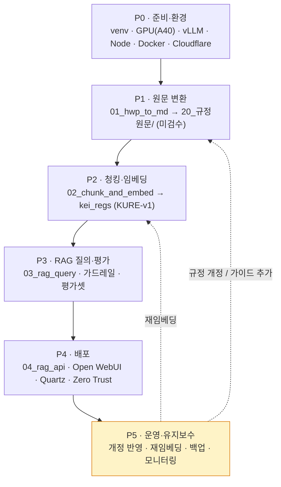
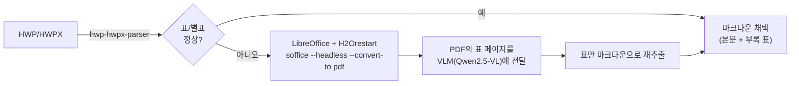
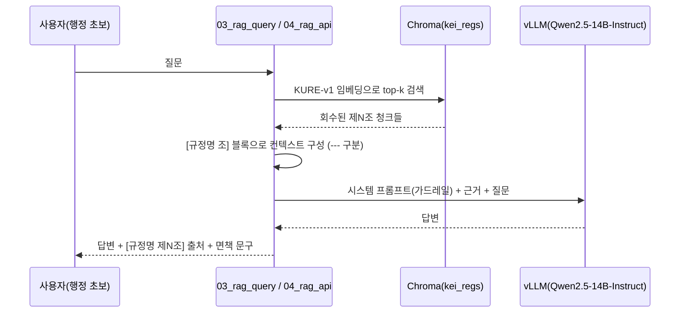
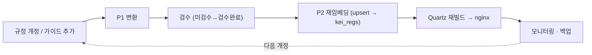

# WORKPLAN — 단계별 실행 계획 (P0~P5)

> KEI 행정 가이드 / 행정 비서를 **빈 레포에서 운영까지** 끌고 가는 단계별 실행 체크리스트입니다.
> 설계의 "왜"는 [docs/](docs/README.md)와 [CLAUDE.md](CLAUDE.md)에, "무엇을 언제"는 이 문서에 둡니다. 단계는 P0→P1→P2→P3→P4→P5 순서로 진행하고, P5는 운영 중 계속 순환합니다.

---

## 사용법 / 범례

이 문서는 단계별 체크리스트입니다. 작업 항목은 `- [ ]`(미완료) / `- [x]`(완료)로 표시합니다.

| 표기 | 의미 |
|---|---|
| `- [ ]` | 아직 하지 않은 작업 |
| `- [x]` | 끝낸 작업 (커밋/검증 완료) |
| **DoD** | 완료의 정의(Definition of Done). 이 조건이 모두 참이어야 단계 종료 |
| **선행조건** | 이 단계 시작 전에 충족돼야 하는 것 |
| `> [!todo]` | 아직 확정되지 않은 KEI 고유 사실(번호/날짜/호스트 등). 채우기 전 단정 금지 |

> [!note]
> 단계는 의존성 순서이지 엄격한 워터폴이 아닙니다. P2 검수와 P3 평가셋 구축은 병행해도 됩니다. 다만 **앞 단계의 DoD를 깨면서 다음 단계로 넘어가지 않습니다.**

> [!warning]
> 두 화면([뇌] Quartz / [비서] Open WebUI+vLLM) 모두 **사내 전용**입니다. 어떤 단계에서도 인터넷에 공개하지 않습니다. (P0/P4 참조)

---

## 단계 개요

| 단계 | 목표 | 주요 산출물 | 완료기준(요약) |
|---|---|---|---|
| **P0 준비·환경** | 개발/실행 환경 구축 | venv, GPU 접근, vLLM 확인, Node/Docker/Cloudflare 접근 | 모든 도구가 서버에서 동작 확인됨 |
| **P1 원문 변환** | HWP → 마크다운 진실원천 적재 | `20_규정원문/` 노트(검수상태: 미검수) | 규정 묶음이 분류별로 적재됨 |
| **P2 청킹·임베딩** | 제N조 청킹 + KURE-v1 임베딩 | `kei_regs` Chroma 컬렉션, 검수 진행 | 검색 가능한 벡터DB 존재 |
| **P3 RAG 질의·평가** | 근거 기반 답변 품질 확보 | 가드레일 튜닝, 평가셋, 측정값 | 출처정확도/거부율 목표 도달 |
| **P4 배포** | 두 화면 사내 공개 | `04_rag_api`, Open WebUI, Quartz, Zero Trust | 사내에서 두 화면 접속 가능 |
| **P5 운영·유지보수** | 개정 반영 순환 운영 | 재임베딩·백업·모니터링 루틴 | 운영 절차가 문서화·자동화됨 |

---

## 단계 의존성



> [!tip]
> P5의 점선 화살표가 핵심입니다. 운영은 끝점이 아니라 **P1/P2로 되돌아가는 순환**입니다. 규정이 개정되면 변환→재임베딩이 다시 돌아갑니다.

---

## P0 — 준비·환경

### 목표
서버에서 파이프라인·서빙·배포 도구가 모두 동작함을 확인한다. 코드를 쓰기 전에 "내 손에 무엇이 있는지" 확정한다.

### 선행조건
- KEI GPU 서버(예: 호스트명 `data05lx`, Ubuntu) 접근 권한
- GitHub 레포 `github.com/mooner92/KEIAdminSuperv` 접근 권한

> [!todo]
> 확인 필요: 정확한 서버 호스트명/IP(`data05lx` 외), A40 GPU 수량, Cloudflare 팀/도메인명.

### 작업 체크리스트
- [ ] 레포 클론, `git config core.quotepath false`(한글 파일명 표시) 설정
- [ ] 협업자(`CrownClownCrowd`) 권한/브랜치 전략 합의
- [ ] `python -m venv tools/.venv && source tools/.venv/bin/activate`
- [ ] `pip install -r tools/requirements.txt` (hwp-hwpx-parser, sentence-transformers, chromadb, openai, fastapi, uvicorn 등)
- [ ] GPU(A40) 접근 확인: `nvidia-smi`로 가용 메모리/사용 현황 확인
- [ ] 기존 vLLM 엔드포인트 확인: 기본 `http://localhost:8000/v1`의 `/v1/models`가 instruct 모델(예: `Qwen/Qwen2.5-14B-Instruct`)을 응답하는지
- [ ] Node v22+ 설치 확인 (`node -v`) — [뇌] Quartz용
- [ ] Docker / `docker compose` 동작 확인 — [비서] Open WebUI용
- [ ] Cloudflare Zero Trust 접근 권한 및 기존 Tunnel 존재 확인
- [ ] (선택) LibreOffice + H2Orestart 사전 설치: `deploy/setup_ubuntu_hwp.sh` 검토

### 산출물
- 활성화 가능한 `tools/.venv`
- vLLM 엔드포인트 응답 로그(모델 ID 포함)
- 환경 점검 메모(GPU/Node/Docker/Cloudflare 가용 여부)

### 완료의 정의 (DoD)
- [ ] `tools/.venv`에서 `import sentence_transformers, chromadb, fastapi` 성공
- [ ] vLLM `/v1/models`에서 instruct 모델 1개 이상 확인 (코더/VL 모델 아님)
- [ ] `node -v`가 v22 이상, `docker compose version` 정상 출력
- [ ] Cloudflare Tunnel 라우트를 추가할 수 있는 접근 권한 확인됨

### 리스크
- vLLM에 instruct가 아닌 코더/VL 모델만 떠 있을 수 있음 → P3 답변 품질 저하. 사전 확인 필수.
- A40 메모리를 다른 워크로드가 점유 → 임베딩/서빙 OOM. P0에서 가용량 측정.

---

## P1 — 원문 변환

### 목표
HWP 규정 파일을 **의역 없이** 마크다운으로 변환해 `KEI-행정가이드/20_규정원문/`에 적재한다. 이 층은 진실원천이므로 사람이 검수하기 전까지 `검수상태: 미검수`를 유지한다.

### 선행조건
- P0 완료 (venv + LibreOffice/H2Orestart)
- 원본 HWP 폴더 확보

### 작업 체크리스트
- [ ] `python tools/01_hwp_to_md.py --src <HWP 폴더> --vault ./KEI-행정가이드` 실행
- [ ] `parse_filename` 정규식 확인: 규정번호 `(\d{3,4})`, `_YYMMDD` → `20YY-MM-DD` 개정일, 제목 추출이 실제 파일명에서 맞는지
- [ ] CATEGORY 매핑 점검 (첫자리 → 분류 폴더):

  | 규정번호 첫자리 | 분류 폴더 |
  |---|---|
  | 1 | 1000_기관 |
  | 2 | 2000_감사·규정 |
  | 3 | 3000_인사 |
  | 4 | 4000_보수·여비 |
  | 5 | 5000_연구·정보 |
  | 6 | 6000_총무·보안·회계 |
  | 7 | 6000_총무·보안·회계 |

- [ ] 표/별표 깨짐 fallback 적용(아래 다이어그램 절차)
- [ ] 암호화/빈 본문 파일은 skip되는지 확인하고 별도 목록화
- [ ] 출력 경로 확인: `20_규정원문/<분류>/<번호>_<제목>.md`
- [ ] 프론트매터에 `검수상태: 미검수`, 경고 콜아웃이 들어갔는지 확인

### 표/별표 깨짐 fallback 절차

순수 파이썬 파서(`hwp_hwpx_parser`)가 표·별표·서식에서 깨지면 다음을 적용한다.



```bash
# Ubuntu: H2Orestart 확장 설치 후 (deploy/setup_ubuntu_hwp.sh 참조)
soffice --headless --convert-to pdf:writer_pdf_Export <규정파일>.hwp
# → 생성된 PDF의 표 페이지를 VLM(Qwen2.5-VL)에 "이 표를 마크다운으로" 프롬프트로 재추출
```

> [!warning]
> 변환 결과는 **의역 금지**입니다. 표가 깨졌다고 임의로 요약·재서술하지 말고, 원문 구조를 그대로 복원합니다. 수치(금액·한도·기한)는 원문대로 옮기되, 확인 불가하면 본문에 손대지 말고 검수 대상으로 남깁니다.

> [!todo]
> 확인 필요: 실제 규정 제목/번호/내용(금액·한도·기한 포함). 이 문서에서는 어떤 구체 조문도 단정하지 않습니다.

### 산출물
- `KEI-행정가이드/20_규정원문/<분류>/*.md` (regulation 프론트매터, `검수상태: 미검수`)
- skip/실패 파일 목록(암호화·빈 본문·표 재추출 필요)

### 완료의 정의 (DoD)
- [ ] 대상 HWP 묶음이 분류 폴더별로 적재됨
- [ ] 각 노트가 regulation 스키마(`type, 규정번호, 규정명, 분류, 개정일, 원본파일, 태그, 검수상태`)를 가짐
- [ ] 표/별표 깨진 파일은 fallback으로 복원되었거나, 미해결분이 목록으로 정리됨
- [ ] 변환물은 검수 전이므로 전부 `검수상태: 미검수`

### 리스크
- `01_hwp_to_md.py`는 스켈레톤 상태 → 정규식/표 처리 다듬기 필요. 작은 묶음으로 먼저 검증.
- 파일명 규칙(`_YYMMDD`, 번호 자릿수)이 실제와 어긋나면 분류/개정일 오류. 표본 검수 필수.
- VLM 표 재추출이 미세하게 틀릴 수 있음 → 반드시 사람 검수(P2)로 교차 확인.

---

## P2 — 청킹·임베딩

### 목표
적재된 원문을 **제N조 단위(조문 1개 = 청크 1개)**로 쪼개고 KURE-v1로 임베딩해 Chroma 컬렉션 `kei_regs`를 만든다. 동시에 원문 검수를 진행하고, 가치층(가이드/용어집) 초안을 시작한다.

### 선행조건
- P1 완료(`20_규정원문/` 적재)
- venv 활성화, GPU 가용

### 작업 체크리스트
- [ ] `python tools/02_chunk_and_embed.py --vault ./KEI-행정가이드 --db ./tools/chroma` 실행
- [ ] 청킹 확인: ARTICLE 정규식 `(?=^\s*제\s*\d+\s*조)`로 분할, **고정 길이 청킹 금지**
- [ ] regulation 노트는 조문별 청크 `{text, 규정명, 규정번호, 조, type, path}` 생성 확인
- [ ] guide/term 노트는 노트 전체가 1청크인지 확인, `_templates`는 제외되는지 확인
- [ ] 임베딩 모델 `nlpai-lab/KURE-v1` 사용, `normalize_embeddings=True`, `batch_size=32`, 양자화하지 않음
- [ ] Chroma `get_or_create_collection("kei_regs", hnsw:space=cosine)` + `col.upsert(...)` 확인
- [ ] `tools/chroma/`가 `.gitignore`에 있는지 확인(커밋 금지)
- [ ] **원문 검수 진행**: 표본을 원본 HWP와 대조, 통과분은 `검수상태: 검수완료`로 전환
- [ ] 가이드(`10_업무가이드/`) / 용어집(`30_용어집/`) 초안 시작 — 가이드는 항상 `[[규정명#제N조]]` 위키링크로 원문 인용

### 임베딩/스토리지 파라미터

| 항목 | 값 |
|---|---|
| 임베딩 모델 | `nlpai-lab/KURE-v1` (대안 `BAAI/bge-m3`) |
| 정규화 | `normalize_embeddings=True` |
| 양자화 | 사용 안 함 |
| 청킹 단위 | 제N조 (조문 1개 = 청크 1개) |
| 벡터DB | Chroma `PersistentClient(path)` |
| 컬렉션 | `kei_regs`, 메타 `hnsw:space=cosine` |
| 제외 | `_templates` |

> [!warning]
> 임베딩 모델은 P2와 P3에서 **반드시 동일**해야 합니다. P2에서 KURE-v1로 적재했으면 `03_rag_query.py`/`04_rag_api.py`의 `EMBED_MODEL`도 KURE-v1이어야 검색이 맞습니다.

### 산출물
- Chroma 컬렉션 `kei_regs` (조문 단위 임베딩)
- 검수 진행 현황(검수완료/미검수 카운트)
- 가이드/용어집 초안 노트

### 완료의 정의 (DoD)
- [ ] `kei_regs` 컬렉션이 생성되고 조문 청크가 upsert됨
- [ ] 샘플 쿼리로 관련 조문이 회수됨(임베딩 동작 확인)
- [ ] 원문 검수 표본 통과분이 `검수상태: 검수완료`로 전환됨
- [ ] `tools/chroma/`가 커밋되지 않음

### 리스크
- 조문 정규식이 변형 표기(예: 공백/하이픈)에서 어긋나면 한 조가 통째로 누락. 청크 수를 조문 수와 대조.
- guide/term을 1청크로 묶기 때문에 노트가 길면 검색 정밀도 저하 → 가이드는 짧고 단일 주제로.

---

## P3 — RAG 질의·평가

### 목표
`03_rag_query.py`로 답변 품질을 검증하고, 가드레일/프롬프트를 튜닝하며, 평가셋을 구축해 **출처정확도/거부율**을 측정한다.

### 선행조건
- P2 완료(`kei_regs` 존재)
- vLLM에 instruct 모델 가동

### 작업 체크리스트
- [ ] `python tools/03_rag_query.py --db ./tools/chroma --q "<예시 질문>" --k 5` 실행
- [ ] 검색 → `[규정명 조]` 블록으로 컨텍스트 구성(`---` 구분) → vLLM chat 흐름 확인
- [ ] vLLM 설정 확인: `VLLM_BASE=http://localhost:8000/v1`, `LLM_MODEL=Qwen/Qwen2.5-14B-Instruct`, `temperature=0.1`, `api_key=EMPTY`
- [ ] 출력에 답변 + 회수된 조 목록이 함께 나오는지 확인
- [ ] **가드레일 검증**(아래 4개 약화 금지)
- [ ] 평가셋 구축: 각 항목 `질문 → 기대 출처(규정명 제N조)` 형식
- [ ] **출처정확도** 측정: 기대 출처가 회수/인용되었는가
- [ ] **거부율** 측정: 근거 없는 질문에 "규정에서 확인되지 않습니다"로 올바르게 거부하는가
- [ ] 프롬프트/`k`값/컨텍스트 길이 튜닝 후 재측정

### 가드레일 (03/04 공통 — 약화 금지)

1. **[근거]에 없는 내용(특히 금액·한도·기한)은 절대 지어내지 않는다.** 없으면 "규정에서 확인되지 않습니다"라고 답한다.
2. 신입도 이해하게 쉽게, **단계로** 설명한다.
3. 답변 끝에 사용한 출처를 **`[규정명 제N조]`** 형식으로 모두 표기한다.
4. 마지막에 **"최종 판단은 원문과 담당 부서 확인 바랍니다."**를 덧붙인다.

### 질의 흐름



> [!note]
> 평가셋의 "기대 출처"는 실제 규정으로 채워야 합니다. 이 문서에서는 구체 조문을 단정하지 않으며, 예시 질문도 일반 표현으로만 둡니다.

### 산출물
- 평가셋 파일(질문 → 기대 출처)
- 측정 결과(출처정확도/거부율)와 튜닝 전후 비교
- 확정된 시스템 프롬프트(가드레일 포함)

### 완료의 정의 (DoD)
- [ ] 평가셋 질문에 대해 기대 출처가 회수·인용됨(출처정확도 목표 도달)
- [ ] 근거 없는 질문에 환각 없이 거부함(거부율 정상)
- [ ] 모든 답변이 `[규정명 제N조]` 출처 + 면책 문구로 끝남
- [ ] 가드레일 4개가 코드/프롬프트에 그대로 반영됨

> [!todo]
> 확인 필요: 출처정확도/거부율의 구체 목표 수치는 팀 합의로 확정.

### 리스크
- 근거가 부실한데 모델이 그럴듯하게 지어내는 환각 → 가드레일 1번이 1차 방어선. 평가셋으로 상시 감시.
- `k`가 작으면 정답 조문 누락, 크면 노이즈/토큰 초과. 평가셋으로 튜닝.

---

## P4 — 배포

### 목표
두 화면을 사내에 띄운다. [비서]는 `04_rag_api` + Open WebUI, [뇌]는 Quartz 정적 사이트(nginx). 둘 다 Cloudflare Zero Trust 뒤.

### 선행조건
- P3 완료(가드레일/RAG 검증)
- Docker, Node v22+, nginx, Cloudflare Tunnel 접근(P0)

### 포트/엔드포인트 요약

| 컴포넌트 | 포트 | 비고 |
|---|---|---|
| vLLM (기존) | 8000 | `/v1`, instruct 모델 |
| 04_rag_api (FastAPI) | 9000 | `/v1/models`, `/v1/chat/completions`, `MODEL_ID=kei-admin-rag` |
| Open WebUI | 3000→8080 | 컨테이너 `kei-webui` |
| 임베딩 TEI (선택) | 8080→80 | 내장 RAG 쓸 때만 |
| Quartz 미리보기 | 8080 | `npx quartz build --serve` (로컬 확인용) |

### P4-a · [비서] RAG API 실행 (04_rag_api)

```bash
# tools/ 디렉터리에서, venv 활성화 상태로
source tools/.venv/bin/activate
cd tools
uvicorn 04_rag_api:app --host 0.0.0.0 --port 9000
```

- 동작: `04_rag_api.py`는 import 시 embed/chroma/llm을 로딩하고 `retrieve(query, k=5)`로 검색한다. `/v1/chat/completions`는 비스트리밍 스켈레톤(SSE는 향후), 응답에 `x_retrieved`(회수된 조)를 디버그로 포함한다.
- **Open WebUI 등록** (설정 > 연결 > OpenAI API):

  | 항목 | 값 |
  |---|---|
  | Base URL | `http://<서버 실제 IP>:9000/v1` |
  | API Key | `EMPTY` |
  | 모델 ID | `kei-admin-rag` |

> [!warning]
> 연결 URL에 `localhost`/`host.docker.internal`이 아니라 **서버 실제 IP**를 쓰세요. Docker 컨테이너(Open WebUI)에서 `localhost`는 컨테이너 자신을 가리킵니다. (가장 흔한 함정)

> [!note]
> **왜 04_rag_api인가:** Open WebUI 내장 RAG는 청킹/출처표기 통제가 약합니다. 그래서 이 서버가 제N조 검색 + 근거 주입 + `[규정명 제N조]` 출처 강제를 담당하고, Open WebUI는 UI/멀티유저/권한만 담당합니다.

### P4-b · [비서] Open WebUI

```bash
# deploy/docker-compose.yml 사용
docker compose up -d        # open-webui (+ 선택: 임베딩 TEI)
```

- `open-webui`: image `ghcr.io/open-webui/open-webui:main`, 컨테이너 `kei-webui`, `3000:8080`, `WEBUI_AUTH=true`, `extra_hosts: host.docker.internal:host-gateway`
- `kei-rag-api` 블록은 주석 처리 상태 → 우선 호스트에서 위 `uvicorn`으로 띄워도 됨
- `embeddings-tei`(`--model-id nlpai-lab/KURE-v1`)는 **내장 RAG를 쓸 때만** 필요. 권장 경로(04_rag_api)에서는 불필요

### P4-c · [뇌] Quartz → nginx

```bash
# Node v22+ 필요
git clone https://github.com/jackyzha0/quartz.git && cd quartz
npm i && npx quartz create
ln -s /path/to/KEI-행정가이드 content   # 볼트를 content로 심볼릭 링크
npx quartz build --serve                 # 로컬 미리보기 :8080
npx quartz build                         # → public/ 정적 산출물
# public/ 을 nginx로 서빙
```

### P4-d · Cloudflare Zero Trust 라우트

- nginx(Quartz) / Open WebUI(3000) 각각을 **기존 Cloudflare Tunnel**에 라우트로 추가
- Zero Trust Access 정책 적용(사내 전용), Open WebUI 자체 인증(RBAC/SSO)으로 한 겹 더

> [!warning]
> **두 화면 모두 인터넷 공개 금지.** 반드시 Cloudflare Zero Trust Access 뒤에 둡니다. 모델·임베딩 전부 온프레미스이므로 데이터는 망 밖으로 나가지 않습니다 — 이 전제를 깨는 노출 설정을 하지 않습니다.

> [!todo]
> 확인 필요: 서버 실제 IP, Cloudflare 팀/도메인명, 라우트 호스트명.

### 산출물
- 9000 포트 RAG API(가동), Open WebUI에 `kei-admin-rag` 등록 완료
- `public/` 정적 사이트가 nginx로 서빙됨
- Cloudflare Tunnel 라우트 2개(뇌/비서) + Access 정책

### 완료의 정의 (DoD)
- [ ] 사내 사용자가 Open WebUI에서 `kei-admin-rag`로 질문 → 출처/면책 포함 답변 수신
- [ ] 사내 사용자가 Quartz 그래프/검색 접속 가능
- [ ] 두 화면 모두 Zero Trust 뒤에서만 접근됨(외부 노출 없음)
- [ ] 연결 URL에 실제 IP 사용(localhost/host.docker.internal 아님)

### 리스크
- `localhost`/`host.docker.internal` 오용으로 컨테이너→API 연결 실패. P4-a 경고 확인.
- 04_rag_api는 비스트리밍 스켈레톤 → 긴 답변 체감 지연. 우선 동작 후 SSE는 P5 개선 항목.
- Cloudflare/RBAC 미설정 시 의도치 않은 노출. 라우트 추가와 동시에 Access 정책 적용.

---

## P5 — 운영·유지보수 (순환)

### 목표
규정 개정·가이드 추가를 반영하고, 재임베딩·백업·모니터링을 일상 루틴으로 돌린다. 운영 절차의 단일 출처는 [docs/10-operations.md](docs/10-operations.md).

### 선행조건
- P4 완료(두 화면 가동)

### 작업 체크리스트
- [ ] **규정 개정 반영**: 새 HWP를 P1로 변환 → `20_규정원문/` 갱신(개정일/검수상태 `미검수`로 회귀) → 검수
- [ ] **재임베딩**: 갱신/추가된 노트로 `02_chunk_and_embed.py` 재실행(`upsert`로 `kei_regs` 갱신)
- [ ] **Quartz 재빌드**: 볼트 갱신 → `npx quartz build` → nginx 반영
- [ ] **백업**: 볼트(git), Chroma(`tools/chroma/`), Open WebUI 볼륨(`open-webui`) 백업 루틴
- [ ] **모니터링**: RAG API/Open WebUI/vLLM 헬스, 응답 품질·거부율 추이, GPU 사용량
- [ ] 변환·생성물은 **검수 전까지 `검수상태: 미검수`** 유지(개정분 포함)

### 운영 순환



> [!tip]
> 개정 시 임베딩 모델을 바꾸지 마세요. KURE-v1로 적재한 컬렉션에 다른 모델 벡터를 섞으면 검색이 망가집니다. 모델 교체는 별도 작업으로 전체 재임베딩.

### 산출물
- 개정 반영/재임베딩 절차(문서 + 가능하면 스크립트)
- 백업·복구 점검 기록
- 모니터링 대시보드/체크리스트

### 완료의 정의 (DoD)
- [ ] 개정 반영 → 재임베딩 → 재빌드 절차가 문서화됨([docs/10-operations.md](docs/10-operations.md))
- [ ] 백업 대상(볼트/Chroma/Open WebUI 볼륨)이 정의·실행됨
- [ ] 모니터링 항목이 정의되고 정기 점검됨

> [!note]
> P5는 종료되지 않는 순환 단계입니다. 규정이 살아 있는 한 P1↔P2로 되돌아갑니다.

### 리스크
- 개정 누락 → 답변이 옛 규정을 인용. 개정 알림→반영 책임자/주기 명확화 필요.
- 재임베딩 시 삭제된 조문이 컬렉션에 잔존(upsert는 추가/갱신). 폐지 조문 정리 정책 필요.
- 백업 누락 시 Chroma/볼륨 손실. 정기 백업 검증.

---

## 위험 등록부 (Risk Register)

| 리스크 | 영향 | 완화 |
|---|---|---|
| HWP 표/별표 변환 깨짐 | 원문 손실·오정보 | LibreOffice+H2Orestart→PDF→VLM(Qwen2.5-VL) fallback, 사람 검수 |
| 원문 의역/요약 혼입 | 진실원천 신뢰성 붕괴 | `20_규정원문/` 의역 금지 원칙, 검수 전 `검수상태: 미검수` 유지 |
| LLM 환각(금액·한도·기한) | 잘못된 행정 안내 | 가드레일 1번("근거 없으면 확인되지 않습니다"), 평가셋으로 거부율 감시 |
| 출처 누락 | 근거 추적 불가 | 가드레일 3번 `[규정명 제N조]` 강제, 04_rag_api가 출처 주입 담당 |
| 임베딩 모델 불일치(P2≠P3/P4) | 검색 품질 저하 | `EMBED_MODEL` 단일화(KURE-v1), 모델 교체 시 전체 재임베딩 |
| 조문 정규식 오분할 | 조문 누락/혼합 | 청크 수 ↔ 조문 수 대조, 표본 검수 |
| Docker 연결 URL 오용 | 비서 화면 미작동 | 실제 IP 사용, `localhost`/`host.docker.internal` 금지 |
| 인터넷 노출 | 내부 규정 유출 | Cloudflare Zero Trust Access + Open WebUI RBAC/SSO, 온프레미스 |
| 규정 개정 미반영 | 옛 규정 인용 | P5 순환 루틴, 개정 알림·반영 책임자 지정 |
| GPU 자원 경합 | OOM/지연 | P0 가용량 측정, 임베딩/서빙 스케줄 조율 |
| 비스트리밍 응답 지연 | 사용자 체감 저하 | 우선 동작 후 SSE 스트리밍 개선(향후) |

---

## 관련 문서

- 문서 인덱스: [docs/README.md](docs/README.md)
- 로드맵: [docs/08-roadmap.md](docs/08-roadmap.md)
- 파이프라인: [docs/04-pipeline.md](docs/04-pipeline.md)
- 배포: [docs/06-deployment.md](docs/06-deployment.md)
- 운영: [docs/10-operations.md](docs/10-operations.md)
- 프로젝트 개요/가이드: [README.md](README.md) · [CLAUDE.md](CLAUDE.md)
- 소스: [tools/01_hwp_to_md.py](tools/01_hwp_to_md.py) · [tools/02_chunk_and_embed.py](tools/02_chunk_and_embed.py) · [tools/03_rag_query.py](tools/03_rag_query.py) · [tools/04_rag_api.py](tools/04_rag_api.py)

| 이전 | 다음 |
|---|---|
| [CLAUDE.md](CLAUDE.md) | [docs/08-roadmap.md](docs/08-roadmap.md) |

---

최종 수정: 2026-06-18
