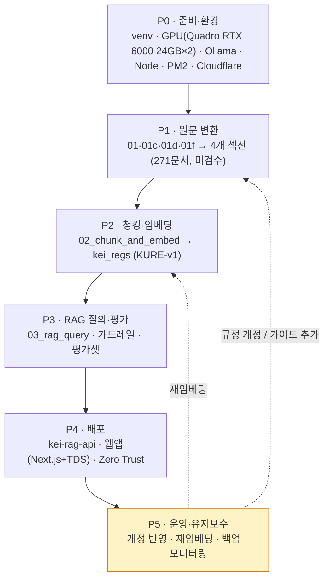
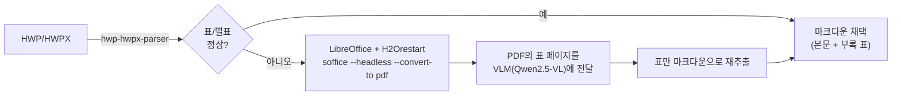
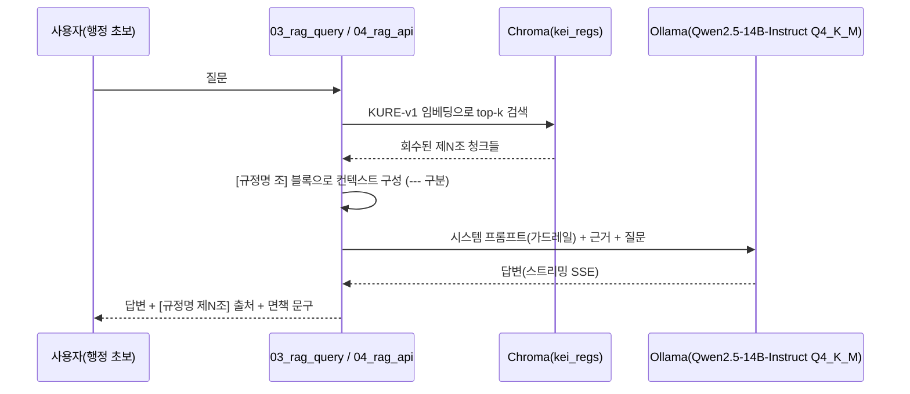
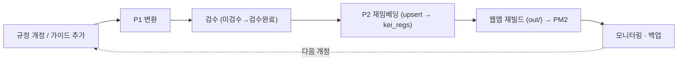

# WORKPLAN — 단계별 실행 계획 (P0~P5)

> KEI 행정 가이드 / 행정 LLM을 **빈 레포에서 운영까지** 끌고 가는 단계별 실행 체크리스트입니다.
> 설계의 "왜"는 [docs/](docs/README.md)와 [CLAUDE.md](CLAUDE.md)에, "무엇을 언제"는 이 문서에 둡니다. 단계는 P0→P1→P2→P3→P4→P5 순서로 진행하고, P5는 운영 중 계속 순환합니다.

---

## 사용법 / 범례

이 문서는 단계별 체크리스트입니다. 작업 항목은 `- [ ]`(미완료) / `- [x]`(완료)로 표시합니다.

| 표기 | 의미 |
|---|---|
| `- [ ]` | 아직 하지 않은 작업 |
| `- [x]` | 끝낸 작업 (커밋/검증 완료) |
| **DoD** | 완료의 정의(Definition of Done). 이 조건이 모두 참이어야 단계 종료 |
| **선행조건** | 이 단계 시작 전에 충족돼야 하는 것 |
| `> [!todo]` | 아직 확정되지 않은 KEI 고유 사실(번호/날짜/호스트 등). 채우기 전 단정 금지 |

> [!note]
> 단계는 의존성 순서이지 엄격한 워터폴이 아닙니다. P2 검수와 P3 평가셋 구축은 병행해도 됩니다. 다만 **앞 단계의 DoD를 깨면서 다음 단계로 넘어가지 않습니다.**

> [!warning]
> 두 화면([뇌] Next.js+TDS 웹앱 / [LLM] 멀티턴 RAG 채팅) 모두 **사내 전용**입니다. 어떤 단계에서도 인터넷에 공개하지 않습니다. (P0/P4 참조)

> [!note]
> **진행 상태(2026-06-20):** 코퍼스 4개 섹션·**271문서** 적재 완료(규정집 111 / 연구행정 가이드 64 / 용어집 84 / ERP 시스템 12), 교차링크(ERP↔규정·용어↔ERP/규정) 완료. P2 임베딩 완료(약 **3,973 청크**: regulation 3044 · guide 718 · system 127 · term 84 · KURE-v1·GPU·클린 리빌드). P3 RAG는 **Ollama**(Qwen2.5-14B-Instruct Q4_K_M, keep_alive=-1 상주+워밍업)로 **생성까지 검증** 완료. P4 LLM 화면 가동: 백엔드 `kei-rag-api`(127.0.0.1:9000, rag_core/app_api/04_rag_api 3분리) + 웹앱 `web/`(Next.js+TDS) — 멀티턴 RAG 채팅·메시지별 근거·문서 드로어, 둘러보기 필터, 관계 그래프(271 노드·275 연결·4색), 인증(bcrypt+PyJWT)·채팅기록 영속·**스트리밍 SSE**·**다크모드**, PM2 서빙(0.0.0.0:3100 정적 out/ + RAG API 리버스 프록시), Playwright 실렌더 검증. 남은 작업: 원문 검수(전부 미검수, 미분류 28 번호 배정), 외부 접속 안정화(Cloudflare 엣지·pm2 startup), 번들 경량화·컬러 토큰 교체, 변환 실패 2건(여비 QnA HWP timeout·예산운용가이드 이미지PDF) 폴백.

---

## 단계 개요

| 단계 | 목표 | 주요 산출물 | 완료기준(요약) |
|---|---|---|---|
| **P0 준비·환경** | 개발/실행 환경 구축 | venv, GPU 접근, Ollama(LLM) 확인, Node/PM2/Cloudflare 접근 | 모든 도구가 서버에서 동작 확인됨 |
| **P1 원문 변환** | HWP/PDF/PPTX/MD → 4개 섹션 적재 | `20_규정원문/`·`10_업무가이드/`·`30_용어집/`·`40_시스템/` 노트(검수상태: 미검수) | 271문서가 섹션·분류별로 적재·교차링크됨 |
| **P2 청킹·임베딩** | 제N조/헤딩 청킹 + KURE-v1 임베딩 | `kei_regs` Chroma 컬렉션(약 3,973 청크), 검수 진행 | 검색 가능한 벡터DB 존재 |
| **P3 RAG 질의·평가** | 근거 기반 답변 품질 확보 | 가드레일 튜닝, 평가셋, 측정값 | 출처정확도/거부율 목표 도달 |
| **P4 배포** | 두 화면 사내 공개 | `kei-rag-api`, 웹앱(Next.js+TDS, LLM/둘러보기/그래프), Zero Trust | 사내에서 두 화면 접속 가능 |
| **P5 운영·유지보수** | 개정 반영 순환 운영 | 재임베딩·백업·모니터링 루틴 | 운영 절차가 문서화·자동화됨 |

---

## 단계 의존성



> [!tip]
> P5의 점선 화살표가 핵심입니다. 운영은 끝점이 아니라 **P1/P2로 되돌아가는 순환**입니다. 규정이 개정되면 변환→재임베딩이 다시 돌아갑니다.

---

## P0 — 준비·환경

### 목표
서버에서 파이프라인·서빙·배포 도구가 모두 동작함을 확인한다. 코드를 쓰기 전에 "내 손에 무엇이 있는지" 확정한다.

### 선행조건
- KEI GPU 서버(예: 호스트명 `data05lx`, Ubuntu) 접근 권한
- GitHub 레포 `github.com/mooner92/KEIAdminSuperv` 접근 권한

> [!todo]
> 확인 필요: 정확한 서버 호스트명/IP(`data05lx` 외), Cloudflare 팀/도메인명. (GPU는 nvidia-smi 실측 = Quadro RTX 6000 24GB×2.)

### 작업 체크리스트
- [ ] 레포 클론, `git config core.quotepath false`(한글 파일명 표시) 설정
- [ ] 협업자(`CrownClownCrowd`) 권한/브랜치 전략 합의
- [ ] `python -m venv tools/.venv && source tools/.venv/bin/activate`
- [ ] `pip install -r tools/requirements.txt` (hwp-hwpx-parser, sentence-transformers, chromadb, openai, fastapi, uvicorn 등)
- [ ] GPU(Quadro RTX 6000 24GB×2) 접근 확인: `nvidia-smi`로 가용 메모리/사용 현황 확인
- [x] LLM 엔드포인트 확인: **Ollama**(`http://127.0.0.1:11434/v1`, OpenAI 호환)의 `/v1/models`가 instruct 모델(`Qwen2.5-14B-Instruct Q4_K_M`)을 응답하는지 — keep_alive=-1 상주 + 기동 워밍업으로 콜드스타트 제거. (vLLM은 대안 표기.)
- [x] Node v22+ 설치 확인 (`node -v`) — [뇌] Next.js+TDS 웹앱용
- [ ] Docker / `docker compose` 동작 확인 — (참고) Open WebUI 등 컨테이너 옵션용. 현 배포는 PM2 호스트 서빙
- [ ] Cloudflare Zero Trust 접근 권한 및 기존 Tunnel 존재 확인
- [ ] (선택) LibreOffice + H2Orestart 사전 설치: `deploy/setup_ubuntu_hwp.sh` 검토

### 산출물
- 활성화 가능한 `tools/.venv`
- LLM 엔드포인트 응답 로그(Ollama, 모델 ID 포함; vLLM은 대안)
- 환경 점검 메모(GPU/Node/PM2/Cloudflare 가용 여부)

### 완료의 정의 (DoD)
- [ ] `tools/.venv`에서 `import sentence_transformers, chromadb, fastapi` 성공
- [x] LLM `/v1/models`에서 instruct 모델 1개 이상 확인 (Ollama; 코더/VL 모델 아님)
- [ ] `node -v`가 v22 이상, `docker compose version` 정상 출력
- [ ] Cloudflare Tunnel 라우트를 추가할 수 있는 접근 권한 확인됨

### 리스크
- LLM 엔드포인트(현 서빙 Ollama; vLLM은 대안)에 instruct가 아닌 코더/VL 모델만 떠 있을 수 있음 → P3 답변 품질 저하. 사전 확인 필수.
- Quadro RTX 6000(24GB×2) 메모리를 다른 워크로드가 점유 → 임베딩/서빙 OOM. P0에서 가용량 측정.
- **기본 PyPI torch 휠은 최신 CUDA(cu130)** → 구형 드라이버(R535/CUDA 12.2)에서 CUDA 인식 실패. 드라이버가 12.x면 cu124 휠 설치(CUDA 12.x 마이너 호환). `nvidia-smi`의 CUDA Version으로 드라이버 한도 확인. (서버 실측: Quadro RTX 6000 24GB×2(총 48GB, 단일 통합 메모리 아님), R535/CUDA 12.2, Python 3.13, torch 2.6.0+cu124)

---

## P1 — 원문 변환

### 목표
규정 HWP를 **의역 없이** 마크다운으로 변환해 `20_규정원문/`에 적재하고, 같은 파이프라인으로 가이드(HWP/HWPX/PDF/PPTX)·ERP·용어집까지 **4개 섹션 271문서**를 적재·교차링크한다. 원문층은 진실원천이므로 사람이 검수하기 전까지 `검수상태: 미검수`를 유지한다.

### 코퍼스 현황 (실측 2026-06-20 — 4개 섹션, 271문서)

| 섹션 | 폴더 | type | 문서수 |
|---|---|---|---|
| 규정집 | `20_규정원문/` | regulation | 111 |
| 연구행정 가이드 | `10_업무가이드/` | guide | 64 |
| 용어집 | `30_용어집/` | term | 84 |
| ERP 시스템 | `40_시스템/` | system | 12 |
| **합계** | | | **271** |

### 변환·교차링크 파이프라인 (실행 순서)

`01`·`01c`·`01d`·`01f`(변환) → `01e`·`01g`(교차링크) → `01b`(나머지 autolink) → `02`(임베딩).

| 스크립트 | 역할 |
|---|---|
| `01_hwp_to_md` | 규정 HWP/HWPX → `20_규정원문/` (제N조 보존) |
| `01b_autolink` | 규정 상호참조 → `[[ ]]` 그래프 엣지 (멱등) |
| `01c_guides_to_md` | 가이드 HWP/HWPX/PDF(PyMuPDF)/PPTX(python-pptx) → `10_업무가이드/`. 스캔 이미지 PDF는 image-pdf 플레이스홀더 |
| `01d_erp_to_md` | `KEI_ERP_entire_features.md` → `40_시스템/` 모듈별 노트(type:system, `####` 기능 단위) |
| `01e_erp_crosslink` | ERP 모듈 ↔ 관련 규정 `[[ ]]` 교차링크(키워드 매칭) |
| `01f_terms_to_md` | `KEI_admin_terms.md` → `30_용어집/` 용어 1개=노트 1개(type:term, 84개) |
| `01g_terms_crosslink` | 용어 ↔ 같은 카테고리 ERP 모듈 + 용어명이 규정명에 포함되면 규정 `[[ ]]` |

### 선행조건
- P0 완료 (venv + LibreOffice/H2Orestart)
- 원본 폴더 확보(규정 HWP, 가이드 HWP/PDF/PPTX, ERP·용어 MD)

### 작업 체크리스트
- [x] `python tools/01_hwp_to_md.py --src <HWP 폴더> --vault ./KEI-행정가이드` 실행
  - 실측(2026-06-19): 입력 112개(.hwp 53 + .hwpx 59) → **111개 변환 성공 / 1개 timeout 스킵**. 파서는 `hwp-hwpx-parser 1.0.0`, `Reader.extract_text()`가 표를 인라인 마크다운으로 포함하므로 별도 (부록) 표는 덧붙이지 않음(중복 방지). 신규 플래그 `--dry-run / --limit / --timeout`(파일당 초) 추가. 커밋 `6750748`.
- [x] 파일명 파싱 확인: 규정번호 `reg_num_from_name()` `(\d{4})`+`1000~7999` 검증, 다형식 개정일 `parse_date()`, 제목 `clean_title()` 가 실제 파일명에서 맞는지
  - 실측: **파일명 맨 앞 4자리(현행 공식 코드)만 신뢰**. 본문에 박힌 `NNNN-` 코드는 과거/내부 코드라 현행과 충돌해 미사용(예: 복무규정 본문 `3200` ↔ 파일명 `3200`=공로연수운영지침; 직원평가규칙 본문 `3150` ↔ 파일명 `3150`=신규채용자재임용평정규칙).
  - 개정일: 다형식 파서(`YYYYMMDD / YYMMDD / YYYY.MM.DD. / YY.MM.DD. / "2025년 12월 22일" / YYYY.MM / YYYYMM`, 검증 포함). **6개는 날짜 미검출**.
  - 제목 정제: 규정번호·날짜(붙어있어도)·리스트마커(`2.` `50.`)·장식(`★`) 제거, `(영문)` 판본 표시는 유지(정관 vs 정관(영문) 충돌 방지).
- [x] `CATEGORY_NAMES` 매핑 점검 (첫자리 → 분류 폴더):

  | 규정번호 첫자리 | 분류 폴더 |
  |---|---|
  | 1 | 1000_기관 |
  | 2 | 2000_감사·규정 |
  | 3 | 3000_인사 |
  | 4 | 4000_보수·여비 |
  | 5 | 5000_연구·정보 |
  | 6 | 6000_총무·보안·회계 |
  | 7 | 6000_총무·보안·회계 |

  - 실측 분류 결과(규정 111개 기준): 변환 직후 미분류는 **37**이었고, 이후 일부 번호 배정으로 **0000_미분류는 현재 28**. 나머지는 분류 폴더(1000~6000)로 배치(7xxx 회계/구매는 6000으로). 미분류 28건은 사람 배정 대기.
- [x] 암호화/빈 본문/표 처리 확인 (`is_encrypted`는 속성, `is_valid()`/`file_type()`는 메서드, 컨텍스트매니저(`with`) 지원)
- [x] 출력 경로 확인: `20_규정원문/<분류>/<번호>_<제목>.md`
- [x] 프론트매터에 `검수상태: 미검수`, 경고 콜아웃이 들어갔는지 확인 — 전 변환물 `검수상태: 미검수`.
- [ ] **변환 실패 2건 fallback 적용**(아래 다이어그램 절차) — 미완.
  - 실측: ① `여비업무처리기준및QnA개선(안)…(1).hwp`가 파서 무한루프(100% CPU 10시간)를 유발 → **파일당 하드 타임아웃(별도 프로세스)으로 격리**해 스킵. ② 예산운용가이드 스캔 이미지 PDF는 텍스트층이 없어 image-pdf 플레이스홀더로 남음. 두 건 모두 LibreOffice/OCR(또는 H2Orestart→PDF→VLM) fallback 대상.
- [ ] **미분류 규정번호 배정(28건)** — 미완(사람 작업 필요).
  - 실측: 미분류에는 번호 없는 가이드/기준/지침과 함께 **인사규정·직제규정·복무규정·위임전결규정·직원평가규칙·유연근무제운영규칙 등 핵심 규정**도 포함 → 사람이 현행 규정번호를 배정해야 정상 분류됨.

### 표/별표 깨짐 fallback 절차

순수 파이썬 파서(`hwp_hwpx_parser`)가 표·별표·서식에서 깨지면 다음을 적용한다.



```bash
# Ubuntu: H2Orestart 확장 설치 후 (deploy/setup_ubuntu_hwp.sh 참조)
soffice --headless --convert-to pdf:writer_pdf_Export <규정파일>.hwp
# → 생성된 PDF의 표 페이지를 VLM(Qwen2.5-VL)에 "이 표를 마크다운으로" 프롬프트로 재추출
```

> [!warning]
> 변환 결과는 **의역 금지**입니다. 표가 깨졌다고 임의로 요약·재서술하지 말고, 원문 구조를 그대로 복원합니다. 수치(금액·한도·기한)는 원문대로 옮기되, 확인 불가하면 본문에 손대지 말고 검수 대상으로 남깁니다.

> [!todo]
> 확인 필요: 실제 규정 제목/번호/내용(금액·한도·기한 포함). 이 문서에서는 어떤 구체 조문도 단정하지 않습니다.

### 산출물
- `KEI-행정가이드/20_규정원문/<분류>/*.md` (regulation 프론트매터, `검수상태: 미검수`)
- skip/실패 파일 목록(암호화·빈 본문·표 재추출 필요)

### 완료의 정의 (DoD)
- [x] 4개 섹션 271문서가 섹션·분류 폴더별로 적재됨 (규정 111 / 가이드 64 / 용어 84 / ERP 12)
- [x] ERP↔규정·용어↔ERP/규정 교차링크 적용(`01e`/`01g`) — 그래프 허브로 ERP 모듈 동작
- [x] 각 노트가 섹션별 스키마(regulation/guide/term/system)를 가짐
- [ ] 변환 실패 미해결분 정리: 2건(여비 QnA HWP timeout · 예산운용가이드 이미지PDF)이 fallback 미적용 상태로 남음
- [x] 변환물은 검수 전이므로 전부 `검수상태: 미검수`

### 리스크
- 일부 파서가 무한루프를 유발할 수 있음(실측 1건, 100% CPU 10시간) → **파일당 하드 타임아웃(별도 프로세스)**으로 격리. 격리분은 fallback 대상으로 추적.
- 파일명 규칙(번호 자릿수, 다형식 날짜)이 실제와 어긋나면 분류/개정일 오류. 본문 코드는 과거/내부 코드라 미사용(현행 충돌) → 파일명 4자리만 신뢰. 표본 검수 필수.
- 미분류 28개(번호 없는 핵심 규정 포함)는 사람이 규정번호 배정 전까지 `0000_미분류`에 머무름.
- VLM 표 재추출이 미세하게 틀릴 수 있음 → 반드시 사람 검수(P2)로 교차 확인.

---

## P2 — 청킹·임베딩

### 목표
적재된 4개 섹션을 청킹(규정=**제N조 단위**, 가이드·ERP·용어=헤딩 `####`·`##` 단위, 없으면 문단 패킹)하고 KURE-v1로 임베딩해 Chroma 컬렉션 `kei_regs`를 만든다. 동시에 원문 검수를 진행한다.

### 선행조건
- P1 완료(4개 섹션 271문서 적재 + 교차링크)
- venv 활성화, GPU 가용

### 작업 체크리스트
- [x] `python tools/02_chunk_and_embed.py --vault ./KEI-행정가이드 --db ./tools/chroma` 실행
  - 실측(2026-06-20): 4개 섹션 271문서 → **약 3,973 청크 = regulation 3044 · guide 718 · system 127 · term 84**.
- [x] 청킹 확인: 규정은 ARTICLE 정규식 `(?=^\s*제\s*\d+\s*조)`로 분할, **고정 길이 청킹 금지**. 가이드·ERP·용어는 헤딩(`####`·`##`) 단위(없으면 문단 패킹).
  - 실측: 규정 첫 `제N조` 앞 머리말(규정명·제정/개정 이력·표)은 `조=""` 청크로 별도 생성. 01이 넣은 H1 제목·변환 경고 콜아웃은 임베딩 전에 제거(노이즈 감소).
- [x] regulation 노트는 조문별 청크 `{text, 규정명, 규정번호, 조, type, path}` 생성 확인
- [x] guide/system/term 노트는 헤딩 단위 청크인지 확인, `_templates`는 제외되는지 확인
- [x] 임베딩 모델 `nlpai-lab/KURE-v1` 사용, `normalize_embeddings=True`, 양자화하지 않음
  - 실측: KURE-v1 = XLM-RoBERTa(BGE-M3 계열), 컨텍스트 8192. GPU `cuda:0`, ~32초. 큰 batch(64)+긴 조문에서 **CUDA OOM** → `batch 8 + max_seq_len 2048`(+ `expandable_segments`)로 해결. **2048 토큰 초과 41개는 임베딩 시 잘림**(긴 조문/일부 머리말) → 향후 하위청킹 과제.
- [x] Chroma `get_or_create_collection("kei_regs", hnsw:space=cosine)` 확인
  - 실측: 컬렉션 `kei_regs`, **약 3,973 items**, `hnsw:space=cosine`. **클린 리빌드 기본**(`--no-reset`로 해제): id=`경로#순번`(위치기반)이라 조문 가감 시 stale 방지를 위해 컬렉션을 비우고 전체 재적재.
  - 메타데이터 키: `규정명, 규정번호, 조, 분류, 개정일, 검수상태, type, path`(볼트 상대경로).
- [x] `tools/chroma/`가 `.gitignore`에 있는지 확인(커밋 금지) — `tools/chroma`(약 44MB)는 재생성 가능하므로 비추적.
- [ ] **원문 검수 진행**: 표본을 원본 HWP와 대조, 통과분은 `검수상태: 검수완료`로 전환 — 미완(전 노트 `미검수`).
- [ ] 가이드(`10_업무가이드/`) / 용어집(`30_용어집/`) 초안 시작 — 가이드는 항상 `[[규정명#제N조]]` 위키링크로 원문 인용 — 미완.

### 임베딩/스토리지 파라미터

| 항목 | 값 |
|---|---|
| 임베딩 모델 | `nlpai-lab/KURE-v1` (XLM-RoBERTa, BGE-M3 계열, ctx 8192; 대안 `BAAI/bge-m3`) |
| 정규화 | `normalize_embeddings=True` |
| 양자화 | 사용 안 함 |
| 배치/시퀀스 | `batch_size=8`, `max_seq_len=2048`(OOM 회피, `expandable_segments`) |
| 청킹 단위 | 규정=제N조(+머리말 `조=""`) · 가이드/ERP/용어=헤딩 `####`·`##`(없으면 문단 패킹) |
| 벡터DB | Chroma `PersistentClient(path)` |
| 컬렉션 | `kei_regs`, 메타 `hnsw:space=cosine` (실측 약 3,973 items) |
| 리빌드 | 클린 리빌드 기본(`--no-reset`로 해제) — id=경로#순번 stale 방지 |
| 제외 | `_templates` |

> [!warning]
> 임베딩 모델은 P2와 P3에서 **반드시 동일**해야 합니다. P2에서 KURE-v1로 적재했으면 `03_rag_query.py`/`04_rag_api.py`의 `EMBED_MODEL`도 KURE-v1이어야 검색이 맞습니다.

### 산출물
- Chroma 컬렉션 `kei_regs` (조문 단위 임베딩)
- 검수 진행 현황(검수완료/미검수 카운트)
- 가이드/용어집 초안 노트

### 완료의 정의 (DoD)
- [x] `kei_regs` 컬렉션이 생성되고 4개 섹션 청크가 적재됨 (약 3,973 items, 클린 리빌드)
- [x] 샘플 쿼리로 관련 조문이 회수됨(임베딩 동작 확인 — P3 `--retrieve-only` 결과 참조)
- [ ] 원문 검수 표본 통과분이 `검수상태: 검수완료`로 전환됨 — 미완(전 노트 `미검수`)
- [x] `tools/chroma/`가 커밋되지 않음

### 리스크
- 조문 정규식이 변형 표기(예: 공백/하이픈)에서 어긋나면 한 조가 통째로 누락. 청크 수를 조문 수와 대조.
- guide/term을 1청크로 묶기 때문에 노트가 길면 검색 정밀도 저하 → 가이드는 짧고 단일 주제로.

---

## P3 — RAG 질의·평가

### 목표
`03_rag_query.py`로 답변 품질을 검증하고, 가드레일/프롬프트를 튜닝하며, 평가셋을 구축해 **출처정확도/거부율**을 측정한다.

### 선행조건
- P2 완료(`kei_regs` 존재)
- Ollama에 instruct 모델 가동(Qwen2.5-14B-Instruct Q4_K_M, keep_alive=-1 상주). vLLM은 대안.

### 작업 체크리스트
- [x] `python tools/03_rag_query.py --db ./tools/chroma --q "<예시 질문>" --k 5 --retrieve-only` 실행 — 검색만(LLM 없이) 검증 완료. 커밋 `fa18378`.
  - 실측 회수(거리=코사인, 작을수록 유사):
    - "출장 여비는 어떻게 정산하나요?" → 여비규정 제9조 (0.243)
    - "휴양시설은 누가 이용할 수 있나요?" → 휴양시설 운영요령 제3조 (0.240)
    - "육아시간은 하루에 몇 시간?" → 복무규정 제19조의2 (0.268)
    - "퇴직금은 어떻게 산정?" → 퇴직금규정 제4조 (0.253)
    - "내부감사는 누가 어떻게?" → 내부감사규정 제17조 (0.348)
    - "법인카드 분실하면?" → 법인카드관리및사용규칙 제3조 (0.354)
  - 03 신규: `--retrieve-only`(LLM 없이 검색만), 거리 표시, 환경변수 `VLLM_BASE`/`LLM_MODEL` 오버라이드, LLM 실패 시 친절 안내.
- [x] 검색 → `[규정명 조]` 블록으로 컨텍스트 구성(`---` 구분) → LLM chat 흐름 확인 (검색·근거주입·생성까지 검증)
- [x] LLM 설정 확인: `VLLM_BASE=http://127.0.0.1:11434/v1`(Ollama), `LLM_MODEL=qwen2.5:14b-instruct-q4_K_M`, `temperature=0.1`, `api_key=EMPTY` — Ollama로 생성 검증 완료(keep_alive=-1 상주 + 기동 워밍업으로 콜드스타트 제거).
- [x] 출력에 답변 + 회수된 조 목록이 함께 나오는지 확인 — 회수 목록·답변 생성 모두 검증. 응답 스트리밍 SSE(meta→delta→done).
- [ ] **가드레일 검증**(아래 4개 약화 금지) — 코드/프롬프트 반영 확인, 정량 측정은 평가셋 구축 후.
- [ ] 평가셋 구축: 각 항목 `질문 → 기대 출처(규정명 제N조)` 형식 — 미완.
- [ ] **출처정확도** 측정: 기대 출처가 회수/인용되었는가 — 미완(회수는 위 표로 사전 확인).
- [ ] **거부율** 측정: 근거 없는 질문에 "규정에서 확인되지 않습니다"로 올바르게 거부하는가 — 미완(평가셋 대기).
- [ ] 프롬프트/`k`값/컨텍스트 길이 튜닝 후 재측정 — 미완.

### 가드레일 (03/04 공통 — 약화 금지)

1. **[근거]에 없는 내용(특히 금액·한도·기한)은 절대 지어내지 않는다.** 없으면 "규정에서 확인되지 않습니다"라고 답한다.
2. 신입도 이해하게 쉽게, **단계로** 설명한다.
3. 답변 끝에 사용한 출처를 **`[규정명 제N조]`** 형식으로 모두 표기한다.
4. 마지막에 **"최종 판단은 원문과 담당 부서 확인 바랍니다."**를 덧붙인다.

### 질의 흐름



> [!note]
> 평가셋의 "기대 출처"는 실제 규정으로 채워야 합니다. 이 문서에서는 구체 조문을 단정하지 않으며, 예시 질문도 일반 표현으로만 둡니다.

### 산출물
- 평가셋 파일(질문 → 기대 출처)
- 측정 결과(출처정확도/거부율)와 튜닝 전후 비교
- 확정된 시스템 프롬프트(가드레일 포함)

### 완료의 정의 (DoD)
- [ ] 평가셋 질문에 대해 기대 출처가 회수·인용됨(출처정확도 목표 도달) — 회수·생성은 검증, 평가셋 기반 정량 측정은 미완
- [ ] 근거 없는 질문에 환각 없이 거부함(거부율 정상) — 정량 측정 미완(평가셋 대기)
- [x] 모든 답변이 `[규정명 제N조]` 출처 + 면책 문구로 끝남 — Ollama 생성으로 동작 확인
- [x] 가드레일 4개가 코드/프롬프트에 그대로 반영됨 — 생성 단계까지 동작 확인

> [!todo]
> 확인 필요: 출처정확도/거부율의 구체 목표 수치는 팀 합의로 확정.

### 리스크
- 근거가 부실한데 모델이 그럴듯하게 지어내는 환각 → 가드레일 1번이 1차 방어선. 평가셋으로 상시 감시.
- `k`가 작으면 정답 조문 누락, 크면 노이즈/토큰 초과. 평가셋으로 튜닝.

---

## P4 — 배포

### 목표
두 화면을 사내에 띄운다. 한 웹앱(`web/`, Next.js 14 + TDS, `output:export`)이 **LLM(/) · 둘러보기(/browse) · 관계 그래프(/graph)**를 모두 제공하고, 백엔드 `kei-rag-api`(127.0.0.1:9000)가 검색·생성·인증·채팅을 담당한다. 둘 다 같은 오리진(PM2 server.js 리버스 프록시)으로 묶여 Cloudflare Zero Trust 뒤에 둔다. (Open WebUI는 `/v1/chat/completions`로 등록 가능한 옵션으로 유지.)

### 백엔드 구조 (한 프로세스 `kei-rag-api`, 3분리)

| 모듈 | 역할 |
|---|---|
| `rag_core` | 검색·생성 공용(backend / retrieve / answer / answer_stream) |
| `app_api` | SQLModel + bcrypt/PyJWT 인증 + 채팅(`/app/*`) |
| `04_rag_api` | 진입점: OpenAI 호환 `/v1/*` + `/app/*` include + `init_db` |

- 표면: `/v1/chat/completions`(무상태, Open WebUI용) + `/app/*`(인증·채팅·멀티턴·메시지별 근거).
- 멀티턴은 세션 메시지 재생(근거는 매 턴 새 검색). 응답 스트리밍 SSE(meta→delta→done).

### 웹앱 구조 (`web/`, Next.js 14 + TDS, Pages Router, `output:export`)

| 화면 | 경로 | 내용 |
|---|---|---|
| LLM | `/` | 로그인 후 멀티턴 RAG 채팅 + 우측 메시지별 근거 패널 + Notion형 문서 드로어 |
| 둘러보기 | `/browse` | 좌측 체크박스 필터(구분 4섹션·분류·검수상태) + 검색 + 행 클릭 드로어 |
| 관계 그래프 | `/graph` | 271 노드·275 연결, 4색(규정집 파랑 #3182f6 · 가이드 초록 · 용어집 주황 · ERP 보라 #8b5cf6). 교차링크로 ERP 모듈이 허브 |

- 인증: bcrypt+PyJWT httpOnly 쿠키, SQLModel/SQLite `tools/app.db`, JWT 키 `tools/.app_secret`(0600). 채팅기록 영속·멀티턴·메시지별 근거 저장.
- 다크모드/테마(라이트·다크·시스템): `lib/theme.tsx` + ThemeToggle, `[data-theme]` 토큰 분기, `_document` 인라인 스크립트로 FOUC 방지, TDS는 ColorSchemeArea. 인증 게이트에 타임아웃(지연 시 무한 로딩 방지).
- 서빙: `server.js`(PM2 `kei-guide`, 0.0.0.0:3100)가 정적 `out/`를 서빙 + `/api/rag/*`·`/api/app/*` → 127.0.0.1:9000 리버스 프록시(같은 오리진, RAG API LAN 비노출).

### 선행조건
- P3 완료(가드레일/RAG 검증)
- Node v22+, PM2, Cloudflare Tunnel 접근(P0). (Open WebUI 옵션 사용 시 Docker.)

### 포트/엔드포인트 요약

| 컴포넌트 | 포트 | 비고 |
|---|---|---|
| Ollama (LLM) | 11434 | `/v1`, instruct 모델(Qwen2.5-14B-Instruct Q4_K_M). vLLM은 대안 |
| kei-rag-api (FastAPI) | 9000 | 127.0.0.1, `/v1/*`(OpenAI 호환) + `/app/*`(인증·채팅), `MODEL_ID=kei-admin-rag` |
| 웹앱 (PM2 server.js) | 3100 | `kei-guide`, 0.0.0.0, 정적 `out/` + `/api/rag/*`·`/api/app/*` 리버스 프록시 |
| Open WebUI (옵션) | 3000→8080 | 컨테이너 `kei-webui`, `/v1/chat/completions` 등록 |
| 임베딩 TEI (선택) | 8080→80 | 내장 RAG 쓸 때만 |

### P4-a · [LLM] RAG API 실행 (kei-rag-api)

```bash
# tools/ 디렉터리에서, venv 활성화 상태로
source tools/.venv/bin/activate
cd tools
uvicorn 04_rag_api:app --host 127.0.0.1 --port 9000
```

- 동작: 진입점 `04_rag_api.py`가 `rag_core`(검색·생성)와 `app_api`(인증·채팅 `/app/*`)를 묶어 `/v1/*`(OpenAI 호환, 무상태)과 `/app/*`(인증·멀티턴·메시지별 근거)을 함께 제공하고 `init_db`로 SQLite를 초기화한다. 응답 스트리밍 SSE(meta→delta→done).
- 실측(2026-06-20): **Ollama로 생성까지 검증 완료**(검색·근거주입·출처·면책·스트리밍). Ollama 미연결이어도 회수 출처는 반환하며 그레이스풀. 환경변수: `CHROMA_DIR / RAG_COLLECTION / EMBED_MODEL / VLLM_BASE(Ollama /v1) / LLM_MODEL / RAG_MODEL_ID / RAG_TOPK`.
  - 서빙 주의: 현 서빙은 Ollama(Qwen2.5-14B-Instruct **Q4_K_M**, keep_alive=-1 상주+워밍업). vLLM 대안 시 fp16(약 28GB)은 RTX 6000 단일 24GB 초과 → 2장 텐서병렬(`tensor-parallel-size=2`) 또는 더 작은/양자화 서빙 필요. 임베딩(KURE-v1)은 1장으로 충분(실측).
- **Open WebUI 등록(옵션)** (설정 > 연결 > OpenAI API):

  | 항목 | 값 |
  |---|---|
  | Base URL | `http://<서버 실제 IP>:9000/v1` |
  | API Key | `EMPTY` |
  | 모델 ID | `kei-admin-rag` |

> [!warning]
> 연결 URL에 `localhost`/`host.docker.internal`이 아니라 **서버 실제 IP**를 쓰세요. Docker 컨테이너(Open WebUI)에서 `localhost`는 컨테이너 자신을 가리킵니다. (가장 흔한 함정)

> [!note]
> **왜 04_rag_api인가:** Open WebUI 내장 RAG는 청킹/출처표기 통제가 약합니다. 그래서 이 서버가 제N조 검색 + 근거 주입 + `[규정명 제N조]` 출처 강제를 담당하고, Open WebUI는 UI/멀티유저/권한만 담당합니다.

### P4-b · [LLM] Open WebUI

```bash
# deploy/docker-compose.yml 사용
docker compose up -d        # open-webui (+ 선택: 임베딩 TEI)
```

- `open-webui`: image `ghcr.io/open-webui/open-webui:main`, 컨테이너 `kei-webui`, `3000:8080`, `WEBUI_AUTH=true`, `extra_hosts: host.docker.internal:host-gateway`
- `kei-rag-api` 블록은 주석 처리 상태 → 우선 호스트에서 위 `uvicorn`으로 띄워도 됨
- `embeddings-tei`(`--model-id nlpai-lab/KURE-v1`)는 **내장 RAG를 쓸 때만** 필요. 권장 경로(04_rag_api)에서는 불필요

### P4-c · [뇌] 웹앱(Next.js + TDS) → PM2

```bash
# Node v22+ 필요. 볼트를 빌드타임 read-only 소비(web/lib/vault.ts)
cd web
VAULT_DIR=../KEI-행정가이드 npm run dev      # 로컬 미리보기 http://127.0.0.1:3100
VAULT_DIR=../KEI-행정가이드 npm run build    # output:export → out/ 정적 산출물
pm2 start server.js --name kei-guide        # out/ 서빙(0.0.0.0:3100) + RAG API 리버스 프록시
```

- LLM/둘러보기/관계 그래프 3화면이 한 앱. `server.js`가 정적 `out/`와 `/api/rag/*`·`/api/app/*`(→127.0.0.1:9000) 리버스 프록시를 같은 오리진으로 묶는다(RAG API LAN 비노출).

### P4-d · Cloudflare Zero Trust 라우트

- 웹앱(PM2 server.js, 3100)을 **기존 Cloudflare Tunnel**에 라우트로 추가(LLM/둘러보기/그래프 + `/api/*` 한 오리진)
- Zero Trust Access 정책 적용(사내 전용, 이메일 인증), 웹앱 자체 인증(bcrypt+PyJWT)으로 한 겹 더
- 엣지 설정(Rocket Loader 등)은 Cloudflare 대시보드에서 조정 — 외부 접속 안정화 항목(사용자 액션)

> [!warning]
> **두 화면 모두 인터넷 공개 금지.** 반드시 Cloudflare Zero Trust Access 뒤에 둡니다. 모델·임베딩 전부 온프레미스이므로 데이터는 망 밖으로 나가지 않습니다 — 이 전제를 깨는 노출 설정을 하지 않습니다.

> [!todo]
> 확인 필요: 서버 실제 IP, Cloudflare 팀/도메인명, 라우트 호스트명.

### 산출물
- 9000 포트 RAG API(`kei-rag-api`, 검색·생성·인증·채팅 가동)
- 웹앱 `out/` 정적 사이트가 PM2 server.js(3100)로 서빙됨(LLM/둘러보기/그래프 + RAG API 리버스 프록시)
- Cloudflare Tunnel 라우트(웹앱 한 오리진) + Access 정책

### 완료의 정의 (DoD)
- [x] LLM 화면에서 로그인 → 멀티턴 RAG 질문 → 출처/면책 포함 답변(스트리밍) 수신, 메시지별 근거·채팅기록 영속
- [x] 둘러보기(필터·검색·드로어)·관계 그래프(271 노드·275 연결·4색) 접속 가능
- [x] 인증(bcrypt+PyJWT httpOnly)·다크모드(라이트/다크/시스템) 동작 — Playwright 실렌더 검증
- [x] RAG API는 같은 오리진 리버스 프록시로만 접근(LAN 비노출, 실제 IP/포트 직노출 없음)
- [ ] 두 화면 모두 Zero Trust 뒤에서만 접근됨(외부 노출 없음) — 엣지 설정·라우트는 사용자 액션
- [ ] pm2 startup(부팅 자동시작) 1회 적용 — 미완

### 리스크
- (Open WebUI 옵션 사용 시) `localhost`/`host.docker.internal` 오용으로 컨테이너→API 연결 실패. P4-a 경고 확인.
- Cloudflare 엣지(Rocket Loader 등) 미조정 시 외부 접속에서 스크립트 깨짐 → 대시보드 설정(사용자 액션). pm2 startup 미적용 시 재부팅 후 수동 기동 필요.
- 웹앱 번들(~440KB) 체감 로딩 → 경량화 과제. KEI 메인 컬러 토큰 교체(미정)도 후속.
- Cloudflare/Access 미설정 시 의도치 않은 노출. 라우트 추가와 동시에 Access 정책 적용.

---

## P5 — 운영·유지보수 (순환)

### 목표
규정 개정·가이드 추가를 반영하고, 재임베딩·백업·모니터링을 일상 루틴으로 돌린다. 운영 절차의 단일 출처는 [docs/10-operations.md](docs/10-operations.md).

### 선행조건
- P4 완료(두 화면 가동)

### 작업 체크리스트
- [ ] **규정 개정 반영**: 새 HWP를 P1로 변환 → `20_규정원문/` 갱신(개정일/검수상태 `미검수`로 회귀) → 검수
- [ ] **재임베딩**: 갱신/추가된 노트로 `02_chunk_and_embed.py` 재실행(`upsert`로 `kei_regs` 갱신)
- [ ] **웹앱 재빌드**: 볼트 갱신 → `npm run build`(output:export) → `out/` → PM2 server.js 반영
- [ ] **백업**: 볼트(git), Chroma(`tools/chroma/`), 앱 DB(`tools/app.db`)·JWT 키(`tools/.app_secret`) 백업 루틴
- [ ] **모니터링**: kei-rag-api/웹앱(PM2)/Ollama 헬스, 응답 품질·거부율 추이, GPU 사용량
- [ ] 변환·생성물은 **검수 전까지 `검수상태: 미검수`** 유지(개정분 포함)

### 운영 순환



> [!tip]
> 개정 시 임베딩 모델을 바꾸지 마세요. KURE-v1로 적재한 컬렉션에 다른 모델 벡터를 섞으면 검색이 망가집니다. 모델 교체는 별도 작업으로 전체 재임베딩.

### 산출물
- 개정 반영/재임베딩 절차(문서 + 가능하면 스크립트)
- 백업·복구 점검 기록
- 모니터링 대시보드/체크리스트

### 완료의 정의 (DoD)
- [ ] 개정 반영 → 재임베딩 → 재빌드 절차가 문서화됨([docs/10-operations.md](docs/10-operations.md))
- [ ] 백업 대상(볼트/Chroma/app.db/.app_secret)이 정의·실행됨
- [ ] 모니터링 항목이 정의되고 정기 점검됨

> [!note]
> P5는 종료되지 않는 순환 단계입니다. 규정이 살아 있는 한 P1↔P2로 되돌아갑니다.

### 리스크
- 개정 누락 → 답변이 옛 규정을 인용. 개정 알림→반영 책임자/주기 명확화 필요.
- 재임베딩 시 삭제된 조문이 컬렉션에 잔존(upsert는 추가/갱신). 폐지 조문 정리 정책 필요.
- 백업 누락 시 Chroma/볼륨 손실. 정기 백업 검증.

---

## 위험 등록부 (Risk Register)

| 리스크 | 영향 | 완화 |
|---|---|---|
| HWP 표/별표 변환 깨짐 | 원문 손실·오정보 | LibreOffice+H2Orestart→PDF→VLM(Qwen2.5-VL) fallback, 사람 검수 |
| 원문 의역/요약 혼입 | 진실원천 신뢰성 붕괴 | `20_규정원문/` 의역 금지 원칙, 검수 전 `검수상태: 미검수` 유지 |
| LLM 환각(금액·한도·기한) | 잘못된 행정 안내 | 가드레일 1번("근거 없으면 확인되지 않습니다"), 평가셋으로 거부율 감시 |
| 출처 누락 | 근거 추적 불가 | 가드레일 3번 `[규정명 제N조]` 강제, 04_rag_api가 출처 주입 담당 |
| 임베딩 모델 불일치(P2≠P3/P4) | 검색 품질 저하 | `EMBED_MODEL` 단일화(KURE-v1), 모델 교체 시 전체 재임베딩 |
| 조문 정규식 오분할 | 조문 누락/혼합 | 청크 수 ↔ 조문 수 대조, 표본 검수 |
| Docker 연결 URL 오용 | LLM 화면 미작동 | 실제 IP 사용, `localhost`/`host.docker.internal` 금지 |
| 인터넷 노출 | 내부 규정 유출 | Cloudflare Zero Trust Access(이메일 인증) + 웹앱 자체 인증(bcrypt+PyJWT), 온프레미스. RAG API는 같은 오리진 리버스 프록시(LAN 비노출) |
| 규정 개정 미반영 | 옛 규정 인용 | P5 순환 루틴, 개정 알림·반영 책임자 지정 |
| GPU 자원 경합 | OOM/지연 | P0 가용량 측정, 임베딩/서빙 스케줄 조율 |
| 긴 조문 임베딩 잘림(>2048 토큰) | 일부 조문 검색 정밀도 저하 | `max_seq_len=2048`로 OOM 회피 중, 41개 잘림 → 향후 하위청킹 |
| 기본 PyPI torch가 드라이버와 CUDA 불일치 | CUDA 인식 실패·임베딩 GPU 미사용 | 기본 휠은 최신 CUDA(cu130) → 구형 드라이버(R535/CUDA 12.2)에서 인식 실패. 드라이버가 12.x면 cu124 휠 설치(CUDA 12.x 마이너 호환), `nvidia-smi`의 CUDA Version으로 드라이버 한도 확인 |
| 응답 지연(콜드스타트) | 사용자 체감 저하 | SSE 스트리밍(meta→delta→done) 적용 완료 + Ollama keep_alive=-1 상주·기동 워밍업으로 첫 질문 콜드스타트 제거 |

---

## 관련 문서

- 문서 인덱스: [docs/README.md](docs/README.md)
- 로드맵: [docs/08-roadmap.md](docs/08-roadmap.md)
- 파이프라인: [docs/04-pipeline.md](docs/04-pipeline.md)
- 배포: [docs/06-deployment.md](docs/06-deployment.md)
- 운영: [docs/10-operations.md](docs/10-operations.md)
- 프로젝트 개요/가이드: [README.md](README.md) · [CLAUDE.md](CLAUDE.md)
- 소스: [tools/01_hwp_to_md.py](tools/01_hwp_to_md.py) · [tools/02_chunk_and_embed.py](tools/02_chunk_and_embed.py) · [tools/03_rag_query.py](tools/03_rag_query.py) · [tools/04_rag_api.py](tools/04_rag_api.py)

| 이전 | 다음 |
|---|---|
| [CLAUDE.md](CLAUDE.md) | [docs/08-roadmap.md](docs/08-roadmap.md) |

---

최종 수정: 2026-06-20
