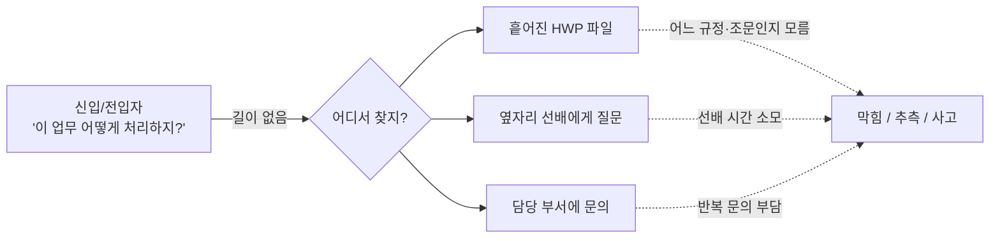
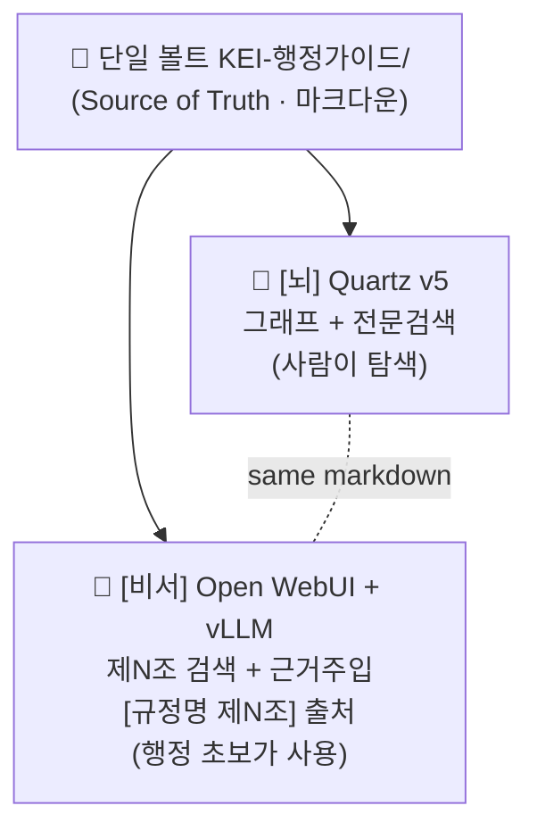
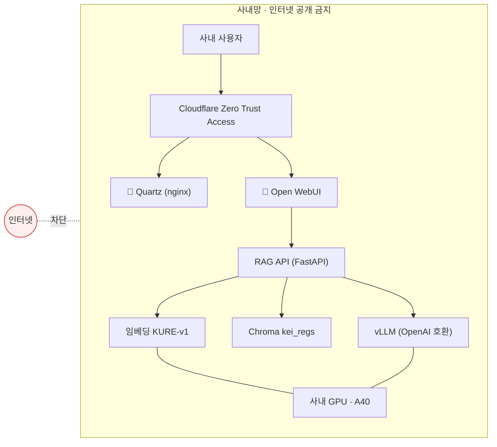

# 01 · 개요와 목표

> KEI(한국환경연구원) **행정 가이드 / 행정 비서** 프로젝트의 출발점.
> 누구의 어떤 고통을 푸는가, 무엇을 만들고 무엇은 만들지 않는가, 그리고 "성공"을 어떻게 측정할지 정의한다.

---

## 1. 문제 정의 — 행정 초보가 규정을 못 찾는 고통

행정 업무는 거의 모두 사내 규정에 근거를 둔다. 그러나 그 규정에 **빠르게 닿는 길**이 없다.

- 규정 문서는 대부분 HWP로 흩어져 있고, 어디에 무엇이 있는지 한눈에 보이지 않는다.
- "이 업무를 어떤 규정의 어느 조문이 다루는가"를 알려면 이미 그 규정 체계를 알고 있어야 한다 — 즉, **모르는 사람은 검색조차 시작하지 못한다.**
- 결국 신입·전입자는 매번 옆자리 선배나 담당 부서에 물어보고, 묻는 쪽도 답하는 쪽도 시간을 쓴다.
- 키워드 전문검색만으로는 "여비를 어떻게 청구하지?" 같은 **업무 언어**와 "제N조 ○○의 지급" 같은 **규정 언어** 사이의 간극을 넘지 못한다.

> [!note]
> 행정·회계·감사 영역에서 **틀린 답은 단순 불편이 아니라 실제 사고**가 된다. 그래서 이 프로젝트의 모든 설계는 "빠른 답"보다 "근거 있는 답, 모르면 모른다고 하는 답"을 우선한다.

---

## 2. 페르소나 — 누가 쓰는가, 무엇을 원하는가

| 페르소나 | 상황 | 가장 원하는 것 | 이 시스템이 주는 것 |
|---|---|---|---|
| **신입** | 행정 업무 자체가 처음 | "이 일을 **무슨 순서로** 하지?" — 용어부터 막힘 | [비서]가 업무 언어를 받아 쉬운 단계 설명 + `[규정명 제N조]` 출처 |
| **전입자** | 행정 경험은 있으나 KEI 규정 체계는 낯섦 | "**우리 기관에서는** 이걸 어느 규정이 정하나?" | [뇌] 그래프로 규정·용어 관계 탐색, [비서]로 근거 확인 |
| **담당 부서** | 같은 질문을 반복해서 받음 | 반복 문의 감소, 답변의 **출처 일관성** | 1차 응대를 시스템이 흡수, 가이드·원문을 검수·관리하는 주체 |

> [!tip]
> 신입·전입자는 주로 **[비서] Open WebUI + vLLM**(질문→답변)으로 들어오고, 담당 부서는 **[뇌] Quartz**(탐색·검수)와 볼트 작성으로 들어온다. 두 입구가 **같은 마크다운 볼트**를 본다.

---

## 3. 솔루션 한 줄 + 가치 제안

> **사내 규정을 단일 마크다운 볼트로 모으고, 같은 볼트를 두 개의 화면 — 탐색용 그래프 [뇌]와 출처 달린 답변용 비서 [비서] — 으로 제공하는 온프레미스 지식베이스 + 로컬 LLM 비서.**

가치 제안:

- **근거 있는 답.** 모든 답변 끝에 `[규정명 제N조]` 출처가 붙고, 근거에 없는 내용은 지어내지 않는다.
- **업무 언어로 물어도 됨.** 임베딩 검색이 "여비 청구" 같은 질문을 해당 조문으로 연결한다.
- **데이터가 밖으로 나가지 않음.** 모델·임베딩·벡터DB 전부 사내 GPU(A40)에서 구동, 두 화면 모두 Cloudflare Zero Trust 뒤 사내 전용.
- **하나만 관리하면 된다.** 볼트(`KEI-행정가이드/`)가 단일 진실원천. 그래프와 채팅을 따로 채우지 않는다.

> 핵심 원칙: **그래프와 채팅은 같은 마크다운을 먹는 두 화면이다.** 채팅은 그림(그래프)이 아니라 **텍스트 + 임베딩 검색**으로 답한다. 자세한 구조는 [02-architecture.md](02-architecture.md) 참조.

---

## 4. 목표(측정 가능) / 비목표(Non-goals)

### 4.1 목표

| # | 목표 | 측정 축(지표) |
|---|---|---|
| G1 | 행정 초보가 업무 언어 질문으로 **관련 조문에 도달** | 답변에 정확한 출처가 달리는 비율(§5 출처 정확도) |
| G2 | **모르면 모른다고** 답해 잘못된 행정 판단을 예방 | 근거 부재 시 거부 응답 비율(§5 거부율) |
| G3 | 흩어진 HWP를 **조문 구조를 보존한 마크다운**으로 통합 | 변환·검수 완료 규정 수, 검수완료 비율(§5) |
| G4 | 담당 부서의 **반복 1차 문의 부담**을 줄임 | 사용 빈도, 질문 커버리지(§5) |
| G5 | 모든 처리를 **온프레미스**로 유지(데이터 비유출) | 외부 호출 0건(§6) |

> [!todo]
> 확인 필요: 위 각 목표의 **정량 목표치**(목표 정확도/거부율/검수 완료 규정 수/주간 사용량 등)는 운영 데이터가 쌓이기 전까지 미정. 1차 베이스라인 측정 후 [08-roadmap.md](08-roadmap.md)에서 수치 확정.

### 4.2 비목표 (Non-goals)

- **외부 공개 아님.** 인터넷에 공개하는 서비스가 아니다 — 내부 전용. 자세한 통제는 [07-security-governance.md](07-security-governance.md).
- **법률·법령 자문 대체 아님.** 사내 규정 안내가 목적이며, 법률 해석이나 유권해석을 대체하지 않는다.
- **규정의 권위 있는 원본 아님.** 시스템은 안내용이고, **최종 판단은 원문과 담당 부서 확인**이 기준이다.
- **규정 의역·창작 아님.** 원문층(`20_규정원문/`)은 의역 금지 — HWP 변환 문구를 보존하고, 표/별표 깨짐과 오타만 교정한다. ([03-content-model.md](03-content-model.md))
- **일반 챗봇 아님.** 행정 규정 도메인 밖 질문에 답하는 범용 어시스턴트를 지향하지 않는다.
- **고정 길이 청킹·범용 RAG 아님.** 조문 단위 청킹과 출처 강제가 핵심이라 통제 약한 내장 RAG에 의존하지 않는다. ([05-rag-design.md](05-rag-design.md))

---

## 5. 성공 기준 (지표 정의)

수치 목표보다 **무엇을 어떻게 잴지**를 먼저 합의한다. 목표치는 베이스라인 측정 후 채운다.

| 지표 | 정의 | 측정 방법(안) | 목표치 |
|---|---|---|---|
| **출처 정확도** | 답변에 붙은 `[규정명 제N조]`가 실제 근거 조문과 일치하는 비율 | 평가셋 질문에 대해 회수된 조 vs 정답 조 대조(사람 검수) | TODO |
| **거부율(모르면 모른다)** | 근거가 없는 질문에 "규정에서 확인되지 않습니다"로 답한 비율 | 의도적 답 없음/범위 밖 질문셋으로 측정 | TODO |
| **검수완료 비율** | 전체 노트 중 `검수상태: 검수완료`인 비율(특히 `20_규정원문/`) | 프론트매터 `검수상태` 집계(Dataview/스크립트) | TODO |
| **사용 빈도** | 주간 질의 수, 활성 사용자 수, 질문 커버리지 | Open WebUI 로그 / RAG API 호출 집계 | TODO |
| **응답 지연** | 질의→응답 소요 시간(p50/p95) | RAG API 측정 로그 | TODO |

> [!warning]
> **거부율은 "낮을수록 좋은" 지표가 아니다.** 근거가 없을 때 솔직히 모른다고 하는 것은 이 시스템의 안전장치다. RAG 시스템 프롬프트의 가드레일("근거에 없으면 '규정에서 확인되지 않습니다'")은 절대 약화시키지 않는다. 가드레일 전문은 [05-rag-design.md](05-rag-design.md).

> [!note]
> 예시(일반 표현): "○○ 한도가 얼마인가?"라는 질문에 근거 조문이 회수되지 않으면, 시스템은 금액을 추측하지 않고 "규정에서 확인되지 않습니다"라고 답한 뒤 **"최종 판단은 원문과 담당 부서 확인 바랍니다."**를 덧붙인다. (실제 금액·조문 번호는 여기서 단정하지 않는다.)

---

## 6. 왜 온프레미스인가 — 데이터 비유출

사내 행정 규정은 외부로 나가서는 안 되는 내부 자산이다. 그래서 추론·임베딩·검색의 **모든 단계를 사내에서** 처리한다.

- **모델·임베딩·벡터DB가 전부 사내에.** vLLM(LLM 서빙)·`nlpai-lab/KURE-v1`(임베딩)·Chroma(벡터DB `kei_regs`)가 사내 GPU(A40) 위에서 돈다. 외부 API로 규정 텍스트를 보내지 않는다.
- **두 화면 모두 사내 전용.** [뇌] Quartz, [비서] Open WebUI 모두 Cloudflare Zero Trust 뒤에 둔다. 인터넷 공개 금지.
- **연결도 내부 경로.** Open WebUI는 RAG API를 **서버 실제 IP**로 연결한다(`localhost`/`host.docker.internal` 금지). 상세는 [06-deployment.md](06-deployment.md).

> [!todo]
> 확인 필요: 정확한 서버 호스트명/IP(예시: `data05lx`, Ubuntu) · GPU 정확 수량(A40 외) · Cloudflare 팀/도메인명. 본 문서에서는 단정하지 않는다.

자세한 보안·거버넌스 원칙(RBAC/SSO, 검수 워크플로 포함)은 [07-security-governance.md](07-security-governance.md)와 ADR [0005-on-prem-zero-trust](adr/0005-on-prem-zero-trust.md) 참조.

---

## 관련 문서

- **문서 인덱스:** [docs/README.md](README.md)
- 프로젝트 컨텍스트: [../README.md](../README.md) · [../CLAUDE.md](../CLAUDE.md) · [../WORKPLAN.md](../WORKPLAN.md)
- 함께 읽기: [02-architecture.md](02-architecture.md) · [05-rag-design.md](05-rag-design.md) · [07-security-governance.md](07-security-governance.md)

| 이전 | 다음 |
|---|---|
| (처음 문서) | [02 아키텍처 →](02-architecture.md) |

---

_최종 수정: 2026-06-18_
