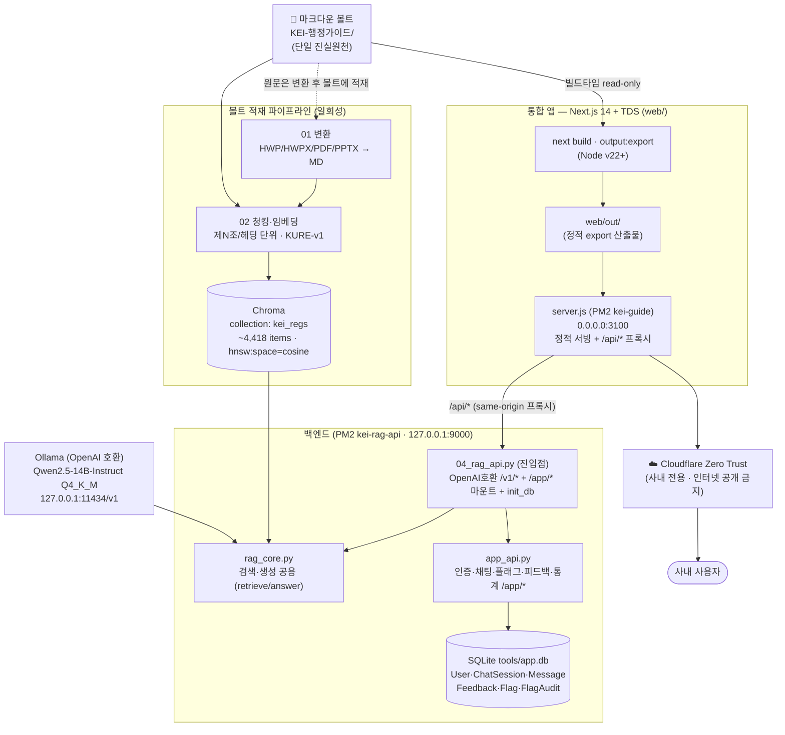
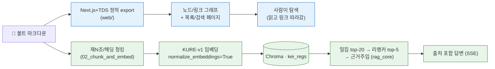
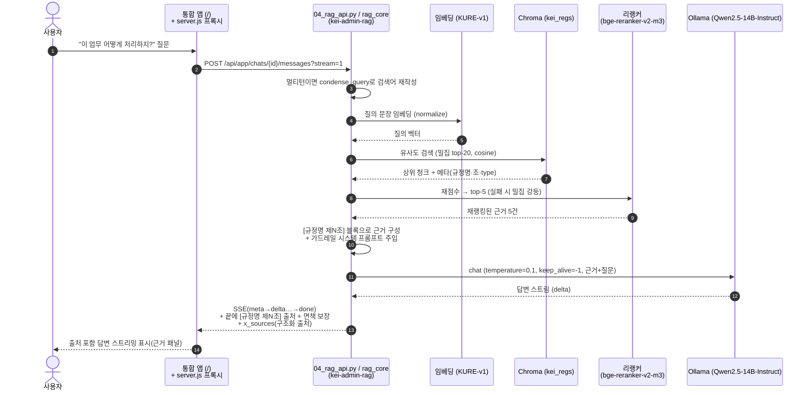
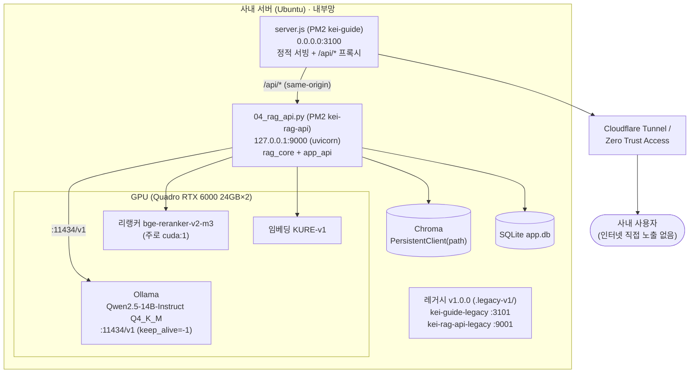

# 02. 아키텍처 — 시스템 구조 · 데이터 흐름 · 토폴로지

> KEI 행정 가이드 / 행정 LLM의 시스템 구조를 다룹니다.
> 핵심은 **하나의 볼트, 두 개의 화면**: 단일 마크다운 볼트를 [뇌] 탐색(그래프·둘러보기·문서)과 [LLM] RAG 채팅이 함께 먹습니다. 두 화면은 모두 한 개의 Next.js 14 + Toss Design System 앱(`web/`)에 통합되어 있습니다.

이 문서는 개발자·운영자를 1차 독자로 하며, 일부 절(원칙·데이터 흐름)은 행정 담당자도 읽을 수 있게 풀어 씁니다.

---

## 1. 하나의 볼트, 두 개의 화면

이 시스템에는 **단 하나의 진실원천(Source of Truth)** 만 존재합니다 — 레포 안의 마크다운 볼트 `KEI-행정가이드/`. 모든 화면은 이 볼트에서 파생되며, 볼트가 바뀌면 두 화면이 따라옵니다.

두 화면은 별도 앱이 아니라 **한 개의 Next.js 14 + TDS 앱(`web/`)에 통합된 두 경로**입니다. 같은 볼트를, 한쪽은 사람이 탐색하고 한쪽은 RAG로 답합니다.

| 화면 | 정체 | 무엇을 하나 | 누가 쓰나 | 어떻게 답하나 |
| --- | --- | --- | --- | --- |
| **[뇌]** | Next.js 14 + TDS 앱의 둘러보기(`/browse`)·관계 그래프(`/graph`)·문서 드로어 (`web/`, Node v22+) | 노드/링크 그래프 + 검색으로 규정·가이드를 **탐색** | 구조를 파악하려는 사람 | 사람이 직접 읽고 링크를 따라감 |
| **[LLM]** | 같은 앱의 RAG 채팅(`/`) — 같은 오리진 `/api/*`로 RAG API 호출 | 질문에 `[규정명 제N조]` 출처를 달아 **답변** | 행정 초보(신입·전입자) | 텍스트 + 임베딩 검색(RAG) |

> [!note] 채팅은 통합 앱의 한 경로
> [LLM] 채팅은 별도 UI가 아니라 [뇌]와 같은 앱의 루트 경로(`/`)입니다. 로그인 + 채팅기록 영속화 + 멀티턴 기억 + 메시지별 근거 저장 + 응답 스트리밍(SSE)을 지원하며, 브라우저는 같은 오리진 `/api/*`로만 백엔드를 호출합니다(상세: §5). Open WebUI는 같은 RAG API를 쓰는 **선택적 폴백**이며 기본 채택이 아닙니다.

> [!note] 가장 흔한 오해
> 채팅 LLM은 그래프 그림을 보고 답하지 않습니다. 그래프와 채팅은 같은 마크다운을 먹는 **두 개의 독립 화면**입니다. 채팅은 임베딩 검색으로 관련 조문을 회수해 텍스트로 근거를 만들고, 그 위에서 답합니다(상세: [04-pipeline.md](04-pipeline.md), [05-rag-design.md](05-rag-design.md)).

볼트 구조와 콘텐츠 계층(가치층/원문층/용어집/관리)은 [03-content-model.md](03-content-model.md)에서 다룹니다. 여기서는 그 위를 흐르는 데이터와 컴포넌트의 토폴로지에 집중합니다.

---

## 2. 컴포넌트 다이어그램

볼트 하나가 두 갈래로 갈라져 각각의 화면이 됩니다. 두 화면 모두 최종 노출은 Cloudflare Zero Trust 뒤에서만 이뤄집니다.

> [!note] 컴포넌트 책임 분리 (백엔드 3분리)
> 백엔드는 세 모듈로 나뉩니다 — `rag_core.py`(검색·생성 공용: retrieve/answer/answer_stream/condense_query/warmup) · `app_api.py`(인증·채팅·플래그·피드백·통계 `/app/*` 라우터) · `04_rag_api.py`(진입점: OpenAI호환 `/v1/*` + `/app/*` 마운트 + `init_db`). PM2는 이 진입점 1프로세스를 띄워 모델을 1회만 로드합니다. `04_rag_api.py`가 제N조 검색 + 근거주입 + `[규정명 제N조]` 출처 강제를 담당합니다(결정 근거: [adr/0003-controlled-rag-api.md](adr/0003-controlled-rag-api.md)). Open WebUI를 선택적 폴백으로 쓸 때도 같은 RAG API를 등록합니다.

> [!note] 통합 앱 구성 — Next.js 14 + TDS (이전 방식 Quartz 대체)
> 두 화면은 레포의 `web/` 디렉터리에 있는 한 개의 **Next.js 14 + Toss Design System(TDS)** 앱입니다. 서버 런타임 없이 `next.config`의 `output: 'export'`로 정적 export(`web/out/`)만 산출하고, `server.js`(의존성0 정적 서버 + `/api/*` 프록시) 또는 nginx(127.0.0.1) → Cloudflare Zero Trust(사내 전용)로 노출합니다.
> - **경로**: LLM RAG 채팅(`/`, 근거 패널·문서 드로어) · 둘러보기(`/browse`, 좌측 체크박스 필터) · 관계 그래프(`/graph`) · 운영자 대시보드/플래그(`/admin`).
> - **라우터·런타임**: Pages Router(TDS=emotion 기반과 SSG 호환), React 18 고정(TDS peer · Next 14).
> - **TDS**: `@toss/tds-mobile` v2.5.0 + `TDSMobileAITProvider`(`@toss/tds-mobile-ait`). TDS 팔레트를 KEI 시맨틱 토큰(`web/styles/globals.css`의 CSS 변수)으로 매핑해, 나중에 KEI 메인 컬러는 그 한 블록만 교체합니다(메인 컬러는 미정). `ThemeProvider`(seed token)로 TDS 컴포넌트 색도 재정의 가능합니다.
> - **다크모드**: 라이트/다크/시스템 토글(`lib/theme.tsx` + `ThemeToggle`). 다크 토큰은 `[data-theme="dark"]`로 분기하고, FOUC 방지용 인라인 스크립트를 `_document`에 둡니다(TDS는 `ColorSchemeArea`로 동기화).
> - **스타일·콘텐츠**: CSS 변수 토큰 + CSS Modules(SSG 안전). 본문은 `react-markdown` + `remark-gfm`로 렌더합니다.
> - **볼트 소비**: `web/lib/vault.ts`가 볼트(`KEI-행정가이드/`, git 비추적·Syncthing)를 **빌드타임 read-only**로 읽습니다(`VAULT_DIR` 환경변수, 기본 레포 루트). 드로어용 `out/docdata/*.json`도 빌드 때 함께 산출됩니다. `web/node_modules`·`.next`·`out`은 `.gitignore` 대상입니다.
> - **기능**: 둘러보기(검색/섹션 필터) / 문서(메타 칩·본문·백링크·제N조 앵커로 조 단위 점프) / 관계 그래프(`react-force-graph-2d`, 노드 클릭 → 문서 이동, 코드 스플릿). 단일 앱·단일 볼트 안에서 섹션(규정집/연구행정 가이드/용어집/ERP 시스템)을 분리하며, 가이드는 `10_업무가이드/`에 문서 추가 시 자동 합류합니다.
> - **기능 플래그**: 정적 export라 빌드에 박지 않고 `lib/flags.tsx`(`useFlag`, 안전기본값 + localStorage 캐시 + 폴백)로 런타임에 `GET /app/flags`를 fetch합니다. 관리자는 `/admin`에서 즉시 토글합니다(매뉴얼: [13-feature-flags.md](13-feature-flags.md)).
> - **위키링크**: 규정 상호참조 `[[ ]]`가 내부 라우트로 연결되고, 이름 변이(공백·가운뎃점·`.`·`및`)도 자동 흡수합니다(01b 정규화).
>
> 디자인 원칙·토큰·컴포넌트 규약은 [design-system.md](design-system.md)를 참고하세요.

> [!note] 코퍼스 규모 (2026-06-21)
> 볼트는 4섹션·271문서입니다 — 규정집(`20_규정원문/`) 111 · 연구행정 가이드(`10_업무가이드/`) 64 · 용어집(`30_용어집/`) 84 · ERP 시스템(`40_시스템/`) 12. 임베딩 청크는 약 4,400개(긴 조문 하위분할 반영, 재색인 후 4,418)이며, 전건 `검수상태: 미검수`(사람 검수 전)입니다. 프론트 실렌더 검증은 `web/verify-*.mjs`(Playwright)로 합니다(headless 한글은 Noto Sans KR·나눔고딕·Noto Color Emoji 설치 + `fc-cache` 후 정상). 남은 일(미정): KEI 메인 컬러 토큰 블록 교체, first-load 번들 경량화, TDS 컴포넌트 확대.

> [!warning] 변환 단계는 일회성 적재 흐름
> `01 변환`은 실시간 경로가 아니라 HWP/HWPX 원문을 볼트의 `20_규정원문/`에 적재하는 **파이프라인 작업**입니다. 평상시 임베딩(`02`)은 볼트의 마크다운을 직접 읽습니다. 점선은 이 적재 관계를 나타냅니다.

> [!note] 현재 검증 상태 (2026-06-21)
> 변환·임베딩·검색·생성까지 실제 실행으로 검증되었습니다. 생성은 **Ollama**(OpenAI 호환, `127.0.0.1:11434/v1`, 모델 `Qwen2.5-14B-Instruct Q4_K_M GGUF`)로 구동되며 한국어 답변을 검증했습니다(vLLM은 대안 표기). 리랭커(P1.4) 적용 후 평가 strict Hit@1 0.600→0.829, @5 1.000. 검색·근거주입·출처 표기·면책 보장도 검증되었습니다(상세: [04-pipeline.md](04-pipeline.md), [05-rag-design.md](05-rag-design.md), [12-품질강화.md](12-품질강화.md)).

---

## 3. 데이터 흐름 — 두 갈래

같은 볼트가 목적에 따라 두 가지 표현으로 갈라집니다.

| 구분 | A. 탐색용 그래프 ([뇌]) | B. 질의응답 RAG ([LLM]) |
| --- | --- | --- |
| 입력 | 볼트 마크다운 + 위키링크 | 볼트 마크다운(조문·헤딩) |
| 변환 | Next.js+TDS 정적 export → 노드/링크/검색 페이지 | 규정=제N조 단위, 가이드/ERP=헤딩 단위 청킹 → KURE-v1 임베딩 |
| 저장 | `web/out/` 정적 파일 | Chroma 벡터(`kei_regs`) |
| 서빙 | `server.js`(또는 nginx) | `server.js` `/api/*` 프록시 → `04_rag_api.py`(rag_core) |
| 소비 방식 | 사람이 링크/그래프를 탐색 | 임베딩 유사도 검색 → 리랭커 재점수로 조문 회수 |
| 출력 형태 | 백링크·그래프 시각화·검색 결과 | `[규정명 제N조]` 출처 포함 답변(SSE 스트리밍) |

> [!warning] 청킹 원칙
> 임베딩 흐름(B)은 규정원문을 **조문 1개 = 청크 1개**(제N조 단위)로, 가이드·ERP는 **헤딩(####/##) 단위**로 자릅니다. 고정 길이 청킹은 금지합니다 — 출처를 `[규정명 제N조]` 수준으로 정확히 달기 위함입니다(근거: [adr/0002-article-level-chunking.md](adr/0002-article-level-chunking.md)). 별표/별지는 1급 청크로 분리하고(조="별표 N"), 긴 청크는 메타를 유지한 채 항→호→문단→줄 순으로 하위분할합니다(상세: [04-pipeline.md](04-pipeline.md)). 원문층(`20_규정원문/`)은 의역 없이 원문 그대로 적재하므로, 검색·근거주입도 원문 텍스트를 그대로 다룹니다.

---

## 4. 질문 한 건의 시퀀스

사용자가 질문 하나를 던졌을 때 [LLM] 화면 안에서 일어나는 일입니다.

답변은 항상 다음 가드레일을 지킵니다(03/04 공통, 약화 금지):

1. `[근거]`에 없는 내용(특히 금액·한도·기한)은 절대 지어내지 않고 **"규정에서 확인되지 않습니다"** 라고 말합니다.
2. 신입도 이해하게 단계로 쉽게 설명합니다.
3. 답변 끝에 사용한 출처를 **`[규정명 제N조]`** 형식으로 모두 표기합니다.
4. 마지막에 **"최종 판단은 원문과 담당 부서 확인 바랍니다."** 를 덧붙입니다.

> [!tip] 검색 추적
> `04_rag_api.py` 응답에는 회수된 출처가 `x_sources`(규정명·조·분류·type·snippet·distance) 구조화 필드로 포함되며(하위호환 `x_retrieved`는 조문 태그 문자열), 근거 패널·문서 드로어가 이를 사용합니다. 답변이 이상할 때 "어떤 조문을 근거로 삼았는지"를 먼저 확인하세요. 가드레일·프롬프트 상세는 [05-rag-design.md](05-rag-design.md).

---

## 5. 배포 토폴로지

두 화면 모두 단일 호스트에서 서빙하며, 모델·임베딩은 전부 사내 GPU에서 구동합니다. 노출은 Cloudflare Zero Trust 뒤에서만 이뤄집니다.

> [!note] 사내 GPU
> 개발·검증·배포 모두 단일 서버의 **사내 GPU(Quadro RTX 6000 24GB×2, 총 48GB)** 에서 구동합니다. 24GB×2이며 단일 통합 메모리가 아닙니다. 임베딩·검색은 1장으로도 검증되었습니다(생성용 LLM도 같은 사내 GPU에서 구동).
>
> 생성은 **Ollama**가 `Qwen2.5-14B-Instruct Q4_K_M(GGUF, ~9GB)` 양자화 모델로 서빙합니다(fp16 ~28GB는 RTX 6000 단일 24GB 초과 → 양자화 또는 2장 텐서병렬이 필요해, 실측 운영은 Q4 양자화). 임베딩(KURE-v1)은 1장으로 충분합니다(실측).

> [!warning] GPU는 공유·변동적
> 모델 배치 전 반드시 `nvidia-smi`로 실제 점유를 확인하세요(CLAUDE.md의 GPU 줄은 불안정). 리랭커(`bge-reranker-v2-m3`)와 재색인은 여유 GPU(주로 `cuda:1`)를 쓰며, 점유 시 밀집/CPU로 우아하게 강등합니다.

### 포트·엔드포인트 요약

현행 개발(feat/0620)과 레거시 v1.0.0이 서로 다른 포트로 완전 격리되어 공존합니다.

| 컴포넌트 | 포트 | 비고 |
| --- | --- | --- |
| Ollama (OpenAI 호환, 생성) | `11434/v1` | `VLLM_BASE=http://127.0.0.1:11434/v1`, 모델 `Qwen2.5-14B-Instruct Q4_K_M` |
| `04_rag_api.py` (PM2 `kei-rag-api`) | `127.0.0.1:9000` | `uvicorn 04_rag_api:app --host 127.0.0.1 --port 9000`. `/v1/*` + `/app/*` |
| 통합 앱 `server.js` (PM2 `kei-guide`) | `0.0.0.0:3100` | `web/out/` 정적 서빙 + `/api/*` → 9000 프록시 |
| 레거시 RAG API (PM2 `kei-rag-api-legacy`) | `127.0.0.1:9001` | `.legacy-v1/`, 동결 빌드(완전 격리) |
| 레거시 앱 (PM2 `kei-guide-legacy`) | `3101` | `.legacy-v1/out`, → 9001 프록시 |

> [!note] 개발 미리보기
> 개발 중에는 `cd web && VAULT_DIR=<볼트> npm run dev`로 미리보기를 띄울 수 있습니다(⚠️ 빌드는 반드시 nvm Node 22 — 기본 node18은 docdata emit이 조용히 실패해 드로어가 깨집니다). 운영 서빙은 `server.js`(PM2 `kei-guide`) 또는 nginx 127.0.0.1 + Cloudflare Zero Trust로 합니다.

> [!warning] 연결 URL / CORS 함정
> 브라우저는 백엔드를 **같은 오리진 `/api/*`로만** 호출하고, `server.js`가 로컬 RAG API(127.0.0.1:9000)로 프록시합니다 → CORS 불필요 + API가 LAN에 직접 노출되지 않습니다(쿠키 인증은 same-origin 전제). `allow_credentials=True`를 와일드카드 오리진과 함께 켜지 마세요. SSE 스트리밍은 `server.js`가 hop-by-hop 헤더(`transfer-encoding`·`content-length`·`connection`)를 제거한 뒤 파이프해 버퍼링/중복청크 없이 흐릅니다. Open WebUI를 선택적 폴백으로 등록할 때는 컨테이너 네트워크 함정에 유의해 `localhost`가 아니라 서버 실제 IP/서비스명을 쓰세요(Base URL `http://<서버IP>:9000/v1`, API Key=`EMPTY`).

> [!warning] 보안 — 인터넷 공개 금지
> 두 화면 모두 **KEI 내부 규정**을 다룹니다. 어떤 화면도 인터넷에 공개하지 않습니다. Cloudflare Zero Trust Access 정책 뒤에 두고, 통합 앱 자체 인증(bcrypt+PyJWT 쿠키 로그인, 관리자 기능은 `APP_ADMINS` fail-closed)으로 한 겹 더 보호합니다. 모델·임베딩이 전부 온프레미스라 데이터는 망 밖으로 나가지 않습니다(상세: [06-deployment.md](06-deployment.md), [07-security-governance.md](07-security-governance.md), [adr/0005-on-prem-zero-trust.md](adr/0005-on-prem-zero-trust.md)).

> [!todo] 확인 필요: 인프라 상세
> 다음 값은 본 문서에서 단정하지 않습니다(정본 사실에 없거나 변동적) — 정해지면 채울 것.
> - 정확한 배포 호스트명/IP
> - Cloudflare 팀/도메인명
>
> (해소됨) 사내 GPU=Quadro RTX 6000 24GB×2(총 48GB, 단일 통합 메모리 아님). Chroma 경로는 `tools/chroma/`(`.gitignore` 대상이라 `02_chunk_and_embed.py`로 재생성), 컬렉션 `kei_regs`. SQLite는 `tools/app.db`, JWT 서명키 `tools/.app_secret`(0600) — 모두 gitignore.

---

## 6. 기술 선택 요약

각 결정의 배경·대안·트레이드오프는 ADR(Architecture Decision Record)에 있습니다.

| 영역 | 선택 | 핵심 이유 | 결정 기록 |
| --- | --- | --- | --- |
| 임베딩 모델 | `nlpai-lab/KURE-v1` (대안 `BAAI/bge-m3`) | 한국어 규정 검색 품질 · 양자화 안 함 · `normalize_embeddings=True` | [adr/0001-embedding-kure-v1.md](adr/0001-embedding-kure-v1.md) |
| 청킹 단위 | 규정=제N조 단위 · 가이드/ERP=헤딩 단위 · 별표/별지=1급 청크 | 고정 길이 청킹 금지 → `[규정명 제N조]` 출처 정확도 | [adr/0002-article-level-chunking.md](adr/0002-article-level-chunking.md) |
| RAG 방식 | 통제형 RAG API(`04_rag_api.py` + `rag_core`) | 출처 강제·근거주입·가드레일을 우리가 통제(UI는 통합 앱, Open WebUI는 선택적 폴백) | [adr/0003-controlled-rag-api.md](adr/0003-controlled-rag-api.md) |
| 탐색 화면 | Next.js 14 + TDS 정적 사이트(`web/`) — 이전 방식(Quartz) 대체 | 정적 export로 그래프·목록·검색·문서 제공 + TDS 디자인 일관성 + KEI 시맨틱 토큰 | [adr/0004-quartz-graph-site.md](adr/0004-quartz-graph-site.md)(이전 방식 배경), [design-system.md](design-system.md) |
| 노출·보안 | 온프레미스 + Cloudflare Zero Trust | 내부 규정 비공개 · 데이터 망 밖 미유출 | [adr/0005-on-prem-zero-trust.md](adr/0005-on-prem-zero-trust.md) |

부수 선택(추가 ADR 없이 본문 사실로 고정):

| 영역 | 선택 |
| --- | --- |
| 벡터DB | Chroma `PersistentClient(path)`, collection `kei_regs`(약 4,418 items), 컬렉션 메타 `hnsw:space=cosine`. 청크 메타데이터 키: `규정명`·`규정번호`·`조`·`분류`·`개정일`·`검수상태`·`type`·`path`(볼트 상대경로) |
| LLM 서빙 | **Ollama**(OpenAI 호환, `127.0.0.1:11434/v1`), 모델 `Qwen2.5-14B-Instruct Q4_K_M`(GGUF, ~9GB, 일반 instruct). vLLM은 대안 표기 |
| 리랭커 | `BAAI/bge-reranker-v2-m3`(cross-encoder, 온프레미스). 밀집 top-20 → top-5 재점수. 실패 시 밀집 강등 |
| HWP 변환 | `hwp-hwpx-parser`(.hwp/.hwpx). 표/별표 깨지면 LibreOffice + H2Orestart → PDF → Qwen2.5-VL로 표만 재추출. 가이드(PDF/PPTX)는 PyMuPDF/python-pptx |
| 앱 영속화 | bcrypt(직접)+PyJWT 쿠키 + SQLModel/SQLite(`tools/app.db`). 테이블 `User`·`ChatSession`·`Message`·`Feedback`·`Flag`·`FlagAudit` |
| LLM UI | 통합 Next.js+TDS 앱(`web/` `/`). `04_rag_api.py`를 같은 오리진 `/api/*`로 호출. Open WebUI는 같은 RAG API를 쓰는 선택적 폴백 |

> [!note] ADR 인덱스
> ADR 목록과 작성 규약은 [adr/README.md](adr/README.md)를 참고하세요.

---

## 관련 문서

- 문서 인덱스: [docs/README.md](README.md)
- 루트: [../README.md](../README.md) · [../CLAUDE.md](../CLAUDE.md) · [../WORKPLAN.md](../WORKPLAN.md)
- ← 이전: [01-overview.md](01-overview.md) — 개요
- → 다음: [03-content-model.md](03-content-model.md) — 콘텐츠 모델

---

최종 수정: 2026-06-21
