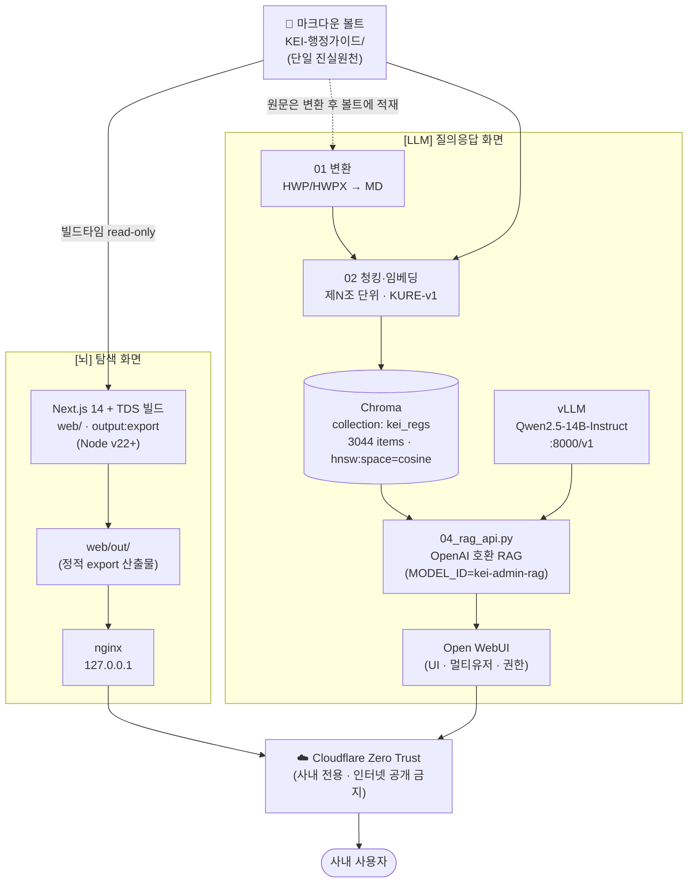
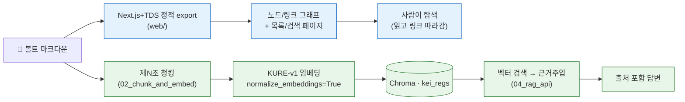
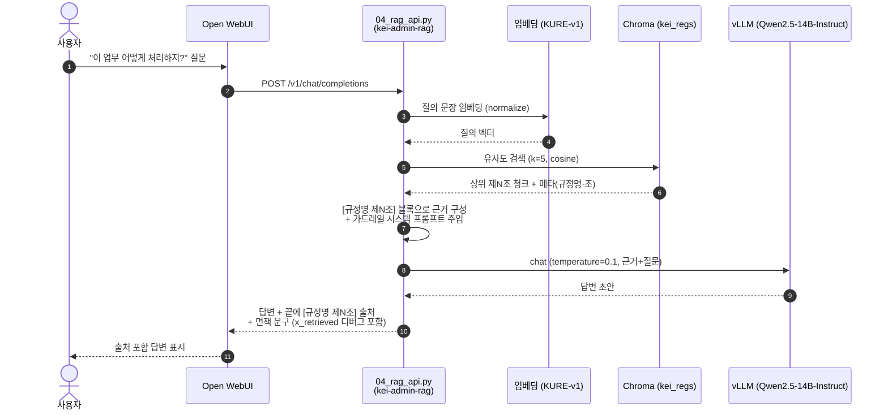
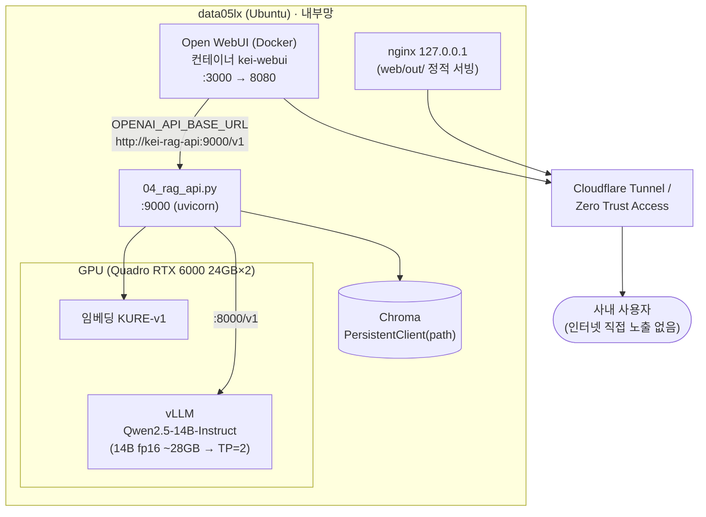

# 02. 아키텍처 — 시스템 구조 · 데이터 흐름 · 토폴로지

> KEI 행정 가이드 / 행정 LLM의 시스템 구조를 다룹니다.
> 핵심은 **하나의 볼트, 두 개의 화면**: 단일 마크다운 볼트를 [뇌] Next.js+TDS 그래프와 [LLM] Open WebUI+vLLM 두 화면이 함께 먹습니다.

이 문서는 개발자·운영자를 1차 독자로 하며, 일부 절(원칙·데이터 흐름)은 행정 담당자도 읽을 수 있게 풀어 씁니다.

---

## 1. 하나의 볼트, 두 개의 화면

이 시스템에는 **단 하나의 진실원천(Source of Truth)** 만 존재합니다 — 레포 안의 마크다운 볼트 `KEI-행정가이드/`. 모든 화면은 이 볼트에서 파생되며, 볼트가 바뀌면 두 화면이 따라옵니다.

| 화면 | 정체 | 무엇을 하나 | 누가 쓰나 | 어떻게 답하나 |
| --- | --- | --- | --- | --- |
| **[뇌]** | Next.js 14 + TDS 정적 사이트 (`web/`, Node v22+) | 노드/링크 그래프 + 검색으로 규정·가이드를 **탐색** | 구조를 파악하려는 사람 | 사람이 직접 읽고 링크를 따라감 |
| **[LLM]** | Open WebUI + vLLM | 질문에 `[규정명 제N조]` 출처를 달아 **답변** | 행정 초보(신입·전입자) | 텍스트 + 임베딩 검색(RAG) |

> [!note] 가장 흔한 오해
> 채팅 LLM은 그래프 그림을 보고 답하지 않습니다. 그래프와 채팅은 같은 마크다운을 먹는 **두 개의 독립 화면**입니다. 채팅은 임베딩 검색으로 관련 조문을 회수해 텍스트로 근거를 만들고, 그 위에서 답합니다(상세: [04-pipeline.md](04-pipeline.md), [05-rag-design.md](05-rag-design.md)).

볼트 구조와 콘텐츠 계층(가치층/원문층/용어집/관리)은 [03-content-model.md](03-content-model.md)에서 다룹니다. 여기서는 그 위를 흐르는 데이터와 컴포넌트의 토폴로지에 집중합니다.

---

## 2. 컴포넌트 다이어그램

볼트 하나가 두 갈래로 갈라져 각각의 화면이 됩니다. 두 화면 모두 최종 노출은 Cloudflare Zero Trust 뒤에서만 이뤄집니다.

> [!note] 컴포넌트 책임 분리
> `04_rag_api.py`가 제N조 검색 + 근거주입 + `[규정명 제N조]` 출처 강제를 담당하고, Open WebUI는 UI/멀티유저/권한만 담당합니다. Open WebUI 내장 RAG는 청킹·출처표기 통제가 약하기 때문입니다(결정 근거: [adr/0003-controlled-rag-api.md](adr/0003-controlled-rag-api.md)).

> [!note] [뇌] 화면 구성 — Next.js 14 + TDS (이전 방식 Quartz 대체)
> [뇌] 탐색 화면은 레포의 `web/` 디렉터리에 있는 **Next.js 14 + Toss Design System(TDS)** 앱입니다. 서버 런타임 없이 `next.config`의 `output: 'export'`로 정적 export(`web/out/`)만 산출하고, 이전 Quartz와 동일하게 nginx(127.0.0.1) → Cloudflare Zero Trust(사내 전용)로 노출합니다.
> - **라우터·런타임**: Pages Router(TDS=emotion 기반과 SSG 호환), React 18 고정(TDS peer · Next 14).
> - **TDS**: `@toss/tds-mobile` v2.5.0 + `TDSMobileAITProvider`(`@toss/tds-mobile-ait`). TDS 팔레트를 KEI 시맨틱 토큰(`web/styles/globals.css`의 CSS 변수)으로 매핑해, 나중에 KEI 메인 컬러는 그 한 블록만 교체합니다(메인 컬러는 미정). `ThemeProvider`(seed token)로 TDS 컴포넌트 색도 재정의 가능합니다.
> - **스타일·콘텐츠**: CSS 변수 토큰 + CSS Modules(SSG 안전). 본문은 `react-markdown` + `remark-gfm`로 렌더합니다.
> - **볼트 소비**: `web/lib/vault.ts`가 볼트(`KEI-행정가이드/`, git 비추적·Syncthing)를 **빌드타임 read-only**로 읽습니다(`VAULT_DIR` 환경변수, 기본 레포 루트). `web/node_modules`·`.next`·`out`은 `.gitignore` 대상입니다.
> - **기능**: 목록(TDS `SearchField`·`SegmentedControl`로 검색/섹션탭) / 문서(메타 칩·본문·백링크·제N조 앵커로 조 단위 점프) / 관계 그래프(`react-force-graph-2d`, 노드 클릭 → 문서 이동, 코드 스플릿). 단일 앱·단일 볼트 안에서 섹션(규정집/연구행정 가이드/용어집)을 분리하며, 가이드는 `10_업무가이드/`에 문서 추가 시 자동 합류합니다.
> - **위키링크**: 규정 상호참조 `[[ ]]`가 내부 라우트로 연결되고, 이름 변이(공백·가운뎃점·`.`·`및`)도 자동 흡수합니다(01b 정규화).
>
> 디자인 원칙·토큰·컴포넌트 규약은 [design-system.md](design-system.md)를 참고하세요.

> [!note] [뇌] 빌드 검증 상태 (2026-06-19)
> `next build` 성공, 정적 **115페이지**(목록·관계 그래프·문서 111). 한글 mojibake 0, 위키링크 내부 네비+제N조 앵커 동작, 그래프 **111 노드·82 연결**, TDS 컬러 적용을 실측했습니다(커밋 `ba6bc8d`·`fe77df3`·`bfdb7e8`). 남은 일(미정): KEI 메인 컬러 토큰 블록 교체, first-load 번들(~388KB, TDS) 경량화, TDS 컴포넌트 확대.

> [!warning] 변환 단계는 일회성 적재 흐름
> `01 변환`은 실시간 경로가 아니라 HWP/HWPX 원문을 볼트의 `20_규정원문/`에 적재하는 **파이프라인 작업**입니다. 평상시 임베딩(`02`)은 볼트의 마크다운을 직접 읽습니다. 점선은 이 적재 관계를 나타냅니다.

> [!note] 현재 검증 상태 (2026-06-19)
> 변환·임베딩·검색까지는 실제 실행으로 검증되었고(112개 중 111개 변환, 3044 청크 임베딩, 회수 정확도 확인), **답변 생성 단계만 vLLM 엔드포인트(사내 GPU Quadro RTX 6000 24GB×2) 연결을 대기 중**입니다. 머신에 vLLM이 미기동이라 생성은 미검증이며, 검색·근거주입·출처 표기는 검증되었습니다(상세: [04-pipeline.md](04-pipeline.md)).

---

## 3. 데이터 흐름 — 두 갈래

같은 볼트가 목적에 따라 두 가지 표현으로 갈라집니다.

| 구분 | A. 탐색용 그래프 ([뇌]) | B. 질의응답 RAG ([LLM]) |
| --- | --- | --- |
| 입력 | 볼트 마크다운 + 위키링크 | 볼트 마크다운(조문) |
| 변환 | Next.js+TDS 정적 export → 노드/링크/검색 페이지 | 제N조 단위 청킹 → KURE-v1 임베딩 |
| 저장 | `web/out/` 정적 파일 | Chroma 벡터(`kei_regs`) |
| 서빙 | nginx | `04_rag_api.py` → Open WebUI |
| 소비 방식 | 사람이 링크/그래프를 탐색 | 임베딩 유사도 검색으로 조문 회수 |
| 출력 형태 | 백링크·그래프 시각화·검색 결과 | `[규정명 제N조]` 출처 포함 답변 |

> [!warning] 청킹 원칙
> 임베딩 흐름(B)은 **조문 1개 = 청크 1개**(제N조 단위)로 자릅니다. 고정 길이 청킹은 금지합니다 — 출처를 `[규정명 제N조]` 수준으로 정확히 달기 위함입니다(근거: [adr/0002-article-level-chunking.md](adr/0002-article-level-chunking.md)). 원문층(`20_규정원문/`)은 의역 없이 원문 그대로 적재하므로, 검색·근거주입도 원문 텍스트를 그대로 다룹니다.

---

## 4. 질문 한 건의 시퀀스

사용자가 질문 하나를 던졌을 때 [LLM] 화면 안에서 일어나는 일입니다.

답변은 항상 다음 가드레일을 지킵니다(03/04 공통, 약화 금지):

1. `[근거]`에 없는 내용(특히 금액·한도·기한)은 절대 지어내지 않고 **"규정에서 확인되지 않습니다"** 라고 말합니다.
2. 신입도 이해하게 단계로 쉽게 설명합니다.
3. 답변 끝에 사용한 출처를 **`[규정명 제N조]`** 형식으로 모두 표기합니다.
4. 마지막에 **"최종 판단은 원문과 담당 부서 확인 바랍니다."** 를 덧붙입니다.

> [!tip] 검색 추적
> `04_rag_api.py` 응답에는 회수된 조 목록이 `x_retrieved` 디버그 필드로 포함됩니다. 답변이 이상할 때 "어떤 조문을 근거로 삼았는지"를 먼저 확인하세요. 가드레일·프롬프트 상세는 [05-rag-design.md](05-rag-design.md).

---

## 5. 배포 토폴로지

두 화면 모두 단일 호스트에서 서빙하며, 모델·임베딩은 전부 사내 GPU에서 구동합니다. 노출은 Cloudflare Zero Trust 뒤에서만 이뤄집니다.

> [!note] 사내 GPU
> 개발·검증·배포 모두 단일 서버(data05lx)의 **사내 GPU(Quadro RTX 6000 24GB×2, 총 48GB)** 에서 구동합니다(드라이버 R535/CUDA 12.2, torch 2.6.0+cu124, `nvidia-smi`로 확인). 24GB×2이며 단일 통합 메모리가 아닙니다. 임베딩·검색은 1장으로도 검증되었습니다(생성용 vLLM도 같은 사내 GPU에서 구동).
>
> Qwen2.5-14B-Instruct fp16(약 28GB)은 RTX 6000 단일 24GB를 초과하므로 2장 텐서병렬(`tensor-parallel-size=2`) 또는 더 작은 instruct(7B/3B)·양자화 서빙이 필요합니다. 임베딩(KURE-v1)은 1장으로 충분합니다(실측).

### 포트·엔드포인트 요약

| 컴포넌트 | 포트 | 비고 |
| --- | --- | --- |
| vLLM (OpenAI 호환) | `8000/v1` | `VLLM_BASE=http://localhost:8000/v1` (기존 서버) |
| `04_rag_api.py` | `9000` | `uvicorn 04_rag_api:app --host 0.0.0.0 --port 9000` |
| Open WebUI | `3000 → 8080` | Docker, 컨테이너 `kei-webui` |
| [뇌] Next.js 미리보기 | `3100` | `cd web && VAULT_DIR=<볼트> npm run dev` → `http://127.0.0.1:3100` (개발용) |
| 임베딩 TEI(선택) | `8080 → 80` | Open WebUI 내장 RAG 쓸 때만 |

> [!note] 미리보기 포트
> [뇌] Next.js 미리보기는 `3100`을 쓰므로([이전 방식 Quartz의 8080과 달리] 임베딩 TEI의 호스트 8080과 충돌하지 않습니다), 개발 중 두 화면을 동시에 띄워도 됩니다. 임베딩 TEI(선택 컴포넌트)는 그대로 호스트 8080을 점유하므로, TEI를 다른 8080 점유 프로세스와 함께 띄울 때만 한쪽 매핑을 변경하세요.

> [!warning] 연결 URL 함정
> 연결 대상이 **어디서 도는지**에 따라 Base URL이 달라집니다. 컴포즈 내부 통신(Open WebUI ↔ 같은 컴포즈의 RAG API)은 **서비스명**(`http://kei-rag-api:9000/v1`, 위 토폴로지 다이어그램)을 씁니다. 반면 컨테이너 외부에서 호스트가 직접 띄운 RAG API(uvicorn)에 붙을 때는 `localhost`/`host.docker.internal`이 아니라 **서버 실제 IP** 를 써야 합니다(흔한 Docker 네트워크 함정). 후자의 Open WebUI 등록: 설정 > 연결 > OpenAI API, Base URL=`http://<서버실제IP>:9000/v1`, API Key=`EMPTY`.

> [!warning] 보안 — 인터넷 공개 금지
> 두 화면 모두 **KEI 내부 규정**을 다룹니다. 어떤 화면도 인터넷에 공개하지 않습니다. Cloudflare Zero Trust Access 정책 뒤에 두고, Open WebUI 자체 인증(RBAC/SSO)으로 한 겹 더 보호합니다. 모델·임베딩이 전부 온프레미스라 데이터는 망 밖으로 나가지 않습니다(상세: [06-deployment.md](06-deployment.md), [07-security-governance.md](07-security-governance.md), [adr/0005-on-prem-zero-trust.md](adr/0005-on-prem-zero-trust.md)).

> [!todo] 확인 필요: 인프라 상세
> 다음 값은 확정 전이므로 본 문서에서 단정하지 않습니다 — 정해지면 채울 것.
> - `data05lx` 외 정확한 배포 호스트명/IP
> - Cloudflare 팀/도메인명
>
> (해소됨) 사내 GPU=Quadro RTX 6000 24GB×2(총 48GB, 단일 통합 메모리 아님), 단일 서버(data05lx) 구동. Chroma 경로는 `tools/chroma/`(약 44MB, `.gitignore` 대상이라 `02_chunk_and_embed.py`로 재생성).

---

## 6. 기술 선택 요약

각 결정의 배경·대안·트레이드오프는 ADR(Architecture Decision Record)에 있습니다.

| 영역 | 선택 | 핵심 이유 | 결정 기록 |
| --- | --- | --- | --- |
| 임베딩 모델 | `nlpai-lab/KURE-v1` (대안 `BAAI/bge-m3`) | 한국어 규정 검색 품질 · 양자화 안 함 · `normalize_embeddings=True` | [adr/0001-embedding-kure-v1.md](adr/0001-embedding-kure-v1.md) |
| 청킹 단위 | 제N조 단위(조문 1개 = 청크 1개) | 고정 길이 청킹 금지 → `[규정명 제N조]` 출처 정확도 | [adr/0002-article-level-chunking.md](adr/0002-article-level-chunking.md) |
| RAG 방식 | 통제형 RAG API(`04_rag_api.py`) | 출처 강제·근거주입·가드레일을 우리가 통제(Open WebUI는 UI만) | [adr/0003-controlled-rag-api.md](adr/0003-controlled-rag-api.md) |
| 탐색 화면 | Next.js 14 + TDS 정적 사이트(`web/`) — 이전 방식(Quartz) 대체 | 정적 export로 그래프·목록·검색·문서 제공 + TDS 디자인 일관성 + KEI 시맨틱 토큰 | [adr/0004-quartz-graph-site.md](adr/0004-quartz-graph-site.md)(이전 방식 배경), [design-system.md](design-system.md) |
| 노출·보안 | 온프레미스 + Cloudflare Zero Trust | 내부 규정 비공개 · 데이터 망 밖 미유출 | [adr/0005-on-prem-zero-trust.md](adr/0005-on-prem-zero-trust.md) |

부수 선택(추가 ADR 없이 본문 사실로 고정):

| 영역 | 선택 |
| --- | --- |
| 벡터DB | Chroma `PersistentClient(path)`, collection `kei_regs`(3044 items), 컬렉션 메타 `hnsw:space=cosine`. 청크 메타데이터 키: `규정명`·`규정번호`·`조`·`분류`·`개정일`·`검수상태`·`type`·`path`(볼트 상대경로) |
| LLM 서빙 | vLLM(OpenAI 호환), 모델 `Qwen/Qwen2.5-14B-Instruct`(일반 instruct, 코더/VL 아님). 한국어 특화 대안 EXAONE/Kanana |
| HWP 변환 | `hwp-hwpx-parser`. 표/별표 깨지면 LibreOffice + H2Orestart → PDF → Qwen2.5-VL로 표만 재추출 |
| LLM UI | Open WebUI(Docker), `04_rag_api.py`를 `kei-admin-rag` 모델로 등록 |

> [!note] ADR 인덱스
> ADR 목록과 작성 규약은 [adr/README.md](adr/README.md)를 참고하세요.

---

## 관련 문서

- 문서 인덱스: [docs/README.md](README.md)
- 루트: [../README.md](../README.md) · [../CLAUDE.md](../CLAUDE.md) · [../WORKPLAN.md](../WORKPLAN.md)
- ← 이전: [01-overview.md](01-overview.md) — 개요
- → 다음: [03-content-model.md](03-content-model.md) — 콘텐츠 모델

---

최종 수정: 2026-06-19
