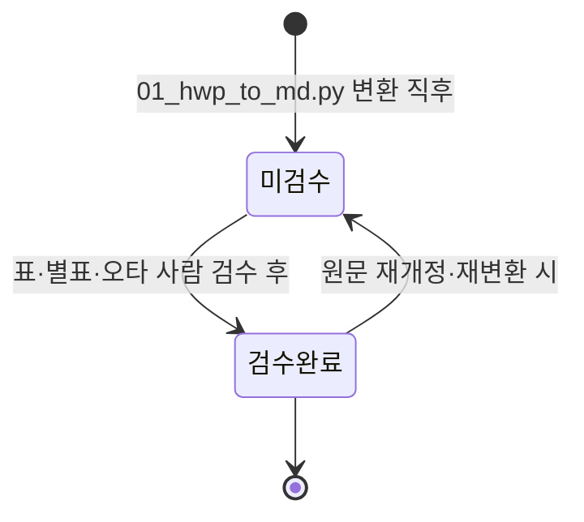
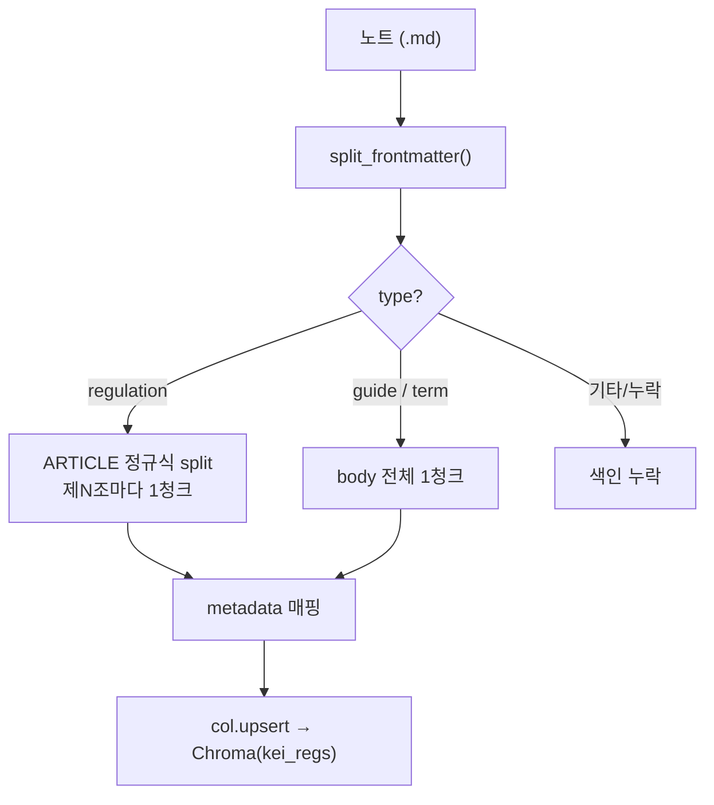

# 03 콘텐츠 모델 (볼트)

> KEI 행정 가이드의 **단일 진실원천(Source of Truth)** 인 마크다운 볼트 `KEI-행정가이드/` 의 구조 규약이다.
> 폴더 2-layer, 규정번호 분류, 파일명 규약, 프론트매터 스키마, 검수 라이프사이클, 그리고 청킹·링크 규약을 정의한다.
> 이 문서의 규약은 변환·청킹 스크립트(`01_hwp_to_md.py`, `02_chunk_and_embed.py`)의 동작과 **반드시 일치**해야 한다.

---

## 1. 큰 그림

볼트는 **하나의 마크다운 트리**이고, [뇌] Quartz 그래프 사이트와 [비서] Open WebUI + vLLM 두 화면이 같은 파일을 먹는다. 그러니 콘텐츠 모델이 곧 두 화면의 품질을 결정한다.


---

## 2. 볼트 2-layer 구조 (10 / 20 / 30 / 90)

볼트는 "**가치층(사람)** ↔ **진실원천(원문)**" 의 2-layer 가 핵심이다. `10` 이 사람의 설명, `20` 이 의역 없는 원문, `30`/`90` 이 이를 떠받친다.

| 층 | 폴더 | 성격 | 책임 | type | 청킹 |
|----|------|------|------|------|------|
| 가치층 | `10_업무가이드/` | 사람이 작성하는 업무 절차 | "이 업무 어떻게 처리하지?" 를 단계로 풀어줌. **항상 원문(`20`)으로 링크** | `guide` | 노트 전체 1청크 |
| 진실원천 | `20_규정원문/` | HWP/HWPX 변환 결과 | KEI 규정 원문(번호 1000~7999). **의역 금지**, 표/오타만 검수 | `regulation` | 제N조 = 1청크 |
| 사전 | `30_용어집/` | 개념 사전 | 개념 1개 = 노트 1개. 가이드·규정이 참조 | `term` | 노트 전체 1청크 |
| 관리 | `90_관리/` | 운영 메타 | 템플릿(`_templates/`), 개정이력, Dataview 인덱스 | (없음) | **청킹 제외** |

> 위 표는 4개 폴더를 나열하지만 구조의 뼈대는 **핵심 2-layer(가치층 `10_업무가이드` ↔ 진실원천 `20_규정원문`)** 이고, 여기에 **보조 2폴더(`30_용어집`·`90_관리`)** 가 더해진 형태다. [`../CLAUDE.md`](../CLAUDE.md) 의 "2-layer" 호칭이 정본이며, 다른 문서에서 "4계층/4폴더" 라 불러도 같은 `KEI-행정가이드/` 볼트를 가리킨다.

> [!note] 가치층 vs 진실원천
> `10` 은 **읽기 쉬움**이 목표라 의역·요약·예시가 허용된다. `20` 은 **정확함**이 목표라 의역이 금지된다. 둘을 섞지 말 것 — 가이드는 설명하고, 규정은 인용된다.

> [!warning] 90_관리/_templates 는 콘텐츠가 아니다
> `02_chunk_and_embed.py` 는 경로에 `_templates` 가 포함된 노트를 **건너뛴다**(`if "_templates" in md.parts: continue`). 템플릿이 RAG 검색 결과에 섞이지 않도록 보장한다.

---

## 3. KEI 규정번호 분류 (1000~7999)

`20_규정원문/` 의 하위 폴더는 **규정번호 첫 자리**로 자동 결정된다. 아래 표는 `01_hwp_to_md.py` 의 `CATEGORY_NAMES` 딕셔너리와 **1:1로 일치**한다.

| 첫 자리 | 분류 폴더 | 영역 | 실측 파일수 |
|---------|-----------|------|:---:|
| `1` | `1000_기관` | 기관 일반 | 3 |
| `2` | `2000_감사·규정` | 감사·규정 | 5 |
| `3` | `3000_인사` | 인사 | 23 |
| `4` | `4000_보수·여비` | 보수·여비 | 8 |
| `5` | `5000_연구·정보` | 연구·정보 | 12 |
| `6` | `6000_총무·보안·회계` | 총무·보안·회계 | 23 |
| `7` | `6000_총무·보안·회계` | **7xxx(회계/구매)도 총무·보안·회계로 합류** | (6000에 포함) |
| (미매칭) | `0000_미분류` | 규정번호 미상 문서 | 37 |

(실측: 2026-06-19 실행, 변환 성공 111개. 합계 3+5+23+8+12+23+37 = 111.)

> [!note] 7xxx → 6000 흡수
> 7번대(회계/구매 계열) 규정은 별도 폴더를 만들지 않고 `6000_총무·보안·회계` 로 배치한다. 코드 상으로도 `"7": "6000_총무·보안·회계"` 로 매핑되어 있다.

번호를 추정할 수 없는 파일(파일명 앞 4자리 없음)은 `CATEGORY_NAMES` 에 매칭되지 않아 `0000_미분류`(`UNCLASSIFIED`) 로 떨어진다. 실측에서 미분류가 37개로 가장 큰 덩어리인데, 여기엔 번호 없는 **가이드/기준/지침**뿐 아니라 **인사규정·직제규정·복무규정·위임전결규정·직원평가규칙·유연근무제운영규칙** 등 핵심 규정도 섞여 있다. 이들은 파일명 앞 4자리 공식 코드가 없어 자동 분류되지 못한 것이므로, 검수 단계에서 **사람이 규정번호를 배정**해 올바른 폴더로 옮긴다.

---

## 4. 파일명 규약

### 4.1 규정 원문 (필수)

```
<번호>_<제목>.md
```

`01_hwp_to_md.py` 가 원본 HWP 파일명에서 다음을 추출한다(번호 `reg_num_from_name()`·제목 `clean_title()`·개정일 `parse_date()`).

| 요소 | 추출 규칙 | 예시(형식 설명용) |
|------|-----------|-------------------|
| 번호 | **파일명 맨 앞 4자리(현행 공식 코드)만** `re.match(r"(\d{4})")` + `1000~7999` 검증 | 4자리 번호 |
| 제목 | 번호·날짜(붙어있어도)·리스트마커(`2.` `50.`)·장식(`★`)을 제거한 나머지. `(영문)` 판본 표시는 유지 | 규정명 |
| 개정일 | 다형식 파서로 정규화(`YYYYMMDD`/`YYMMDD`/`YYYY.MM.DD.`/`YY.MM.DD.`/`2025년 12월 22일`/`YYYY.MM`/`YYYYMM`) → `YYYY-MM-DD` | `_250324` → `2025-03-24` |

출력 경로: `<vault>/20_규정원문/<분류>/<번호>_<제목>.md` (분류는 §3 표).

> [!warning] 규정번호는 **파일명 4자리만 신뢰** — 본문 코드는 미사용
> 규정번호의 유일한 출처는 **파일명 맨 앞 4자리(현행 공식 코드)** 다. 본문에 박혀 있는 `NNNN-` 형식 코드는 **과거/내부 코드**라 현행과 충돌하므로 분류·메타에 **쓰지 않는다(stale·충돌)**. 실제 충돌 예:
> - 복무규정: 본문 코드 `3200` ↔ 파일명 `3200` = 공로연수운영지침
> - 직원평가규칙: 본문 코드 `3150` ↔ 파일명 `3150` = 신규채용자재임용평정규칙
>
> 본문 코드를 신뢰했다면 서로 다른 규정이 같은 번호로 충돌했을 것이다. 그래서 분류·규정번호는 항상 파일명에서만 가져온다.

> [!note] 제목 정제 — `(영문)` 판본은 보존
> 번호·날짜가 제목에 붙어 있어도 떼어내지만, `(영문)` 같은 판본 표시는 남긴다. 이는 `정관` vs `정관(영문)` 처럼 같은 규정의 두 판본이 같은 제목으로 충돌하는 것을 막기 위함이다.

> [!tip] 한글 파일명
> 제목은 한글이다. 레포는 `git config core.quotepath false` 를 적용해 한글 파일명이 깨지지 않게 한다. 자세한 협업 규약은 [09-contributing.md](09-contributing.md) 참고.

### 4.2 가이드·용어 (권장)

자동 생성이 아니라 사람이 만들므로 정해진 강제 포맷은 없지만, 그래프·검색 가독성을 위해 다음을 권장한다.

| 층 | 권장 파일명 | 비고 |
|----|-------------|------|
| `10_업무가이드/` | `<업무명>.md` (예: `출장비_정산.md`) | 번호 접두어 불필요 |
| `30_용어집/` | `<용어>.md` (예: `여비.md`) | 개념 1개 = 노트 1개 |

---

## 5. 프론트매터 스키마 (3종)

모든 노트는 YAML 프론트매터로 시작한다. 템플릿은 [`KEI-행정가이드/90_관리/_templates/`](../KEI-행정가이드/90_관리/_templates/) 에 보관한다(이 폴더는 청킹 제외).

> [!note] `type` 이 모든 것을 가른다
> `02_chunk_and_embed.py` 는 `type` 값으로 청킹 방식을 분기한다. `type` 누락 시 빈 문자열이 되어 **어느 분기에도 안 걸려 색인에서 누락**된다. 프론트매터 첫 필드는 항상 `type`.

### 5.1 `regulation` (규정 원문 · 자동 생성)

| 필드 | 필수 | 설명 | 예시(형식) |
|------|:---:|------|-----------|
| `type` | ✅ | 고정값 `regulation` | `regulation` |
| `규정번호` | ✅ | 4자리(1000~7999) | `"4300"`(형식 예시) |
| `규정명` | ✅ | 제목 | `"○○규정"` |
| `분류` | ✅ | §3 폴더명 | `"4000_보수·여비"` |
| `개정일` | ⬜ | `YYYY-MM-DD`(없으면 빈 값) | `2025-03-24` |
| `원본파일` | ✅ | 변환 전 HWP 파일명 | `"4300○○규정_250324.hwp"` |
| `태그` | ⬜ | 배열 | `[]` |
| `검수상태` | ✅ | `미검수` \| `검수완료` | `미검수` |

```yaml
---
type: regulation
규정번호: "4300"          # 형식 예시 — 파일명 4자리에서만 채움(§4.1, 본문 코드 미사용)
규정명: "○○규정"
분류: "4000_보수·여비"
개정일: 2025-03-24
원본파일: "4300○○규정_250324.hwp"
태그: []
검수상태: 미검수
---
```

### 5.2 `guide` (업무 가이드 · 사람 작성)

| 필드 | 필수 | 설명 | 예시(형식) |
|------|:---:|------|-----------|
| `type` | ✅ | 고정값 `guide` | `guide` |
| `제목` | ✅ | 업무명 | `"출장비 정산하기"` |
| `분류` | ⬜ | 업무 영역 | `"보수·여비"` |
| `대상` | ⬜ | 독자 | `"신입/전입자"` |
| `관련규정` | ⬜ | 위키링크 배열 | `["[[○○규정#제N조]]"]` |
| `관련서식` | ⬜ | 서식 배열 | `[]` |
| `최종검토일` | ⬜ | `YYYY-MM-DD` | `2026-06-18` |
| `검토자` | ⬜ | 작성/검토자 | `"홍길동"` |
| `태그` | ⬜ | 배열 | `[]` |

```yaml
---
type: guide
제목: "출장비 정산하기"
분류: "보수·여비"
대상: "신입/전입자"
관련규정: ["[[○○규정#제N조]]"]   # 형식 예시 — 실제 조문은 원문 확인
관련서식: []
최종검토일: 2026-06-18
검토자: ""
태그: []
---
```

### 5.3 `term` (용어 · 사람 작성)

| 필드 | 필수 | 설명 | 예시(형식) |
|------|:---:|------|-----------|
| `type` | ✅ | 고정값 `term` | `term` |
| `용어` | ✅ | 표제어 | `"여비"` |
| `영문` | ⬜ | 영문 표기 | `"travel expenses"` |
| `관련규정` | ⬜ | 위키링크 배열 | `["[[○○규정#제N조]]"]` |
| `태그` | ⬜ | 배열 | `[]` |

```yaml
---
type: term
용어: "여비"
영문: "travel expenses"
관련규정: ["[[○○규정#제N조]]"]
태그: []
---
```

> [!note] 청킹 시 노트 식별 이름
> `02_chunk_and_embed.py` 는 메타의 `규정명`(없으면 `제목`/`용어`, 그래도 없으면 파일명 `stem`)을 청크 식별 이름으로 쓴다. 가이드는 `제목`, 용어는 `용어` 필드가 검색 결과의 출처 이름이 된다.

---

## 6. 검수상태 라이프사이클

`regulation` 노트는 HWP에서 자동 변환되므로 **표/별표 깨짐과 오타**가 있을 수 있다. 그래서 `검수상태` 로 신뢰도를 추적한다.



- 변환 직후 `build_note()` 는 항상 `검수상태: 미검수` + 경고 콜아웃(`> [!warning] 자동 변환 — 의역 금지...`)을 붙인다.
- 사람이 표/별표/오타만 검수 후 `검수완료` 로 올린다. **의역은 이 단계에서도 금지**(§8).
- 실측(2026-06-19): 변환 성공 111개가 **모두 `미검수`** 상태다. 검수 큐가 곧 전체 볼트이며, 핵심 규정이 다수 섞인 `0000_미분류`(§3)부터 사람 검수가 필요하다.

### Dataview 인덱스 연계

`90_관리/` 의 Dataview 인덱스가 검수 큐를 만든다. 예: 미검수 규정 목록을 뽑는 쿼리.

````markdown
```dataview
TABLE 규정번호, 분류, 개정일
FROM "20_규정원문"
WHERE type = "regulation" AND 검수상태 = "미검수"
SORT 규정번호 ASC
```
````

> [!tip] 검수와 색인의 분리
> 청킹·임베딩(`02`)은 `검수상태` 와 무관하게 색인한다. 즉 미검수 규정도 검색은 된다. RAG 답변은 항상 원문 대조 면책 문구(§7·[!warning])로 마무리하므로, 검수상태는 **사람 검수 큐 관리용**으로 본다.

---

## 7. 청킹 규약

핵심 원칙: **고정 길이 청킹 금지. `regulation` 은 제N조 단위로만 나눈다.** ADR은 [adr/0002-article-level-chunking.md](adr/0002-article-level-chunking.md).

| type | 청킹 방식 | 이유 |
|------|-----------|------|
| `regulation` | **제N조 = 1청크** | 법적으로 완결된 단위 → 출처 `[규정명 제N조]` 표기가 깔끔 |
| `guide` | 노트 전체 = 1청크 | 절차 전체가 하나의 맥락 |
| `term` | 노트 전체 = 1청크 | 개념 1개 = 노트 1개 |

조문 경계는 `02_chunk_and_embed.py` 의 정규식으로 분리한다.

```python
ARTICLE = re.compile(r"(?=^\s*제\s*\d+\s*조)", re.MULTILINE)  # 제N조 경계
```



### metadata 매핑 (02 코드와 일치)

각 청크는 아래 **8개 필드**를 메타로 싣는다. `02_chunk_and_embed.py` 의 `META_KEYS = ("규정명", "규정번호", "조", "분류", "개정일", "검수상태", "type", "path")` 와 `col.upsert(..., metadatas=...)` 가 쓰는 키와 글자 단위로 동일하다.

| 키 | regulation | guide / term |
|----|-----------|--------------|
| `규정명` | 메타 `규정명`(없으면 파일 stem) | `제목` 또는 `용어`(없으면 stem) |
| `규정번호` | 메타 `규정번호`(파일명 4자리) | `""`(빈 값) |
| `조` | `article_no()` 결과 = `제N조`. **머리말 청크는 `""`** | `""`(빈 값) |
| `분류` | 메타 `분류`(§3 폴더명) | 메타 `분류`(있으면) |
| `개정일` | 메타 `개정일`(`YYYY-MM-DD`) | `""`(빈 값) |
| `검수상태` | 메타 `검수상태`(`미검수`/`검수완료`) | 메타 `검수상태`(있으면) |
| `type` | `regulation` | `guide` / `term` |
| `path` | 볼트 상대경로 `str(md.relative_to(vault))` | 동일 |

`article_no()` 는 청크 머리에서 `제\s*(\d+)\s*조` 를 잡아 `제N조` 문자열을 만든다. 이 값이 RAG 답변 출처 `[규정명 제N조]` 의 조문 부분이 된다(검색·답변 흐름은 [05-rag-design.md](05-rag-design.md)). `upsert` 시 모든 값은 `c[k] or ""` 로 빈 문자열을 보정해 None 이 들어가지 않는다.

> [!note] 머리말 청크(조 = `""`)
> `regulation` 노트에서 **첫 `제N조` 앞의 머리말**(규정명·제정/개정 이력·표 등)은 `ARTICLE` 정규식 split 의 첫 조각으로 떨어진다. 이 조각도 버리지 않고 **조 = `""` 인 청크**로 적재해, 어느 조문에도 속하지 않는 도입부 정보가 검색에서 누락되지 않게 한다. 실측 청크 구성은 아래 [!tip] 참고.

> [!tip] 실측 청크 수 (2026-06-19 실행)
> 문서 111개 → 총 **3044 청크 = 조문청크 2933 + 머리말 111**. 문서마다 머리말 청크가 정확히 1개씩(111개) 생긴다. 임베딩 모델은 KURE-v1(XLM-RoBERTa·BGE-M3 계열, 컨텍스트 8192)이며, OOM 회피를 위해 `--max-seq-len 2048` 로 운영한다 — 이 한도를 넘는 긴 조문/일부 머리말 41개는 임베딩 시 잘리며 **하위 청킹은 향후 과제**다. 파이프라인 실행 상세는 [04-pipeline.md](04-pipeline.md).

> [!warning] 02 코드와의 동기화는 계약이다
> §3 분류표는 `01` 의 `CATEGORY_NAMES`, §7 메타 키는 `02` 의 `upsert` 와 **글자 단위로 맞춰야** 한다. 코드가 바뀌면 이 문서를, 이 문서 규약이 바뀌면 코드를 같이 고친다. 변환·청킹 파이프라인 전체는 [04-pipeline.md](04-pipeline.md) 참고.

---

## 8. 절대 규칙 2 — 의역 금지 (원문층)

> [!warning] `20_규정원문/` 은 의역하지 않는다
> 진실원천 층의 본문은 HWP 원문을 **그대로** 옮긴다. 요약·풀어쓰기·문장 재배열을 하지 않는다. 검수 단계에서 손대는 것은 **표/별표 깨짐과 명백한 OCR/변환 오타**뿐이다.
> 변환 노트마다 자동으로 붙는 경고가 이 규칙을 명시한다:
> `> [!warning] 자동 변환 — 의역 금지. 표/별표 깨짐과 오타만 검수 후 \`검수완료\`로.`

설명·풀이가 필요하면 `20` 이 아니라 `10_업무가이드/`(가치층)에 쓴다. 가이드는 의역해도 되지만, 그 대신 **반드시 원문으로 링크**해야 한다(§9). 이렇게 "정확한 원문 / 읽기 쉬운 설명" 을 물리적으로 분리해 둔다.

> [!todo] 확인 필요: 규정 본문·금액·한도·기한
> 이 문서의 모든 규정 예시(`○○규정`, `제N조`, `4300` 등)는 **형식 설명용 placeholder** 다. 실제 규정명·조문 번호·금액·한도·기한은 원문 변환으로만 확정하며, 추측해 적지 않는다.

---

## 9. 링크 규약

### 9.1 가이드 → 규정 위키링크 (필수)

> [!warning] ⛔ 규칙 3 — 가이드는 출처를 위키링크로 단다
> `10_업무가이드/` 의 모든 가이드는 근거가 되는 규정을 `[[규정명#제N조]]` **위키링크**로 표기해야 한다. 근거 없는 절차 서술은 금지다. 이 위키링크가 [뇌] Quartz 그래프의 노드-링크 엣지를 만들고, 독자를 원문으로 데려간다.

```markdown
출장비는 [[○○규정#제N조]] 에 따라 정산합니다.   <!-- 형식 예시 -->
```

(위 `○○규정`/`제N조` 는 형식 예시. 실제 규정명·조 번호는 원문에서 확인한다.)

### 9.2 RAG 답변의 출처 (필수 — 강제는 05/07에서)

[비서] Open WebUI + vLLM 답변은 끝에 `[규정명 제N조]` 형식으로 출처를 모두 달고, `"최종 판단은 원문과 담당 부서 확인 바랍니다."` 면책 문구를 붙인다. 가드레일 상세는 [05-rag-design.md](05-rag-design.md)·[07-security-governance.md](07-security-governance.md).

### 9.3 docs 내부 링크 (이 문서들)

| 대상 | 링크 형식 |
|------|-----------|
| 같은 `docs/` 형제 문서 | `02-architecture.md` (파일명만) |
| 루트 파일 | `../README.md`, `../CLAUDE.md`, `../WORKPLAN.md` |
| 소스 | `../tools/02_chunk_and_embed.py` |
| ADR | `adr/0002-article-level-chunking.md` |
| 볼트 콘텐츠 예시 | `[[규정명#제N조]]` 위키링크 |

---

## 관련 문서

- 문서 인덱스: [docs/README.md](README.md)
- 이전: [02 아키텍처](02-architecture.md)
- 다음: [04 파이프라인](04-pipeline.md)
- 함께 보기: [05 RAG 설계](05-rag-design.md) · [09 기여 가이드](09-contributing.md) · [ADR-0002 조문 단위 청킹](adr/0002-article-level-chunking.md)
- 소스: [`../tools/01_hwp_to_md.py`](../tools/01_hwp_to_md.py) · [`../tools/02_chunk_and_embed.py`](../tools/02_chunk_and_embed.py)

---

최종 수정: 2026-06-19
