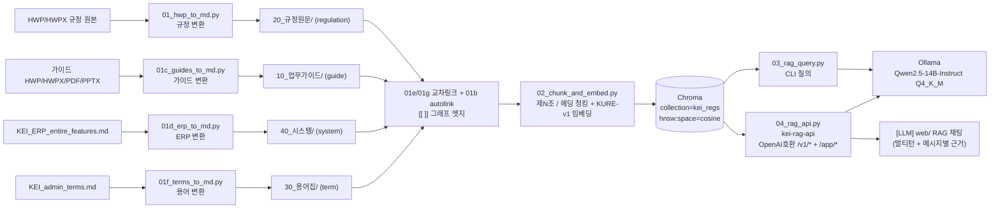
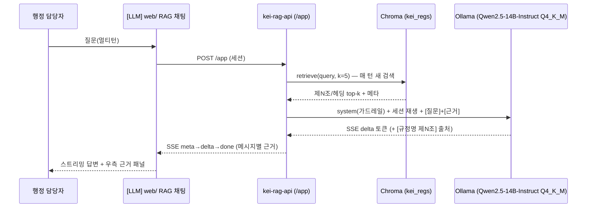

# 04 · 데이터 파이프라인

> 4개 섹션 코퍼스(규정·가이드·용어·ERP)가 [LLM] RAG 채팅 답변으로 흐르기까지의 변환·교차링크·임베딩 스크립트.
> 변환(01·01c·01d·01f) → 교차링크(01e·01g·01b) → 청킹·임베딩(02) → 질의(03) / RAG API(04). 각 절은 목적·입출력·CLI·핵심 로직·튜닝·한계로 구성한다.

이 문서는 `tools/`의 01~04 스크립트를 실행·운영하는 개발자/운영자를 위한 상세 레퍼런스다. 설계 배경은 [02-architecture.md](02-architecture.md), 콘텐츠 모델은 [03-content-model.md](03-content-model.md), RAG 검색 설계는 [05-rag-design.md](05-rag-design.md)를 참고한다.

> [!note] 현재 상태 (2026-06-21)
> 코퍼스는 **4개 섹션 271문서**(규정집 111 · 연구행정 가이드 64 · 용어집 84 · ERP 시스템 12)로 확장됐다. P1 변환 완료(규정 111, 가이드 PDF/PPTX 포함, ERP·용어 자동초안), 교차링크(01e·01g·01b) 완료, P2 임베딩 완료(별표/별지 1급 청크 분리·긴 조문 하위청킹 반영, 약 4,400 청크 — 재색인 후 4,418), P3 검색·API 완료. **답변 생성**은 로컬 Ollama(Qwen2.5-14B-Instruct Q4_K_M)로 동작하며 SSE 스트리밍·멀티턴까지 구현됐다. 변환·생성물은 검수 전까지 프론트매터 `검수상태: 미검수`를 유지한다(전부 미검수). 실측 수치는 문서 맨 끝 [실측 결과(2026-06-21)](#-실측-결과-2026-06-21) 참고.

---

## 전체 흐름



핵심: [뇌] 그래프 사이트(`web/`)와 [LLM] RAG 채팅은 **같은 마크다운 볼트**를 먹는 두 화면이다. 채팅은 그림이 아니라 텍스트 + 임베딩 검색으로 답한다. 이 파이프라인은 그중 **채팅(LLM)** 쪽 데이터 경로다.

| 단계 | 스크립트 | 입력 | 출력 |
|---|---|---|---|
| 규정 변환 | `01_hwp_to_md.py` | HWP/HWPX 규정 폴더 | `20_규정원문/` (regulation) |
| 가이드 변환 | `01c_guides_to_md.py` | 가이드 HWP/HWPX/PDF/PPTX | `10_업무가이드/` (guide) |
| ERP 변환 | `01d_erp_to_md.py` | `KEI_ERP_entire_features.md` | `40_시스템/` (system) |
| 용어 변환 | `01f_terms_to_md.py` | `KEI_admin_terms.md` | `30_용어집/` (term) |
| ERP 교차링크 | `01e_erp_crosslink.py` | ERP 노트 + 규정 | ERP↔규정 `[[ ]]` |
| 용어 교차링크 | `01g_terms_crosslink.py` | 용어 노트 + ERP/규정 | 용어↔ERP/규정 `[[ ]]` |
| 규정 autolink | `01b_autolink.py` | 볼트 전체 | 규정 상호참조 `[[ ]]`(멱등) |
| 청킹·임베딩 | `02_chunk_and_embed.py` | 볼트(`KEI-행정가이드/`) | Chroma `kei_regs` |
| 질의(CLI) | `03_rag_query.py` | Chroma + 질문 | 콘솔 답변 + 회수 조문 |
| RAG API | `04_rag_api.py` | Chroma + HTTP 요청 | OpenAI 호환 + `/app/*` 응답 |

---

## 🛠️ 01 · `01_hwp_to_md.py` — HWP → Markdown

소스: [`../tools/01_hwp_to_md.py`](../tools/01_hwp_to_md.py)

### 목적
HWP/HWPX 규정 원본을 마크다운 진실원천(`20_규정원문/`)으로 적재한다. 원문층은 **의역 금지** — 스크립트는 텍스트를 그대로 옮기고(표는 파서가 본문에 인라인 마크다운으로 이미 끼워 넣는다), 사람 검수 전까지 `검수상태: 미검수`로 둔다.

> [!note] 입력은 비추적
> 입력 폴더 `rule_files/`(KEI 내부 규정 .hwp/.hwpx)는 `.gitignore`라 깃에 추적되지 않는다. **진실원천은 변환 결과인 볼트 MD**다.

### 입력 · 출력

| | 내용 |
|---|---|
| 입력 | `--src` 폴더의 `*.hwp`, `*.hwpx` |
| 출력 | `<vault>/20_규정원문/<분류>/<번호>_<제목>.md` |
| 분류 폴더 | 규정번호 첫 자리로 자동 배치(아래 `CATEGORY_NAMES` 표) |

### CLI 사용법

```bash
# 먼저 dry-run으로 추출·분류 결과만 미리보기(파일 쓰지 않음)
python tools/01_hwp_to_md.py --src rule_files --vault KEI-행정가이드 --dry-run

# 확인 후 실제 변환
python tools/01_hwp_to_md.py --src rule_files --vault KEI-행정가이드
```

| 인자 | 필수 | 기본값 | 설명 |
|---|---|---|---|
| `--src` | 예 | — | HWP/HWPX가 모여 있는 폴더 |
| `--vault` | 예 | — | 볼트 루트(`KEI-행정가이드/`) |
| `--dry-run` | 아니오 | off | 파일을 쓰지 않고 추출·분류 결과만 리포트로 미리보기 |
| `--limit` | 아니오 | `0` | 처음 N개만 처리(테스트) |
| `--timeout` | 아니오 | `90` | 파일당 추출 제한(초). 초과 시 `skip:timeout`(아래 격리 참고) |

### 핵심 로직

**규정번호 = 파일명 맨 앞 4자리만 신뢰(`reg_num_from_name`)** — 파일명 첫 4자리가 KEI 코드 범위(`1000~7999`)면 그것만 규정번호로 쓴다. **본문에 박힌 `NNNN-` 코드는 쓰지 않는다.**

```python
def reg_num_from_name(stem: str):
    m = re.match(r"(\d{4})", stem)
    if m and 1000 <= int(m.group(1)) <= 7999:
        return m.group(1)
    return None
```

> [!warning] 본문 코드는 stale — 미사용
> 본문 머리의 `NNNN-한글`(예: `3200-복무규정`)은 **과거/내부 코드**라 현행 공식 코드(파일명)와 충돌한다. 실제 충돌 예:
> - 복무규정 **본문 3200** ↔ **파일명 3200 = 공로연수운영지침**
> - 직원평가규칙 **본문 3150** ↔ **파일명 3150 = 신규채용자재임용평정규칙**
>
> 그래서 분류·번호는 파일명 4자리만 쓰고, 4자리가 없으면 `0000_미분류`로 보낸다(사람이 번호 배정).

**`CATEGORY_NAMES` 매핑** — 규정번호 첫 자리 → `20_규정원문/` 하위 분류 폴더. 코드가 받는 번호 범위는 `1000~7999`이며, 7xxx(회계/구매)도 총무·보안·회계(6000)로 합친다.

| 첫 자리 | 분류 폴더 |
|---|---|
| 1 | `1000_기관` |
| 2 | `2000_감사·규정` |
| 3 | `3000_인사` |
| 4 | `4000_보수·여비` |
| 5 | `5000_연구·정보` |
| 6 | `6000_총무·보안·회계` |
| 7 | `6000_총무·보안·회계` |
| (번호 없음) | `0000_미분류` |

**개정일 = 다형식 파서(`parse_date`)** — 파일명에서 아래 형식들을 우선순위대로 검증(`datetime.date`로 유효성 확인)하며 추출한다. 미검출 시 `개정일:` 빈값.

| 형식 | 예 | 결과 |
|---|---|---|
| `YYYY년 M월 D일` | `2025년 12월 22일` | `2025-12-22` |
| `YYYY.MM.DD.` | `2025.07.30.` | `2025-07-30` |
| `YY.MM.DD.` | `24.11.25.` | `2024-11-25` |
| `YYYYMMDD` | `20231004` | `2023-10-04` |
| `YYYY.MM` | `2025.03.` | `2025-03` |
| `YYMMDD`/`YYYYMM`(6자리) | `250324` | `2025-03-24` |

**제목 정제(`clean_title`)** — 규정번호·날짜(한글에 붙어 있어도)·리스트마커(`2.` `50.`)·장식(`★`)을 제거한다. **단 `(영문)` 같은 판본 표시는 유지**해 `정관` vs `정관(영문)` 충돌을 막는다.

**본문/표 추출 — `hwp_hwpx_parser.Reader` (1.0.0)**:
- `Reader`는 **컨텍스트 매니저**(`with Reader(path) as r:`)를 지원한다.
- `extract_text()`가 **표를 인라인 마크다운으로 이미 포함**하므로, 별도 `(부록) 표`를 덧붙이지 않는다(**중복 방지**). 표가 본문 속 제N조에 그대로 붙어 02의 제N조 청킹과도 잘 맞는다.
- `is_encrypted`는 **속성**, `is_valid()`/`file_type()`은 **메서드**다(코드는 둘 다 안전하게 처리). 암호화/무효 파일은 빈 본문 → skip.
- 본문이 비어 있으면 `status=empty`로 skip.

**프로세스 격리 + 하드 타임아웃(`extract_body`)** — 추출을 **별도 프로세스(`fork`)**에서 돌리고 **파일당 하드 타임아웃**(`--timeout`, 기본 90초)을 건다. 깨진 파일 하나가 무한루프로 배치 전체를 막지 못하게 격리한다. status ∈ `{ok, encrypted, invalid, empty, error, timeout}`.

> [!warning] 1개 timeout 격리 사례 — fallback 대상
> 실측에서 `여비업무처리기준및QnA개선(안)241230(1).hwp` 가 파서 무한루프(100% CPU 10시간)에 걸려 `skip:timeout`으로 격리됐다. 이 1건은 아래 [HWP 변환 fallback](#-hwp-변환-fallback)(LibreOffice + H2Orestart → PDF → VLM) 대상이다.

**`build_note`** — `regulation` 프론트매터 + 경고 콜아웃 + 본문을 생성한다. 프론트매터는 `type: regulation / 규정번호 / 규정명 / 분류 / 개정일 / 원본파일 / 태그 / 검수상태: 미검수`이며, 본문 머리에 다음 경고를 박는다.

```markdown
> [!warning] 자동 변환 — 의역 금지. 표/별표 깨짐과 오타만 검수 후 `검수상태: 검수완료`로.
```

### 튜닝 포인트
- `parse_date` 형식: 파일명 날짜 규칙이 더 다양해지면 검증 분기를 보강.
- `clean_title` 정규식: 새 장식·마커가 보이면 제거 규칙 추가(단 `(영문)` 판본 표시는 유지).
- `--timeout`: 무한루프 파일은 격리되므로, 큰 정상 파일이 잘리면 값을 키운다.

### 알려진 한계
> [!warning]
> - 표/별표(別表) 레이아웃이 깨질 수 있다. 깨질 때는 아래 [HWP 변환 fallback](#-hwp-변환-fallback)으로 재추출한다.
> - 규정번호가 파일명에 없는 문서는 `0000_미분류`로 떨어진다 → **사람이 번호 배정** 필요(실측 28개, 핵심 규정 다수 포함 — 아래 실측 결과 참고).
> - 파서 무한루프 1건(`여비업무처리기준및QnA개선`)은 타임아웃 격리됐고 fallback으로 별도 처리한다.

---

## 📚 01c · `01c_guides_to_md.py` — 가이드(HWP/HWPX/PDF/PPTX) → Markdown

소스: [`../tools/01c_guides_to_md.py`](../tools/01c_guides_to_md.py)

### 목적
연구행정 가이드 원본(다양한 포맷)을 `10_업무가이드/`로 적재한다(type:guide). 규정 원문과 달리 가이드는 HWP/HWPX 외에 **PDF·PPTX** 배포본이 섞여 있어 포맷별 추출기를 분기한다.

### 입력 · 출력

| | 내용 |
|---|---|
| 입력 | `*.hwp`, `*.hwpx`, `*.pdf`, `*.pptx`(연구행정 가이드 폴더) |
| 출력 | `<vault>/10_업무가이드/…/<제목>.md` (type:guide) |
| 추출기 | HWP/HWPX = `hwp-hwpx-parser`, PDF = **PyMuPDF**, PPTX = **python-pptx** |

### 핵심 로직
- 포맷에 따라 추출기를 선택: PDF는 PyMuPDF로 텍스트 레이어를 뽑고, PPTX는 python-pptx로 슬라이드 텍스트를 순서대로 모은다.
- **스캔 이미지 PDF**(텍스트 레이어 없음)는 본문 대신 `image-pdf` 플레이스홀더 노트로 남겨 사람이 OCR/대체 처리하도록 표시한다(실측: 예산운용가이드 1건).
- `guide` 프론트매터(`type, 제목, 분류, 대상, 관련규정[], 관련서식[], 최종검토일, 검토자, 태그, 검수상태: 미검수`)를 생성한다. 헤딩(`##`/`####`) 구조는 보존해 02 청킹 단위로 쓰인다.

### 알려진 한계
> [!warning]
> - 스캔 이미지 PDF는 텍스트가 없어 `image-pdf` 플레이스홀더만 남는다(실측 1건, fallback OCR 대상).
> - 레이아웃 복잡한 PPTX는 표/도형 텍스트 순서가 뒤섞일 수 있다 → 검수 시 확인.

---

## 🖥️ 01d · `01d_erp_to_md.py` — ERP 기능 → 시스템 노트

소스: [`../tools/01d_erp_to_md.py`](../tools/01d_erp_to_md.py)

### 목적
ERP 전체 기능 정의(`KEI_ERP_entire_features.md`)를 **모듈별 노트**로 쪼개 `40_시스템/`에 적재한다(type:system). 모듈 1개 = 노트 1개이며 기능은 `####` 단위로 정리한다.

### 입력 · 출력

| | 내용 |
|---|---|
| 입력 | `KEI_ERP_entire_features.md`(단일 원본, gitignore) |
| 출력 | `<vault>/40_시스템/<모듈>.md` (type:system, 실측 12개) |
| 분할 단위 | 모듈 헤딩 → 노트, 기능 `####` → 청킹 단위 |

### 핵심 로직
- 원본을 모듈 경계로 분할해 모듈마다 `system` 프론트매터 노트를 만든다. 각 기능은 `####` 헤딩으로 남겨 02가 헤딩 단위로 청킹한다.
- 검수상태는 `미검수`(자동초안).

---

## 🔗 01e · `01e_erp_crosslink.py` — ERP ↔ 규정 교차링크

소스: [`../tools/01e_erp_crosslink.py`](../tools/01e_erp_crosslink.py)

### 목적
ERP 모듈 노트와 관련 규정을 `[[ ]]`로 잇는다. **키워드 매칭**으로 모듈이 다루는 업무와 관련 규정을 찾아 그래프 엣지를 만든다 → 그래프에서 ERP 모듈이 허브 역할을 하게 된다.

### 핵심 로직
- ERP 모듈 본문/제목의 키워드를 규정명과 매칭해 관련 규정으로 위키링크를 건다(멱등하게 재실행 가능).

---

## 📖 01f · `01f_terms_to_md.py` — 용어집 → 용어 노트

소스: [`../tools/01f_terms_to_md.py`](../tools/01f_terms_to_md.py)

### 목적
행정 용어 정의(`KEI_admin_terms.md`)를 **용어 1개 = 노트 1개**로 풀어 `30_용어집/`에 적재한다(type:term, 실측 84개).

### 입력 · 출력

| | 내용 |
|---|---|
| 입력 | `KEI_admin_terms.md`(단일 원본, gitignore) |
| 출력 | `<vault>/30_용어집/<용어>.md` (type:term, 84개) |

### 핵심 로직
- `term` 프론트매터(`type, 용어, 영문, 관련규정[], 태그`)를 생성하고 용어별 설명을 본문에 남긴다. 검수상태는 `미검수`(자동초안).

---

## 🔗 01g · `01g_terms_crosslink.py` — 용어 ↔ ERP/규정 교차링크

소스: [`../tools/01g_terms_crosslink.py`](../tools/01g_terms_crosslink.py)

### 목적
용어 노트를 **같은 카테고리의 ERP 모듈**과 잇고, **용어명이 규정명에 포함되면 해당 규정**과도 `[[ ]]`로 연결한다.

### 핵심 로직
- 용어 카테고리 ↔ ERP 모듈 카테고리를 매칭해 위키링크를 만든다.
- 용어명이 규정명 문자열에 포함되는 경우 그 규정으로 추가 링크를 건다.

> [!note] 변환·교차링크 실행 순서
> 변환(`01`·`01c`·`01d`·`01f`)을 먼저 돌려 4섹션 노트를 만든 뒤 교차링크(`01e`·`01g`)를 돌리고, 마지막으로 규정 상호참조 `01b_autolink`를 돌려 나머지 엣지를 채운다. 그다음 `02` 임베딩을 실행한다.

---

## 🧩 02 · `02_chunk_and_embed.py` — 제N조 청킹 + 임베딩

소스: [`../tools/02_chunk_and_embed.py`](../tools/02_chunk_and_embed.py)

### 목적
4섹션 볼트를 type에 맞는 단위로 쪼개 한국어 임베딩으로 변환하고 Chroma에 적재한다. **규정은 제N조 단위**(조문 1개 = 청크 1개), **가이드·ERP·용어는 헤딩(`####`·`##`) 단위**(헤딩이 없으면 문단 패킹)로 청킹한다. 고정 길이 청킹은 금지 — 검색 결과가 "완결된 단위"로 떨어지고 `[규정명 제N조]` 출처 표기가 깔끔해지기 때문이다. 규정의 경우 **첫 제N조 앞의 머리말**(규정명·제정/개정 이력·표)은 `조=""` 청크로 따로 적재한다(문서당 1개). 또한 **별표/별지는 1급 청크로 분리**(P1.3, `조="별표 N"`/`"별지 제N호"`, 토글 `CHUNK_BYEOLPYO`)하고, **입력 한도를 넘는 긴 조문은 하위청킹**(P2.3, 토글 `CHUNK_SUBSPLIT`)해 뒷부분(항·호의 조건)이 임베딩에서 잘리지 않게 한다. 근거는 [ADR 0002](adr/0002-article-level-chunking.md), 임베딩 선택은 [ADR 0001](adr/0001-embedding-kure-v1.md), 품질 강화 트랙은 [12-품질강화.md](12-품질강화.md) 참고.

### 입력 · 출력

| | 내용 |
|---|---|
| 입력 | `--vault` 볼트의 `*.md`(단, `_templates` 제외) — 4섹션(regulation·guide·system·term) |
| 출력 | Chroma `PersistentClient(path=--db)`의 collection `kei_regs` (실측 약 4,400 items — 별표 분리·하위청킹 후 재색인 4,418) |
| 메타 | `hnsw:space=cosine` |
| 산출물 위치 | `tools/chroma/`(`.gitignore`·재생성 가능) |

### CLI 사용법

```bash
python tools/02_chunk_and_embed.py \
  --vault KEI-행정가이드 \
  --db tools/chroma
```

| 인자 | 필수 | 기본값 | 설명 |
|---|---|---|---|
| `--vault` | 예 | — | 볼트 루트 |
| `--db` | 아니오 | `tools/chroma` | Chroma 영속 경로(`tools/chroma/`는 gitignore·재생성 가능) |
| `--model` | 아니오 | `nlpai-lab/KURE-v1` | 임베딩 모델(대안 `BAAI/bge-m3`) |
| `--collection` | 아니오 | `kei_regs` | Chroma 컬렉션명 |
| `--batch-size` | 아니오 | `8` | 임베딩 배치 크기(긴 조문 OOM 방지로 작게) |
| `--max-seq-len` | 아니오 | `2048` | 입력 토큰 상한. `0`=모델 기본(8192) |
| `--limit` | 아니오 | `0` | 처음 N청크만(테스트) |
| `--no-reset` | 아니오 | off | 클린 리빌드를 끄고 `upsert`만(기본은 리빌드) |

### 핵심 로직

**제N조 + 별표/별지 분할** — 룩어헤드 정규식으로 경계 직전에서 나눠 조문 제목을 청크에 남긴다. 기본 경계는 **제N조에 더해 줄머리 `[별표 N]`·`[별지 제N호]`까지 포함**(P1.3)해, 별표/별지를 조문에 흡수시키지 않고 1급 청크로 떼어낸다. `CHUNK_BYEOLPYO=0`이면 제N조만 쓰는 구(舊) 동작(`ARTICLE`)으로 떨어진다(A/B 비교용).

```python
ARTICLE  = re.compile(r"(?=^\s*제\s*\d+\s*조)", re.MULTILINE)            # 제N조만(구 동작)
BOUNDARY = re.compile(r"(?=^\s*제\s*\d+\s*조)|(?=^\s*\[\s*별표)|(?=^\s*\[\s*별지)", re.MULTILINE)
splitter = BOUNDARY if BYEOLPYO_SPLIT else ARTICLE   # 기본 BOUNDARY(CHUNK_BYEOLPYO=1)
```

별표/별지 청크는 본문에서 그 별표를 인용하는 조문 목록(`refs`)을 산출해 메타에 남긴다(그래프/출처 연결). 인용 탐지는 본문 속 "별표 1의…" 같은 언급이 아니라 **줄머리 대괄호 헤더**만 경계로 보므로, 본문 인용과 헤더가 섞여도 청크가 잘게 쪼개지지 않는다.

**`split_frontmatter`** — `---`로 시작하면 프론트매터를 `key: value`로 파싱(따옴표 제거)하고 본문과 분리한다.

**`strip_injected`** — 01이 넣은 머리 **H1 제목(`# 규정명`)과 변환 경고 콜아웃을 임베딩 전에 제거**한다(노이즈 감소·검색 품질 보호).

**type별 청킹**

| type | 청킹 방식 | 메타데이터 |
|---|---|---|
| `regulation` | 첫 제N조 앞 **머리말 1청크(`조=""`)** + 제N조마다 1청크 + **별표/별지마다 1급 청크**(`조="별표 N"`/`"별지 제N호"`) | 아래 메타데이터 키 |
| `guide` / `system` | **헤딩(`####`·`##`) 단위 청크**(헤딩 없으면 문단 패킹) | `규정명`에 `제목`/`모듈명`, `조` 빈값 |
| `term` | 헤딩 단위(용어 1노트 = 보통 1청크) | `규정명`에 `용어`, `조` 빈값 |

`chunk_label()`이 규정 청크 머리를 보고 `(kind, 라벨)`을 판정한다 — 제N조면 `조`에 `제N조`, 줄머리 `[별표 N]`/`[별지 제N호]`면 각각 `별표 N`/`별지 제N호`를 채우고 `별표="Y"`로 표식한다(가이드·ERP·용어는 `조` 빈값). `_templates`가 경로에 포함된 파일은 건너뛴다.

**메타데이터 키** — 모든 청크는 다음 키를 채운다:

```python
META_KEYS = ("규정명", "규정번호", "조", "분류", "개정일", "검수상태", "type", "별표", "refs", "부분", "path")
```

- `path`는 **볼트 상대경로**, `검수상태`는 현재 전부 `미검수`다.
- `별표`(`"Y"`/빈값) = 별표/별지 1급 청크 표식, `refs` = 그 별표/별지를 인용하는 조문 목록(그래프·출처 연결).
- `부분`(예: `2/3`) = 긴 조문 하위청킹 시 어느 조각인지(분할 안 된 청크는 빈값). 아래 하위청킹 참고.

**긴 조문 하위청킹(P2.3, `subsplit_long_chunks`, 토글 `CHUNK_SUBSPLIT`, 기본 on)** — `max_seq_len`(기본 2048)을 넘는 청크는 임베딩 시 뒷부분(항·호의 조건)이 잘린다. 이를 막기 위해 초과 청크를 **항(①②) → 호(`1.`·`가.`) → 문단 → 줄** 순으로 쪼갠다.

- 조 라벨(`제N조`)과 출처·앵커·메타는 그대로 유지하고(출처·평가 strict 불변), 하위 인덱스만 `부분`(예: `2/3`) 메타에 기록한다.
- **별표/별지(표) 청크는 분할하지 않는다** — 표 구조를 보존하고, 깨진 거대 표는 [HWP 변환 fallback](#-hwp-변환-fallback)(VLM 복원 트랙)에서 처리한다.
- 재색인 시 청크 수가 늘어난다(실측 4,345 → 4,418, +73). A/B 비교에서 잘린 꼬리를 묻는 질의가 구 인덱스에서는 회수되지 않다가 신 인덱스에서 1위로 회수된다.

**임베딩 · 적재**

```python
EMBED_MODEL = "nlpai-lab/KURE-v1"   # 대안: "BAAI/bge-m3"
model = SentenceTransformer(EMBED_MODEL)            # GPU cuda:0 자동 사용
model.max_seq_length = 2048                         # --max-seq-len (메모리·속도)
col   = client.get_or_create_collection(
            "kei_regs", metadata={"hnsw:space": "cosine"})
embs  = model.encode([c["text"] for c in chunks],
            normalize_embeddings=True, batch_size=8, show_progress_bar=True)
ids   = [f"{c['path']}#{i}" for i, c in enumerate(chunks)]   # 경로#순번(위치 기반)
col.upsert(ids, embeddings, documents, metadatas)
```

- 임베딩 모델 `nlpai-lab/KURE-v1` = **XLM-RoBERTa(BGE-M3 계열), 컨텍스트 8192**. **양자화하지 않음.**
- `normalize_embeddings=True` + `hnsw:space=cosine` → 정규화 벡터에 코사인 거리.
- **메모리 대응**: 큰 배치(64)+긴 조문이면 CUDA OOM. 해결 = `batch_size=8` + `max_seq_len=2048`(+ `PYTORCH_CUDA_ALLOC_CONF=expandable_segments:True`). 실측 GPU `cuda:0`에서 ~32초.
- **클린 리빌드 기본**(`--no-reset`로 해제): `id=경로#순번`(위치 기반)이라 조문이 가감되면 stale 벡터가 남을 수 있어, `delete_collection("kei_regs")`로 비운 뒤 볼트 전체를 재생성한다.

> [!tip] 재색인 시 Chroma 백업
> Chroma(`tools/chroma/`)는 **볼트+02로 언제든 재생성되는 파생물**이라 별도 백업이 필수는 아니다(진실원천은 볼트=git). 다만 재색인 중 모델 교체·OOM 등으로 인덱스가 깨질 때 즉시 롤백하려면, 클린 리빌드 직전 `tools/chroma/`를 통째로 복사해 두면 안전하다(예: `cp -r tools/chroma tools/chroma.bak`, 검증 후 삭제). 백업 정책 전체는 [10-operations.md](10-operations.md) §10.5 참고.

### 튜닝 포인트
- `--model`(`EMBED_MODEL`): KURE-v1 ↔ bge-m3 교체. **단, 교체 시 03/04도 같은 값으로 맞추고 재적재해야 한다**(아래 03 제약 참고).
- `--batch-size` / `--max-seq-len`: GPU 메모리에 맞춰 조정(사내 GPU Quadro RTX 6000 24GB×2(총 48GB)는 더 키울 여지가 있다). GPU는 공유·변동적이라 배치 전 `nvidia-smi`로 빈 메모리를 확인한다.
- `BOUNDARY`/`ARTICLE` 정규식: 「제 1 조」처럼 띄어쓰기/장(章)·항(項) 혼재 문서면 경계 규칙 보강.
- `CHUNK_BYEOLPYO`(별표 분리)·`CHUNK_SUBSPLIT`(긴 조문 하위청킹): 둘 다 기본 on. `0`/`false`로 끄면 구 동작(제N조만·잘림 허용)으로 떨어진다 — A/B 평가용.

### 알려진 한계
> [!warning]
> - 입력 한도(`max_seq_len`, 기본 2048) 초과 청크는 임베딩 시 뒤가 잘리는데, **긴 조문은 하위청킹(P2.3·`CHUNK_SUBSPLIT`)으로 항·호 단위로 쪼개 대부분 해소**했다. 표(별표/별지)는 분할하지 않으므로 거대 표 한도 초과는 남는다 — 이는 VLM 복원 트랙 대상이다. `--max-seq-len 0`으로 8192까지 올릴 수 있으나 OOM 위험이 커진다.
> - `id=경로#순번`은 위치 기반이라, `--no-reset`로 부분 적재하면 조문 가감 시 stale 청크가 남을 수 있다 → 기본 클린 리빌드를 권장.
> - 깨진 거대 표(별표)는 1급 청크로 분리되어도 표 구조가 어긋날 수 있다 → [HWP 변환 fallback](#-hwp-변환-fallback)으로 표만 재추출.

---

## 🔎 03 · `03_rag_query.py` — CLI 질의

소스: [`../tools/03_rag_query.py`](../tools/03_rag_query.py)

### 목적
임베딩 검색으로 관련 청크(규정 제N조·가이드/ERP/용어 헤딩) top-k를 회수해 근거로 주입하고, 로컬 LLM(Ollama)으로 답한 뒤 회수 청크를 출력한다. 운영 전 검증·디버깅용 CLI다. `--retrieve-only`로 **LLM 없이 검색만** 돌려 회수 품질을 따로 확인할 수 있다.

### 입력 · 출력

| | 내용 |
|---|---|
| 입력 | Chroma(`--db`) + 질문(`--q`) |
| 출력 | 콘솔에 답변 + `─ 회수된 조문:` 목록(코사인 **거리** 표시, 작을수록 유사) |

### CLI 사용법

```bash
# 검색만(LLM 불필요) — 회수 품질 확인
python tools/03_rag_query.py --db tools/chroma --q "출장 여비는 어떻게 정산하나요?" --retrieve-only

# 답변 생성까지(Ollama 필요)
python tools/03_rag_query.py --db tools/chroma --q "<질문>" --k 5
```

| 인자 | 필수 | 기본값 | 설명 |
|---|---|---|---|
| `--db` | 아니오 | `tools/chroma` | Chroma 경로 |
| `--q` | 예 | — | 질문 |
| `--k` | 아니오 | `5` | top-k 회수 개수 |
| `--retrieve-only` | 아니오 | off | LLM 호출 없이 검색·거리만 출력 |

> 위 질문은 **사용법 예시**다. 실제 절차·금액·조문 번호는 규정 원문으로만 확인한다.

### 핵심 로직

```python
EMBED_MODEL = "nlpai-lab/KURE-v1"            # 02와 동일해야 함
LLM_BASE    = "http://127.0.0.1:11434/v1"    # Ollama OpenAI 호환 엔드포인트
LLM_MODEL   = "Qwen2.5-14B-Instruct Q4_K_M"  # Ollama에 올라간 모델 태그
```

1. 질문을 `KURE-v1`로 임베딩(`normalize_embeddings=True`) → `col.query(n_results=k)`.
2. 회수된 각 청크를 `[규정명 제N조]\n본문` 블록(가이드·ERP·용어는 `[제목/용어]`)으로 만들고 `\n\n---\n\n`로 연결해 컨텍스트 구성.
3. (`--retrieve-only`가 아니면) Ollama의 OpenAI 호환 엔드포인트로 `temperature=0.1` chat 호출. **LLM 연결 실패 시 친절 안내**를 출력하고 회수 결과는 그대로 보여준다.
4. 답변 출력 후 회수된 청크 목록과 **코사인 거리**를 콘솔에 표기.

> [!warning] EMBED_MODEL은 02와 반드시 동일
> 질의 임베딩과 적재 임베딩이 같은 모델이어야 벡터 공간이 일치한다. 02에서 모델을 바꿨다면 03/04의 `EMBED_MODEL`도 똑같이 바꾸고 **Chroma를 재적재**해야 한다. 다르면 검색 품질이 조용히 무너진다.

LLM은 일반 instruct 모델을 **로컬 Ollama**로 서빙한다(`Qwen2.5-14B-Instruct Q4_K_M`, 코더/VL 아님). `keep_alive=-1`로 모델을 상주시키고 기동 시 워밍업해 첫 질문 콜드스타트를 없앤다. vLLM은 대안 서빙으로만 둔다. 한국어 특화 대안은 EXAONE/Kanana.

### 시스템 프롬프트 가드레일(03/04 공통, 약화 금지)
1. `[근거]`에 없는 내용(특히 금액·한도·기한)은 절대 지어내지 말고 **"규정에서 확인되지 않습니다"**라고 말한다.
2. 신입도 이해하게 쉽게, 단계로 설명한다.
3. 답변 끝에 사용한 출처를 `[규정명 제N조]` 형식으로 모두 표기한다.
4. 마지막에 **"최종 판단은 원문과 담당 부서 확인 바랍니다."**를 덧붙인다.

### 튜닝 포인트
- `--k`: 회수량. 늘리면 재현율↑·컨텍스트 길이↑.
- `--retrieve-only`: LLM 없이 회수 정확도만 빠르게 점검(실측 표는 맨 끝 참고).
- `temperature=0.1`: 환각 억제 위해 낮게 고정. 더 보수적으로 가려면 0으로.
- `LLM_MODEL`/`LLM_BASE`: 환경변수로 오버라이드 — Ollama(또는 대안 vLLM)에 떠 있는 모델명·주소와 일치시킬 것.

### 알려진 한계
- 재랭킹/필터(규정번호·분류) 없음 — 순수 벡터 top-k. 정밀 검색 설계는 [05-rag-design.md](05-rag-design.md).
- 단발성 CLI라 멀티턴/세션 없음(그건 04의 `/app/*` + 자체 웹앱 `web/`이 담당).

---

## 🌐 04 · `04_rag_api.py` — OpenAI 호환 RAG API

소스: [`../tools/04_rag_api.py`](../tools/04_rag_api.py)

### 목적
03의 RAG를 한 프로세스 백엔드 **`kei-rag-api`(127.0.0.1:9000)**로 노출한다. 두 표면을 제공한다 — **무상태 OpenAI 호환 `/v1/*`**(Open WebUI 등 외부 클라이언트용)과 **`/app/*`**(자체 웹앱 `web/`의 인증·멀티턴 채팅·메시지별 근거). 제N조/헤딩 검색·근거 주입·`[규정명 제N조]` 출처 강제는 이 서버가 담당한다(설계 근거 [ADR 0003](adr/0003-controlled-rag-api.md)).

> [!note] 백엔드 3분리
> 진입점 `04_rag_api`는 두 모듈을 합친다. **`rag_core`**(검색·생성 공용: backend/retrieve/answer/answer_stream)와 **`app_api`**(SQLModel+bcrypt/PyJWT 인증 + 채팅 `/app`). `04_rag_api`가 OpenAI 호환 `/v1/*` + `/app/*` include + `init_db`를 묶는다.

### 입력 · 출력

| | 내용 |
|---|---|
| 입력 | HTTP — OpenAI Chat Completions(`/v1`) · 자체 채팅(`/app`) |
| 출력 | OpenAI 호환 JSON / SSE(`meta→delta→done`) + 회수 근거 |
| 상수 | `MODEL_ID = kei-admin-rag` (모델 목록 표시명) |

### 엔드포인트

| 메서드 | 경로 | 동작 |
|---|---|---|
| GET | `/health` | 헬스 체크 |
| GET | `/v1/models` | `kei-admin-rag` 단일 모델 반환 |
| POST | `/v1/chat/completions` | **무상태**: 마지막 user 메시지로 검색 → 근거 주입 → LLM → 응답(Open WebUI용) |
| POST | `/app/*` | **인증·멀티턴**: 세션 기반 채팅, 메시지별 근거 저장, SSE 스트리밍 |

백엔드(임베딩 `KURE-v1`·Chroma `kei_regs`·Ollama 클라이언트)는 **지연 로딩**이라 `/v1/models` 같은 모델 등록 요청에는 즉시 응답한다. `retrieve(query, k=5)`가 03과 동일하게 `[규정명 제N조]`(가이드·ERP·용어는 `[제목/용어]`) 블록 컨텍스트를 만든다. 환경변수 `CHROMA_DIR / RAG_COLLECTION / EMBED_MODEL / LLM_BASE / LLM_MODEL / RAG_MODEL_ID / RAG_TOPK`로 설정을 오버라이드한다.

- `rag_core`의 `answer`/`answer_stream`이 검색→근거 주입→LLM 호출을 담당한다. **스트리밍은 SSE(`meta`→`delta`→`done`)** 로 구현됐다(`meta`로 회수 근거 먼저 전달, `delta`로 토큰, `done`으로 종료).
- 응답에 회수 근거(출처 목록)를 포함. **LLM 미연결이어도 근거는 반환**해 운영자가 원인을 파악할 수 있게 그레이스풀하게 동작한다.
- 시스템 프롬프트는 03과 동일한 4대 가드레일(약화 금지).
- **멀티턴**: 세션 메시지를 재생하되 **근거는 매 턴 새로 검색**한다(메시지별 근거 저장).

### 실행 · 등록

```bash
# 단일 프로세스 백엔드(127.0.0.1:9000)
uvicorn 04_rag_api:app --host 127.0.0.1 --port 9000
```

자체 웹앱(`web/`)은 같은 오리진 리버스 프록시(`/api/rag/*`·`/api/app/*` → `127.0.0.1:9000`)로 붙으므로 RAG API를 LAN에 노출하지 않는다. 외부 OpenAI 호환 클라이언트(Open WebUI 등)를 붙일 때만 `/v1`을 노출한다.

| 항목 | 값 |
|---|---|
| Base URL(`/v1` 클라이언트) | `http://<서버실제IP>:9000/v1` |
| API Key | `EMPTY` |

> [!warning] Docker 클라이언트는 localhost 금지
> Open WebUI 등 Docker 컨테이너에서 붙을 때는 연결 URL에 `localhost`/`host.docker.internal`을 쓰지 말고 **서버의 실제 IP**를 넣는다.

### 흐름



### 튜닝 포인트
- `retrieve`의 `k`: 회수량.
- `temperature`: 요청값 우선, 없으면 0.1.
- `MODEL_ID`/`LLM_MODEL`: 표시명·실제 서빙 모델명(Ollama 태그).

### 알려진 한계
> [!warning]
> - 답변 생성은 **로컬 Ollama**(`Qwen2.5-14B-Instruct Q4_K_M`, 127.0.0.1:11434/v1)가 떠 있어야 한다. `keep_alive=-1` 상주 + 기동 워밍업으로 첫 질문 콜드스타트를 없앴다. 더 큰 fp16 서빙이 필요하면 대안으로 vLLM 2장 텐서병렬(`tensor-parallel-size=2`)을 쓴다. 임베딩(KURE-v1)은 1장으로 충분(실측).
> - 외부 `/v1` 표면은 인증이 얇다(`api_key=EMPTY`). 접근 통제는 Cloudflare Zero Trust(이메일 인증)와, 자체 웹앱의 bcrypt+PyJWT httpOnly 쿠키 인증이 담당한다([07-security-governance.md](07-security-governance.md)). `/app/*`은 인증 게이트 뒤에 있다.
> - 회수 근거는 디버그/패널 표기용이며 답변 본문의 `[규정명 제N조]` 출처와 함께 쓰인다.

---

## 🩹 HWP 변환 fallback

`hwp-hwpx-parser`로 본문은 보통 잘 나오지만 **표/별표가 깨지거나**, **파서가 아예 무한루프에 빠지는**(실측: `여비업무처리기준및QnA개선` 1건, 타임아웃 격리) 파일이 있다. 이때는 LibreOffice로 PDF를 만들고(H2Orestart HWP 필터), 표가 있는 페이지를 VLM에 넘겨 표만 마크다운으로 재추출한다. 설치 스크립트는 [`../deploy/setup_ubuntu_hwp.sh`](../deploy/setup_ubuntu_hwp.sh)에 정리한다.


### 설치(`setup_ubuntu_hwp.sh`)
LibreOffice + H2Orestart 확장(HWP 필터)을 설치한다.

```bash
# Ubuntu (예: data05lx)
sudo apt-get install -y libreoffice unzip wget
# ebandal/H2Orestart 릴리스에서 oxt 내려받아 LibreOffice에 등록
wget -O H2Orestart.oxt <H2Orestart 릴리스 oxt URL>
unopkg add H2Orestart.oxt
```

> [!todo] 확인 필요: H2Orestart 릴리스 URL/버전
> `ebandal/H2Orestart`의 정확한 oxt 다운로드 URL과 버전 핀은 설치 시점에 확정해 `setup_ubuntu_hwp.sh`에 박는다.

### headless 변환

```bash
soffice --headless --convert-to pdf --outdir ./pdf_out ./hwp_inbox/규정.hwp
```

### 별표 페이지 → VLM 표 재추출
깨진 별표가 있는 PDF 페이지만 골라 **Qwen2.5-VL**에 넘겨 표만 마크다운으로 다시 뽑는다. 결과는 해당 조문/부록의 표를 교체하고, **의역 없이** 표 구조만 복원한 뒤 검수자가 `검수완료`로 바꾼다.

> [!note] 모델 역할 분리
> 본문 QA(03/04)는 일반 instruct(`Qwen/Qwen2.5-14B-Instruct`)가, 표 재추출은 비전 모델(`Qwen2.5-VL`)이 담당한다. 둘은 용도가 다른 별개 모델이다.

---

## ▶️ 재현 / 실행 순서

```bash
# 0) 가상환경 + 의존성
python -m venv tools/.venv
source tools/.venv/bin/activate
pip install -r tools/requirements.txt   # hwp-hwpx-parser, sentence-transformers,
                                         # chromadb, kss(선택), openai, fastapi, uvicorn

# 1) 변환 — 4섹션 노트 생성 (규정 먼저 dry-run으로 분류 확인)
python tools/01_hwp_to_md.py --src rule_files --vault KEI-행정가이드 --dry-run
python tools/01_hwp_to_md.py  --vault KEI-행정가이드 --src rule_files          # 규정 → 20_규정원문/
python tools/01c_guides_to_md.py --vault KEI-행정가이드 --src research_rule_files  # 가이드(PDF/PPTX 포함) → 10_업무가이드/
python tools/01d_erp_to_md.py    --vault KEI-행정가이드                          # ERP → 40_시스템/
python tools/01f_terms_to_md.py  --vault KEI-행정가이드                          # 용어 → 30_용어집/
#   → 사람 검수: 표/별표·오타 확인, 0000_미분류 규정번호 배정 후 검수상태: 검수완료

# 1b) 교차링크 [[ ]] 그래프 엣지 — 변환 후 실행
python tools/01e_erp_crosslink.py   --vault KEI-행정가이드   # ERP ↔ 규정
python tools/01g_terms_crosslink.py --vault KEI-행정가이드   # 용어 ↔ ERP/규정
python tools/01b_autolink.py        --vault KEI-행정가이드   # 규정 상호참조(멱등)

# 2) 청킹(규정 제N조 / 가이드·ERP·용어 헤딩) + KURE-v1 임베딩 → Chroma(kei_regs) — 기본 클린 리빌드
python tools/02_chunk_and_embed.py --vault KEI-행정가이드 --db tools/chroma

# 3) 검색만 검증(LLM 불필요)
python tools/03_rag_query.py --db tools/chroma --q "<질문>" --retrieve-only

# 4) RAG API 기동 (web/ 리버스 프록시 대상 + OpenAI 호환 /v1)
cd tools && uvicorn 04_rag_api:app --host 127.0.0.1 --port 9000
#   → 답변 생성: 로컬 Ollama(127.0.0.1:11434, Qwen2.5-14B-Instruct Q4_K_M) 필요
#   → 외부 OpenAI 호환 클라이언트: Base URL = http://<서버실제IP>:9000/v1 , API Key = EMPTY
```

> [!warning] torch CUDA 휠 주의
> 기본 PyPI `torch` 휠은 **최신 CUDA(cu130)**라 구형 드라이버(R535/CUDA 12.2)에서 **CUDA 인식이 실패**한다. 드라이버가 12.x면 **cu124 휠**을 설치한다(CUDA 12.x 마이너 버전 호환). `nvidia-smi`의 `CUDA Version`으로 드라이버가 지원하는 상한을 먼저 확인할 것. (실측: torch 2.6.0+cu124, Python 3.13.)

> [!tip]
> 02는 기본 **클린 리빌드**라 재실행 시 컬렉션을 비우고 재적재한다(`--no-reset`로 upsert만). 임베딩 모델을 바꿨다면 반드시 재적재한다. 배포/Docker 구성은 [06-deployment.md](06-deployment.md), 운영 절차는 [10-operations.md](10-operations.md) 참고.

> [!warning] 내부 전용
> [뇌] 그래프 사이트(`web/`)와 [LLM] RAG 채팅 두 화면 모두 Cloudflare Zero Trust(이메일 인증) 뒤의 사내 전용이다. 온프레미스(사내 GPU Quadro RTX 6000 24GB×2)에서만 구동하며 어느 화면도 인터넷에 공개하지 않는다.

---

## 📊 실측 결과 (2026-06-21)

> [!note] 실측 환경
> 서버(data05lx): GPU Quadro RTX 6000 24GB×2(총 48GB, 단일 통합 메모리 아님; 공유·변동적이라 배치 전 `nvidia-smi` 확인), 드라이버 R535 / CUDA 12.2, Python 3.13, torch 2.6.0+cu124. 코퍼스 **4개 섹션 271문서**(규정집 111 · 연구행정 가이드 64 · 용어집 84 · ERP 시스템 12). 답변 생성은 로컬 Ollama(Qwen2.5-14B-Instruct Q4_K_M).

### 01 변환 (4섹션)

- **규정 111개 성공 / 1개 timeout 스킵**. 스킵된 `여비업무처리기준및QnA개선(안)241230(1).hwp`는 파서 무한루프로 격리됐고 [HWP 변환 fallback](#-hwp-변환-fallback) 대상이다.
- **가이드 64개**(01c, HWP/HWPX/PDF/PPTX). 스캔 이미지 PDF 1건(예산운용가이드)은 `image-pdf` 플레이스홀더로 OCR 폴백 대상.
- **ERP 시스템 12개 모듈**(01d), **용어 84개**(01f). 전부 자동초안.
- 규정번호는 파일명 4자리만 신뢰 → 4자리 없는 **28개**는 미분류(번호 배정 대상).
- 검수상태: **전부 미검수**(4섹션 공통).

**구분별 문서 수(코퍼스 271)**

| 구분 | 섹션 폴더 | type | 문서 수 |
|---|---|---|--:|
| 규정집 | `20_규정원문/` | regulation | 111 |
| 연구행정 가이드 | `10_업무가이드/` | guide | 64 |
| 용어집 | `30_용어집/` | term | 84 |
| ERP 시스템 | `40_시스템/` | system | 12 |

> [!warning] 미분류 28개에 핵심 규정 다수
> 번호 없는 가이드/기준/지침과 함께 **인사규정·직제규정·복무규정·위임전결규정·직원평가규칙·유연근무제운영규칙** 등 핵심 규정이 미분류로 떨어졌다(본문 코드는 stale라 미사용). **사람이 규정번호를 배정**해 재분류해야 한다.

### 교차링크 (01e / 01g / 01b)

- ERP↔규정(01e)·용어↔ERP/규정(01g) 키워드 매칭 + 규정 상호참조(01b) `[[ ]]` 엣지 생성. 그래프(`web/graph`)에서 **271 노드·275 연결**이 되고 교차링크 덕분에 ERP 모듈이 허브가 된다.

### 02 청킹·임베딩

- **약 4,400 청크**(별표/별지 1급 청크 분리 + 긴 조문 하위청킹 반영, 재색인 후 4,418). 대다수가 regulation 조문 청크, 나머지는 guide·system·term 헤딩 청크.
- Chroma `kei_regs`, `hnsw:space=cosine`. `tools/chroma`는 재생성 가능(gitignore).
- 임베딩 KURE-v1, GPU `cuda:0`. `batch_size=8` + `max_seq_len=2048`로 OOM 회피.
- 청킹 단위: 규정 제N조(+ 문서당 머리말 1청크) + **별표/별지 1급 청크**(P1.3) / 가이드·ERP·용어는 헤딩(`####`·`##`).
- **긴 조문 하위청킹**(P2.3·`CHUNK_SUBSPLIT`)으로 입력 한도 초과 청크의 뒤가 잘리는 문제를 항·호 단위 분할로 해소(재색인 4,345 → 4,418, +73). 표(별표)는 분할하지 않는다.

### 03 검색 (`--retrieve-only`)

회수 정확도 실측 — **거리는 코사인(작을수록 유사)**, top-1만 표기:

| 질문 | top-1 회수 | 거리 |
|---|---|--:|
| 출장 여비는 어떻게 정산하나요? | 여비규정 제9조 | 0.243 |
| 휴양시설은 누가 이용할 수 있나요? | 휴양시설 운영요령 제3조 | 0.240 |
| 육아시간은 하루에 몇 시간? | 복무규정 제19조의2 | 0.268 |
| 퇴직금은 어떻게 산정? | 퇴직금규정 제4조 | 0.253 |
| 내부감사는 누가 어떻게? | 내부감사규정 제17조 | 0.348 |
| 법인카드 분실하면? | 법인카드관리및사용규칙 제3조 | 0.354 |

> 위 회수 결과는 검색 정확도 확인용이다. **실제 답변(금액·절차·조문 번호)은 규정 원문으로만 확인**하며, 미검수 콘텐츠는 LLM 답변 근거로 쓰지 않는다.

### 04 API · 생성

- `/health`, `/v1/models`, `/v1/chat/completions`(무상태) + `/app/*`(인증·멀티턴) 동작. 백엔드 지연 로딩이라 모델 등록 즉시 응답.
- **검색·근거 주입·출처는 검증됨.** 답변 생성은 로컬 **Ollama(Qwen2.5-14B-Instruct Q4_K_M)** 로 동작하며 SSE 스트리밍(`meta→delta→done`)·멀티턴(매 턴 새 검색)까지 구현됐다. `keep_alive=-1` 상주 + 워밍업으로 첫 질문 콜드스타트 제거.
- 자체 웹앱(`web/`)이 같은 오리진 리버스 프록시로 붙어 RAG API를 LAN에 노출하지 않는다.
- 진행 상태: **P1 변환(4섹션) 완료 · 교차링크 완료 · P2 임베딩 완료 · P3 검색/API/생성 완료**. 남은 일은 검수(전부 미검수)와 외부 접속 안정화.

---

## 관련 문서

문서 인덱스: [docs/README.md](README.md)

| 이전 | 다음 |
|---|---|
| ← [03-content-model.md](03-content-model.md) · 콘텐츠 모델 | [05-rag-design.md](05-rag-design.md) · RAG 설계 → |

연관: [02-architecture.md](02-architecture.md) · [06-deployment.md](06-deployment.md) · [07-security-governance.md](07-security-governance.md) · [ADR 0001](adr/0001-embedding-kure-v1.md) · [ADR 0002](adr/0002-article-level-chunking.md) · [ADR 0003](adr/0003-controlled-rag-api.md)
루트: [../README.md](../README.md) · [../CLAUDE.md](../CLAUDE.md) · [../WORKPLAN.md](../WORKPLAN.md)

---

최종 수정: 2026-06-21
