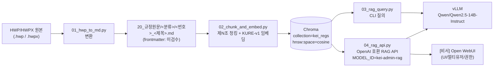
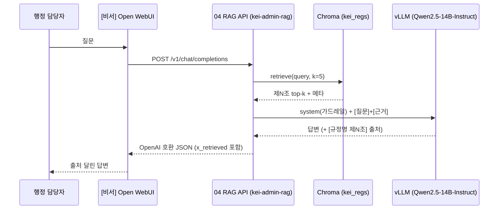
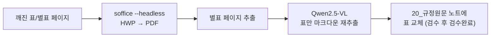

# 04 · 데이터 파이프라인

> HWP 규정 원문이 [비서] Open WebUI 답변으로 흐르기까지의 4단계 스크립트.
> 변환(01) → 청킹·임베딩(02) → 질의(03) / RAG API(04). 각 절은 목적·입출력·CLI·핵심 로직·튜닝·한계로 구성한다.

이 문서는 `tools/`의 01~04 스크립트를 실행·운영하는 개발자/운영자를 위한 상세 레퍼런스다. 설계 배경은 [02-architecture.md](02-architecture.md), 콘텐츠 모델은 [03-content-model.md](03-content-model.md), RAG 검색 설계는 [05-rag-design.md](05-rag-design.md)를 참고한다.

> [!note] 현재 상태
> 01과 04는 **스켈레톤**이다(소스 docstring 기준). 정규식/표 처리(01), SSE 스트리밍(04)은 실 데이터로 돌려보며 다듬는다. 변환·생성물은 검수 전까지 프론트매터 `검수상태: 미검수`를 유지한다.

---

## 전체 흐름



핵심: [뇌] Quartz 그래프 사이트와 [비서] Open WebUI는 **같은 마크다운 볼트**를 먹는 두 화면이다. 채팅은 그림이 아니라 텍스트 + 임베딩 검색으로 답한다. 이 파이프라인은 그중 **채팅(비서)** 쪽 데이터 경로다.

| 단계 | 스크립트 | 입력 | 출력 |
|---|---|---|---|
| 변환 | `01_hwp_to_md.py` | HWP/HWPX 폴더 | `20_규정원문/` 마크다운 |
| 청킹·임베딩 | `02_chunk_and_embed.py` | 볼트(`KEI-행정가이드/`) | Chroma `kei_regs` |
| 질의(CLI) | `03_rag_query.py` | Chroma + 질문 | 콘솔 답변 + 회수 조문 |
| RAG API | `04_rag_api.py` | Chroma + HTTP 요청 | OpenAI 호환 응답 |

---

## 🛠️ 01 · `01_hwp_to_md.py` — HWP → Markdown

소스: [`../tools/01_hwp_to_md.py`](../tools/01_hwp_to_md.py)

### 목적
HWP/HWPX 규정 원본을 마크다운 진실원천(`20_규정원문/`)으로 적재한다. 원문층은 **의역 금지** — 스크립트는 텍스트를 그대로 옮기고 표만 부록으로 분리하며, 사람 검수 전까지 `검수상태: 미검수`로 둔다.

### 입력 · 출력

| | 내용 |
|---|---|
| 입력 | `--src` 폴더의 `*.hwp`, `*.hwpx` |
| 출력 | `<vault>/20_규정원문/<분류>/<번호>_<제목>.md` |
| 분류 폴더 | 규정번호 첫 자리로 자동 배치(아래 `CATEGORY` 표) |

### CLI 사용법

```bash
python tools/01_hwp_to_md.py \
  --src ./hwp_inbox \
  --vault ./KEI-행정가이드
```

| 인자 | 필수 | 설명 |
|---|---|---|
| `--src` | 예 | HWP/HWPX가 모여 있는 폴더 |
| `--vault` | 예 | 볼트 루트(`KEI-행정가이드/`) |

### 핵심 로직

**`parse_filename(name)`** — 파일명에서 규정번호·제목·개정일을 추정한다.

```python
num  = (re.match(r"(\d{3,4})", stem) or [None, ""])[1]   # 앞 3~4자리 = 규정번호
m    = re.search(r"(\d{2})(\d{2})(\d{2})", stem)          # _YYMMDD → 20YY-MM-DD 개정일
title = re.sub(r"^\d{3,4}", "", stem)                     # 앞 번호 제거
title = re.sub(r"[_\(].*$", "", title).strip() or stem    # _ 또는 ( 이후 절단
```

> 예시(설명용, 실제 규정 아님): `4300여비규정_250324.hwp` → 번호 `4300`, 제목 `여비규정`, 개정일 `2025-03-24`.

**`CATEGORY` 매핑** — 규정번호 첫 자리 → `20_규정원문/` 하위 분류 폴더. KEI 규정번호 체계는 1000~6000이며, 7xxx(회계/구매)도 총무·보안·회계로 합친다.

| 첫 자리 | 분류 폴더 |
|---|---|
| 1 | `1000_기관` |
| 2 | `2000_감사·규정` |
| 3 | `3000_인사` |
| 4 | `4000_보수·여비` |
| 5 | `5000_연구·정보` |
| 6 | `6000_총무·보안·회계` |
| 7 | `6000_총무·보안·회계` |

**본문/표 추출(`to_markdown`)** — `hwp_hwpx_parser.Reader`로 처리:
- `extract_text()` 로 본문 텍스트.
- `get_tables_as_markdown()` 로 표를 마크다운으로 추출 → 본문 끝에 `## (부록) 표`로 **부록 처리**(인라인 치환은 추후 고도화).
- `is_encrypted`이면 빈 문자열 반환 → **암호화 파일 skip**.
- 본문이 비어 있으면(`not body.strip()`) `[skip]` 로그 후 건너뜀.

**`build_note`** — `regulation` 프론트매터 + 경고 콜아웃 + 본문을 생성한다. 프론트매터는 `type: regulation / 규정번호 / 규정명 / 분류 / 개정일 / 원본파일 / 태그 / 검수상태: 미검수`이며, 본문 머리에 다음 경고를 박는다.

```markdown
> [!warning] 자동 변환 — 의역 금지. 표/별표 깨짐과 오타만 검수 후 `검수완료`로.
```

### 튜닝 포인트
- `parse_filename` 정규식: 파일명 규칙이 다양할 때 번호/개정일/제목 분리 규칙을 실데이터로 보강.
- 표 처리: 현재는 본문 끝 부록. 조문 내 인라인 위치 복원은 향후 과제.
- skip 로그: 암호화/빈 본문은 콘솔 로그만 남김 → 별도 파일 로깅 권장(소스 주석).

### 알려진 한계
> [!warning] 스켈레톤
> - 표/별표(別表) 레이아웃이 깨질 수 있다. 깨질 때는 아래 [HWP 변환 fallback](#-hwp-변환-fallback)으로 재추출한다.
> - 인라인 표 위치는 보존되지 않고 부록으로만 분리된다.
> - 암호화 파일은 자동 skip되므로 사전 복호화가 필요하다.

---

## 🧩 02 · `02_chunk_and_embed.py` — 제N조 청킹 + 임베딩

소스: [`../tools/02_chunk_and_embed.py`](../tools/02_chunk_and_embed.py)

### 목적
규정을 **제N조 단위**(조문 1개 = 청크 1개)로 쪼개 한국어 임베딩으로 변환하고 Chroma에 적재한다. 고정 길이 청킹은 금지 — 검색 결과가 "법적으로 완결된 단위"로 떨어지고 `[규정명 제N조]` 출처 표기가 깔끔해지기 때문이다. 근거는 [ADR 0002](adr/0002-article-level-chunking.md), 임베딩 선택은 [ADR 0001](adr/0001-embedding-kure-v1.md) 참고.

### 입력 · 출력

| | 내용 |
|---|---|
| 입력 | `--vault` 볼트의 `*.md`(단, `_templates` 제외) |
| 출력 | Chroma `PersistentClient(path=--db)`의 collection `kei_regs` |
| 메타 | `hnsw:space=cosine` |

### CLI 사용법

```bash
python tools/02_chunk_and_embed.py \
  --vault ./KEI-행정가이드 \
  --db ./tools/chroma
```

| 인자 | 필수 | 기본값 | 설명 |
|---|---|---|---|
| `--vault` | 예 | — | 볼트 루트 |
| `--db` | 아니오 | `./chroma` | Chroma 영속 경로(`tools/chroma/`는 gitignore) |

### 핵심 로직

**제N조 분할** — 룩어헤드 정규식으로 경계 직전에서 나눠 조문 제목을 청크에 남긴다.

```python
ARTICLE = re.compile(r"(?=^\s*제\s*\d+\s*조)", re.MULTILINE)  # 제N조 경계
```

**`split_frontmatter`** — `---`로 시작하면 프론트매터를 `key: value`로 파싱(따옴표 제거)하고 본문과 분리한다.

**type별 청킹**

| type | 청킹 방식 | 메타데이터 |
|---|---|---|
| `regulation` | 제N조마다 1청크 | `text, 규정명, 규정번호, 조, type, path` |
| `guide` / `term` | 노트 전체 1청크 | `규정명`에 `제목`/`용어`, `조` 빈값 |

`article_no()`가 청크 머리에서 `제\s*(\d+)\s*조`를 잡아 `조` 메타(`제N조`)를 채운다. `_templates`가 경로에 포함된 파일은 건너뛴다.

**임베딩 · 적재**

```python
EMBED_MODEL = "nlpai-lab/KURE-v1"   # 대안: "BAAI/bge-m3"
model = SentenceTransformer(EMBED_MODEL)            # GPU(A40) 자동 사용
col   = client.get_or_create_collection(
            "kei_regs", metadata={"hnsw:space": "cosine"})
embs  = model.encode([c["text"] for c in chunks],
            normalize_embeddings=True, batch_size=32, show_progress_bar=True)
col.upsert(ids, embeddings, documents, metadatas)
```

- 임베딩 모델 `nlpai-lab/KURE-v1`(대안 `BAAI/bge-m3`). **양자화하지 않음.**
- `normalize_embeddings=True` + `hnsw:space=cosine` → 정규화 벡터에 코사인 거리.
- `batch_size=32`, `upsert`(ids 재실행 시 갱신).

### 튜닝 포인트
- `EMBED_MODEL`: KURE-v1 ↔ bge-m3 교체. **단, 교체 시 03/04도 같은 값으로 맞추고 재적재해야 한다**(아래 03 제약 참고).
- `batch_size`: GPU 메모리에 맞춰 증감.
- `ARTICLE` 정규식: 「제 1 조」처럼 띄어쓰기/장(章)·항(項) 혼재 문서면 경계 규칙 보강.

### 알려진 한계
> [!warning]
> - `ids`가 `range(len(chunks))` 순번이라 청크 수가 바뀌면 ID가 밀려 stale 청크가 남을 수 있다 → 풀 재적재 또는 ID 전략 개선 필요.
> - 조문 외 별표/서식 본문은 해당 조 청크에 흡수되거나 누락될 수 있다.

---

## 🔎 03 · `03_rag_query.py` — CLI 질의

소스: [`../tools/03_rag_query.py`](../tools/03_rag_query.py)

### 목적
임베딩 검색으로 관련 조문 top-k를 회수해 근거로 주입하고, 로컬 vLLM으로 답한 뒤 회수 조문을 출력한다. 운영 전 검증·디버깅용 CLI다.

### 입력 · 출력

| | 내용 |
|---|---|
| 입력 | Chroma(`--db`) + 질문(`--q`) |
| 출력 | 콘솔에 답변 + `─ 회수된 조문:` 목록 |

### CLI 사용법

```bash
python tools/03_rag_query.py \
  --db ./tools/chroma \
  --q "출장 정산은 어떤 절차로 하나요?" \
  --k 5
```

| 인자 | 필수 | 기본값 | 설명 |
|---|---|---|---|
| `--db` | 아니오 | `./chroma` | Chroma 경로 |
| `--q` | 예 | — | 질문 |
| `--k` | 아니오 | `5` | top-k 회수 개수 |

> 위 질문은 **사용법 예시**다. 실제 절차·금액·조문 번호는 규정 원문으로만 확인한다.

### 핵심 로직

```python
EMBED_MODEL = "nlpai-lab/KURE-v1"     # 02와 동일해야 함
VLLM_BASE   = "http://localhost:8000/v1"
LLM_MODEL   = "Qwen/Qwen2.5-14B-Instruct"
```

1. 질문을 `KURE-v1`로 임베딩(`normalize_embeddings=True`) → `col.query(n_results=k)`.
2. 회수된 각 조문을 `[규정명 제N조]\n본문` 블록으로 만들고 `\n\n---\n\n`로 연결해 컨텍스트 구성.
3. `OpenAI(base_url=VLLM_BASE, api_key="EMPTY")`로 `temperature=0.1` chat 호출.
4. 답변 출력 후 회수된 조 목록을 콘솔에 표기.

> [!warning] EMBED_MODEL은 02와 반드시 동일
> 질의 임베딩과 적재 임베딩이 같은 모델이어야 벡터 공간이 일치한다. 02에서 모델을 바꿨다면 03/04의 `EMBED_MODEL`도 똑같이 바꾸고 **Chroma를 재적재**해야 한다. 다르면 검색 품질이 조용히 무너진다.

LLM은 일반 instruct 모델(`Qwen/Qwen2.5-14B-Instruct` 등)을 쓴다 — 코더/VL 아님. 한국어 특화 대안은 EXAONE/Kanana.

### 시스템 프롬프트 가드레일(03/04 공통, 약화 금지)
1. `[근거]`에 없는 내용(특히 금액·한도·기한)은 절대 지어내지 말고 **"규정에서 확인되지 않습니다"**라고 말한다.
2. 신입도 이해하게 쉽게, 단계로 설명한다.
3. 답변 끝에 사용한 출처를 `[규정명 제N조]` 형식으로 모두 표기한다.
4. 마지막에 **"최종 판단은 원문과 담당 부서 확인 바랍니다."**를 덧붙인다.

### 튜닝 포인트
- `--k`: 회수량. 늘리면 재현율↑·컨텍스트 길이↑.
- `temperature=0.1`: 환각 억제 위해 낮게 고정. 더 보수적으로 가려면 0으로.
- `LLM_MODEL`: vLLM에 떠 있는 모델명과 일치시킬 것.

### 알려진 한계
- 재랭킹/필터(규정번호·분류) 없음 — 순수 벡터 top-k. 정밀 검색 설계는 [05-rag-design.md](05-rag-design.md).
- 단발성 CLI라 멀티턴/세션 없음(그건 04 + Open WebUI 담당).

---

## 🌐 04 · `04_rag_api.py` — OpenAI 호환 RAG API

소스: [`../tools/04_rag_api.py`](../tools/04_rag_api.py)

### 목적
03의 RAG를 **OpenAI 호환 모델**로 노출해 Open WebUI가 그대로 붙게 한다. Open WebUI 내장 RAG는 청킹/출처표기 통제가 약하므로, 제N조 검색·근거 주입·`[규정명 제N조]` 출처 강제는 이 서버가 담당하고 Open WebUI는 UI/멀티유저/권한만 담당한다(설계 근거 [ADR 0003](adr/0003-controlled-rag-api.md)).

### 입력 · 출력

| | 내용 |
|---|---|
| 입력 | HTTP(OpenAI Chat Completions 형식) |
| 출력 | OpenAI 호환 JSON(+ 디버그용 `x_retrieved`) |
| 상수 | `MODEL_ID = kei-admin-rag` (Open WebUI 모델 목록 표시명) |

### 엔드포인트

| 메서드 | 경로 | 동작 |
|---|---|---|
| GET | `/v1/models` | `kei-admin-rag` 단일 모델 반환 |
| POST | `/v1/chat/completions` | 마지막 user 메시지로 검색 → 근거 주입 → vLLM → 응답 |

import 시 임베딩(`KURE-v1`)·Chroma(`get_collection("kei_regs")`)·vLLM 클라이언트를 로딩한다. `retrieve(query, k=5)`가 03과 동일하게 `[규정명 제N조]` 블록 컨텍스트를 만든다.

```python
@app.post("/v1/chat/completions")
def chat(req: ChatReq):
    user_msg = next((m["content"] for m in reversed(req.messages)
                     if m.get("role") == "user"), "")
    context, srcs = retrieve(user_msg)
    out = _llm.chat.completions.create(
        model=LLM_MODEL, temperature=req.temperature or 0.1,
        messages=[{"role": "system", "content": SYSTEM},
                  {"role": "user", "content": f"[질문]\n{user_msg}\n\n[근거]\n{context}"}])
    return JSONResponse({..., "model": MODEL_ID, "x_retrieved": srcs})
```

- 응답에 `x_retrieved`(회수된 조문 태그 목록)를 **디버그용**으로 포함.
- 시스템 프롬프트는 03과 동일한 4대 가드레일(약화 금지).
- 현재 **비스트리밍** 스켈레톤(`stream` 필드는 있으나 본문은 단발 응답) — SSE는 향후 확장.

### 실행 · 등록

```bash
uvicorn 04_rag_api:app --host 0.0.0.0 --port 9000
```

Open WebUI 등록: **설정 > 연결 > OpenAI API**

| 항목 | 값 |
|---|---|
| Base URL | `http://<서버실제IP>:9000/v1` |
| API Key | `EMPTY` |

> [!warning] localhost / host.docker.internal 금지
> Open WebUI가 Docker 컨테이너에서 돌기 때문에 연결 URL에 `localhost`나 `host.docker.internal`을 쓰면 안 된다. **서버의 실제 IP**를 넣는다.

### 흐름



### 튜닝 포인트
- `retrieve`의 `k`: 회수량.
- `temperature`: 요청값 우선, 없으면 0.1.
- `MODEL_ID`/`LLM_MODEL`: 표시명·실제 서빙 모델명.

### 알려진 한계
> [!warning] 스켈레톤
> - 비스트리밍 → 긴 답변은 응답 지연이 체감된다. **SSE 스트리밍은 향후 추가.**
> - 인증/요청 검증이 얇다(`api_key=EMPTY`). 접근 통제는 Cloudflare Zero Trust + Open WebUI RBAC가 담당([07-security-governance.md](07-security-governance.md)).
> - `x_retrieved`는 디버그용이며 UI 출처 표기는 답변 본문의 `[규정명 제N조]`에 의존한다.

---

## 🩹 HWP 변환 fallback

`hwp-hwpx-parser`로 본문은 보통 잘 나오지만 **표/별표가 깨질 때**가 있다. 이때는 LibreOffice로 PDF를 만들고, 표가 있는 페이지를 VLM에 넘겨 표만 마크다운으로 재추출한다. 설치 스크립트는 [`../deploy/setup_ubuntu_hwp.sh`](../deploy/setup_ubuntu_hwp.sh)에 정리한다.



### 설치(`setup_ubuntu_hwp.sh`)
LibreOffice + H2Orestart 확장(HWP 필터)을 설치한다.

```bash
# Ubuntu (예: data05lx)
sudo apt-get install -y libreoffice unzip wget
# ebandal/H2Orestart 릴리스에서 oxt 내려받아 LibreOffice에 등록
wget -O H2Orestart.oxt <H2Orestart 릴리스 oxt URL>
unopkg add H2Orestart.oxt
```

> [!todo] 확인 필요: H2Orestart 릴리스 URL/버전
> `ebandal/H2Orestart`의 정확한 oxt 다운로드 URL과 버전 핀은 설치 시점에 확정해 `setup_ubuntu_hwp.sh`에 박는다.

### headless 변환

```bash
soffice --headless --convert-to pdf --outdir ./pdf_out ./hwp_inbox/규정.hwp
```

### 별표 페이지 → VLM 표 재추출
깨진 별표가 있는 PDF 페이지만 골라 **Qwen2.5-VL**에 넘겨 표만 마크다운으로 다시 뽑는다. 결과는 해당 조문/부록의 표를 교체하고, **의역 없이** 표 구조만 복원한 뒤 검수자가 `검수완료`로 바꾼다.

> [!note] 모델 역할 분리
> 본문 QA(03/04)는 일반 instruct(`Qwen/Qwen2.5-14B-Instruct`)가, 표 재추출은 비전 모델(`Qwen2.5-VL`)이 담당한다. 둘은 용도가 다른 별개 모델이다.

---

## ▶️ 재현 / 실행 순서

```bash
# 0) 가상환경 + 의존성
python -m venv tools/.venv
source tools/.venv/bin/activate
pip install -r tools/requirements.txt   # hwp-hwpx-parser, sentence-transformers,
                                         # chromadb, kss(선택), openai, fastapi, uvicorn

# 1) HWP → Markdown (20_규정원문/ 적재)
python tools/01_hwp_to_md.py --src ./hwp_inbox --vault ./KEI-행정가이드
#   → 사람 검수: 표/별표·오타 확인 후 frontmatter 검수상태: 검수완료

# 2) 제N조 청킹 + KURE-v1 임베딩 → Chroma(kei_regs)
python tools/02_chunk_and_embed.py --vault ./KEI-행정가이드 --db ./tools/chroma

# 3) CLI 질의로 검증
python tools/03_rag_query.py --db ./tools/chroma --q "<질문>" --k 5

# 4) RAG API 기동 (Open WebUI가 붙는 OpenAI 호환 모델)
cd tools && uvicorn 04_rag_api:app --host 0.0.0.0 --port 9000
#   → Open WebUI 설정 > 연결 > OpenAI API
#     Base URL = http://<서버실제IP>:9000/v1 , API Key = EMPTY
```

> [!tip]
> 02는 `upsert`라 재실행 시 갱신된다. 임베딩 모델을 바꿨다면 Chroma를 새로 만들어 풀 재적재하는 게 안전하다. 배포/Docker 구성은 [06-deployment.md](06-deployment.md), 운영 절차는 [10-operations.md](10-operations.md) 참고.

> [!warning] 내부 전용
> [뇌] Quartz와 [비서] Open WebUI 두 화면 모두 Cloudflare Zero Trust 뒤의 사내 전용이다. 온프레미스(A40 GPU)에서만 구동하며 어느 화면도 인터넷에 공개하지 않는다.

---

## 관련 문서

문서 인덱스: [docs/README.md](README.md)

| 이전 | 다음 |
|---|---|
| ← [03-content-model.md](03-content-model.md) · 콘텐츠 모델 | [05-rag-design.md](05-rag-design.md) · RAG 설계 → |

연관: [02-architecture.md](02-architecture.md) · [06-deployment.md](06-deployment.md) · [07-security-governance.md](07-security-governance.md) · [ADR 0001](adr/0001-embedding-kure-v1.md) · [ADR 0002](adr/0002-article-level-chunking.md) · [ADR 0003](adr/0003-controlled-rag-api.md)
루트: [../README.md](../README.md) · [../CLAUDE.md](../CLAUDE.md) · [../WORKPLAN.md](../WORKPLAN.md)

---

최종 수정: 2026-06-18
