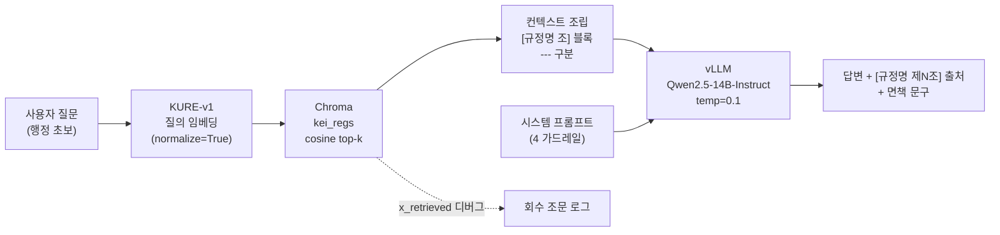
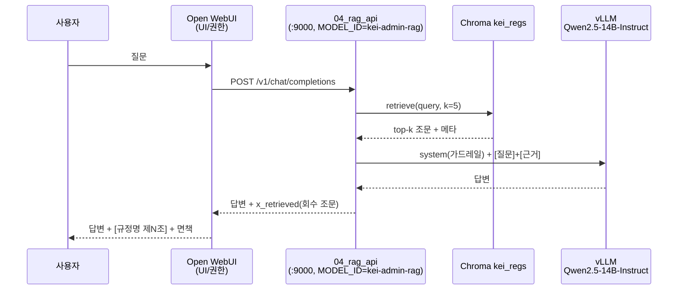
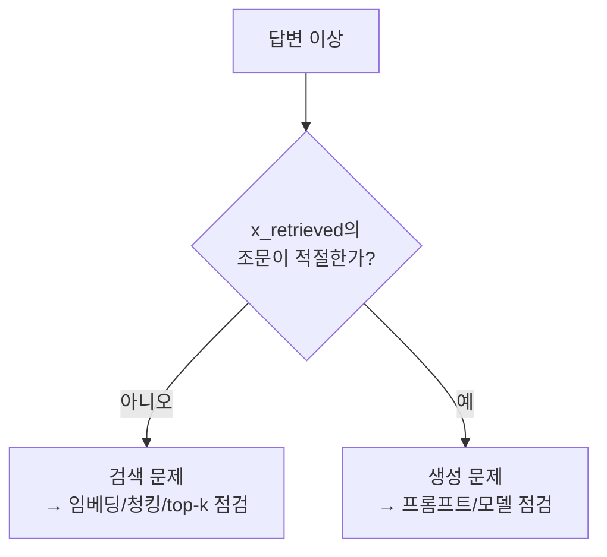

# 05 · RAG 설계 — 검색 · 프롬프트 · 가드레일 · 평가

> [비서] Open WebUI + vLLM 화면이 "이 업무 어떻게 처리하지?"에 **사내 규정 근거**로 답하기 위한 검색·생성 파이프라인 설계.
> 핵심 원칙: 그림이 아니라 **텍스트 + 임베딩 검색**으로 답하고, 모든 답변 끝에 `[규정명 제N조]` 출처와 면책 문구를 강제한다.

이 문서는 RAG의 네 축 — **검색(retrieval)**, **프롬프트(prompt)**, **가드레일(guardrail)**, **평가(eval)** — 를 정의한다. 콘텐츠 모델·청킹 규칙은 [03-content-model.md](03-content-model.md)·[04-pipeline.md](04-pipeline.md)에서, 전체 아키텍처는 [02-architecture.md](02-architecture.md)에서 다룬다.

---

## 1. 전체 흐름

마크다운 볼트 `KEI-행정가이드/`가 단일 진실원천이고, 같은 볼트를 두 화면이 먹는다. RAG 비서는 **제N조 단위 청크**를 임베딩 검색해 근거로 주입한다.



| 단계 | 담당 | 구현 |
|------|------|------|
| 변환·청킹·임베딩 | 오프라인 파이프라인 | [`../tools/01_hwp_to_md.py`](../tools/01_hwp_to_md.py) → [`../tools/02_chunk_and_embed.py`](../tools/02_chunk_and_embed.py) |
| CLI 질의(개발·디버그) | 단발 스크립트 | [`../tools/03_rag_query.py`](../tools/03_rag_query.py) |
| 통제형 RAG API(운영) | OpenAI 호환 서버 | [`../tools/04_rag_api.py`](../tools/04_rag_api.py) |
| 채팅 UI/권한 | Open WebUI | [06-deployment.md](06-deployment.md) |

---

## 2. 임베딩

### 2.1 모델 선택: `nlpai-lab/KURE-v1`

| 항목 | 결정 | 이유 |
|------|------|------|
| 기본 모델 | `nlpai-lab/KURE-v1` | **한국어 특화** 임베딩. 규정 원문·행정 질의가 모두 한국어라 한국어 의미 검색 품질이 핵심 |
| 대안 | `BAAI/bge-m3` | 다국어·롱컨텍스트가 필요해지면 교체 후보 |
| 양자화 | **안 함** | 검색 정확도 우선. A40 GPU 한 대로 임베딩 규모를 충분히 감당하므로 양자화로 품질을 희생할 이유가 없음 |
| 정규화 | `normalize_embeddings=True` | 벡터를 단위 길이로 만들어 **cosine** 거리가 안정적으로 동작 |
| 거리 함수 | cosine (`hnsw:space=cosine`) | 정규화된 임베딩과 짝을 이룸 |

> [!note] 모델 ID 일치는 불변식
> 임베딩 모델은 색인(02)·CLI 질의(03)·API(04)에서 **반드시 동일**해야 한다. 모델을 바꾸면 색인을 다시 만들어야 한다(섹션 7 참고).

자세한 근거와 트레이드오프는 [ADR 0001 — 임베딩 모델로 KURE-v1 채택](adr/0001-embedding-kure-v1.md) 참고.

### 2.2 임베딩 호출

```python
# tools/02_chunk_and_embed.py · 03 · 04 공통 패턴
from sentence_transformers import SentenceTransformer
model = SentenceTransformer("nlpai-lab/KURE-v1")          # GPU 자동 사용
vecs = model.encode(texts, normalize_embeddings=True, batch_size=32)
```

---

## 3. 벡터DB — Chroma

### 3.1 클라이언트와 컬렉션

| 항목 | 값 |
|------|-----|
| 엔진 | Chroma (`chromadb`) |
| 클라이언트 | `PersistentClient(path=...)` — 기본 `./chroma` |
| 컬렉션명 | `kei_regs` |
| 거리 함수 | `hnsw:space=cosine` |
| 영속 디렉터리 | `tools/chroma/` — **`.gitignore` 대상**(생성물, 커밋 금지) |

```python
import chromadb
col = chromadb.PersistentClient(path="./chroma").get_or_create_collection(
    "kei_regs", metadata={"hnsw:space": "cosine"})
col.upsert(ids=ids, embeddings=embs, documents=docs, metadatas=metas)
```

### 3.2 청크에 실리는 필드(document + metadata)

청킹·임베딩 단계([`../tools/02_chunk_and_embed.py`](../tools/02_chunk_and_embed.py))는 청크 본문을 `documents=`로, 출처·디버그용 필드를 `metadatas=`로 분리해 넣는다. 즉 아래 첫 행 `text`는 **메타데이터가 아니라 Chroma document 본문**이고, `metadatas=`에는 그 아래 5개(`규정명`·`규정번호`·`조`·`type`·`path`)만 들어간다. 이 필드들이 출처 표기와 디버그 로깅의 재료가 된다.

| 필드 | 의미 | 채워지는 청크 |
|------|------|----------------|
| `text` | 청크 본문(조문 또는 노트 전체) — **metadata 아님, Chroma document 본문(`documents=`)** | 전부 |
| `규정명` | 규정 제목 | regulation |
| `규정번호` | KEI 규정번호(1000~6000) | regulation |
| `조` | 조문 식별자(예: 제N조) | regulation |
| `type` | `regulation` / `guide` / `term` | 전부 |
| `path` | 볼트 내 원본 노트 경로 | 전부 |

> [!note] 청킹 단위
> `type=regulation`은 **제N조 = 청크 1개**(고정 길이 청킹 금지). `guide`·`term`은 노트 전체가 1청크. `_templates`는 청킹에서 제외한다. 근거는 [ADR 0002](adr/0002-article-level-chunking.md).

---

## 4. 검색 전략

### 4.1 top-k 회수

- 기본 `k=5` (CLI: `03_rag_query.py --k 5`, API: `retrieve(query, k=5)`).
- 질의를 KURE-v1로 임베딩(정규화) → `col.query(query_embeddings=[qv], n_results=k)` → cosine 상위 k개 청크 회수.

### 4.2 컨텍스트 블록 조립

회수한 각 청크를 `[규정명 조]` 헤더가 달린 블록으로 만들고, 블록 사이를 `---`로 구분해 하나의 `[근거]` 컨텍스트로 합친다. 출처 태그(`규정명 + 조`)가 본문과 함께 LLM에 들어가므로, 모델이 어느 조문을 인용하는지 추적할 수 있다.

```python
# tools/03_rag_query.py · 04_rag_api.py 공통
blocks = []
for doc, m in zip(res["documents"][0], res["metadatas"][0]):
    tag = f"{m.get('규정명','')} {m.get('조','')}".strip()
    blocks.append(f"[{tag}]\n{doc}")
context = "\n\n---\n\n".join(blocks)
```

조립된 컨텍스트의 모양(예시 — 실제 규정명·조 번호가 아니라 형식만 표시):

```text
[○○ 규정 제N조]
(해당 조문 본문 …)

---

[○○ 규정 제M조]
(해당 조문 본문 …)
```

> [!tip] 왜 이 형식인가
> 제N조 단위 청킹 덕분에 한 블록이 정확히 한 조문에 대응한다. 그래서 LLM이 출처를 `[규정명 제N조]`로 깔끔하게 돌려줄 수 있고, 사람이 디버그할 때도 "어느 조문이 회수됐나"가 한눈에 보인다.

---

## 5. 시스템 프롬프트와 가드레일

`03_rag_query.py`와 `04_rag_api.py`는 **동일한 시스템 프롬프트**를 쓴다. 아래는 전문이다(약화 금지 — 이 4개 규칙은 불변식이다). 가드레일 전문의 정본(canonical)은 본 문서 §5이며, 다른 문서가 4개 규칙을 인용할 때는 여기를 기준으로 한다.

```text
너는 KEI 행정 도우미다. 아래 [근거]에 담긴 규정 조문만 사용해 답한다.
규칙:
1) [근거]에 없는 내용(특히 금액·한도·기한)은 절대 지어내지 말고
   '규정에서 확인되지 않습니다'라고 말한다.
2) 답변은 신입도 이해하게 쉽게, 단계로.
3) 답변 맨 끝에 사용한 출처를 [규정명 제N조] 형식으로 모두 표기한다.
4) 마지막에 '최종 판단은 원문과 담당 부서 확인 바랍니다.'를 덧붙인다.
```

각 규칙의 의도:

| # | 규칙 | 의도 |
|---|------|------|
| 1 | 근거에 없으면 "규정에서 확인되지 않습니다" | **환각 억제.** 금액·한도·기한처럼 틀리면 위험한 값을 모델이 지어내지 못하게 막는다. 모르면 모른다고 말하는 것이 정답보다 우선한다 |
| 2 | 신입도 이해하게 단계로 | **쉬운 설명.** 주 독자가 행정 초보(신입·전입자)이므로, 조문을 그대로 던지지 않고 절차로 풀어준다 |
| 3 | 끝에 `[규정명 제N조]` 출처 표기 | **출처·감사 추적성.** 답변의 모든 주장이 어느 조문에서 왔는지 사용자가 원문으로 되짚을 수 있게 한다 |
| 4 | "최종 판단은 원문과 담당 부서 확인 바랍니다." | **면책.** 비서는 길잡이일 뿐, 최종 책임은 원문·담당 부서에 있음을 명시한다 |

> [!warning] 가드레일은 약화 금지
> 위 4개 규칙은 임의로 완화·삭제하면 안 된다. 특히 규칙 1(근거에 없으면 확인되지 않는다고 답한다)을 풀면 RAG 비서의 신뢰성 자체가 무너진다. 모델 교체·프롬프트 튜닝 시에도 이 4개 의미는 보존해야 한다.

생성 파라미터는 `temperature=0.1`로 낮춰 결정성을 높이고 추측을 줄인다.

---

## 6. 출처 표기

### 6.1 강제 형식

RAG 답변은 **항상** 끝에 `[규정명 제N조]` 형식으로 사용한 출처를 모두 표기하고, 면책 문구를 덧붙인다(가드레일 규칙 3·4).

> [!note] 화면별 출처 규약 차이
> - [비서] RAG 답변: 본문 끝에 `[규정명 제N조]` + 면책 문구.
> - 사람이 작성하는 업무가이드(`10_업무가이드/`): 본문에 `[[규정명#제N조]]` **위키링크**로 원문층을 가리킨다.
> 두 규약 모두 출처를 원문층(`20_규정원문/`)으로 되돌리는 것이 목적이다.

### 6.2 제N조 청킹이 출처를 깔끔하게 만든다

고정 길이 청킹이라면 한 청크에 여러 조문이 섞이거나 한 조문이 잘려, 출처를 "어디서 왔는지"로 정확히 환원하기 어렵다. **조문 1개 = 청크 1개**라서 회수 단위와 인용 단위가 1:1로 맞고, 그래서 `[규정명 제N조]`가 자연스럽게 떨어진다. 결정 근거는 [ADR 0002 — 제N조 단위 청킹](adr/0002-article-level-chunking.md).

> [!warning] 원문층 의역 금지
> 출처가 가리키는 `20_규정원문/`은 HWP 변환 진실원천이다. **의역하지 않는다.** 비서가 쉬운 말로 풀어주는 것은 답변 본문에서만 하고, 인용·출처는 원문 조문을 그대로 가리킨다.

---

## 7. 왜 통제형 `04_rag_api.py`인가 (vs Open WebUI 내장 RAG)

Open WebUI에는 자체 RAG 기능이 있지만, **청킹·출처 표기 통제가 약하다**. 우리 요구(제N조 단위 검색, 근거 주입, `[규정명 제N조]` 출처 강제)를 보장하려면 직접 통제해야 한다.

해법: `04_rag_api.py`를 **OpenAI 호환 모델**(`MODEL_ID=kei-admin-rag`)로 Open WebUI에 등록한다. 역할 분담은 다음과 같다.

| 책임 | 담당 |
|------|------|
| 채팅 UI · 멀티유저 · 권한(RBAC/SSO) | Open WebUI |
| 제N조 단위 검색 · 근거 주입 · `[규정명 제N조]` 출처 강제 · 가드레일 | `04_rag_api.py` |



엔드포인트:

| 메서드 · 경로 | 역할 |
|---------------|------|
| `GET /v1/models` | 모델 목록(`kei-admin-rag`) 노출 |
| `POST /v1/chat/completions` | 검색 → 근거 주입 → vLLM 호출 → 출처 포함 응답(비스트리밍 스켈레톤) |

실행과 등록:

```bash
# 호스트에서 직접 띄우기(우선 권장; compose 블록은 주석 처리되어 있음)
uvicorn 04_rag_api:app --host 0.0.0.0 --port 9000
```

> [!warning] 연결 URL에 localhost 쓰지 말 것
> Open WebUI(Docker) → API 연결 시 Base URL은 **서버 실제 IP**를 써야 한다(`http://<서버실제IP>:9000/v1`, API Key=`EMPTY`). Docker 네트워크 특성상 `localhost`/`host.docker.internal`은 컨테이너 안에서 다른 곳을 가리킨다.

결정 근거: [ADR 0003 — 통제형 RAG API](adr/0003-controlled-rag-api.md). 배포 절차는 [06-deployment.md](06-deployment.md).

---

## 8. 평가

RAG 품질을 "느낌"이 아니라 재현 가능한 지표로 본다.

### 8.1 질문셋

행정 초보가 실제로 던질 법한 질문(휴가·출장·결재·보안 등 업무 시나리오)으로 평가셋을 만든다. 각 항목은 질문 + 기대 출처 조문(`[[규정명#제N조]]`) + 기대 답변 요지로 구성한다.

> [!todo] 확인 필요: 평가 질문셋
> 실제 규정 제목·조문 번호·금액은 원문 확인 전까지 단정하지 않는다. 질문셋과 기대 출처는 검수 완료된 `20_규정원문/`을 근거로 채운다. (「TODO: 질문셋 원문 확인」)

### 8.2 지표

| 지표 | 정의 | 측정 방법 |
|------|------|-----------|
| 정답성(correctness) | 답변 내용이 규정과 일치하는가 | 기대 답변 요지 대비 사람/LLM 채점 |
| 출처 정확도(citation accuracy) | `[규정명 제N조]`가 실제 근거 조문을 가리키는가 | 답변 출처 vs 회수 조문(`x_retrieved`) 대조 |
| 거부율(refusal rate) | 근거에 없을 때 "규정에서 확인되지 않습니다"라고 제대로 거부하는가 | **모르면 모른다** 시나리오 통과율 |

> [!note] 거부율은 약점이 아니라 미덕
> 근거 밖 질문에 "확인되지 않습니다"라고 답하는 비율이 적정해야 한다(가드레일 규칙 1). 무조건 답을 만들어내는 모델은 거부율이 0에 가깝고, 그건 환각 위험 신호다.

> [!todo] 확인 필요: 목표 수치
> 각 지표의 목표치(예: 출처 정확도 N% 이상, 위험 질문 거부율 N% 이상)는 첫 측정 후 베이스라인을 보고 정한다. (「TODO: 목표 수치 확정」)

### 8.3 디버그 — `x_retrieved`로 회수 조문 로깅

`04_rag_api.py`의 응답에는 디버그용 `x_retrieved` 필드가 들어가, **어떤 조문이 회수됐는지** 그대로 남긴다. CLI(`03_rag_query.py`)는 실행 끝에 회수된 조 목록을 출력한다.

```python
# 04_rag_api.py 응답 일부 — 회수 조문을 디버그로 노출
return JSONResponse({
    ...,
    "x_retrieved": srcs,   # 디버그용: 회수된 조문 태그 목록
})
```

이로써 "답이 틀렸다"가 **검색 실패(엉뚱한 조문 회수)**인지, **생성 실패(맞는 근거를 줬는데 잘못 답함)**인지 분리해 디버그할 수 있다.



---

## 9. 향후 과제

| 항목 | 내용 |
|------|------|
| 리랭커(reranker) | top-k 회수 후 cross-encoder 등으로 재정렬해 상위 근거 품질 향상 |
| 스트리밍(SSE) | `04_rag_api.py`의 `/v1/chat/completions`를 SSE 스트리밍으로 확장(현재는 비스트리밍 스켈레톤) |
| 하이브리드 검색 | 임베딩(dense) + 키워드(BM25 등 sparse) 결합으로 규정번호·고유명 회수 보강 |

> [!todo] 확인 필요: 우선순위·일정
> 위 과제의 착수 시점·담당은 미정. 로드맵은 [08-roadmap.md](08-roadmap.md)에서 관리한다. (「TODO: 일정 확정」)

---

## 관련 문서

- 문서 인덱스: [docs/README.md](README.md)
- 루트: [../README.md](../README.md) · [../CLAUDE.md](../CLAUDE.md) · [../WORKPLAN.md](../WORKPLAN.md)
- 관련 ADR: [0001 임베딩 KURE-v1](adr/0001-embedding-kure-v1.md) · [0002 제N조 청킹](adr/0002-article-level-chunking.md) · [0003 통제형 RAG API](adr/0003-controlled-rag-api.md)
- 소스: [`../tools/02_chunk_and_embed.py`](../tools/02_chunk_and_embed.py) · [`../tools/03_rag_query.py`](../tools/03_rag_query.py) · [`../tools/04_rag_api.py`](../tools/04_rag_api.py)

| ← 이전 | 인덱스 | 다음 → |
|--------|--------|--------|
| [04-pipeline.md](04-pipeline.md) | [docs/README.md](README.md) | [06-deployment.md](06-deployment.md) |

---

최종 수정: 2026-06-18
