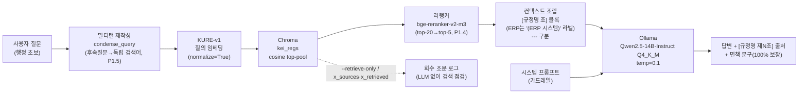
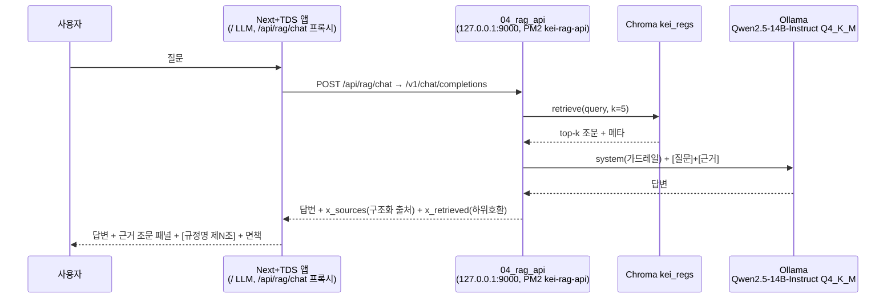
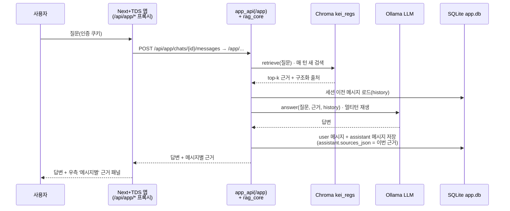
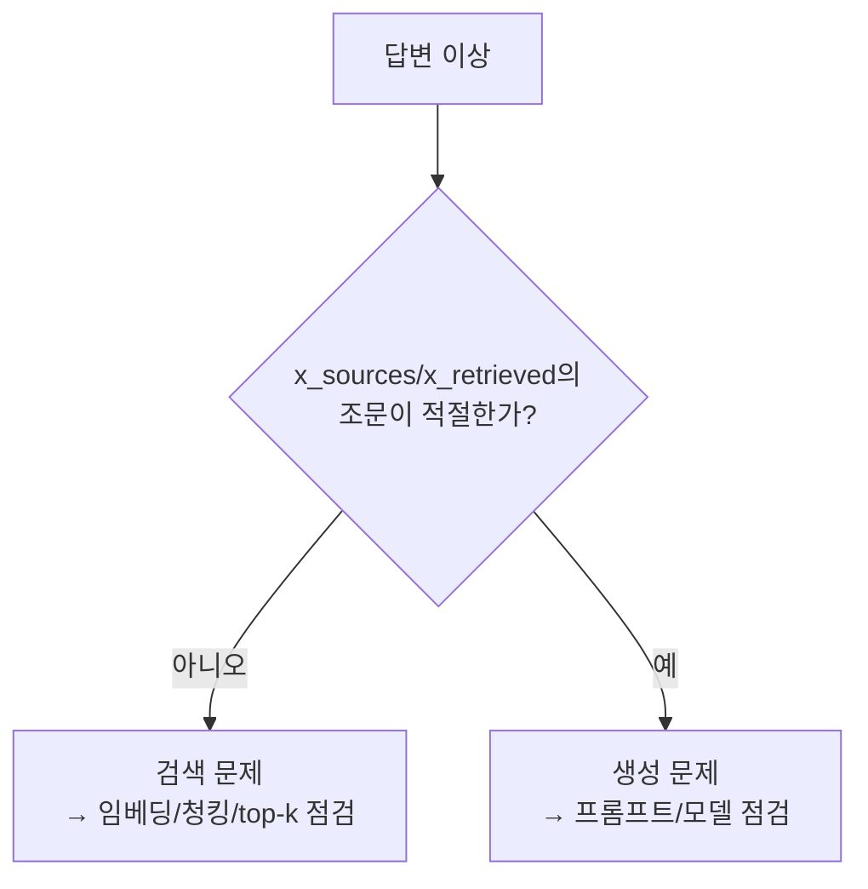

# 05 · RAG 설계 — 검색 · 프롬프트 · 가드레일 · 평가

> [LLM] 통합 채팅(Next.js + TDS 앱) + Ollama 화면이 "이 업무 어떻게 처리하지?"에 **사내 규정 근거**로 답하기 위한 검색·생성 파이프라인 설계.
> 핵심 원칙: 그림이 아니라 **텍스트 + 임베딩 검색**으로 답하고, 모든 답변 끝에 `[규정명 제N조]` 출처와 면책 문구를 강제한다.

이 문서는 RAG의 네 축 — **검색(retrieval)**, **프롬프트(prompt)**, **가드레일(guardrail)**, **평가(eval)** — 를 정의한다. 콘텐츠 모델·청킹 규칙은 [03-content-model.md](03-content-model.md)·[04-pipeline.md](04-pipeline.md)에서, 전체 아키텍처는 [02-architecture.md](02-architecture.md)에서 다룬다. 검색·생성 품질을 끌어올린 운영 작업(리랭커·멀티턴 재작성·ERP 연결·면책 보장 등)의 **before/after 지표**는 [12-품질강화.md](12-품질강화.md)에 정리돼 있고, 본 문서는 그 설계 의도를 다룬다.

---

## 1. 전체 흐름

마크다운 볼트 `KEI-행정가이드/`가 단일 진실원천이고, 같은 볼트를 두 화면이 먹는다. RAG LLM은 **제N조 단위 청크**를 임베딩 검색해 근거로 주입한다.



> [!note] 검증 상태(2026-06-21, 개발 머신)
> **검색·근거주입·출처 표기에 더해 생성(LLM) 단계까지 엔드투엔드로 가동·검증됐다.** 생성 LLM은 **Ollama**(OpenAI 호환, `127.0.0.1:11434/v1`)로 **Qwen2.5-14B-Instruct Q4_K_M GGUF**(약 9GB)를 띄워 한국어 답변을 확인했다(예: "법인카드로 주말에 비품 사도 되나요?" → `법인카드관리및사용규칙` 근거 답변). 임베딩 KURE-v1은 변경 없이 1장으로 충분하다(실측). 그 위에 운영 품질 작업이 적용됐다 — **리랭커(P1.4·§4.5), 멀티턴 쿼리 재작성(P1.5·§4.6), ERP·서식 연결(P2.4·§4.7), 면책 문구 100% 보장(§5), SSE 스트리밍(§7b.4)**. 03은 여전히 `--retrieve-only`(LLM 없이 검색만), 04는 LLM 미연결 시 회수 출처만 반환하는 그레이스풀 동작을 제공한다(§4.4·§7). GPU는 2×Quadro RTX 6000 24GB이며 공유·변동적이라 모델 배치 전 `nvidia-smi`로 확인한다(리랭커·재색인은 여유 GPU — 주로 cuda:1 사용). Qwen2.5-14B-Instruct fp16(약 28GB)은 단일 24GB를 초과하므로 현재는 양자화(Q4) 서빙을 쓰며, vLLM으로 갈 경우 2장 텐서병렬(`tensor-parallel-size=2`)이나 더 작은 instruct(7B/3B)·양자화 서빙이 대안이다.

| 단계 | 담당 | 구현 |
|------|------|------|
| 변환·청킹·임베딩 | 오프라인 파이프라인 | [`../tools/01_hwp_to_md.py`](../tools/01_hwp_to_md.py) → [`../tools/02_chunk_and_embed.py`](../tools/02_chunk_and_embed.py) |
| CLI 질의(개발·디버그) | 단발 스크립트 | [`../tools/03_rag_query.py`](../tools/03_rag_query.py) |
| 통제형 RAG API(운영) | OpenAI 호환 + `/app` 채팅 API 서버, PM2 `kei-rag-api`(`127.0.0.1:9000`) | [`../tools/04_rag_api.py`](../tools/04_rag_api.py)(진입점) · [`../tools/rag_core.py`](../tools/rag_core.py)(검색·생성 코어) · [`../tools/app_api.py`](../tools/app_api.py)(인증·채팅) |
| 채팅 UI | Next.js + TDS 앱에 통합(`/` LLM, 같은 오리진 프록시 — 무상태 `/api/rag/chat` + 영속 `/api/app/*`) | [06-deployment.md](06-deployment.md) |

---

## 2. 임베딩

### 2.1 모델 선택: `nlpai-lab/KURE-v1`

| 항목 | 결정 | 이유 |
|------|------|------|
| 기본 모델 | `nlpai-lab/KURE-v1` | **한국어 특화** 임베딩. 규정 원문·행정 질의가 모두 한국어라 한국어 의미 검색 품질이 핵심 |
| 대안 | `BAAI/bge-m3` | 다국어·롱컨텍스트가 필요해지면 교체 후보 |
| 양자화 | **안 함** | 검색 정확도 우선. Quadro RTX 6000 한 장으로 임베딩 규모를 충분히 감당하므로(실측) 양자화로 품질을 희생할 이유가 없음 |
| 정규화 | `normalize_embeddings=True` | 벡터를 단위 길이로 만들어 **cosine** 거리가 안정적으로 동작 |
| 거리 함수 | cosine (`hnsw:space=cosine`) | 정규화된 임베딩과 짝을 이룸 |

> [!note] 모델 ID 일치는 불변식
> 임베딩 모델은 색인(02)·CLI 질의(03)·API(04)에서 **반드시 동일**해야 한다. 모델을 바꾸면 색인을 다시 만들어야 한다(섹션 7 참고).

자세한 근거와 트레이드오프는 [ADR 0001 — 임베딩 모델로 KURE-v1 채택](adr/0001-embedding-kure-v1.md) 참고.

### 2.2 임베딩 호출

```python
# tools/02_chunk_and_embed.py · 03 · 04 공통 패턴
from sentence_transformers import SentenceTransformer
model = SentenceTransformer("nlpai-lab/KURE-v1")          # GPU 자동 사용
vecs = model.encode(texts, normalize_embeddings=True, batch_size=8)
```

### 2.3 실측 임베딩 파라미터와 잘림(truncation) 한계

KURE-v1은 XLM-RoBERTa(BGE-M3 계열)로 컨텍스트 한계가 8192이지만, 02 실측에서 큰 배치(64)와 긴 조문이 겹쳐 **CUDA OOM**이 났다. 해결책으로 `batch_size=8` + `max_seq_len=2048`(+ `expandable_segments`)로 낮춰 안정화했고, cuda:0에서 약 32초에 3,044 청크를 임베딩했다.

| 파라미터 | 실측값 | 이유 |
|---------|--------|------|
| `batch_size` | 8 | 64에서 CUDA OOM → 축소 |
| `max_seq_len` | 2048 토큰 | OOM 방지(메모리 상한) |
| 임베딩 시간 | 약 32초 (cuda:0) | 3,044 청크 |

> [!note] max_seq_len 2048 잘림 → 하위청킹(P2.3)으로 해소
> 메모리 안정화를 위해 `max_seq_len=2048`으로 두면, **2048 토큰을 초과하는 긴 청크(긴 조문·일부 머리말)는 임베딩 시 뒤가 잘려** 조문 후반부만 묻는 질의의 회수 품질이 떨어진다. 이 한계는 **긴 청크 하위청킹(P2.3)** 으로 해소했다 — 초과 청크를 항(①②)→호(1./가.)→문단→줄 순으로 분할하되 **조 라벨(`제N조`)·메타(출처·앵커)는 유지**한다(별표/별지 표는 분할 안 함). 재색인 4345→4418(+73)이고, A/B로 잘린 꼬리 질의가 구 인덱스에선 미회수→신 인덱스 1위로 입증됐다. 상세·지표는 [12-품질강화.md](12-품질강화.md)(P2.3)·§9.

> [!note] 임베딩 전 노이즈 제거
> 01이 넣은 H1 제목·HWP 변환 경고 콜아웃은 임베딩 직전 제거한다(검색 노이즈 감소). 출처 태그는 H1이 아니라 메타데이터(`규정명`+`조`)에서 만든다.

---

## 3. 벡터DB — Chroma

### 3.1 클라이언트와 컬렉션

| 항목 | 값 |
|------|-----|
| 엔진 | Chroma (`chromadb`) |
| 클라이언트 | `PersistentClient(path=...)` — 기본 `./chroma` |
| 컬렉션명 | `kei_regs` |
| 적재 규모(실측) | **약 4,400 청크**(재색인 후 4,418) — 4섹션·271문서(규정원문 111 · 가이드 64 · 용어집 84 · ERP 12). 긴 조문 하위청킹(P2.3) 반영분 포함 |
| 거리 함수 | `hnsw:space=cosine` (정규화 임베딩과 짝, 작을수록 유사) |
| 영속 디렉터리 | `tools/chroma/` — **`.gitignore` 대상**(생성물, 재생성 가능, 커밋 금지) |

> [!note] 클린 리빌드가 기본
> 02는 매 실행마다 컬렉션을 비우고 재적재한다(`--no-reset`로 해제). id가 `경로#순번`(위치 기반)이라, 조문을 가감하면 순번이 밀려 stale 청크가 남을 수 있어 전체 재생성으로 방지한다.

```python
import chromadb
col = chromadb.PersistentClient(path="./chroma").get_or_create_collection(
    "kei_regs", metadata={"hnsw:space": "cosine"})
col.upsert(ids=ids, embeddings=embs, documents=docs, metadatas=metas)
```

### 3.2 청크에 실리는 필드(document + metadata)

청킹·임베딩 단계([`../tools/02_chunk_and_embed.py`](../tools/02_chunk_and_embed.py))는 청크 본문을 `documents=`로, 출처·디버그용 필드를 `metadatas=`로 분리해 넣는다. 즉 아래 첫 행 `text`는 **메타데이터가 아니라 Chroma document 본문**이고, `metadatas=`에는 그 아래 **8개 키**(`규정명`·`규정번호`·`조`·`분류`·`개정일`·`검수상태`·`type`·`path`)가 들어간다. 이 필드들이 출처 표기·필터링·디버그 로깅의 재료가 된다.

| 필드 | 의미 | 비고 |
|------|------|------|
| `text` | 청크 본문(조문 또는 노트 전체) — **metadata 아님, Chroma document 본문(`documents=`)** | 전부 |
| `규정명` | 규정 제목(번호·날짜·리스트마커·장식 제거, `(영문)` 판본 표시는 유지) | 출처 태그 재료 |
| `규정번호` | KEI 규정번호(파일명 맨 앞 4자리만 신뢰; 본문 박힌 코드는 미사용) | 미분류는 비어 있을 수 있음 |
| `조` | 조문 식별자(예: 제N조). 첫 조 앞 머리말은 `조=""` | regulation 본문 |
| `분류` | `1000_기관`~`6000_총무·보안·회계` / `0000_미분류`(7xxx 회계·구매는 6000) | 03 회수 로그에 표시 |
| `개정일` | 다형식 파서로 추출(6건 미검출) | 미검출 시 비어 있을 수 있음 |
| `검수상태` | 현재 전부 **미검수** | LLM 답변 근거 허용 전 사람 검수 필요 |
| `type` | `regulation` / `guide` / `system`(ERP) / `term` | 전부. UI에서 🖥 ERP/📄 서식 칩 구분에 사용(§4.7) |
| `path` | 볼트 내 원본 노트의 **상대경로** | 전부 |

> [!note] 청킹 단위
> `type=regulation`은 **제N조 = 청크 1개**(고정 길이 청킹 금지). 첫 `제N조` 앞 머리말(규정명·제정/개정 이력·표)은 `조=""` 머리말 청크로 별도 보존한다(문서당 1개). `guide`·`system`(ERP)은 **헤딩(####/##) 단위**, `term`은 노트 전체가 1청크다. **별표/별지는 1급 청크로 분리**(조=`별표 N`, P1.3), **`max_seq_len`(2048) 초과 청크는 항·호·줄 단위로 하위분할**(조 라벨·메타 유지, P2.3)한다. `_templates`는 청킹에서 제외한다. 상세는 [04-pipeline.md](04-pipeline.md)·[12-품질강화.md](12-품질강화.md), 결정 근거는 [ADR 0002](adr/0002-article-level-chunking.md).

> [!warning] 현재 적재 콘텐츠는 전부 미검수
> 위 `검수상태`는 적재 청크 전건이 **미검수**다. 가드레일상(§5 규칙 1·면책) 미검수 콘텐츠를 LLM 답변의 단정 근거로 쓰면 안 된다. 평가셋·운영 전환은 `20_규정원문/` 검수 완료를 전제로 한다. 검수 우선순위 큐·도구는 [12-품질강화.md](12-품질강화.md)(P1.2)·[14-feedback-loop.md](14-feedback-loop.md)에서 다룬다.

---

## 4. 검색 전략

### 4.1 top-k 회수

- 기본 `k=5` (CLI: `03_rag_query.py --k 5`, API/코어: `RAG_TOPK` 환경변수, 기본 5).
- 질의를 KURE-v1로 임베딩(정규화) → `col.query(query_embeddings=[qv], n_results=pool)` → cosine 상위 청크 회수.
- 03은 `include=[..., "distances"]`로 **코사인 거리**를 함께 받아 회수 로그에 표시한다(작을수록 유사 — §4.3).

> [!note] 밀집(dense)이 기본, 그 위에 리랭커·재작성을 얹는다
> [`../tools/rag_core.py`](../tools/rag_core.py)의 `retrieve()`는 밀집 검색을 기본으로 하되, **리랭커가 켜져 있으면**(§4.5) 후보 풀(`pool`)을 `RERANK_POOL`(기본 20)까지 넓혀 회수한 뒤 cross-encoder로 재점수해 최종 top-k를 고른다. 검색 직전엔 멀티턴 질의 재작성(§4.6)이 후속 질문을 독립 검색어로 바꾼다. 하이브리드(BM25+RRF)·섹션 다양성은 평가상 이득이 없어 **기본 off**(§4.5·§4.7), opt-in 인프라만 남겼다.

### 4.2 컨텍스트 블록 조립

회수한 각 청크를 `[규정명 조]` 헤더가 달린 블록으로 만들고, 블록 사이를 `---`로 구분해 하나의 `[근거]` 컨텍스트로 합친다. 출처 태그(`규정명 + 조`)가 본문과 함께 LLM에 들어가므로, 모델이 어느 조문을 인용하는지 추적할 수 있다.

```python
# tools/03_rag_query.py · 04_rag_api.py 공통
blocks = []
for doc, m in zip(res["documents"][0], res["metadatas"][0]):
    tag = f"{m.get('규정명','')} {m.get('조','')}".strip()
    blocks.append(f"[{tag}]\n{doc}")
context = "\n\n---\n\n".join(blocks)
```

조립된 컨텍스트의 모양(예시 — 실제 규정명·조 번호가 아니라 형식만 표시):

```text
[○○ 규정 제N조]
(해당 조문 본문 …)

---

[○○ 규정 제M조]
(해당 조문 본문 …)
```

> [!tip] 왜 이 형식인가
> 제N조 단위 청킹 덕분에 한 블록이 정확히 한 조문에 대응한다. 그래서 LLM이 출처를 `[규정명 제N조]`로 깔끔하게 돌려줄 수 있고, 사람이 디버그할 때도 "어느 조문이 회수됐나"가 한눈에 보인다.

### 4.3 실측 검색 결과 (2026-06-19, `--retrieve-only`, 밀집 단독 베이스라인)

`03_rag_query.py --retrieve-only`로 LLM 없이 **밀집 검색만** 점검한 결과다(리랭커 적용 전 베이스라인). 거리는 **코사인**(작을수록 유사)이며, 6개 대표 질의 모두 **의미상 정확한 규정·제N조를 top-1으로 회수**했다. 정량 평가셋 기반 before/after(밀집 vs +리랭커, strict Hit@1 0.600→0.829 등)는 [12-품질강화.md](12-품질강화.md)를 참고한다.

| 질의 | top-1 회수 규정·조 | 거리(코사인) |
|------|--------------------|:---:|
| 출장 여비는 어떻게 정산하나요? | 여비규정 제9조 | 0.243 |
| 휴양시설은 누가 이용할 수 있나요? | 휴양시설 운영요령 제3조 | 0.240 |
| 육아시간은 하루에 몇 시간? | 복무규정 제19조의2 | 0.268 |
| 퇴직금은 어떻게 산정? | 퇴직금규정 제4조 | 0.253 |
| 내부감사는 누가 어떻게? | 내부감사규정 제17조 | 0.348 |
| 법인카드 분실하면? | 법인카드관리및사용규칙 제3조 | 0.354 |

> [!note] 검색·생성 모두 가동, 단 본문은 미검수 콘텐츠 기반
> 위 표는 **회수(retrieval)의 정확성**을 보여준다. 회수된 조문 본문을 근거로 한 **실제 답변 생성**도 현재 Ollama(Qwen2.5-14B-Instruct Q4_K_M)로 가동돼 엔드투엔드로 확인됐다(§1·§7). 다만 회수된 조문은 모두 `검수상태=미검수`이므로, 운영 답변 근거로 쓰기 전 사람 검수가 선행돼야 한다.

### 4.4 `--retrieve-only` — LLM 없이 검색 점검

03은 `--retrieve-only` 플래그로 **생성 LLM 없이 검색만** 실행한다. 회수된 각 조문의 거리·`[규정명 조]`·분류·본문 앞부분을 출력하므로, 임베딩/청킹/top-k 품질을 LLM 변수 없이 격리해 점검할 수 있다. §8.3의 "검색 실패 vs 생성 실패" 분리 디버깅의 1차 도구다.

```bash
# LLM 불필요 — 검색 품질만 점검
python 03_rag_query.py --db tools/chroma --q "출장 여비 정산" --retrieve-only
```

03의 LLM 경로(플래그 미지정 시)는 환경변수 `VLLM_BASE`(현재는 Ollama의 `127.0.0.1:11434/v1`을 가리킴)·`LLM_MODEL`로 엔드포인트·모델을 오버라이드할 수 있고, LLM 호출이 실패하면 친절한 안내(엔드포인트 확인 / `--retrieve-only` 권유)를 출력한다.

### 4.5 리랭커 — cross-encoder 재정렬 (P1.4)

밀집(KURE-v1) top-k는 "**규정은 맞는데 조가 틀림**"이 종종 생긴다. 그래서 `retrieve()`는 밀집으로 후보 풀(`RERANK_POOL`, 기본 **20**)을 회수한 뒤, **cross-encoder 리랭커**가 (질의, 청크) 쌍을 직접 재점수해 상위 **top-5**로 재정렬한다.

| 항목 | 값 |
|------|-----|
| 모델 | `BAAI/bge-reranker-v2-m3` (온프레미스, cross-encoder) — `RAG_RERANK_MODEL` |
| 토글 | `RAG_RERANK`(기본 off; 운영은 on) — `retrieve(rerank=)`로도 강제 가능 |
| 후보 풀 | `RAG_RERANK_POOL`(기본 20) → top-`RAG_TOPK`(기본 5) |
| 디바이스 | `RAG_RERANK_DEVICE`(기본 cpu, 운영은 cuda 권장 — 여유 GPU, 주로 cuda:1) |

> [!note] 실패해도 안 깨진다 — 밀집 순서로 강등
> 리랭커 호출이 실패하면(예: GPU OOM) 예외를 잡아 **밀집 회수 순서 그대로** 진행한다. 즉 리랭커는 *품질 향상*이지 *단일 장애점*이 아니다. 기동 `warmup()`에서 리랭커를 미리 예열해 첫 질의 콜드스타트를 없앤다(예열 실패 시에도 런타임에 밀집 강등).

> [!note] 하이브리드(BM25+RRF)는 평가상 이득 없어 기본 off
> 밀집 KURE-v1이 의미형 행정 질의에서 이미 상한에 가깝고(평가셋 @5 1.000), BM25를 섞으면 오히려 하락했다. 그래서 하이브리드(`RAG_HYBRID`, [`../tools/bm25_index.py`](../tools/bm25_index.py))는 **기본 off, opt-in 인프라만 보존**한다. 측정 표는 [12-품질강화.md](12-품질강화.md)(P1.4).

### 4.6 멀티턴 쿼리 재작성 (P1.5)

후속 질문("그럼 몇 퍼센트야?")은 그대로 임베딩하면 직전 주제가 빠져 엉뚱한 조문을 회수한다. 그래서 검색 **직전에** `condense_query(question, history)`가 직전 대화를 복원해 **그 자체로 의미가 통하는 독립 검색어 한 줄**로 재작성한다.

- 토글 `RAG_QUERY_REWRITE`(**기본 on**). 첫 턴(history 없음)은 비용 0으로 원 질문 그대로.
- ⛔ **검색어만 바꾼다.** 답변 생성은 원 질문 + 이번 턴 새로 검색한 `[근거]`로 하므로 가드레일·사실성은 불변(§7b.3).
- 실패(LLM 오류 등) 시 **원 질문으로 우아하게 강등**. 재작성 결과가 비었거나 너무 짧으면 원 질문 사용.

### 4.7 ERP·서식 연결 (P2.4)

규정만으로는 "그래서 ERP 어디서 처리하냐"가 안 풀린다. ERP 시스템(`type=system`) 청크가 근거로 회수되면, 컨텍스트 블록에 **`(ERP 시스템)` 라벨**을 붙이고(예: `[○○ 모듈 (ERP 시스템)]`), 시스템 프롬프트가 거기 적힌 **메뉴·처리 경로(화면ID 등)를 답변에 함께 안내**하게 한다 — 단 **근거에 있을 때만**(없는 경로·서식명은 지어내지 않음, 가드레일 유지).

- 구조화 출처(`_src`)에 `type`을 실어 UI가 **🖥 ERP / 📄 서식** 칩으로 구분 표시한다(§8.3·§3.2).
- ERP↔규정 교차링크는 오프라인 단계([`../tools/01e_erp_crosslink.py`](../tools/01e_erp_crosslink.py))가 그래프 엣지로 만든다([04-pipeline.md](04-pipeline.md)).

> [!note] 섹션 다양성(`_select_diverse`)은 측정상 무이득 → 기본 off
> 규정이 top-k를 독점해 ERP·가이드가 밀릴까 봐 좌석 보장 로직(`RAG_SECTION_DIVERSITY`)을 만들었으나, 밀집(KURE-v1)이 이미 규정·가이드·시스템·용어를 골고루 회수해(측정: off=on 동일) **기본 off·opt-in**으로 둔다. 하이브리드(§4.5)와 같은 판단이다. 상세는 [12-품질강화.md](12-품질강화.md)(P2.4).

---

## 5. 시스템 프롬프트와 가드레일

`03_rag_query.py`·`04_rag_api.py`·`/app` 채팅은 모두 [`../tools/rag_core.py`](../tools/rag_core.py)의 **동일한 시스템 프롬프트**(`SYSTEM`)를 쓴다. 아래는 전문이다(약화 금지). 핵심 4개 규칙(1~4)은 불변식이고, 멀티턴·ERP 안내용 규칙 5~6이 더해졌다(둘 다 가드레일을 *강화*하는 방향 — 근거 밖 사실은 여전히 금지). 가드레일 전문의 정본(canonical)은 본 문서 §5이며, 다른 문서가 규칙을 인용할 때는 여기를 기준으로 한다.

```text
너는 KEI 행정 도우미다. 아래 [근거] 규정 조문만 사용해 답한다.
1) [근거]에 없는 내용(금액·한도·기한 등)은 지어내지 말고 '규정에서 확인되지 않습니다'라고 한다.
2) 신입도 이해하게 쉽게, 단계로 설명한다.
3) 답변 끝에 사용한 출처를 [규정명 제N조] 형식으로 모두 표기한다.
4) 마지막에 '최종 판단은 원문과 담당 부서 확인 바랍니다.'를 덧붙인다.
5) 이전 대화 맥락을 참고하되, 사실 근거는 항상 이번 [근거]에서만 가져온다.
6) [근거]에 '(ERP 시스템)' 항목이 있으면, 거기 적힌 메뉴·처리 경로를 답변에 함께 안내한다
   (근거에 없는 경로·서식명은 지어내지 않는다).
```

각 규칙의 의도:

| # | 규칙 | 의도 |
|---|------|------|
| 1 | 근거에 없으면 "규정에서 확인되지 않습니다" | **환각 억제.** 금액·한도·기한처럼 틀리면 위험한 값을 모델이 지어내지 못하게 막는다. 모르면 모른다고 말하는 것이 정답보다 우선한다 |
| 2 | 신입도 이해하게 단계로 | **쉬운 설명.** 주 독자가 행정 초보(신입·전입자)이므로, 조문을 그대로 던지지 않고 절차로 풀어준다 |
| 3 | 끝에 `[규정명 제N조]` 출처 표기 | **출처·감사 추적성.** 답변의 모든 주장이 어느 조문에서 왔는지 사용자가 원문으로 되짚을 수 있게 한다 |
| 4 | "최종 판단은 원문과 담당 부서 확인 바랍니다." | **면책.** LLM은 길잡이일 뿐, 최종 책임은 원문·담당 부서에 있음을 명시한다 |
| 5 | 이전 대화는 맥락으로만, 사실 근거는 이번 `[근거]`에서만 | **멀티턴이 가드레일을 약화시키지 않게.** 대화를 잇되 사실은 매 턴 새로 검색한 근거로만(§7b.3) |
| 6 | `(ERP 시스템)` 근거가 있으면 메뉴·경로를 안내(없는 건 금지) | **규정→실제 처리 연결(P2.4·§4.7).** ERP 경로 안내도 환각 금지 원칙 안에서만 |

> [!warning] 가드레일은 약화 금지
> 핵심 4개 규칙(1~4)은 임의로 완화·삭제하면 안 된다. 특히 규칙 1(근거에 없으면 확인되지 않는다고 답한다)을 풀면 RAG LLM의 신뢰성 자체가 무너진다. 규칙 5~6도 "근거 밖 사실 금지"를 재확인하는 방향이므로 함께 보존한다. 모델 교체·프롬프트 튜닝 시에도 이 의미는 유지해야 한다.

> [!note] 면책 문구는 100% 보장(결정적 강화)
> 14B는 마무리 면책 문구("최종 판단은…")를 종종 빠뜨린다(평가셋 측정 ~19% 누락, 0.806). 그래서 모델 출력에 면책 어구가 없으면 [`../tools/rag_core.py`](../tools/rag_core.py)의 `_ensure_disclaimer()`가 **결정적으로 덧붙여 100% 보장**한다(0.806→1.000 by construction). 표현이 살짝 달라도 중복으로 두 번 붙지 않게 핵심 어구로 감지한다. **비스트리밍(`answer`)·스트리밍(`answer_stream`) 모두 동일**하게 적용된다(§7b.4). 이는 가드레일 약화가 아니라 강화다.

생성 파라미터는 `temperature=0.1`로 낮춰 결정성을 높이고 추측을 줄인다(멀티턴 재작성 호출은 `temperature=0.0`).

---

## 6. 출처 표기

### 6.1 강제 형식

RAG 답변은 **항상** 끝에 `[규정명 제N조]` 형식으로 사용한 출처를 모두 표기하고, 면책 문구를 덧붙인다(가드레일 규칙 3·4).

> [!note] 화면별 출처 규약 차이
> - [LLM] RAG 답변: 본문 끝에 `[규정명 제N조]` + 면책 문구.
> - 사람이 작성하는 업무가이드(`10_업무가이드/`): 본문에 `[[규정명#제N조]]` **위키링크**로 원문층을 가리킨다.
> 두 규약 모두 출처를 원문층(`20_규정원문/`)으로 되돌리는 것이 목적이다.

### 6.2 제N조 청킹이 출처를 깔끔하게 만든다

고정 길이 청킹이라면 한 청크에 여러 조문이 섞이거나 한 조문이 잘려, 출처를 "어디서 왔는지"로 정확히 환원하기 어렵다. **조문 1개 = 청크 1개**라서 회수 단위와 인용 단위가 1:1로 맞고, 그래서 `[규정명 제N조]`가 자연스럽게 떨어진다. 결정 근거는 [ADR 0002 — 제N조 단위 청킹](adr/0002-article-level-chunking.md).

> [!warning] 원문층 의역 금지
> 출처가 가리키는 `20_규정원문/`은 HWP 변환 진실원천이다. **의역하지 않는다.** LLM이 쉬운 말로 풀어주는 것은 답변 본문에서만 하고, 인용·출처는 원문 조문을 그대로 가리킨다.

---

## 7. 왜 통제형 `04_rag_api.py`인가 + LLM 채팅을 Next 앱에 통합

검색·근거주입·출처·가드레일 통제는 우리가 직접 쥐어야 한다(제N조 단위 검색, 근거 주입, `[규정명 제N조]` 출처 강제). 그래서 이 통제 책임을 전부 `04_rag_api.py`에 둔다.

채팅 UI는 별도 Open WebUI가 아니라 **우리 Next.js 14 + Toss Design System 앱에 통합**했다. 커스텀 채팅 UI(`/` LLM)이 같은 오리진 `/api/rag/chat`로 우리 RAG API를 호출한다. 이유는 ① **디자인 통일**(TDS) ② 채팅·그래프·문서 드로어를 **한 화면**으로 통합이다. Open WebUI는 브랜딩 보호 라이선스 이슈가 있어 기본 채택하지 않고, **같은 RAG API를 쓰는 선택적 관리자 폴백**으로만 남긴다(향후 스트리밍 UI 프리미티브로 assistant-ui를 검토 중). 역할 분담은 다음과 같다.

| 책임 | 담당 |
|------|------|
| 채팅 UI · 근거 조문 패널 · 문서 드로어 | Next.js + TDS 앱(`/` LLM) |
| 제N조 단위 검색 · 근거 주입 · `[규정명 제N조]` 출처 강제 · 가드레일 · `x_sources` 구조화 출처 | `04_rag_api.py` |



엔드포인트:

| 메서드 · 경로 | 역할 |
|---------------|------|
| `GET /health` | 상태·컬렉션·임베딩 모델·LLM(Ollama) 설정 노출 |
| `GET /v1/models` | 모델 목록(`kei-admin-rag`) 노출 |
| `POST /v1/chat/completions` | 검색 → 근거 주입 → Ollama 호출 → `x_sources` 출처 포함 응답(비스트리밍 v1) |

> [!note] 지연 로딩(lazy loading)
> 임베딩·Chroma·LLM 클라이언트는 **첫 요청 때 한 번만** 로드한다. 덕분에 `/v1/models` 등록·헬스체크는 무거운 모델 로딩 없이 즉시 응답하고, OpenAI 호환 클라이언트(통합 채팅·선택적 Open WebUI 폴백)의 모델 목록에 곧바로 잡힌다.

> [!warning] LLM 미연결이어도 그레이스풀 — `x_sources`·`x_retrieved`로 회수 출처 반환
> 04는 생성 LLM(현재 Ollama) 엔드포인트에 연결하지 못해도 **에러로 죽지 않는다.** 검색·근거주입은 그대로 수행하고, 답변 본문에 "생성 모델 미연결" 안내 + 회수된 근거 조문 목록을 담아 돌려주며, 응답의 `x_sources`(구조화 출처: 규정명/조/분류/snippet/distance)와 `x_retrieved`(하위호환 태그 문자열) 필드에도 회수 출처를 그대로 싣는다. 그래서 운영자가 **검색이 됐는지 / LLM이 문제인지**를 한 응답에서 분리해 진단할 수 있다(원인 단서: `VLLM_BASE`·`LLM_MODEL`·예외 타입).

04의 동작은 환경변수로 조정한다: `CHROMA_DIR`, `RAG_COLLECTION`, `EMBED_MODEL`, `VLLM_BASE`(현재 Ollama `127.0.0.1:11434/v1`), `LLM_MODEL`(현재 `hf.co/bartowski/Qwen2.5-14B-Instruct-GGUF:Q4_K_M`), `RAG_MODEL_ID`, `RAG_TOPK`. (`EMBED_MODEL`은 색인(02)·CLI(03)와 **반드시 동일** — §2.1 불변식.)

실행과 운영:

```bash
# PM2로 상시 구동(프로세스명 kei-rag-api, uvicorn, 127.0.0.1:9000 로컬 전용)
# Ollama 연결 env는 tools/ecosystem.config.js에 정의
pm2 start tools/ecosystem.config.js   # 이후 pm2 save 완료
```

> [!note] 같은 오리진 프록시 — RAG API는 LAN 비노출
> RAG API는 `127.0.0.1:9000`에만 바인딩되어 LAN에 직접 노출되지 않는다. 프론트(Next 앱, PM2 `kei-guide`)가 `/api/rag/*`를 `127.0.0.1:9000`으로 리버스 프록시하므로 **같은 오리진**이라 CORS도 불필요하다. 선택적 폴백인 Open WebUI(Docker)에서 붙일 경우에만 Base URL에 **서버 실제 IP**를 써야 한다(`http://<서버실제IP>:9000/v1`, API Key=`EMPTY`; Docker 네트워크 특성상 `localhost`/`host.docker.internal`은 컨테이너 안에서 다른 곳을 가리킴).

> [!note] 생성 단계 가동 중 — Ollama(Q4) 엔드투엔드 검증
> 검색·근거주입·`x_sources`/`x_retrieved` 출처 반환은 물론 **실제 답변 생성까지 가동·검증됐다.** 현재 생성 LLM은 **Ollama**(OpenAI 호환, `127.0.0.1:11434/v1`)로 **Qwen2.5-14B-Instruct Q4_K_M GGUF**(약 9GB)를 띄워 사용하며, GPU1에 약 18GB 상주하고 GPU0은 비어 있어 전용 인스턴스 여지가 있다. 한국어 답변을 엔드투엔드로 확인했다(예: "법인카드로 주말에 비품 사도 되나요?" → `법인카드관리및사용규칙 제4조` 근거 답변). Qwen2.5-14B-Instruct fp16(약 28GB)은 RTX 6000 단일 24GB를 초과하므로 현재는 Q4 양자화로 단일 GPU에 올렸고, **vLLM은 대안**으로 남는다(2장 텐서병렬 `tensor-parallel-size=2` 또는 더 작은 instruct(7B/3B)·양자화 서빙). 운영 정답성·출처 정확도·거부율은 §8 지표로 본측정 예정이다.

결정 근거: [ADR 0003 — 통제형 RAG API](adr/0003-controlled-rag-api.md). 배포 절차는 [06-deployment.md](06-deployment.md).

---

## 7b. 로그인 · 채팅기록 · 멀티턴 · 메시지별 근거

LLM은 여전히 **Next.js + TDS 앱에 통합**(별도 Open WebUI 아님)이지만, 무상태 한 방 질의를 넘어 **로그인/회원가입 · 채팅기록 영속 · 멀티턴 기억 · 답변(메시지)별 근거 저장**을 추가했다. 핵심 원칙은 그대로다 — **사실 근거는 매 턴 새로 검색한 `[근거]`에서만** 가져오고, 이전 대화는 *맥락*으로만 재생(replay)한다. 즉 멀티턴이 가드레일(§5)을 약화시키지 않는다.

### 7b.1 백엔드 3분리(한 PM2 프로세스 `kei-rag-api`)

검색·생성·인증·채팅을 한 프로세스 안에서 모듈로 나눈다.

| 모듈 | 책임 |
|------|------|
| [`../tools/rag_core.py`](../tools/rag_core.py) | 검색·생성 공용 코어. `backend()`(임베딩/Chroma/LLM 클라이언트 1회 로드), `retrieve(query) -> (근거컨텍스트, 구조화출처)`, `answer(question, context, history) -> 문자열` |
| [`../tools/app_api.py`](../tools/app_api.py) | SQLModel 모델 + bcrypt/PyJWT 인증 + 채팅 라우터(`prefix=/app`) + `init_db()` |
| [`../tools/04_rag_api.py`](../tools/04_rag_api.py) | 진입점. OpenAI 호환 `/v1/*`·`/health` + `app_api` 라우터(`/app/*`) include + `init_db()`. `uvicorn 04_rag_api:app`(`127.0.0.1:9000`) |

`03`·`04`의 OpenAI 호환 경로와 `/app` 채팅 경로가 **같은 `rag_core`** 를 쓰므로 검색·청킹·가드레일은 한 곳에 남고 변하지 않는다.

### 7b.2 인증 스택과 영속 저장

조사로 확정한 스택은 다음과 같다(무거운 의존성 회피).

| 항목 | 채택 | 비고 |
|------|------|------|
| 비밀번호 해시 | **bcrypt 직접 사용** | `passlib` 미사용(bcrypt 5 호환 이슈) |
| 토큰 | **PyJWT**(HS256, httpOnly 쿠키) | `fastapi-users` 미사용(2026 유지보수 모드·과함) |
| ORM·DB | **SQLModel + SQLite** | 테이블: `user`, `chatsession`, `message` |
| 프론트 데이터 | **plain fetch + React hooks** | React Query 미도입(번들 경량) |

- **SQLite: `tools/app.db`** — 사용자·채팅·근거 스니펫을 담으므로 **`.gitignore` 대상**(커밋 금지). `message.sources_json`(JSON 컬럼)에 그 답변 시점의 회수 근거를 함께 저장한다.
- **JWT 서명키: `tools/.app_secret`** — 퍼미션 `0600`, `.gitignore`, 없으면 자동 생성. 디스크에 영속되므로 재시작에도 세션이 유지된다.
- `requirements.txt` 추가: `sqlmodel>=0.0.22`, `pyjwt>=2.9.0`, `bcrypt>=4.0`(이미 설치됨).

### 7b.3 멀티턴 — 세션 재생, 단 근거는 매 턴 새 검색

멀티턴은 세션의 **이전 메시지를 LLM에 재생(replay)** 해 맥락을 잇는다. 그러나 **사실 근거는 매 턴 새로 검색한 `[근거]`에서만** 쓴다(가드레일 규칙 1 유지). OpenAI 호환 엔드포인트(`/v1`)도 동일하게 **마지막 user 메시지로 검색**하고, 그 앞 메시지들은 맥락으로 전달한다.

```python
# tools/rag_core.py — 매 턴 새로 검색한 context + 이전 메시지(history)를 함께 전달
context, sources = retrieve(question)          # 근거는 이번 턴 검색에서만
text = answer(question, context, history)      # history는 맥락 재생용(근거 아님)
```

### 7b.4 `/app` 엔드포인트와 메시지 흐름

프론트는 `server.js`가 `/api/app/*` → `/app/*` 로 프록시한다(쿠키·set-cookie 전달, 쿼리 보존).

| 메서드 · 경로 | 역할 |
|---------------|------|
| `POST /app/auth/register` · `POST /app/auth/login` · `POST /app/auth/logout` · `GET /app/auth/me` | 회원가입 · 로그인 · 로그아웃 · 현재 사용자 |
| `GET /app/chats` · `POST /app/chats` | 대화 목록 · 새 대화 생성 |
| `GET /app/chats/{id}` | 메시지 포함 단일 대화 조회 |
| `PATCH /app/chats/{id}` · `DELETE /app/chats/{id}` | 제목 변경 · 삭제 |
| `POST /app/chats/{id}/messages` | **검색 → 멀티턴 생성 → user/assistant 메시지 저장(assistant에 근거) → 반환.** 첫 질문으로 대화 제목 자동 설정. `?stream=1`이면 SSE(`meta`=근거+user → `delta`=토큰… → `done`=저장된 assistant+session)로 스트리밍 후 동일하게 저장(`rag_core.answer_stream`) |

`POST /app/chats/{id}/messages` 한 번의 흐름:



### 7b.5 프론트엔드 신규

- [`../web/lib/api.ts`](../web/lib/api.ts) — 타입 클라이언트.
- [`../web/components/Login.tsx`](../web/components/Login.tsx) — 로그인/회원가입.
- [`../web/components/ChatApp.tsx`](../web/components/ChatApp.tsx) — 좌측 대화목록 사이드바(새 대화/선택/삭제) · 중앙 멀티턴 채팅 · 우측 **'메시지별' 근거 패널** · 문서 드로어. 지난 답변을 클릭하면 그때 저장된 근거(`message.sources_json`)를 우측에 다시 표시한다.
- `Assistant.tsx` — 인증 게이트(`/auth/me` → `Login` 또는 `ChatApp`). 정적 export는 유지(게이트는 클라이언트 렌더).

### 7b.6 프록시 · 쿠키 · 보안

- [`../web/server.js`](../web/server.js): 기존 무상태 `/api/rag/chat` + 신규 `/api/app/*` → `/app/*` 프록시. RAG/LLM API는 `127.0.0.1:9000` 전용 유지(LAN 비노출), 같은 오리진이라 CORS 의존 안 함.
- 쿠키: `httponly` + `samesite=lax` + `secure=False`(내부망 HTTP). Cloudflare ZT/HTTPS 도입 시 `secure=True` 권장. ZT 식별자(`Cf-Access-Authenticated-User-Email`)는 향후 옵션(LAN 직접접속 dev는 비밀번호 로그인 유지).

> [!warning] 영속 파일은 커밋 금지 · 백업 대상
> `tools/app.db`(사용자·채팅·근거 스니펫)와 `tools/.app_secret`(JWT 서명키)은 **`.gitignore` 대상이며 커밋 금지**다(vault/HWP와 동일 원칙). 동시에 **백업 대상**이다 — `pm2 restart kei-rag-api` 시 두 파일이 디스크에 영속되어 사용자·기록이 유지된다. 부팅 자동시작은 여전히 `pm2 startup`(systemd) 1회 별도 설정이 필요하다.

> [!note] 검증 완료(2026-06-19, 개발 머신)
> register → login → 멀티턴(이전 답변 참조) → 기록 영속 → 메시지별 근거 → 미인증 401, 그리고 프론트 프록시 경유까지 엔드투엔드로 통과했다.

---

## 8. 평가

RAG 품질을 "느낌"이 아니라 재현 가능한 지표로 본다. 재현 가능한 **평가 하베스트**가 있다 — [`../eval/run.sh`](../eval/run.sh)·[`../eval/run_eval.py`](../eval/run_eval.py)가 Hit/Recall/MRR(strict=규정명+조 / relaxed=규정명)을 계산하고, `--rerank`/`--rewrite`/`--hybrid` 토글로 A/B를, `--judge`로 LLM-judge 충실도·출처표기·면책·거부율을 측정한다. 골든 평가셋(`eval/golden.jsonl`)은 `.gitignore` 대상이다. **실제 before/after 측정치는 [12-품질강화.md](12-품질강화.md)에 정리**돼 있다(예: 리랭커 strict Hit@1 0.600→0.829·@5 1.000, 면책 0.806→1.000).

### 8.1 질문셋

행정 초보가 실제로 던질 법한 질문(휴가·출장·결재·보안 등 업무 시나리오)으로 평가셋을 만든다. 각 항목은 질문 + 기대 출처 조문(`[[규정명#제N조]]`) + 기대 답변 요지로 구성한다.

> [!todo] 확인 필요: 평가 질문셋
> 실제 규정 제목·조문 번호·금액은 원문 확인 전까지 단정하지 않는다. 질문셋과 기대 출처는 검수 완료된 `20_규정원문/`을 근거로 채운다. (「TODO: 질문셋 원문 확인」)

### 8.2 지표

| 지표 | 정의 | 측정 방법 |
|------|------|-----------|
| 정답성(correctness) | 답변 내용이 규정과 일치하는가 | 기대 답변 요지 대비 사람/LLM 채점 |
| 출처 정확도(citation accuracy) | `[규정명 제N조]`가 실제 근거 조문을 가리키는가 | 답변 출처 vs 회수 조문(`x_sources`/`x_retrieved`) 대조 |
| 거부율(refusal rate) | 근거에 없을 때 "규정에서 확인되지 않습니다"라고 제대로 거부하는가 | **모르면 모른다** 시나리오 통과율 |

> [!note] 거부율은 약점이 아니라 미덕
> 근거 밖 질문에 "확인되지 않습니다"라고 답하는 비율이 적정해야 한다(가드레일 규칙 1). 무조건 답을 만들어내는 모델은 거부율이 0에 가깝고, 그건 환각 위험 신호다.

> [!todo] 확인 필요: 목표 수치
> 각 지표의 목표치(예: 출처 정확도 N% 이상, 위험 질문 거부율 N% 이상)는 첫 측정 후 베이스라인을 보고 정한다. (「TODO: 목표 수치 확정」)

### 8.3 디버그 — `x_sources`/`x_retrieved`로 회수 조문 로깅

`04_rag_api.py`의 응답에는 **어떤 조문이 회수됐는지** 그대로 남기는 출처 필드가 들어간다(생성 LLM 미연결 시에도 회수 출처는 반환 — §7). 프론트 근거 패널이 소비하는 `x_sources`(구조화 출처: 규정명/조/분류/`type`/snippet/distance, 리랭커 켜진 경우 `rerank` 점수 포함)와, 디버그·하위호환용 `x_retrieved`(태그 문자열) 두 형태로 제공한다. `type`으로 UI가 🖥 ERP/📄 서식 칩을 구분한다(§4.7). `/app` 채팅 경로에서는 같은 회수 근거를 답변 메시지의 `message.sources_json`에 함께 저장하므로, 지난 답변별로 "그때 무엇이 회수됐는지"를 사후에도 되짚을 수 있다(§7b.4). CLI(`03_rag_query.py`)는 `--retrieve-only`로 LLM 없이 회수된 조 목록·거리를 출력한다(§4.4). 이미 §4.3에서 6개 대표 질의의 회수 정확성을 이 경로로 검증했다.

```python
# 04_rag_api.py 응답 일부 — 회수 조문을 출처로 노출
return JSONResponse({
    ...,
    "x_sources": sources,    # 구조화 출처: 규정명/조/분류/snippet/distance
    "x_retrieved": srcs,     # 하위호환·디버그용: 회수된 조문 태그 목록
})
```

이로써 "답이 틀렸다"가 **검색 실패(엉뚱한 조문 회수)**인지, **생성 실패(맞는 근거를 줬는데 잘못 답함)**인지 분리해 디버그할 수 있다.



---

## 9. 적용 완료 · 남은 과제

§2.3에서 "향후 과제"로 적었던 항목들은 대부분 운영 품질 작업(P1~P2)으로 **적용 완료**됐다. before/after 지표 표는 [12-품질강화.md](12-품질강화.md)에 있다.

| 항목 | 상태 |
|------|------|
| 리랭커(reranker) | ✅ **적용**(P1.4·§4.5). 밀집 top-20 → `bge-reranker-v2-m3` 재점수 → top-5. strict Hit@1 0.600→0.829·@5 1.000 |
| 멀티턴 쿼리 재작성 | ✅ **적용**(P1.5·§4.6). 후속 질문을 독립 검색어로 재작성, 기본 on |
| 긴 조문 하위청킹 | ✅ **적용**(P2.3). `max_seq_len`(2048) 초과 청크를 항·호·줄로 분할(조 라벨 유지). 재색인 4345→4418, dense 회귀 0 |
| 별표/별지 1급 청크 | ✅ **적용**(P1.3). 별표 적중 0/4→4/4 |
| ERP·서식 연결 | ✅ **적용**(P2.4·§4.7). `(ERP 시스템)` 라벨 + 메뉴·경로 안내 + 🖥/📄 칩 |
| 스트리밍(SSE) | ✅ **적용**(`/app` 채팅 `?stream=1`, `answer_stream`·§7b.4). OpenAI 호환 `/v1`은 의도적으로 비스트리밍 유지 |
| 면책 100% 보장 | ✅ **적용**(`_ensure_disclaimer`, 0.806→1.000·§5) |
| 하이브리드 검색(BM25+RRF) | 🟡 인프라 보존, **기본 off**(평가상 이득 없음·§4.5) |
| 생성 지표 본측정 | 🟡 평가 하베스트([`../eval/`](../eval/))로 일부 측정([12-품질강화.md](12-품질강화.md)). 검수 완료 코퍼스 기반 운영 베이스라인은 검수 진행에 연동 |
| VLM 표 복원 | 🔲 깨진 거대 표를 VLM(Qwen2.5-VL)으로 복원 — 모델 다운로드 승인 대기(보류) |

> [!note] 로드맵
> 품질 강화 작업 전체 흐름(P1.1~P2.5)·우선순위는 [08-roadmap.md](08-roadmap.md)·[12-품질강화.md](12-품질강화.md)에서 관리한다.

---

## 관련 문서

- 문서 인덱스: [docs/README.md](README.md)
- 루트: [../README.md](../README.md) · [../CLAUDE.md](../CLAUDE.md) · [../WORKPLAN.md](../WORKPLAN.md)
- 품질·지표: [12-품질강화.md](12-품질강화.md)(리랭커·재작성·별표·하위청킹·ERP before/after) · [14-feedback-loop.md](14-feedback-loop.md)(👍/👎 → 검수 큐 환류)
- 관련 ADR: [0001 임베딩 KURE-v1](adr/0001-embedding-kure-v1.md) · [0002 제N조 청킹](adr/0002-article-level-chunking.md) · [0003 통제형 RAG API](adr/0003-controlled-rag-api.md)
- 소스: [`../tools/rag_core.py`](../tools/rag_core.py)(검색·생성 코어) · [`../tools/02_chunk_and_embed.py`](../tools/02_chunk_and_embed.py) · [`../tools/03_rag_query.py`](../tools/03_rag_query.py) · [`../tools/04_rag_api.py`](../tools/04_rag_api.py) · [`../tools/app_api.py`](../tools/app_api.py)

| ← 이전 | 인덱스 | 다음 → |
|--------|--------|--------|
| [04-pipeline.md](04-pipeline.md) | [docs/README.md](README.md) | [06-deployment.md](06-deployment.md) |

---

최종 수정: 2026-06-21
