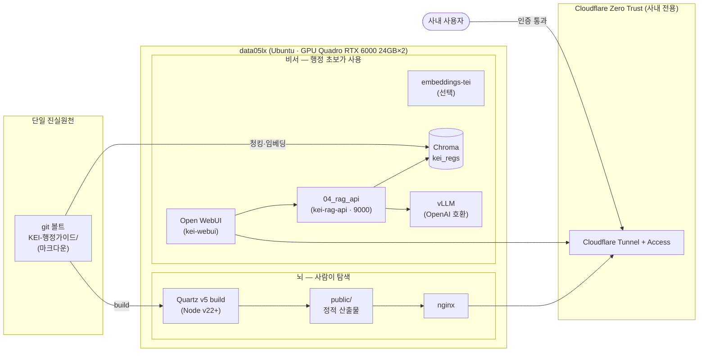
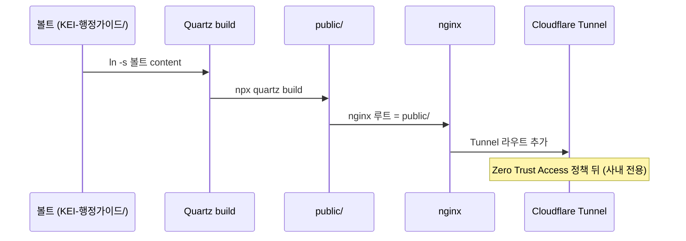
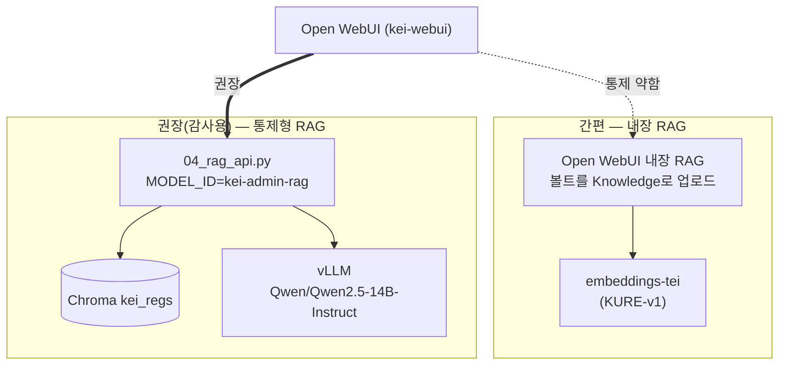
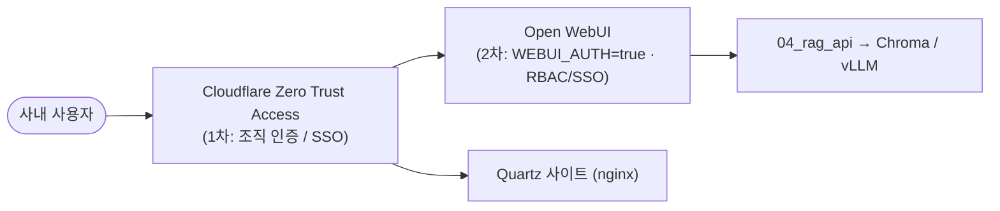

# 06 배포

> 하나의 볼트, 두 개의 화면을 운영 서버에 올린다. [뇌] Quartz 정적 사이트와 [비서] Open WebUI + vLLM을 같은 마크다운 볼트 위에서 서빙하고, 둘 다 Cloudflare Zero Trust 뒤에 둔다.
> 이 문서는 운영 배포의 토폴로지·포트·절차를 정리한다. 실제 소스는 [`../deploy/README.md`](../deploy/README.md), [`../deploy/docker-compose.yml`](../deploy/docker-compose.yml), [`../deploy/setup_ubuntu_hwp.sh`](../deploy/setup_ubuntu_hwp.sh)이다.

---

## 1. 배포 토폴로지

단일 진실원천(Source of Truth)인 git 볼트 `KEI-행정가이드/`가 두 갈래로 흐른다. [뇌]는 같은 마크다운을 정적 사이트로 빌드해 사람이 탐색하고, [비서]는 같은 마크다운을 임베딩 검색해 출처를 단 답변을 만든다. 두 화면 모두 사내 GPU(Quadro RTX 6000 24GB×2) 서버 `data05lx`(Ubuntu)에서 서빙되며, 인터넷에는 노출하지 않고 Cloudflare Zero Trust 뒤에만 둔다.



> [!note] 핵심
> 그래프([뇌])와 채팅([비서])은 **같은 마크다운을 먹는 두 화면**이다. 채팅은 그래프 그림이 아니라 텍스트 + 임베딩 검색([Chroma](05-rag-design.md) 컬렉션 `kei_regs`)으로 답한다. 토폴로지가 두 갈래로 갈라져도 입구는 항상 하나의 볼트다.

---

## 2. 포트 맵

| 서비스 | 컨테이너/프로세스 | 호스트:컨테이너 포트 | 비고 |
| --- | --- | --- | --- |
| Open WebUI | `kei-webui` (docker) | `3000:8080` | 채팅 UI. 사용자 진입점 |
| 04_rag_api | `kei-rag-api` (docker 또는 호스트 uvicorn) | `9000` | 통제형 RAG. OpenAI 호환 `/v1` |
| embeddings-tei | `kei-embeddings` (docker, **선택**) | `8080:80` | Open WebUI 내장 RAG를 쓸 때만 |
| vLLM | 기존 프로세스 (호스트) | `8000` | OpenAI 호환 `/v1`. 이미 구동 중 가정 |
| Quartz preview | `npx quartz build --serve` | `8080` | 로컬 미리보기 전용 |

> [!warning] 8080 포트 충돌 주의
> `embeddings-tei`(`8080:80`)와 Quartz 미리보기(`8080`)가 같은 호스트 포트를 쓴다. 둘을 동시에 띄울 일은 드물지만, 동시 운영 시 한쪽 포트를 바꿔야 한다. 운영의 Quartz는 미리보기가 아니라 `public/`을 nginx로 서빙하므로 8080을 점유하지 않는다.

---

## 3. [뇌] Quartz 배포 절차

[뇌] Quartz v5는 볼트를 노드/링크 그래프 + 전문검색이 가능한 정적 사이트로 만든다. 빌드 산출물 `public/`을 nginx로 서빙하고, 기존 Cloudflare Tunnel에 라우트를 추가한다.

```bash
# Node v22+ 필요 (CJK 검색·그래프·백링크 기본 지원)
git clone https://github.com/jackyzha0/quartz.git && cd quartz
npm i
npx quartz create                       # 콘텐츠 폴더 초기화

# 볼트를 content로 심볼릭 링크 → 옵시디언 편집이 사이트에 그대로 반영
ln -s /path/to/KEI-행정가이드 content

npx quartz build --serve                # 로컬 미리보기 :8080 (검수용)
npx quartz build                        # → public/ 정적 산출물 생성
```

산출된 `public/`을 nginx 루트로 지정하고, 기존 Cloudflare Tunnel에 이 사이트로 향하는 라우트를 추가한다.



> [!tip] 한글 파일/심볼릭 링크
> 한글 파일명을 쓰므로 git은 `core.quotepath false`가 적용되어 있어야 한다. `content`는 심볼릭 링크이므로 볼트를 그 자리에서 직접 편집해도 빌드에 반영된다.

> [!todo] 확인 필요: nginx 가상호스트/서버블록 설정과 Cloudflare Tunnel 라우트 정의(도메인/팀명)
> 정확한 도메인명·Cloudflare 팀명·nginx server_name은 본 브리프에 명시되지 않았다. 운영 환경에서 확정한다.

---

## 4. [비서] Open WebUI 배포

[비서]는 채팅 화면(Open WebUI)과 답변 정확성을 담당하는 통제형 RAG(`04_rag_api.py`), 그리고 기존 vLLM으로 구성된다. 기본 구동은 `docker compose`로 시작한다.

```bash
docker compose up -d        # open-webui + (선택)임베딩
```

### 4.1 docker-compose 서비스 구성

[`../deploy/docker-compose.yml`](../deploy/docker-compose.yml) 기준이다.

| 서비스 | 이미지 | 역할 | 상태 |
| --- | --- | --- | --- |
| `open-webui` (`kei-webui`) | `ghcr.io/open-webui/open-webui:main` | 채팅 UI · 멀티유저 · 권한 | 항상 사용 |
| `embeddings-tei` (`kei-embeddings`) | `ghcr.io/huggingface/text-embeddings-inference:latest` | 한국어 임베딩 서버(`--model-id nlpai-lab/KURE-v1`) | 선택 (내장 RAG 경로에서만) |
| `kei-rag-api` | `build: ../tools` | 통제형 RAG(제N조 청킹 + 출처 강제) | 주석 처리 — 우선 호스트 uvicorn 권장 |

```yaml
# 발췌 — deploy/docker-compose.yml (요지)
services:
  open-webui:
    image: ghcr.io/open-webui/open-webui:main
    container_name: kei-webui
    ports: ["3000:8080"]
    volumes: ["open-webui:/app/backend/data"]
    environment:
      - OPENAI_API_BASE_URL=http://kei-rag-api:9000/v1   # ⚠️ localhost 금지
      - OPENAI_API_KEY=EMPTY
      - WEBUI_AUTH=true            # 멀티유저/권한 켬
    extra_hosts: ["host.docker.internal:host-gateway"]
    restart: always
```

| 환경변수 | 값 | 의미 |
| --- | --- | --- |
| `OPENAI_API_BASE_URL` | `http://kei-rag-api:9000/v1` | 우리 RAG API를 '모델'로 연결. **컨테이너 외부 연결이면 실제 IP** (§4.4) |
| `OPENAI_API_KEY` | `EMPTY` | vLLM/우리 RAG는 키를 요구하지 않음 |
| `WEBUI_AUTH` | `true` | 멀티유저/권한(RBAC) 활성화 |

> [!note] embeddings-tei는 선택
> `embeddings-tei`(`8080:80`, `nlpai-lab/KURE-v1`)는 **Open WebUI 내장 RAG를 쓸 때만** 필요하다. 권장 경로인 `04_rag_api.py`로만 갈 거면 이 블록은 없어도 된다. GPU를 쓰려면 `deploy.resources.reservations.devices`로 nvidia를 할당한다.

### 4.2 모델 연결 두 갈래



- **간편(내장 RAG):** 볼트 마크다운을 'Knowledge'로 올리고 임베딩 엔진을 `nlpai-lab/KURE-v1`(대안 `BAAI/bge-m3`)로 지정한다. 청킹/출처 표기 통제가 약하다.
- **권장(감사용):** [`../tools/04_rag_api.py`](../tools/04_rag_api.py)를 OpenAI 호환 모델로 등록한다. 이 서버가 제N조 검색 + 근거 주입 + `[규정명 제N조]` 출처 강제를 담당하고, Open WebUI는 UI/멀티유저/권한만 담당한다. 설계 이유는 [05 RAG 설계](05-rag-design.md)와 [ADR 0003](adr/0003-controlled-rag-api.md) 참조.

> [!warning] vLLM 14B 서빙은 단일 카드에 안 올라간다
> `Qwen2.5-14B-Instruct` fp16(약 28GB)은 Quadro RTX 6000 단일 24GB를 초과한다. 2장 텐서병렬(`--tensor-parallel-size 2`)로 두 카드에 분산하거나, 더 작은 instruct(7B/3B)·양자화 서빙으로 단일 카드에 맞춘다. 임베딩(`KURE-v1`)은 1장으로 충분하다(실측).

> [!warning] 가드레일은 통제형 경로에 산다
> "근거에 없으면 '규정에서 확인되지 않습니다'", "[규정명 제N조] 출처 표기", "최종 판단은 원문과 담당 부서 확인 바랍니다." 같은 가드레일은 `04_rag_api.py`(권장 경로)가 강제한다. 내장 RAG 경로는 이 통제가 약하므로, 감사/정확성이 중요한 운영에서는 권장 경로를 쓴다.

### 4.3 04_rag_api: 컨테이너화 또는 호스트 uvicorn

`kei-rag-api` 블록은 compose에서 주석 처리되어 있다. 두 가지 방식이 가능하다.

**(A) 우선 권장 — 호스트에서 uvicorn으로 직접 실행**

```bash
# tools/.venv 활성화 후
uvicorn 04_rag_api:app --host 0.0.0.0 --port 9000
```

- `MODEL_ID=kei-admin-rag`로 `/v1/models`, `/v1/chat/completions`(비스트리밍) 제공.
- import 시 임베딩/Chroma/LLM 클라이언트를 로딩하고, `retrieve(query, k=5)`로 회수한 조를 응답의 `x_retrieved` 디버그 필드에 포함한다.

**(B) 컨테이너화 — compose 블록 주석 해제**

```yaml
# deploy/docker-compose.yml — 주석 해제 시
kei-rag-api:
  build: ../tools          # Dockerfile은 tools/ 기준으로 별도 작성
  container_name: kei-rag-api
  ports: ["9000:9000"]
  restart: always
```

> [!todo] 확인 필요: `tools/` 기준 Dockerfile 미작성
> 컨테이너화 경로(B)는 `tools/` 기준 Dockerfile이 필요하다(현재 미작성). vLLM/Chroma 경로 주입과 GPU 접근을 함께 설계해야 한다. 우선은 (A) 호스트 uvicorn으로 운영을 시작한다.

### 4.4 Open WebUI에 RAG 등록

Open WebUI > 설정 > 연결 > OpenAI API에 다음을 등록한다.

| 항목 | 값 |
| --- | --- |
| Base URL | `http://<서버 실제 IP>:9000/v1` |
| API Key | `EMPTY` |

> [!warning] ⚠️ 실제 IP 함정 (localhost / host.docker.internal 금지)
> Open WebUI는 컨테이너 안에서 돈다. 연결 URL에 `localhost`를 쓰면 **컨테이너 자기 자신**을 가리켜 RAG API에 닿지 못한다. compose 내부 서비스끼리는 서비스명(`kei-rag-api`)으로 통신하지만, **컨테이너 밖(호스트 uvicorn)의 RAG API에 붙을 때는 반드시 서버의 실제 IP를 써라.** `host.docker.internal`도 환경에 따라 동작이 갈리는 흔한 함정이므로 피하고 실제 IP로 명시한다. vLLM 기본 주소(`http://localhost:8000/v1`)도 컨테이너에서 호출할 때는 같은 원칙을 적용한다.

---

## 5. 보안 — Cloudflare Zero Trust + Open WebUI 이중 인증

KEI 내부 규정이다. **두 화면([뇌]/[비서]) 모두 인터넷 공개 금지.** 인증을 두 겹으로 둔다.



1. **1차 — Cloudflare Zero Trust Access:** 기존 Cloudflare Tunnel + Access 정책 뒤에 둔다. 조직 인증을 통과한 사용자만 두 화면에 접근한다.
2. **2차 — Open WebUI 자체 인증:** `WEBUI_AUTH=true`로 멀티유저/권한(RBAC, SSO)을 한 겹 더 건다.

모델·임베딩은 전부 온프레미스(GPU Quadro RTX 6000 24GB×2, `data05lx`)에서 구동되므로 데이터는 망 밖으로 나가지 않는다. 상세 보안·거버넌스 정책은 [07 보안·거버넌스](07-security-governance.md)와 [ADR 0005](adr/0005-on-prem-zero-trust.md)를 따른다.

> [!warning] 공개 금지 원칙
> 어떤 화면도 인터넷에 공개하지 않는다. 이 원칙을 약화시키는 설정(공개 도메인 직결, Access 정책 우회 등)은 운영에서 금지한다.

> [!todo] 확인 필요: Cloudflare 팀/도메인명, Access 정책 그룹
> 정확한 Cloudflare 팀명·도메인·접근 그룹은 본 브리프에 없다. [07 보안·거버넌스](07-security-governance.md)에서 확정한다.

---

## 6. 운영 반영 — 개정 → 재빌드

규정이 개정되면 볼트를 갱신하고 두 화면을 다시 만든다. 흐름은 동일하게 "볼트 → 재처리"다.

- **[뇌] Quartz:** 볼트 갱신 → `npx quartz build` → `public/` 교체 → nginx 반영.
- **[비서] RAG:** 볼트 갱신 → [`../tools/02_chunk_and_embed.py`](../tools/02_chunk_and_embed.py)로 제N조 청킹·재임베딩 → Chroma `kei_regs` upsert.

변환·생성물은 검수 전까지 프론트매터 `검수상태: 미검수`를 유지한다(원문층 의역 금지 원칙은 [03 콘텐츠 모델](03-content-model.md) 참조).

> [!note] 재빌드·재임베딩의 구체 절차와 운영 체크리스트는 [10 운영](10-operations.md)에 있다.
> 본 문서는 "어떻게 배포하는가"를, 10-operations.md는 "개정을 어떻게 반영·운영하는가"를 다룬다.

---

## 7. 배포 체크리스트

| # | 항목 | 참조 |
| --- | --- | --- |
| 1 | HWP/HWPX 변환 툴체인 설치 | [`../deploy/setup_ubuntu_hwp.sh`](../deploy/setup_ubuntu_hwp.sh) · [04 파이프라인](04-pipeline.md) |
| 2 | 볼트 청킹·임베딩 → Chroma `kei_regs` 생성 | [`../tools/02_chunk_and_embed.py`](../tools/02_chunk_and_embed.py) |
| 3 | vLLM 구동 확인 (`:8000/v1`) | [05 RAG 설계](05-rag-design.md) |
| 4 | `04_rag_api` 호스트 uvicorn 실행 (`:9000`) | [`../tools/04_rag_api.py`](../tools/04_rag_api.py) |
| 5 | `docker compose up -d` (Open WebUI) | [`../deploy/docker-compose.yml`](../deploy/docker-compose.yml) |
| 6 | Open WebUI 연결 등록 (실제 IP, key=EMPTY) | §4.4 |
| 7 | Quartz build → `public/` → nginx | §3 |
| 8 | Cloudflare Tunnel 라우트 + Access 정책 + `WEBUI_AUTH` | [07 보안·거버넌스](07-security-governance.md) |

---

## 관련 문서

- 인덱스: [docs/README.md](README.md)
- 이전: [05 RAG 설계](05-rag-design.md)
- 다음: [07 보안·거버넌스](07-security-governance.md)

관련: [02 아키텍처](02-architecture.md) · [04 파이프라인](04-pipeline.md) · [10 운영](10-operations.md) · [ADR 0003 통제형 RAG API](adr/0003-controlled-rag-api.md) · [ADR 0004 Quartz 그래프 사이트](adr/0004-quartz-graph-site.md) · [ADR 0005 온프레미스 Zero Trust](adr/0005-on-prem-zero-trust.md)
루트: [../README.md](../README.md) · [../CLAUDE.md](../CLAUDE.md) · [../WORKPLAN.md](../WORKPLAN.md)

최종 수정: 2026-06-19
