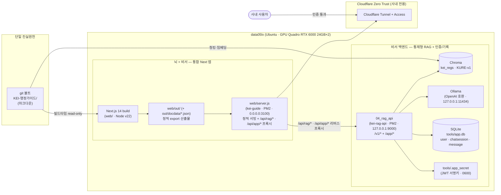
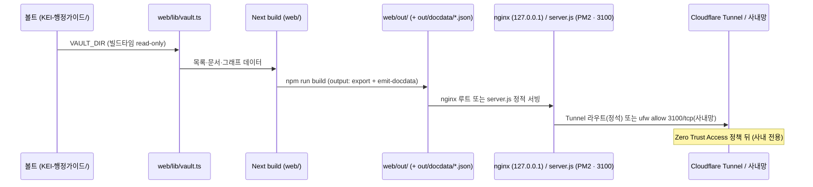
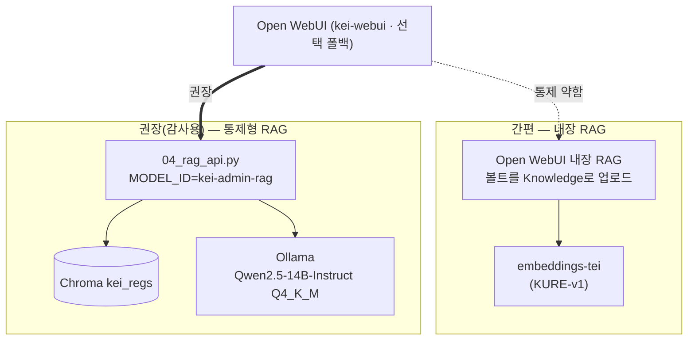
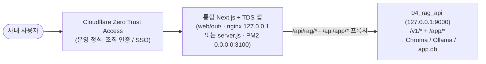

# 06 배포

> 하나의 볼트, 두 개의 화면을 운영 서버에 올린다. [뇌] Next.js + TDS 정적 사이트와 [비서] 통합 채팅(같은 Next 앱)을 같은 마크다운 볼트 위에서 서빙하고, 둘 다 Cloudflare Zero Trust 뒤에 둔다. 답변 LLM은 현재 Ollama(OpenAI 호환)로 구동한다. 비서에는 로그인/회원가입, 채팅기록 영속화, 멀티턴 기억, 메시지별 근거 저장이 추가되어 SQLite DB(`tools/app.db`)와 JWT 서명키(`tools/.app_secret`)를 운영 자산으로 함께 관리한다.
> 이 문서는 운영 배포의 토폴로지·포트·절차를 정리한다. 실제 소스는 [`../deploy/README.md`](../deploy/README.md), [`../deploy/docker-compose.yml`](../deploy/docker-compose.yml), [`../deploy/setup_ubuntu_hwp.sh`](../deploy/setup_ubuntu_hwp.sh)이다.

---

## 1. 배포 토폴로지

단일 진실원천(Source of Truth)인 git 볼트 `KEI-행정가이드/`가 두 갈래로 흐른다. [뇌]는 같은 마크다운을 정적 사이트로 빌드해 사람이 탐색하고, [비서]는 같은 마크다운을 임베딩 검색해 출처를 단 답변을 만든다. 비서(채팅)는 별도 Open WebUI가 아니라 같은 Next.js 14 + TDS 앱에 통합된 커스텀 채팅 UI로, 같은 오리진에서 우리 RAG API를 호출한다. 두 화면 모두 사내 GPU(Quadro RTX 6000 24GB×2) 서버 `data05lx`(Ubuntu)에서 서빙되며, 인터넷에는 노출하지 않고 Cloudflare Zero Trust 뒤에만 둔다.



> [!note] 핵심
> 그래프([뇌])와 채팅([비서])은 **같은 마크다운을 먹는 두 화면**이며, 이제 같은 Next 앱 안에 함께 산다. 채팅은 그래프 그림이 아니라 텍스트 + 임베딩 검색([Chroma](05-rag-design.md) 컬렉션 `kei_regs`)으로 답한다. 토폴로지가 두 갈래로 갈라져도 입구는 항상 하나의 볼트다. 답변 생성 LLM은 현재 Ollama이며, 채팅 UI는 같은 오리진 `/api/rag/*`(무상태)와 `/api/app/*`(로그인·채팅기록·멀티턴)를 통해 RAG API에 닿는다. `kei-rag-api` 한 프로세스가 `/v1/*`(OpenAI 호환)과 `/app/*`(인증·채팅)을 함께 제공하며, 사용자·대화·메시지별 근거는 SQLite `tools/app.db`에 영속된다.

---

## 2. 포트 맵

| 서비스 | 컨테이너/프로세스 | 바인드 주소:포트 | 비고 |
| --- | --- | --- | --- |
| kei-guide ([뇌]+[비서]) | `web/server.js` (PM2) | `0.0.0.0:3100` | 정적 `out/` 서빙 + `/api/rag/*`·`/api/app/*` → `127.0.0.1:9000` 리버스 프록시(쿠키 전달). 사용자 진입점 |
| kei-rag-api | `04_rag_api` (PM2 · uvicorn) | `127.0.0.1:9000` | 통제형 RAG. OpenAI 호환 `/v1` + 인증·채팅 `/app`. **로컬 전용(LAN 비노출)**. 기동 시 워밍업(임베딩 로드 + LLM `keep_alive=-1` 상주) + 주기 keep-alive(`OLLAMA_PING_SECONDS`)로 첫 질문 콜드스타트 제거 |
| Ollama | 기존 프로세스 (호스트) | `127.0.0.1:11434` | OpenAI 호환 `/v1`. 답변 LLM. 이미 구동 중 가정 |
| Open WebUI | `kei-webui` (docker, **선택**) | `3000:8080` | 같은 RAG API를 쓰는 관리자 폴백(§4) |
| embeddings-tei | `kei-embeddings` (docker, **선택**) | `8080:80` | Open WebUI 내장 RAG를 쓸 때만 |
| vLLM | 기존 프로세스 (호스트, **대안**) | `8000` | OpenAI 호환 `/v1`. Ollama 대안 서빙 |
| Next dev ([뇌]) | `cd web && npm run dev` | `127.0.0.1:3100` | 로컬 미리보기 전용 |

> [!note] [뇌]+[비서] 운영은 정적 export + PM2 정적 서버
> Next dev(`3100`)는 검수용 미리보기 전용이다. 운영은 dev 서버가 아니라 `npm run build`의 `web/out/`을 서빙한다. 운영 정석은 nginx(`127.0.0.1`) + Cloudflare Zero Trust이며, 사내망 직접 서빙은 의존성 0의 Node 정적 서버 `web/server.js`(PM2 프로세스 `kei-guide`, `0.0.0.0:3100`)로도 가능하다. 둘 다 서버 런타임이 필요 없는 정적 산출물을 서빙한다. RAG API(`9000`)는 같은 서버의 프록시 뒤에 두고 LAN에 직접 열지 않는다.

---

## 3. [뇌] Next.js + TDS 배포

[뇌] 화면(사람이 탐색하는 목록·문서·관계 그래프)과 [비서] 채팅은 모두 **Next.js 14 + Toss Design System(TDS)** 한 앱으로 만든다. 코드는 레포의 [`../web/`](../web/) 디렉터리에 있다. Next.js 정적 export로 빌드해 `web/out/`을 nginx(`127.0.0.1`)로 서빙하거나 `web/server.js`(PM2)로 사내망에 직접 서빙하고, 기존 [비서]와 같은 Cloudflare Zero Trust 뒤에 둔다 — 서버 런타임이 필요 없다.

> [!note] Quartz는 superseded
> 이전 방식([Quartz](adr/0004-quartz-graph-site.md))은 [뇌]의 목록·문서·관계 그래프를 Next.js + TDS가 대체하면서 superseded되었다. 아래는 현재 방식(Next.js + TDS)이다. 기존 Quartz가 차지하던 nginx/Zero Trust 자리를 그대로 대체한다.

### 3.1 구성 요약

- **서빙:** Next.js 정적 export([`../web/next.config.mjs`](../web/next.config.mjs)의 `output: "export"`) → `web/out/` → nginx `127.0.0.1` → Cloudflare Zero Trust(사내 전용, 운영 정석) 또는 `web/server.js`(PM2 · 사내망 직접 서빙/nginx 백엔드). 서버 런타임 불필요.
- **비서 통합:** 채팅 화면이 별도 Open WebUI가 아니라 같은 Next 앱의 커스텀 UI다. 클라이언트가 같은 오리진 `/api/rag/chat`(무상태) 또는 `/api/app/*`(로그인·채팅기록·멀티턴)를 fetch하면 `web/server.js`가 `127.0.0.1:9000`(RAG API)으로 리버스 프록시한다. `/api/app/*` 프록시는 요청 쿠키와 응답 `set-cookie`를 그대로 전달하고 쿼리스트링을 보존하므로, httpOnly JWT 쿠키 기반 로그인 세션이 같은 오리진에서 유지된다. 같은 오리진이라 CORS가 불필요하고 RAG API가 LAN에 직접 노출되지 않는다. 정적 export에서도 클라이언트 fetch로 동작한다. 답변은 `?stream=1`일 때 **SSE로 토큰 스트리밍**되며(`meta`→`delta`→`done`), `web/server.js`는 hop-by-hop 헤더(`transfer-encoding`·`content-length`·`connection`)를 제거한 뒤 파이프해 버퍼링 없이 흘려보낸다.
- **인증 게이트(클라이언트):** `Assistant.tsx`가 `/api/app/auth/me`로 세션을 확인해 미인증이면 `Login.tsx`(로그인/회원가입), 인증되면 `ChatApp.tsx`(좌측 대화목록 사이드바 · 중앙 멀티턴 채팅 · 우측 메시지별 근거 패널 · 문서 드로어)를 렌더한다. 정적 export를 유지한 채 게이트는 클라이언트 렌더로 동작한다. 프론트는 plain fetch + React hooks(React Query 미도입, 번들 경량)이며 타입 클라이언트는 `web/lib/api.ts`에 있다. 지난 답변을 클릭하면 그때 저장된 근거를 우측에 다시 표시한다.
- **라우터:** Pages Router. TDS(=emotion 기반)와 정적 사이트 생성(SSG) 호환이 매끄럽다. React 18 고정(TDS peer · Next 14).
- **TDS:** `@toss/tds-mobile` v2.5.0 + `TDSMobileAITProvider`(`@toss/tds-mobile-ait`). TDS 팔레트를 KEI 시맨틱 토큰([`../web/styles/globals.css`](../web/styles/globals.css)의 CSS 변수)으로 매핑한다 — KEI 메인 컬러는 나중에 그 한 블록만 교체한다. `ThemeProvider`(seed token)로 TDS 컴포넌트 색도 재정의할 수 있다.
- **스타일:** CSS 변수 토큰 + CSS Modules(SSG 안전). 콘텐츠 렌더는 `react-markdown` + `remark-gfm`.
- **볼트 소비:** [`../web/lib/vault.ts`](../web/lib/vault.ts)가 볼트(`KEI-행정가이드/`, git 비추적·Syncthing 동기화)를 **빌드타임 read-only**로 읽는다. `VAULT_DIR` 환경변수로 볼트 경로를 지정하며 기본값은 레포 루트다. 빌드 시 `web/scripts/emit-docdata.mts`가 `lib/vault.ts`를 그대로 재사용(`node --experimental-strip-types`)해 문서별 JSON(`out/docdata/<slug>.json`)을 생성하므로, 전체화면 페이지와 문서 드로어가 동일한 본문·링크를 보장한다. `web/node_modules`·`.next`·`out`(및 `out/docdata/*.json`, 규정 본문 포함 → 커밋 금지)은 `.gitignore`.

### 3.2 빌드·미리보기·서빙

```bash
cd web                                  # 레포의 web/ 디렉터리
# Node v22 (PATH에 node22) · VAULT_DIR로 볼트 지정 (기본은 레포 루트)
VAULT_DIR=<볼트경로> npm run dev         # 로컬 미리보기 → http://127.0.0.1:3100 (검수용)
VAULT_DIR=<볼트경로> npm run build       # → web/out/ (정적 export) + out/docdata/*.json (emit-docdata)
```

산출된 `web/out/`을 nginx 루트로 지정하고 기존 Cloudflare Tunnel에 라우트를 추가하거나(운영 정석), `web/server.js`(PM2)로 사내망에 직접 서빙한다. PM2 서빙은 §4에 정리한다.



### 3.3 화면 구성

단일 앱·단일 볼트 안에서 섹션(규정집 / 연구행정 가이드 / 용어집)을 분리한다. 가이드는 볼트의 `10_업무가이드/`에 문서를 추가하면 자동으로 합류한다. 라우트는 다음과 같다.

- **`/` 비서(Assistant):** 로그인 게이트 뒤의 멀티턴 RAG 채팅. 좌측 대화목록 사이드바(새 대화/선택/삭제) · 중앙 채팅 · 우측 '메시지별' 근거 패널(`x_sources` 카드)로 구성된다. 근거 카드를 클릭하면 Notion형 문서 드로어가 해당 조(`제N조` 앵커)로 펼쳐지고, 지난 답변을 클릭하면 그때 저장된 근거가 우측에 다시 뜬다. 미인증이면 로그인/회원가입 화면을 보여준다. 무상태 호출은 같은 오리진 `/api/rag/chat`, 로그인·기록·멀티턴은 `/api/app/*`를 클라이언트 fetch로 호출(정적 export에서 동작). 비스트리밍 v1.
- **`/browse` 둘러보기(Explorer):** 좌측 체크박스 필터(구분=규정집/가이드/용어집, 분류=category, 검수상태) + 검색 + 결과 목록. 행 클릭 시 페이지 이동 없이 우측 Notion형 드로어로 본문이 열린다. 패싯 카운트(다른 필터 반영)를 제공한다.
- **`/graph` 관계 그래프:** `react-force-graph-2d`(노드 클릭 → 문서 이동, 코드 스플릿).
- **`/d/[slug]` 전체화면 문서:** 드로어의 '전체화면' 폴백(기존 SSG 페이지 유지). 메타 칩 · 본문 · 백링크 · `제N조` 앵커로 조 단위 점프. 위키링크 `[[ ]]`(규정 상호참조)는 내부 라우트로 연결되고, 이름 변이(공백·가운뎃점 `·`·`.`·`및`)도 정규화로 자동 흡수한다.
- **DocDrawer:** 우측 슬라이드인. `out/docdata/<slug>.json`(빌드 산출물)을 지연 로드한다. `emit-docdata.mts`가 `lib/vault.ts`를 재사용해 생성하므로 드로어와 전체화면 페이지가 동일 본문/링크를 보장한다.

> [!note] 실측(2026-06-19)
> `npm run build` 성공, 정적 115페이지(목록·관계 그래프 + 문서 111). 한글 mojibake 0, 위키링크 내부 네비 + `제N조` 앵커 동작, 그래프 111 노드·82 연결, TDS 컬러 적용. `/`의 first-load JS는 약 433KB(TDS + react-markdown)로, 번들 경량화는 기존 로드맵 항목이다. 디자인 원칙·토큰·컴포넌트 규약은 [design-system.md](design-system.md) 참조.

> [!tip] 한글 파일
> 한글 파일명을 쓰므로 git은 `core.quotepath false`가 적용되어 있어야 한다. 볼트는 `VAULT_DIR`로 빌드타임에 read-only로 읽으므로 빌드가 볼트를 수정하지 않는다.

> [!todo] 확인 필요: nginx 가상호스트/서버블록 설정과 Cloudflare Tunnel 라우트 정의(도메인/팀명)
> 정확한 도메인명·Cloudflare 팀명·nginx server_name은 본 브리프에 명시되지 않았다. 운영 환경에서 확정한다.

---

## 4. [비서] RAG 서빙 — PM2 + Ollama

[비서]는 채팅 화면(통합 Next 앱)과 답변 정확성을 담당하는 통제형 RAG(`04_rag_api.py`), 그리고 답변 LLM(현재 Ollama)으로 구성된다. 채팅 UI는 같은 Next 앱에 통합되어 있고(§3), 백엔드 두 프로세스(`kei-guide` 정적 서버, `kei-rag-api`)는 **PM2**가 관리한다. `kei-rag-api` 한 프로세스가 OpenAI 호환 `/v1/*`과 인증·채팅 `/app/*`을 함께 제공한다. Open WebUI는 기본 채택하지 않고, 같은 RAG API를 쓰는 선택적 관리자 폴백으로만 둔다(§4.5).

백엔드는 한 프로세스 안에서 역할별로 세 모듈로 나뉜다.

| 모듈 | 역할 |
| --- | --- |
| [`../tools/rag_core.py`](../tools/rag_core.py) | 검색·생성 공용 코어. `backend()`로 임베딩/Chroma/LLM을 1회 로드, `retrieve(query)`→(근거 컨텍스트, 구조화 출처), `answer(question, context, history)`→문자열 |
| [`../tools/app_api.py`](../tools/app_api.py) | SQLModel 모델 + bcrypt/PyJWT 인증 + 채팅 라우터(`prefix=/app`). `init_db()` |
| [`../tools/04_rag_api.py`](../tools/04_rag_api.py) | 진입점. OpenAI 호환 `/v1/chat/completions`·`/v1/models`·`/health` + `app_api` 라우터(`/app/*`) include + `init_db()` |

인증·영속 스택은 조사로 확정했다: bcrypt(직접 사용) + PyJWT(HS256, httpOnly 쿠키) + SQLModel + SQLite. passlib(bcrypt 5 호환 이슈)·fastapi-users(2026 유지보수 모드·과함)는 쓰지 않는다. [`../tools/requirements.txt`](../tools/requirements.txt)에 `sqlmodel>=0.0.22`·`pyjwt>=2.9.0`를 추가했고 `bcrypt>=4.0`은 이미 설치되어 있다.

> [!note] 멀티턴과 가드레일
> 멀티턴은 세션의 이전 메시지를 LLM에 재생(replay)해 맥락을 잇되, **사실 근거는 매 턴 새로 검색한 `[근거]`에서만** 가져와 가드레일을 유지한다. OpenAI 호환 `/v1` 엔드포인트도 마지막 user 메시지로 검색하고 그 앞 메시지를 맥락으로 전달한다.

> [!note] DB·비밀키 자산
> SQLite `tools/app.db`(테이블: `user`·`chatsession`·`message`, 답변별 근거는 `message.sources_json` JSON 컬럼)와 JWT 서명키 `tools/.app_secret`(퍼미션 `0600`, 없으면 자동 생성). 둘 다 `.gitignore`로 커밋 금지다 — `app.db`는 사용자·채팅·근거 스니펫을 담고 `.app_secret`은 서명키다. `.app_secret`이 디스크에 남으므로 재시작에도 로그인 세션이 유지된다.

### 4.1 PM2 서빙

[`../tools/ecosystem.config.js`](../tools/ecosystem.config.js)에 두 프로세스를 정의한다.

| PM2 프로세스 | 실행 | 바인드 | 역할 |
| --- | --- | --- | --- |
| `kei-guide` | `web/server.js` (의존성 0 Node 정적 서버) | `0.0.0.0:3100` | `web/out/` 서빙 + `trailingSlash` 라우팅 + `/api/rag/*`·`/api/app/*` → `127.0.0.1:9000` 리버스 프록시(쿠키·`set-cookie` 전달) |
| `kei-rag-api` | `uvicorn` (`tools/04_rag_api.py`) | `127.0.0.1:9000` | 통제형 RAG(`/v1/*`) + 인증·채팅(`/app/*`). env로 Ollama 연결. SQLite `tools/app.db` + JWT 키 `tools/.app_secret` 사용. **LAN 비노출** |

```bash
# tools/ 디렉터리 기준
pm2 start ecosystem.config.js     # kei-guide + kei-rag-api 기동
pm2 save                          # 현재 프로세스 목록 저장 (완료)
pm2 startup                       # 부팅 자동시작(systemd) — 별도 1회 필요(미설정 가능)
```

> [!note] 같은 오리진 프록시
> 채팅 UI가 같은 오리진 `/api/rag/*`·`/api/app/*`만 호출하므로 CORS가 불필요하고, RAG API(`9000`)는 `127.0.0.1`에만 바인드되어 LAN에 직접 노출되지 않는다. `/api/app/*` 프록시는 요청 쿠키와 응답 `set-cookie`를 전달하고 쿼리를 보존하므로 로그인 세션이 같은 오리진에서 유지된다. `kei-guide`가 유일한 외부 진입점이다.

> [!note] pm2 restart에도 사용자/기록 유지
> `tools/app.db`와 `tools/.app_secret`은 디스크에 영속되므로 `pm2 restart kei-rag-api` 후에도 사용자 계정·채팅기록·로그인 세션이 유지된다. 부팅 자동시작은 여전히 `pm2 startup`(systemd) 1회 별도 설정이 필요하다.

### 4.1.1 비서 인증·채팅 API (`/app`)

`app_api.py`가 `prefix=/app`로 등록하며, 프론트는 `web/server.js`가 `/api/app/*` → `/app/*`로 프록시한다(쿠키 전달).

| 메서드 · 경로 | 역할 |
| --- | --- |
| `POST /app/auth/register` · `POST /app/auth/login` · `POST /app/auth/logout` · `GET /app/auth/me` | 회원가입 · 로그인(httpOnly JWT 쿠키 발급) · 로그아웃 · 세션 확인 |
| `GET /app/chats` · `POST /app/chats` | 대화 목록 · 새 대화 생성 |
| `GET /app/chats/{id}` · `PATCH /app/chats/{id}` · `DELETE /app/chats/{id}` | 메시지 포함 조회 · 제목 변경 · 삭제 |
| `POST /app/chats/{id}/messages` | 검색 + 멀티턴 생성 → user/assistant 메시지 저장(assistant에 근거 동봉) → 반환. 첫 질문으로 대화 제목 자동 설정 |

> [!warning] 쿠키 secure 주의 (내부망 HTTP ↔ ZT/HTTPS)
> 인증 쿠키는 `httponly` + `samesite=lax` + `secure=False`(내부망 HTTP 직접 서빙 기준)로 발급한다. **Cloudflare Zero Trust/HTTPS를 도입하면 `secure=True`로 전환**해야 쿠키가 HTTPS에서만 전송된다. ZT 식별자(`Cf-Access-Authenticated-User-Email`)로 로그인을 대체하는 것은 향후 옵션이며, LAN 직접접속 dev에서는 비밀번호 로그인을 유지한다.

### 4.2 방화벽 (ufw)

서버 ufw는 active다. 사내망에서 [비서]에 접근하려면 `3100`만 연다. RAG API(`9000`)는 열지 않는다(프록시 뒤).

```bash
sudo ufw allow 3100/tcp                     # 사내망 전체에 3100 허용
# 또는 대역 한정
sudo ufw allow from 192.168.1.0/24 to any port 3100 proto tcp
```

> [!note] 운영 정석은 그대로 nginx + Zero Trust
> PM2 + `server.js`(`0.0.0.0:3100`)는 사내망 직접 서빙(또는 nginx 백엔드) 경로다. 인터넷 비공개 원칙상 운영 정석은 여전히 nginx(`127.0.0.1`) + Cloudflare Zero Trust이며(§3·§5), PM2 직접 서빙은 사내망 한정으로 ufw로 막아 둔다.

### 4.3 Ollama 답변 LLM

답변 생성 LLM은 현재 **Ollama**(OpenAI 호환, `127.0.0.1:11434/v1`)로 구동한다. `04_rag_api.py`가 검색 근거를 주입한 뒤 Ollama로 답변을 생성하고 `[규정명 제N조]` 출처를 강제한다.

| 항목 | 값 |
| --- | --- |
| 답변 모델 | `Qwen2.5-14B-Instruct` Q4_K_M GGUF (`hf.co/bartowski/Qwen2.5-14B-Instruct-GGUF:Q4_K_M`, ~9GB) · 한국어 검증 완료 |
| 임베딩(검색) | `nlpai-lab/KURE-v1` + Chroma `kei_regs` (변경 없음) |
| GPU | GPU1에 Ollama(~18GB), GPU0 완전히 비어 있음(전용 인스턴스 여지) |

> [!warning] 공유 GPU 운영 주의
> Ollama는 다른 사용자와 GPU를 공유한다(현재 GPU1, GPU0 여유). 점유·VRAM 변동을 운영에서 모니터링한다.

### (선택) Open WebUI 폴백 — docker compose

Open WebUI는 브랜딩 보호 라이선스 이슈로 기본 채택하지 않으며, 같은 RAG API를 쓰는 **선택적 관리자 폴백**으로만 둔다. 필요 시 `docker compose`로 띄운다.

```bash
docker compose up -d        # open-webui + (선택)임베딩
```

#### docker-compose 서비스 구성

[`../deploy/docker-compose.yml`](../deploy/docker-compose.yml) 기준이다(Open WebUI 폴백을 쓸 때만).

| 서비스 | 이미지 | 역할 | 상태 |
| --- | --- | --- | --- |
| `open-webui` (`kei-webui`) | `ghcr.io/open-webui/open-webui:main` | 채팅 UI · 멀티유저 · 권한 | 선택 (관리자 폴백) |
| `embeddings-tei` (`kei-embeddings`) | `ghcr.io/huggingface/text-embeddings-inference:latest` | 한국어 임베딩 서버(`--model-id nlpai-lab/KURE-v1`) | 선택 (내장 RAG 경로에서만) |
| `kei-rag-api` | `build: ../tools` | 통제형 RAG(제N조 청킹 + 출처 강제) | 주석 처리 — 운영은 PM2 uvicorn 사용 |

```yaml
# 발췌 — deploy/docker-compose.yml (요지)
services:
  open-webui:
    image: ghcr.io/open-webui/open-webui:main
    container_name: kei-webui
    ports: ["3000:8080"]
    volumes: ["open-webui:/app/backend/data"]
    environment:
      - OPENAI_API_BASE_URL=http://kei-rag-api:9000/v1   # ⚠️ localhost 금지
      - OPENAI_API_KEY=EMPTY
      - WEBUI_AUTH=true            # 멀티유저/권한 켬
    extra_hosts: ["host.docker.internal:host-gateway"]
    restart: always
```

| 환경변수 | 값 | 의미 |
| --- | --- | --- |
| `OPENAI_API_BASE_URL` | `http://kei-rag-api:9000/v1` | 우리 RAG API를 '모델'로 연결. **컨테이너 외부 연결이면 실제 IP** (§4.4) |
| `OPENAI_API_KEY` | `EMPTY` | Ollama/우리 RAG는 키를 요구하지 않음 |
| `WEBUI_AUTH` | `true` | 멀티유저/권한(RBAC) 활성화 |

> [!note] embeddings-tei는 선택
> `embeddings-tei`(`8080:80`, `nlpai-lab/KURE-v1`)는 **Open WebUI 내장 RAG를 쓸 때만** 필요하다. 권장 경로인 `04_rag_api.py`로만 갈 거면 이 블록은 없어도 된다. GPU를 쓰려면 `deploy.resources.reservations.devices`로 nvidia를 할당한다.

#### (폴백) 모델 연결 두 갈래

Open WebUI 폴백을 쓸 경우의 두 경로다.



- **간편(내장 RAG):** 볼트 마크다운을 'Knowledge'로 올리고 임베딩 엔진을 `nlpai-lab/KURE-v1`(대안 `BAAI/bge-m3`)로 지정한다. 청킹/출처 표기 통제가 약하다.
- **권장(감사용):** [`../tools/04_rag_api.py`](../tools/04_rag_api.py)를 OpenAI 호환 모델로 등록한다. 이 서버가 제N조 검색 + 근거 주입 + `[규정명 제N조]` 출처 강제를 담당하고, Open WebUI는 UI/멀티유저/권한만 담당한다. 설계 이유는 [05 RAG 설계](05-rag-design.md)와 [ADR 0003](adr/0003-controlled-rag-api.md) 참조.

> [!warning] 14B fp16는 단일 카드에 안 올라간다 → 현재는 Ollama Q4
> `Qwen2.5-14B-Instruct` fp16(약 28GB)은 Quadro RTX 6000 단일 24GB를 초과한다. 그래서 현재는 Ollama로 Q4_K_M 양자화 GGUF(~9GB)를 단일 카드(GPU1, ~18GB)에 올려 구동한다. 대안으로 vLLM 2장 텐서병렬(`--tensor-parallel-size 2`)로 두 카드에 fp16를 분산하거나, 더 작은 instruct(7B/3B) 서빙도 가능하다. 임베딩(`KURE-v1`)은 1장으로 충분하다(실측).

> [!warning] 가드레일은 통제형 경로에 산다
> "근거에 없으면 '규정에서 확인되지 않습니다'", "[규정명 제N조] 출처 표기", "최종 판단은 원문과 담당 부서 확인 바랍니다." 같은 가드레일은 `04_rag_api.py`(권장 경로)가 강제한다. 내장 RAG 경로는 이 통제가 약하므로, 감사/정확성이 중요한 운영에서는 권장 경로를 쓴다.

### 4.4 04_rag_api: PM2 uvicorn 또는 컨테이너화

`kei-rag-api` 블록은 compose에서 주석 처리되어 있다. 운영은 (A) PM2 uvicorn을 쓴다.

**(A) 운영 권장 — PM2가 관리하는 uvicorn (`127.0.0.1:9000`)**

```bash
# tools/.venv 활성화 후 — ecosystem.config.js로 PM2 기동(§4.1)
uvicorn 04_rag_api:app --host 127.0.0.1 --port 9000
```

- `MODEL_ID=kei-admin-rag`로 `/v1/models`, `/v1/chat/completions`(비스트리밍)을 제공하고, `app_api` 라우터(`/app/*`, §4.1.1)를 include하며 기동 시 `init_db()`로 SQLite(`tools/app.db`)를 준비한다. `127.0.0.1`에만 바인드해 `kei-guide` 프록시 뒤에 둔다.
- import 시 `rag_core.backend()`가 임베딩(KURE-v1)/Chroma/LLM(Ollama) 클라이언트를 1회 로딩하고, `retrieve(query)`로 회수한 조를 응답에 포함한다. 응답에는 구조화 출처 `x_sources`(규정명/조/분류/snippet/distance)와 하위호환용 태그 문자열 `x_retrieved`가 함께 실린다 — 프런트의 '근거 조문' 패널이 `x_sources`를 카드로 렌더한다. `/app/chats/{id}/messages`는 같은 검색·생성 코어를 쓰되 근거를 `message.sources_json`에 함께 저장해 메시지별로 다시 보여준다.

**(B) 컨테이너화 — compose 블록 주석 해제**

```yaml
# deploy/docker-compose.yml — 주석 해제 시
kei-rag-api:
  build: ../tools          # Dockerfile은 tools/ 기준으로 별도 작성
  container_name: kei-rag-api
  ports: ["9000:9000"]
  restart: always
```

> [!todo] 확인 필요: `tools/` 기준 Dockerfile 미작성
> 컨테이너화 경로(B)는 `tools/` 기준 Dockerfile이 필요하다(현재 미작성). Ollama/Chroma 경로 주입과 GPU 접근을 함께 설계해야 한다. 운영은 (A) PM2 uvicorn으로 시작한다.

### 4.5 (폴백) Open WebUI에 RAG 등록

Open WebUI 폴백을 쓸 때만 해당한다. Open WebUI > 설정 > 연결 > OpenAI API에 다음을 등록한다.

| 항목 | 값 |
| --- | --- |
| Base URL | `http://<서버 실제 IP>:9000/v1` |
| API Key | `EMPTY` |

> [!warning] ⚠️ 실제 IP 함정 (localhost / host.docker.internal 금지)
> Open WebUI는 컨테이너 안에서 돈다. 연결 URL에 `localhost`를 쓰면 **컨테이너 자기 자신**을 가리켜 RAG API에 닿지 못한다. compose 내부 서비스끼리는 서비스명(`kei-rag-api`)으로 통신하지만, **컨테이너 밖(호스트 uvicorn)의 RAG API에 붙을 때는 반드시 서버의 실제 IP를 써라.** `host.docker.internal`도 환경에 따라 동작이 갈리는 흔한 함정이므로 피하고 실제 IP로 명시한다. (참고: 운영의 통합 Next 앱은 같은 오리진 프록시로 `127.0.0.1:9000`에 붙으므로 이 함정이 없다.)

---

## 5. 보안 — Cloudflare Zero Trust + 사내망 차단

KEI 내부 규정이다. **두 화면([뇌]/[비서]) 모두 인터넷 공개 금지.** 통합 Next 앱이 유일한 외부 진입점이고, RAG API(`9000`)는 `127.0.0.1`에만 바인드되어 프록시 뒤에 숨는다.



1. **운영 정석 — Cloudflare Zero Trust Access:** 기존 Cloudflare Tunnel + Access 정책 뒤에 둔다. 조직 인증을 통과한 사용자만 두 화면에 접근한다.
2. **사내망 직접 서빙:** PM2 `server.js`(`0.0.0.0:3100`)로 서빙할 때는 ufw로 `3100`만(또는 대역 한정) 사내망에 열고, RAG API(`9000`)는 열지 않는다(§4.2). 인터넷 노출은 어느 경로에서도 금지.
3. **선택 폴백 — Open WebUI 자체 인증:** Open WebUI 폴백을 쓸 경우 `WEBUI_AUTH=true`로 멀티유저/권한(RBAC, SSO)을 한 겹 더 건다.

모델·임베딩은 전부 온프레미스(GPU Quadro RTX 6000 24GB×2, `data05lx`)에서 구동되므로 데이터는 망 밖으로 나가지 않는다. 상세 보안·거버넌스 정책은 [07 보안·거버넌스](07-security-governance.md)와 [ADR 0005](adr/0005-on-prem-zero-trust.md)를 따른다.

> [!warning] 공개 금지 원칙
> 어떤 화면도 인터넷에 공개하지 않는다. 이 원칙을 약화시키는 설정(공개 도메인 직결, Access 정책 우회, RAG API의 LAN 직노출 등)은 운영에서 금지한다. `web/out/`·`out/docdata/*.json`은 규정 본문을 포함하므로 커밋 금지(gitignore). 비서 DB `tools/app.db`(사용자·채팅·근거 스니펫)와 JWT 키 `tools/.app_secret`도 커밋 금지(gitignore). 볼트/HWP/rule_files 커밋 금지 원칙도 불변. Cloudflare ZT/HTTPS를 도입하면 인증 쿠키를 `secure=True`로 전환한다(§4.1.1).

> [!todo] 확인 필요: Cloudflare 팀/도메인명, Access 정책 그룹
> 정확한 Cloudflare 팀명·도메인·접근 그룹은 본 브리프에 없다. [07 보안·거버넌스](07-security-governance.md)에서 확정한다.

---

## 6. 운영 반영 — 개정 → 재빌드

규정이 개정되면 볼트를 갱신하고 두 화면을 다시 만든다. 흐름은 동일하게 "볼트 → 재처리"다.

- **[뇌] Next.js + TDS:** 볼트 갱신 → `cd web && npm run build`(`VAULT_DIR`) → `web/out/`(및 `out/docdata/*.json`) 교체 → nginx 반영 또는 `pm2 reload kei-guide`.
- **[비서] RAG:** 볼트 갱신 → [`../tools/02_chunk_and_embed.py`](../tools/02_chunk_and_embed.py)로 제N조 청킹·재임베딩 → Chroma `kei_regs` upsert → 필요 시 `pm2 reload kei-rag-api`.

변환·생성물은 검수 전까지 프론트매터 `검수상태: 미검수`를 유지한다(원문층 의역 금지 원칙은 [03 콘텐츠 모델](03-content-model.md) 참조).

> [!note] 백업 대상
> 비서 상태(사용자·채팅기록·메시지별 근거·로그인 세션)는 `tools/app.db`와 `tools/.app_secret` 두 파일에 담긴다. 정기 백업 대상에 두 파일을 포함한다. `.app_secret`을 잃으면 기존 JWT 세션이 무효화되어 재로그인이 필요하다.

> [!note] 재빌드·재임베딩의 구체 절차와 운영 체크리스트는 [10 운영](10-operations.md)에 있다.
> 본 문서는 "어떻게 배포하는가"를, 10-operations.md는 "개정을 어떻게 반영·운영하는가"를 다룬다.

---

## 7. 배포 체크리스트

| # | 항목 | 참조 |
| --- | --- | --- |
| 1 | HWP/HWPX 변환 툴체인 설치 | [`../deploy/setup_ubuntu_hwp.sh`](../deploy/setup_ubuntu_hwp.sh) · [04 파이프라인](04-pipeline.md) |
| 2 | 볼트 청킹·임베딩 → Chroma `kei_regs` 생성 | [`../tools/02_chunk_and_embed.py`](../tools/02_chunk_and_embed.py) |
| 3 | Ollama 구동 확인 (`Qwen2.5-14B-Instruct` Q4_K_M · `:11434/v1`) | §4.3 · [05 RAG 설계](05-rag-design.md) |
| 4 | `cd web && VAULT_DIR=… npm run build` → `web/out/` + `out/docdata/*.json` | §3 |
| 5 | PM2 기동: `kei-rag-api`(`127.0.0.1:9000`, `/v1/*`+`/app/*`) + `kei-guide`(`0.0.0.0:3100`) | §4.1 · [`../tools/ecosystem.config.js`](../tools/ecosystem.config.js) |
| 6 | `pm2 save` + `pm2 startup`(부팅 자동시작 1회) | §4.1 |
| 6b | 비서 의존성 설치(`sqlmodel`·`pyjwt`·`bcrypt`) · `init_db()`로 `tools/app.db` 생성 · `tools/.app_secret`(`0600`) 자동 생성 확인 | §4 · [`../tools/requirements.txt`](../tools/requirements.txt) |
| 7 | 운영 정석 nginx(`127.0.0.1`) + Cloudflare Tunnel + Access **또는** 사내망 `sudo ufw allow 3100/tcp`(RAG `9000` 비개방) | §4.2 · §5 · [07 보안·거버넌스](07-security-governance.md) |
| 8 | (선택) Open WebUI 폴백: `docker compose up -d` + 연결 등록(실제 IP, key=EMPTY) | §4.5 |
| 9 | 백업 대상에 `tools/app.db`·`tools/.app_secret` 포함(커밋 금지) · ZT/HTTPS 시 쿠키 `secure=True` | §4.1.1 · §6 |

---

## 관련 문서

- 인덱스: [docs/README.md](README.md)
- 이전: [05 RAG 설계](05-rag-design.md)
- 다음: [07 보안·거버넌스](07-security-governance.md)

관련: [02 아키텍처](02-architecture.md) · [04 파이프라인](04-pipeline.md) · [10 운영](10-operations.md) · [ADR 0003 통제형 RAG API](adr/0003-controlled-rag-api.md) · [ADR 0004 Quartz 그래프 사이트](adr/0004-quartz-graph-site.md) · [ADR 0005 온프레미스 Zero Trust](adr/0005-on-prem-zero-trust.md)
루트: [../README.md](../README.md) · [../CLAUDE.md](../CLAUDE.md) · [../WORKPLAN.md](../WORKPLAN.md)

최종 수정: 2026-06-19 (비서 로그인·채팅기록·멀티턴·메시지별 근거 추가)
