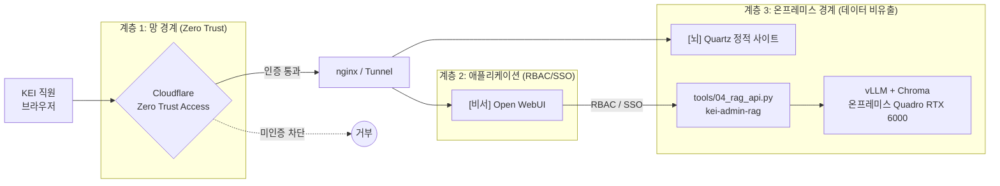
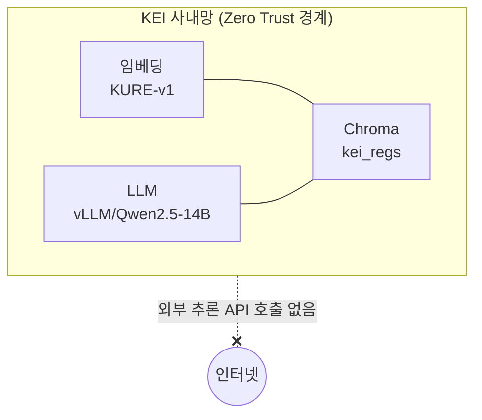
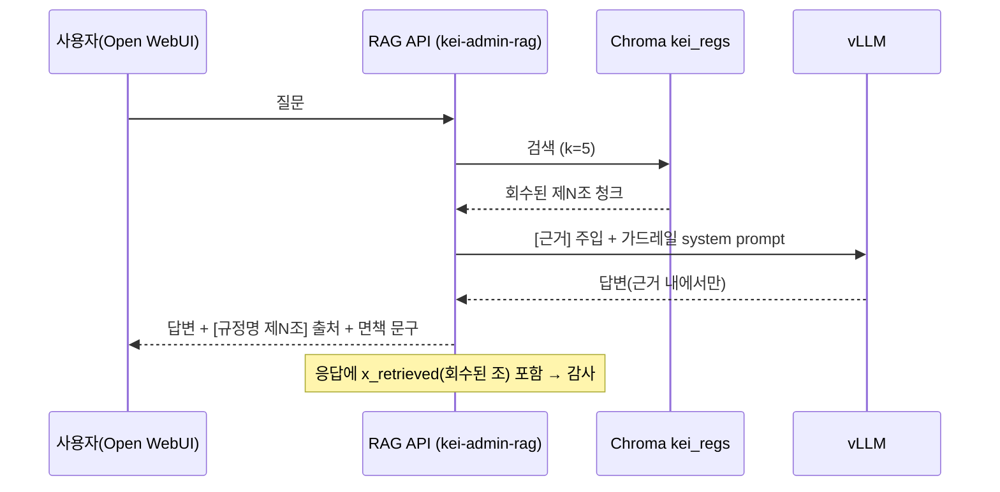
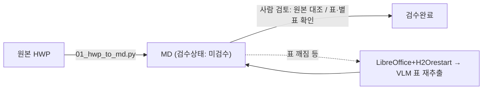

# 07. 보안·거버넌스

> 내부전용 시스템의 접근통제·데이터 비유출·감사 추적성·콘텐츠 검수 거버넌스를 정의한다.
> 핵심 명제 하나: **KEI 행정 가이드/비서는 사내 규정을 다루는 내부 시스템이며, 어떤 화면도 인터넷에 공개하지 않는다.**

이 문서는 [01-overview.md](01-overview.md)의 목표와 [02-architecture.md](02-architecture.md)의 "하나의 볼트, 두 개의 화면" 구조를 전제로, 운영 시 지켜야 할 보안·거버넌스 원칙을 정리한다. 배포의 실제 절차는 [06-deployment.md](06-deployment.md), RAG 가드레일의 구현은 [05-rag-design.md](05-rag-design.md)를 함께 본다.

---

## 1. 원칙 (Principles)

| 원칙 | 내용 | 근거 |
| --- | --- | --- |
| 내부전용 | 행정 가이드/비서는 KEI 직원만 사용. 외부 공개 대상이 아니다. | 사내 규정 문서를 다룸 |
| 인터넷 공개 금지 | [뇌] Quartz, [비서] Open WebUI+vLLM **두 화면 모두** 공개 라우트를 갖지 않는다. | ⛔ 절대 규칙 5 |
| 망 밖 비유출 | 모델·임베딩·벡터DB 전부 사내 GPU(Quadro RTX 6000 24GB×2) 온프레미스 구동. 외부 API 호출 없음. | 온프레미스 설계 |
| 출처 강제 | 모든 답변/가이드에 `[규정명 제N조]` 출처 + 면책 문구. 근거 없는 단정 금지. | ⛔ 절대 규칙 3·4 |
| 의역 금지 | 원문층(`20_규정원문/`)은 변환 그대로. 사람 해석은 가치층(`10_업무가이드/`)으로 분리. | ⛔ 절대 규칙 2 |

> [!warning] 공개를 권하는 어떤 설정·문서·서술도 금지
> 데모·외부 공유 요청이 와도 시스템 자체를 공개하지 않는다. 필요한 자료는 캡처/요약본을 별도로 검토 후 제공한다. 연결 URL 설정 시 `localhost`/`host.docker.internal`이 아니라 서버 실제 IP를 쓰되, 그 IP 역시 사내망/Zero Trust 뒤에 있어야 한다.

---

## 2. 접근통제 — 이중 계층 (Defense in Depth)

접근통제는 **망 경계**와 **애플리케이션** 두 계층으로 분리한다. 둘 중 하나가 뚫려도 다른 하나가 남도록 설계한다.



### 계층 정리

| 계층 | 담당 | 통제 대상 | 통제 방식 | 비고 |
| --- | --- | --- | --- | --- |
| 1. 망 경계 | Cloudflare Zero Trust Access | "누가 사이트에 도달할 수 있나" | 신원 기반 접근 정책 + Tunnel. 공개 인바운드 포트 없음 | [뇌]·[비서] 둘 다 이 뒤에 위치 |
| 2. 애플리케이션 | Open WebUI RBAC / SSO | "들어온 사용자가 무엇을 할 수 있나" | `WEBUI_AUTH=true`, 사용자/권한/멀티유저 관리 | 채팅 화면 한정 |
| 3. 온프레미스 경계 | 사내 GPU 호스트 | "데이터·모델이 망 밖으로 나가나" | 모델·임베딩·벡터DB 전부 로컬 구동 | 아래 3절 참조 |

> [!note] 역할 분리
> Open WebUI는 **UI·멀티유저·권한(RBAC/SSO)** 만 담당하고, 제N조 검색·근거 주입·출처 강제는 `tools/04_rag_api.py`가 담당한다. Open WebUI 내장 RAG는 청킹/출처표기 통제가 약하므로 감사용 운영에서는 컨트롤드 RAG API를 권장한다. 배경은 [ADR 0003](adr/0003-controlled-rag-api.md), [ADR 0005](adr/0005-on-prem-zero-trust.md) 참조.

> [!todo] 확인 필요: Cloudflare 팀/도메인명, Zero Trust Access 정책 그룹(허용 이메일 도메인/그룹)
> Open WebUI SSO 연동 방식(IdP 종류)도 운영 전 확정 필요.

---

## 3. 데이터 비유출 (Data Non-Exfiltration)

온프레미스 설계의 목적은 단순하다: **사내 규정 텍스트와 그 임베딩이 KEI 망 밖으로 나가지 않게 한다.**

| 구성요소 | 위치 | 외부 호출 여부 |
| --- | --- | --- |
| 임베딩 모델 `nlpai-lab/KURE-v1` (대안 `BAAI/bge-m3`) | 사내 GPU(Quadro RTX 6000) | 없음 (로컬 추론, 1장으로 충분 — 실측) |
| LLM 서빙 vLLM (`Qwen/Qwen2.5-14B-Instruct` 등) | 사내 GPU(Quadro RTX 6000) | 없음 (OpenAI 호환 로컬 엔드포인트 `http://localhost:8000/v1`) |
| 벡터DB Chroma (`PersistentClient`, 컬렉션 `kei_regs`) | 로컬 디스크 (`tools/chroma/`, gitignore) | 없음 |
| RAG API `tools/04_rag_api.py` (`MODEL_ID=kei-admin-rag`) | 사내 호스트(예: data05lx) | 없음 (api_key=`EMPTY`, base는 로컬 vLLM) |



> [!note] GPU 메모리와 14B 서빙
> Qwen2.5-14B-Instruct fp16(약 28GB)은 Quadro RTX 6000 단일 24GB를 초과한다. 2장 텐서병렬(`--tensor-parallel-size=2`)로 서빙하거나, 더 작은 instruct(7B/3B)·양자화 모델을 사용한다. 임베딩(KURE-v1)은 1장으로 충분하다(실측). 2장은 총 48GB이지만 단일 통합 메모리가 아니라 카드별 24GB이다.

> [!warning] 외부 추론 API 도입 금지(설계 변경 시 ADR 필요)
> 클라우드 LLM·임베딩 API를 호출하는 순간 규정 텍스트가 망 밖으로 나간다. 외부 API 사용은 데이터 비유출 원칙 위반이며, 검토가 필요하면 반드시 [ADR](adr/README.md)로 결정 기록을 남긴다.

> [!note] api_key=EMPTY의 의미
> vLLM/RAG API의 `api_key`는 의도적으로 `EMPTY`다. 이는 "외부 결제 키가 없다 = 외부 호출이 없다"는 신호이기도 하다. 실제 접근통제는 키가 아니라 **망 경계(계층 1)와 앱 인증(계층 2)** 가 담당한다.

---

## 4. 감사 추적성 (Auditability)

답변의 모든 주장은 **추적 가능한 근거**로 환원되어야 한다. 세 가지 장치로 보장한다.

1. **출처 강제** — RAG 답변은 끝에 사용한 조문을 `[규정명 제N조]` 형식으로 모두 표기한다. 가이드 문서는 본문에 `[[규정명#제N조]]` 위키링크를 단다.
2. **회수 로깅(`x_retrieved`)** — `tools/04_rag_api.py`는 응답에 검색으로 회수된 조 목록을 `x_retrieved` 디버그 필드로 포함한다. "이 답변이 어떤 조문을 근거로 했나"를 사후 검증할 수 있다.
3. **면책 문구** — 모든 답변 끝에 `"최종 판단은 원문과 담당 부서 확인 바랍니다."` 를 덧붙인다.



### RAG 가드레일 (약화 금지)

[비서] 응답 품질·안전의 핵심은 시스템 프롬프트 가드레일이다. 이 규칙들은 어떤 운영 변경에서도 약화하지 않는다.

> [!warning] 가드레일 원문 (03/04 공통)
> 1. `[근거]`에 없는 내용(특히 금액·한도·기한)은 절대 지어내지 말고 **"규정에서 확인되지 않습니다"** 라고 말한다.
> 2. 신입도 이해하게 쉽게, 단계로 설명한다.
> 3. 답변 끝에 사용한 출처를 `[규정명 제N조]` 형식으로 모두 표기한다.
> 4. 마지막에 `"최종 판단은 원문과 담당 부서 확인 바랍니다."` 를 덧붙인다.

가드레일·검색 파라미터의 구현 세부는 [05-rag-design.md](05-rag-design.md), 결정 배경은 [ADR 0003](adr/0003-controlled-rag-api.md) 참조.

> [!todo] 확인 필요: x_retrieved 로그의 영속 저장 정책
> 현재 `x_retrieved`는 응답 디버그 필드다. 장기 감사 로그로 남길지(저장 위치·보존기간·접근권한)는 운영 정책으로 별도 결정 — [10-operations.md](10-operations.md) 연계.

---

## 5. ⛔ 5대 절대 규칙 — 거버넌스 관점

다섯 규칙을 "지키지 않으면 무엇이 깨지는가" 관점으로 정리한다. 위반 시 위험과 통제 방법을 한 표로 본다.

| # | 규칙 | 위반 시 위험 | 통제 방법 |
| --- | --- | --- | --- |
| ⛔1 | 규정 내용을 지어내지 않는다 (금액·한도·기한·조건 추측 금지) | 잘못된 행정 처리, 신뢰 붕괴 | RAG 가드레일 1·근거 주입; 원문 없으면 `「TODO: 원문 확인」` placeholder |
| ⛔2 | 원문층(`20_규정원문/`) 의역 금지 | 진실원천 오염, 출처 추적 불가 | 변환 그대로 보존; 해석은 `10_업무가이드/`(가치층)로 분리; 조문 단위 청킹 |
| ⛔3 | 모든 가이드/답변에 출처 표기 | 근거 없는 답변, 감사 불가 | 가이드 `[[규정명#제N조]]`; RAG `[규정명 제N조]` + 면책 문구; `x_retrieved` 로깅 |
| ⛔4 | RAG 가드레일 약화 금지 | 환각(hallucination) 답변 유포 | 시스템 프롬프트 고정; "규정에서 확인되지 않습니다" 응답 보장 (4절) |
| ⛔5 | 어떤 화면도 인터넷 공개 금지 | 내부 규정 외부 유출 | Cloudflare Zero Trust(계층1) + Open WebUI RBAC/SSO(계층2) + 온프레미스(계층3) (2·3절) |

> [!tip] 규칙은 코드와 문서 양쪽에서 강제한다
> ⛔1·⛔3·⛔4는 RAG 코드(`tools/03_rag_query.py`, `tools/04_rag_api.py`)의 시스템 프롬프트로, ⛔2는 변환/청킹 파이프라인(`tools/01_hwp_to_md.py`, `tools/02_chunk_and_embed.py`)으로, ⛔5는 배포 구성(Zero Trust·nginx·docker-compose)으로 각각 강제된다. 문서 서술만으로 끝내지 않는다.

---

## 6. 콘텐츠 거버넌스 (Content Governance)

볼트 콘텐츠는 "검증된 것만 답변 근거로 쓴다"는 원칙으로 운영한다.

### 검수 상태 흐름

원문(`type: regulation`) 노트는 프론트매터에 `검수상태`를 가진다. 변환·생성 직후는 항상 `미검수`이며, 사람이 원본 HWP와 대조 검토한 뒤 `검수완료`로 전환한다.



| 검수상태 | 의미 | 운영 |
| --- | --- | --- |
| `미검수` | 자동 변환/생성 직후. 표·별표·조문 누락 가능 | 인덱스 적재 자체는 막지 않으나, 검수 완료 전에는 [비서] 답변 노출/운영 반영을 하지 않는다(검수 완료 후 한 호흡에 반영). 의역 금지 유지 |
| `검수완료` | 사람이 원본 HWP와 대조 확인 | 신뢰 근거 |

> [!note] 검수 전 산출물은 "미검수"로 유지
> 변환·생성물은 검수 전까지 `검수상태: 미검수`를 그대로 둔다(임의로 검수완료로 올리지 않는다). 프론트매터 스키마는 [03-content-model.md](03-content-model.md) 참조.

### 의역 금지 & TODO placeholder

- **의역 금지**: 원문층은 변환 결과를 가공하지 않는다. "쉽게 풀어쓴" 설명이 필요하면 가치층(`10_업무가이드/`)에 작성하고, 거기서도 반드시 `[[규정명#제N조]]`로 원문을 가리킨다.
- **TODO placeholder**: 원문이 없거나 불확실한 값(금액·한도·기한 등)은 **추측해서 채우지 않고** `「TODO: 원문 확인」` placeholder로 남긴다. 빈 칸이 추측보다 안전하다.

> [!warning] 예시는 명백히 예시로
> 문서·가이드에 규정을 인용해 설명할 때는 일반적 표현을 쓰고, 실제 금액/조문 번호를 단정하지 않는다. (예: "출장비는 「여비 규정 제O조」에 따른다" — `제O조`는 자리표시이지 확정값이 아님.) 확정 인용이 필요하면 검수완료된 원문에서만 가져온다.

---

## 7. 비밀·환경 관리 (Secrets & Env)

| 항목 | 정책 | gitignore 처리 |
| --- | --- | --- |
| `.env` / `*.env` / `*.local` | 절대 커밋 금지. 환경별 로컬 보관 | ✅ `.gitignore`에 포함 |
| `*.key` / `*.pem` / `secrets/` | 키·인증서·시크릿 디렉터리 커밋 금지 | ✅ 포함 |
| 벡터DB `tools/chroma/`, `chroma/`, `*.sqlite3` | 재생성 가능 산출물. 커밋 금지 | ✅ 포함 |
| 모델 가중치 `models/` | 대용량 바이너리. 호스트 로컬 보관 | ✅ 포함 |
| Quartz `public/`, `node_modules/` | 빌드 산출물. 커밋 금지 | ✅ 포함 |

```ini
# .gitignore (발췌) — 비밀/환경
.env
*.env
*.local
secrets/
*.key
*.pem
```

> [!warning] 키 노출 금지
> API 키·토큰을 코드/문서/커밋 메시지에 하드코딩하지 않는다. vLLM·RAG API의 `api_key`는 `EMPTY`로 두고(외부 호출 없음), Open WebUI 환경변수는 `docker-compose.yml`/`.env`로 주입하되 그 `.env`는 커밋하지 않는다. 실수로 커밋된 비밀은 무효화(rotate) 후 히스토리에서 제거한다.

> [!note] 단일 진실원천은 항상 버전관리
> 마크다운 볼트(`KEI-행정가이드/`)는 단일 진실원천이므로 **항상** 버전관리한다. 제외 대상은 생성물·캐시·비밀·대용량 바이너리뿐이다. 한글 파일명은 `git config core.quotepath false`로 다룬다. 협업 규약은 [09-contributing.md](09-contributing.md) 참조.

---

## 관련 문서

- 문서 인덱스: [docs/README.md](README.md)
- 이전: [06. 배포](06-deployment.md)
- 다음: [08. 로드맵](08-roadmap.md)
- 함께 보기: [02. 아키텍처](02-architecture.md) · [05. RAG 설계](05-rag-design.md) · [10. 운영](10-operations.md)
- 관련 ADR: [0003 컨트롤드 RAG API](adr/0003-controlled-rag-api.md) · [0005 온프레미스 Zero Trust](adr/0005-on-prem-zero-trust.md)
- 루트: [../README.md](../README.md) · [../CLAUDE.md](../CLAUDE.md) · [../WORKPLAN.md](../WORKPLAN.md)

---

최종 수정: 2026-06-19
