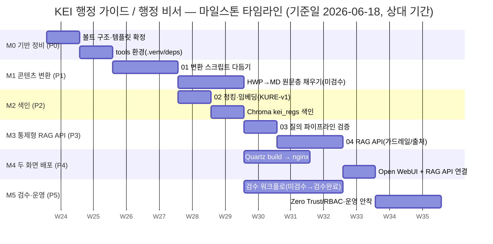
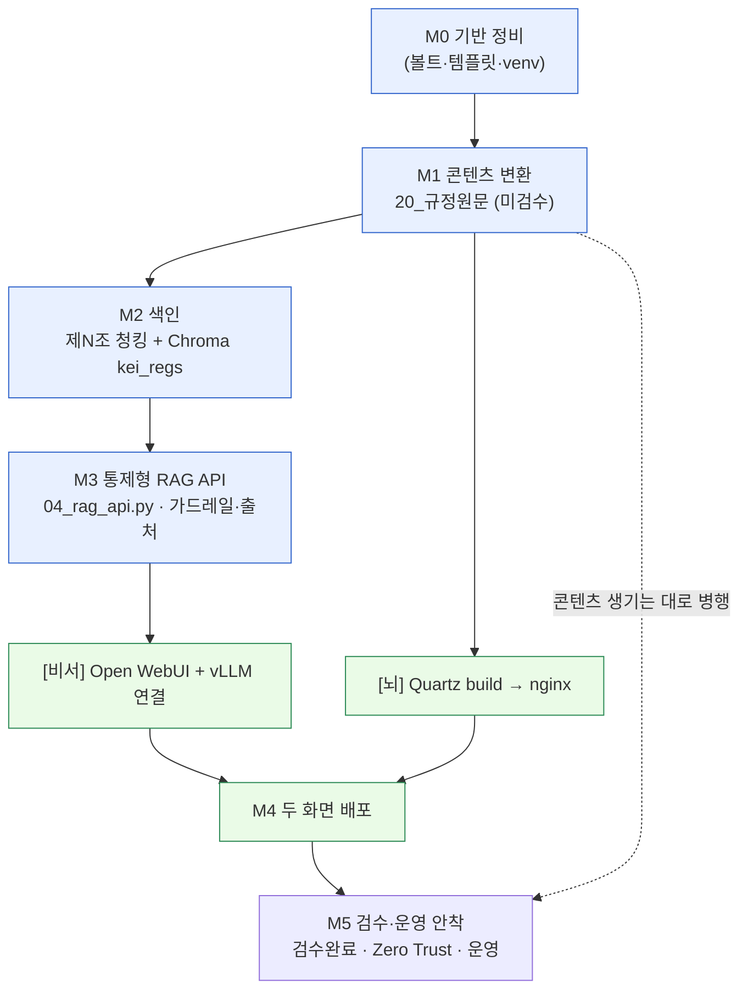

# 08 로드맵

> KEI 행정 가이드 / 행정 비서를 어떤 순서로, 무엇에 의존해 만들 것인가에 대한 전략 뷰입니다.
> 마일스톤(M0~M5)을 실행 계획서([WORKPLAN](../WORKPLAN.md))의 단계(P0~P5)에 매핑하고, 의존성과 산출물을 정리합니다.

이 문서는 "큰 그림"입니다. 구체적인 작업 항목·체크리스트·담당은 [WORKPLAN](../WORKPLAN.md)에서 관리하고, 여기서는 마일스톤·타임라인·의존성만 다룹니다.

> [!note]
> 전체 기준 시작일은 **2026-06-18**입니다. 아래 타임라인의 절대 날짜는 단정하지 않으며, 상대적 순서와 대략적 기간(주 단위)으로만 표기합니다. 인력·일정 확정 전까지는 모두 추정치입니다.

---

## 마일스톤 개요 (M0~M5 ↔ WORKPLAN P0~P5)

이 시스템은 **하나의 볼트, 두 개의 화면**을 향해 단계적으로 자랍니다.
([뇌] Quartz 그래프 사이트 / [비서] Open WebUI + vLLM)

| 마일스톤 | WORKPLAN 단계 | 한 줄 목표 | 핵심 산출물 | 완료 판정(Exit) |
| --- | --- | --- | --- | --- |
| **M0 — 기반 정비** | [P0](../WORKPLAN.md#p0--준비환경) | 볼트 구조·템플릿·툴 환경 확정 | 레포 스켈레톤, 프론트매터 템플릿, `tools/.venv` | 템플릿대로 노트 1건 수기 작성 가능 |
| **M1 — 콘텐츠 변환** | [P1](../WORKPLAN.md#p1--원문-변환) | HWP → 마크다운 원문층 채우기 | `20_규정원문/` 마크다운(검수상태: 미검수) | 샘플 규정이 조문 단위로 읽힘 |
| **M2 — 색인(임베딩)** | [P2](../WORKPLAN.md#p2--청킹임베딩) | 제N조 단위 청킹 + 벡터 색인 | Chroma 컬렉션 `kei_regs` | `02`로 색인, `03`으로 질의 응답 확인 |
| **M3 — 통제형 RAG API** | [P3](../WORKPLAN.md#p3--rag-질의평가) | 출처 강제·가드레일 탑재 API | `tools/04_rag_api.py` (OpenAI 호환) | `/v1/chat/completions`가 출처 포함 응답 |
| **M4 — 두 화면 배포** | [P4](../WORKPLAN.md#p4--배포) | [뇌]·[비서] 온프레미스 기동 | Quartz `public/` + nginx, Open WebUI(Docker) | 사내망에서 두 화면 모두 접속 |
| **M5 — 검수·운영 안착** | [P5](../WORKPLAN.md#p5--운영유지보수-순환) | 검수 워크플로·접근통제·운영 | 검수 완료 콘텐츠, Zero Trust 라우트, 운영 문서 | 행정 초보가 출처 달린 답을 신뢰하고 사용 |

> [!todo]
> 확인 필요: WORKPLAN의 단계 번호 체계와 본 매핑(P0~P5)이 1:1로 맞는지 [WORKPLAN](../WORKPLAN.md) 확정 후 동기화. 단계 앵커 링크는 WORKPLAN의 실제 헤딩(예: `## P0 — 준비·환경` → `../WORKPLAN.md#p0--준비환경`) 기준으로 보강 완료.

---

## 타임라인 (상대 기간)

기준일 **2026-06-18**부터의 상대 순서/기간입니다. 날짜는 추정이며 인력 확정 시 갱신합니다.

> [!tip]
> M2(색인)는 M1 변환이 일부만 완료돼도 착수할 수 있습니다. "조금 변환 → 조금 색인 → 질의 확인"으로 짧게 반복하는 편이 한 번에 전부 변환하는 것보다 안전합니다. 검수(M5)는 콘텐츠가 생기는 즉시 병행 시작합니다.

> [!todo]
> 확인 필요: 각 마일스톤의 실제 캘린더 일정·담당 인원. 인원/구체 일정은 미정이므로 위 기간은 상대 순서 표현용 placeholder.

---

## 단계 의존성 그래프

무엇이 무엇을 막는지(blocking)를 보여줍니다. 핵심 경로는 **변환 → 청킹·임베딩 → 통제형 API → 비서 화면**입니다.

핵심 관찰:

- **[뇌] Quartz는 색인/RAG와 무관하게 진행 가능.** Quartz는 같은 마크다운 볼트를 정적 사이트로 만들 뿐이라 M1만 충분히 차면 배포할 수 있습니다.
- **[비서]는 M3(통제형 API)에 의존.** 채팅은 그림이 아니라 텍스트+임베딩 검색으로 답하므로, 색인(M2)과 출처 강제 API(M3)가 선행돼야 합니다.
- **검수(M5)는 콘텐츠 생성과 병행.** 변환·생성물은 검수 전까지 `검수상태: 미검수`를 유지하며, 검수는 M1 이후 상시 진행합니다.

---

## 마일스톤별 산출물 상세

### M0 — 기반 정비 · [P0](../WORKPLAN.md#p0--준비환경)

볼트 구조와 작업 환경을 확정합니다. 이후 모든 단계의 토대입니다.

- 레포 스켈레톤: `KEI-행정가이드/`(`10_업무가이드` / `20_규정원문` / `30_용어집` / `90_관리`), `tools/`, `deploy/`, `docs/`.
- 프론트매터 템플릿 3종(`90_관리/_templates/`): `regulation` · `guide` · `term`.
- 파이썬 환경: `tools/.venv`, 의존성 [`tools/requirements.txt`](../tools/requirements.txt).
- 한글 파일명 정책: `git config core.quotepath false`.
- 참조: [02 아키텍처](02-architecture.md), [03 콘텐츠 모델](03-content-model.md).

> [!note]
> `_templates`는 청킹·임베딩 대상에서 제외됩니다(스크립트가 자동 제외).

### M1 — 콘텐츠 변환 · [P1](../WORKPLAN.md#p1--원문-변환)

HWP 규정 원문을 마크다운 원문층(`20_규정원문/`)으로 변환합니다.

- 산출물: 규정별 `<번호>_<제목>.md`(프론트매터 `type: regulation`, `검수상태: 미검수`, 경고 콜아웃 포함).
- 도구: [`tools/01_hwp_to_md.py`](../tools/01_hwp_to_md.py) — `hwp-hwpx-parser`로 본문/표 추출, `parse_filename`으로 규정번호·개정일·제목 파싱, 첫자리 기준 분류 매핑.
- 표/별표 깨짐 대응: LibreOffice + H2Orestart로 PDF 변환 → 해당 페이지를 VLM(`Qwen2.5-VL`)에 넘겨 표만 마크다운 재추출.
- 참조: [04 파이프라인](04-pipeline.md).

> [!warning]
> 원문층(`20_규정원문/`)은 **의역 금지**입니다. 변환물은 진실원천이므로 표현을 다듬지 말고, 불확실하면 「TODO: 원문 확인」 placeholder로 남깁니다. 금액·한도·기한은 추측해 채우지 않습니다.

> [!todo]
> 확인 필요: 변환 대상 규정 목록과 KEI 규정번호(1000~6000) 실제 매핑. `01_hwp_to_md.py`는 현재 스켈레톤이며 정규식·표 처리 다듬기 필요.

### M2 — 색인(청킹·임베딩) · [P2](../WORKPLAN.md#p2--청킹임베딩)

규정을 조문 단위로 쪼개 벡터로 색인합니다.

- 도구: [`tools/02_chunk_and_embed.py`](../tools/02_chunk_and_embed.py).
- 청킹: **제N조 단위(조문 1개 = 청크 1개)**. 고정 길이 청킹 금지. `guide`/`term`은 노트 전체 1청크.
- 임베딩: `nlpai-lab/KURE-v1`(대안 `BAAI/bge-m3`), `normalize_embeddings=True`, 양자화 안 함.
- 벡터DB: Chroma `PersistentClient`, 컬렉션 `kei_regs`, `hnsw:space=cosine`. `tools/chroma/`는 gitignore.
- 참조: [04 파이프라인](04-pipeline.md), [ADR 0001](adr/0001-embedding-kure-v1.md), [ADR 0002](adr/0002-article-level-chunking.md).

### M3 — 통제형 RAG API · [P3](../WORKPLAN.md#p3--rag-질의평가)

출처 표기와 가드레일을 시스템이 강제하는 OpenAI 호환 API를 만듭니다.

- 도구: [`tools/03_rag_query.py`](../tools/03_rag_query.py)(CLI 검증) → [`tools/04_rag_api.py`](../tools/04_rag_api.py)(FastAPI, `MODEL_ID=kei-admin-rag`).
- LLM 서빙: vLLM(OpenAI 호환, 기본 `http://localhost:8000/v1`), 모델 `Qwen/Qwen2.5-14B-Instruct` 등 일반 instruct(한국어 특화 대안 EXAONE/Kanana).
- 엔드포인트: `/v1/models`, `/v1/chat/completions`(비스트리밍 스켈레톤, SSE는 향후). 디버그용 `x_retrieved`(회수된 조) 포함.
- 참조: [05 RAG 설계](05-rag-design.md), [ADR 0003](adr/0003-controlled-rag-api.md).

> [!warning]
> 가드레일은 약화 금지입니다. [근거]에 없는 내용(특히 금액·한도·기한)은 지어내지 않고 "규정에서 확인되지 않습니다"라고 답하며, 답변 끝에 `[규정명 제N조]` 출처와 "최종 판단은 원문과 담당 부서 확인 바랍니다." 면책을 반드시 붙입니다.

### M4 — 두 화면 배포 · [P4](../WORKPLAN.md#p4--배포)

[뇌]와 [비서]를 온프레미스에서 기동합니다.

- **[뇌] Quartz v5**(Node v22+): 볼트를 `content`로 심볼릭 링크 → `npx quartz build` → `public/` → nginx. 노드/링크 그래프 + 전문검색.
- **[비서] Open WebUI**(Docker, `ghcr.io/open-webui/open-webui:main`): `04_rag_api.py`를 OpenAI 호환 모델로 등록. 연결 Base URL은 `localhost`/`host.docker.internal`이 아니라 **서버 실제 IP** 사용.
- 모델·임베딩은 전부 사내 GPU(A40)에서 구동.
- 참조: [06 배포](06-deployment.md), [ADR 0004](adr/0004-quartz-graph-site.md), [`deploy/README.md`](../deploy/README.md), [`deploy/docker-compose.yml`](../deploy/docker-compose.yml).

> [!todo]
> 확인 필요: 서버 호스트명/IP(예시 `data05lx` 외 확정값), GPU 수량(A40 외), Cloudflare 팀/도메인명.

### M5 — 검수·운영 안착 · [P5](../WORKPLAN.md#p5--운영유지보수-순환)

콘텐츠 신뢰성과 접근 통제, 운영 절차를 갖춥니다.

- 검수 워크플로: `검수상태: 미검수` → 사람이 원문 대조 후 `검수완료`로 승격. 가이드는 항상 `[[규정명#제N조]]` 위키링크로 원문 근거 표시.
- 접근 통제: 두 화면 모두 Cloudflare Zero Trust Access 뒤 + Open WebUI RBAC/SSO. 온프레미스라 데이터는 망 밖으로 나가지 않음.
- 운영: 색인 재빌드 주기, 변환 검수 큐, 백업 등.
- 참조: [07 보안·거버넌스](07-security-governance.md), [10 운영](10-operations.md), [09 기여 가이드](09-contributing.md), [ADR 0005](adr/0005-on-prem-zero-trust.md).

> [!warning]
> 내부 규정 자료입니다. [뇌]·[비서] 어떤 화면도 인터넷에 공개하지 않습니다. 두 화면 모두 사내 전용으로만 노출합니다.

---

## 향후 확장 백로그 (아이디어)

아래는 핵심 마일스톤 완료 이후를 위한 **아이디어 목록**입니다. 일정·확정 범위가 아니며, 우선순위는 미정입니다.

| 아이디어 | 무엇을 위한 것인가 | 비고 |
| --- | --- | --- |
| **리랭커(reranker)** | 회수 상위 조문을 한 번 더 정렬해 정확도 향상 | 벡터 검색 → 교차 인코더 재정렬. 모델 선정 미정 |
| **평가 자동화** | 출처 일치·할루시네이션 회귀를 CI에서 측정 | 질문/정답 셋 구축 필요. 가드레일 준수 자동 검사 |
| **알림(notification)** | 규정 개정 시 관련 가이드 검토 환기 | 개정일 변경 감지 → 담당자 알림. 채널 미정 |
| **다국어** | 한국어 외 사용자 대응(예: 영문 질의) | 사용자 노출 콘텐츠 기본은 한국어 유지 원칙 |
| **SSE 스트리밍** | 비서 응답 체감 속도 개선 | `04_rag_api.py`의 `/v1/chat/completions` 스트리밍 구현 |
| **Dataview 인덱스 강화** | `90_관리`의 자동 인덱스/대시보드 확장 | 검수 진척·미검수 큐 가시화 |
| **하이브리드 검색** | 키워드(BM25) + 벡터 결합 | 조문 번호·고유명사 회수율 보강 |

> [!note]
> 이 백로그 항목은 핵심 경로(M0~M5)를 막지 않습니다. M5 안착 후 가치/비용을 보고 선별 도입합니다.

---

## 관련 문서

- 문서 인덱스: [docs/README.md](README.md)
- 실행 계획서: [../WORKPLAN.md](../WORKPLAN.md) · 저장소 개요: [../README.md](../README.md) · 작업 규약: [../CLAUDE.md](../CLAUDE.md)
- 이전: [07 보안·거버넌스](07-security-governance.md)
- 다음: [09 기여 가이드](09-contributing.md)

---

최종 수정: 2026-06-18
