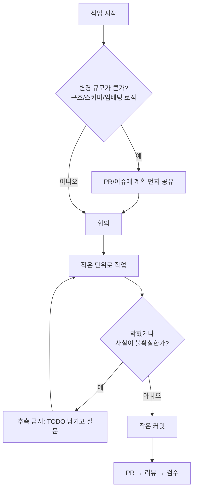
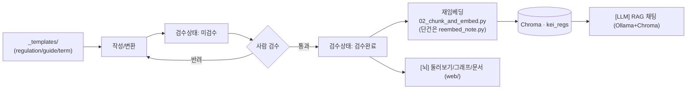

# 09 기여 가이드

> KEI 행정 가이드 / 행정 LLM에 기여하는 방법 — 작업 방식, 브랜치·커밋 규약, 콘텐츠/코드 기여 흐름, 그리고 검수까지.
> 이 문서는 [`CLAUDE.md`](../CLAUDE.md)의 작업 정신을 사람·에이전트 모두가 따를 수 있도록 풀어 쓴 것이다. 충돌이 있으면 `CLAUDE.md`의 ⛔ 절대 규칙이 우선한다.

---

## 1. 한눈에

이 프로젝트는 **하나의 볼트, 두 개의 화면**이다. 두 화면 모두 **한 개의 Next.js 14 + Toss Design System 앱(`web/`)** 에 통합돼 있다.

- 단일 진실원천(Source of Truth) = 마크다운 볼트 `KEI-행정가이드/`
- **[뇌]** 둘러보기(`/browse`)·관계 그래프(`/graph`)·문서 드로어 — 노드/링크 그래프 + 필터 + 원문 열람 (사람이 탐색)
- **[LLM]** RAG 채팅(`/`) — 질문에 `[규정명 제N조]` 출처를 달아 답변 (행정 초보가 사용). 백엔드는 Ollama(OpenAI 호환) 서빙 + Chroma 검색.

기여의 대부분은 **마크다운(콘텐츠)** 이고, 일부는 **파이프라인 코드(`tools/`)** 다. 두 경로 모두 같은 ⛔ 절대 규칙 위에서 움직인다.

| 무엇을 바꾸나 | 어디를 만지나 | 핵심 주의 |
|---|---|---|
| 규정 원문 추가/교정 | `KEI-행정가이드/20_규정원문/` | **의역 금지**, 조문(제N조) 구조 유지, `검수상태: 미검수`로 시작 |
| 업무 가이드 작성 | `KEI-행정가이드/10_업무가이드/` | 항상 원문 `[[규정명#제N조]]` 링크, 사람이 작성 |
| 용어 추가 | `KEI-행정가이드/30_용어집/` | 개념 1개 = 노트 1개 |
| ERP 시스템 노트 | `KEI-행정가이드/40_시스템/` | `type: system`, 모듈별 노트, `####` 기능 단위 |
| 템플릿/인덱스 | `KEI-행정가이드/90_관리/` | `_templates/`는 청킹 제외 |
| 변환·임베딩·RAG 코드 | `tools/` | venv 사용, 주변 코드 일관성, 가드레일 약화 금지 |
| 배포 설정 | `deploy/` | 내부 전용 — 인터넷 공개 금지 |
| 설계·계획 문서 | `docs/` | 사실의 출처는 코드와 `CLAUDE.md` |

> [!warning] 공개 레포에는 **코드·설계문서만** 둔다
> `KEI-행정가이드/`(규정 볼트)·`rule_files/`(HWP)는 **내부 전용**이라 git에 추적하지 않는다(`.gitignore`). 볼트 콘텐츠 작업은 공개 레포가 아니라 **Syncthing으로 동기화된 로컬 볼트 + Obsidian**에서 한다. 공개 구조 예시는 [`vault-example/`](../vault-example/), 데이터 분리 모델은 [SECURITY.md](../SECURITY.md) 참조.

---

## 1.5 보안 가드레일 (clone 후 1회 필수)

공개 레포에 내부 규정이 섞여 들어가지 않도록 **3중 통제**가 있다.

1. **`.gitignore`** — `KEI-행정가이드/`·`rule_files/`·`*.hwp`·`*.hwpx` 차단.
2. **공유 pre-commit 훅** — clone 후 한 번 활성화하면, 내부 콘텐츠가 스테이징된 커밋을 로컬에서 차단한다.
   ```bash
   git config core.hooksPath .githooks   # 레포에 포함된 훅 사용 (clone 후 1회)
   ```
3. **GitHub Actions CI**(`.github/workflows/security-scan.yml`) — 푸시·PR마다 내부 콘텐츠 존재 여부 + 시크릿(gitleaks)을 검사해 실패시킨다.

> 일부러 `git add -f KEI-행정가이드/x.md` 후 커밋을 시도하면 훅이 차단한다(검증됨). (선택) `pre-commit` 프레임워크는 [`.pre-commit-config.yaml`](../.pre-commit-config.yaml) 참조.

---

## 2. 작업 방식 (CLAUDE.md 정신)

세 가지만 기억하면 된다.

1. **작은 커밋.** 변환 1건, 가이드 1개, 버그 1개 — 의미 단위로 쪼개 커밋한다. 한 커밋이 한 가지 일만 하면 리뷰도, 되돌리기도 쉽다.
2. **큰 변경 전에는 계획을 먼저 공유한다.** 디렉터리 구조 변경, 청킹·임베딩 로직 변경, 프론트매터 스키마 변경처럼 파급이 큰 작업은 PR/이슈에 먼저 한두 문단으로 의도와 영향 범위를 적고 합의한 뒤 손댄다.
3. **막히면 추측하지 말고 질문한다.** 특히 규정의 금액·한도·기한·조건은 모르면 지어내지 말고 `「TODO: 원문 확인」`을 남긴다. (아래 ⛔ 절대 규칙 참조.)



> [!tip]
> 에이전트(Claude Code 등)로 작업할 때도 동일하다. 에이전트는 `CLAUDE.md`를 매 세션 읽고, 생성물에 `검수상태: 미검수`를 유지하며, 불확실하면 `「TODO: 원문 확인」`을 남긴다.

---

## 3. Git 협업 규약

### 3.1 저장소와 협업자

| 항목 | 값 |
|---|---|
| origin | `github.com/mooner92/KEIAdminSuperv` |
| 협업자(collaborator) | `CrownClownCrowd` |
| 기본 작업 단위 | 작은 커밋, 의미 단위 |

> [!todo] 확인 필요: 메인 브랜치 보호 규칙
> 메인 브랜치명(`main`/`master`), PR 필수 여부, 리뷰어 최소 인원 등 브랜치 보호 정책이 아직 합의되지 않았다. 정해지면 이 표에 반영한다.

### 3.2 한글 파일명/경로

이 볼트는 한글 파일명을 쓴다(예: `20_규정원문/3000_인사/3100_복무규정.md` 형태). git이 한글 경로를 `\355\225\234...`처럼 8진 이스케이프로 보여주지 않도록, 클론 직후 한 번 설정한다.

```bash
git config core.quotepath false
```

> [!note]
> `core.quotepath false`는 로컬 설정이다. 새로 클론하거나 새 머신에서 작업할 때마다 다시 적용해야 `git status`/`git diff`에서 한글 파일명이 그대로 보인다.

### 3.3 브랜치 전략

- 기본 브랜치에 직접 푸시하지 말고 작업 브랜치를 판다.
- 브랜치명은 짧고 목적이 드러나게.

```text
content/복무규정-변환
content/연차-가이드-작성
fix/청킹-조문분할-정규식
docs/09-기여가이드
```

### 3.4 커밋 메시지 규약

두 방식 중 하나를 일관되게 쓴다. 한 저장소 안에서 둘을 섞지만 않으면 된다.

**(A) 간결한 한국어** — 콘텐츠 기여에 권장. 무엇을 했는지 한 줄로.

```text
복무규정 원문 변환 추가 (검수상태: 미검수)
연차휴가 신청 가이드 초안 작성
청킹 조문 분할 정규식 다듬기
```

**(B) Conventional Commits** — 코드 기여에 권장. `<type>(<scope>): <설명>`.

```text
feat(tools): 04 RAG API에 x_retrieved 디버그 필드 추가
fix(tools): 02 청킹 제N조 정규식 누락 조문 보정
docs(adr): 0002 조문 단위 청킹 결정 기록
chore(deploy): docker-compose 임베딩 TEI 주석 정리
```

권장 type: `feat`, `fix`, `docs`, `refactor`, `chore`, `content`(볼트 콘텐츠 변경).

> [!tip]
> 커밋 본문에 "왜"를 한 줄 적으면 6개월 뒤의 나와 `CrownClownCrowd`가 고마워한다. "무엇"은 diff가 말해주지만 "왜"는 메시지만 말해준다.

---

## 4. 콘텐츠 기여 흐름

콘텐츠가 이 프로젝트의 본체다. 볼트에 들어가는 모든 노트는 **템플릿에서 시작 → 작성 → 사람 검수 → 재임베딩**의 한 방향 흐름을 탄다.



### 4.1 템플릿에서 시작

새 노트는 `KEI-행정가이드/90_관리/_templates/` 의 양식으로 시작해 프론트매터를 일관되게 유지한다. `_templates/`는 청킹에서 제외되므로(임베딩 코퍼스에 들어가지 않음) 템플릿 자체는 LLM 답변에 섞이지 않는다.

| type | 프론트매터 필드 | 위치 |
|---|---|---|
| `regulation` | `type, 규정번호, 규정명, 분류, 개정일, 원본파일, 태그, 검수상태(미검수\|검수완료)` | `20_규정원문/` |
| `guide` | `type, 제목, 분류, 대상, 관련규정[], 관련서식[], 최종검토일, 검토자, 태그` | `10_업무가이드/` |
| `term` | `type, 용어, 영문, 관련규정[], 태그` | `30_용어집/` |

### 4.2 작성

- **규정 원문(`20_규정원문/`)**: 보통 변환 스크립트(`01_hwp_to_md.py`)가 생성한다. 사람은 변환된 문구를 **의역하지 않고**, 표/별표 깨짐과 명백한 오타만 교정한다. 조문(제N조) 구조는 그대로 둔다. (자세한 변환·표 복구는 [04-pipeline.md](04-pipeline.md) 참조.)
- **업무 가이드(`10_업무가이드/`)**: 사람이 쉬운 말로 쓰되, 근거가 되는 조문을 반드시 위키링크로 단다.

근거 링크 표기(볼트 내부):

```markdown
연차휴가는 근속 기간에 따라 부여됩니다. 자세한 일수는 원문을 확인하세요.
관련 근거: [[복무규정#제N조]]
```

> [!warning]
> 가이드에 **구체 일수·금액·한도·기한을 직접 적지 말 것.** 그 값은 규정 개정으로 바뀌고, 가이드가 진실원천이 아니다. 값이 필요하면 "원문 확인" 문구와 함께 `[[규정명#제N조]]` 링크로 넘긴다. 위 예시의 `제N조`도 실제 조 번호가 아니라 **표기 형식 예시**다.

### 4.3 검수상태: 미검수 → 사람 검수 → 검수완료

- 변환·생성된 노트는 `검수상태: 미검수`로 태어난다. 자동으로 `검수완료`로 바뀌는 일은 없다. (현재 전건 미검수 — 사람 검수 전이다.)
- 사람이 원문과 대조해 표/조문/오타를 확인한 뒤에만 프론트매터를 `검수상태: 검수완료`로 바꾼다.
- `regulation` 노트의 검수는 "변환이 원문을 충실히 보존했는가"를 본다. 새로운 해석을 더하는 자리가 아니다.
- 검수는 [`tools/review_tool.py`](../tools/review_tool.py)(검수 CLI)로 돕는다. 우선순위 큐([`review_queue.py`](../tools/review_queue.py), 읽기전용)가 유형·별표·미분류·피인용·👎피드백을 점수로 매겨 검수할 노트를 추린다. ⛔ `검수완료` 확정은 사람이 명시적으로 `approve`를 입력할 때만 기록되고, 그 직후 그 노트만 재임베딩된다. 에이전트·스크립트의 자동 승인은 금지다.

```diff
  ---
  type: regulation
  규정명: 복무규정
- 검수상태: 미검수
+ 검수상태: 검수완료
  ---
```

### 4.4 재임베딩

검수가 끝났거나 본문이 바뀌면 임베딩을 다시 만들어 LLM이 최신 내용을 검색하게 한다.

```bash
python tools/02_chunk_and_embed.py --vault KEI-행정가이드 --db tools/chroma
```

- `02_chunk_and_embed.py`는 규정원문을 `제N조` 단위, 가이드/ERP를 헤딩(`####`/`##`) 단위로 청킹하고(고정 길이 청킹 금지), `nlpai-lab/KURE-v1`로 임베딩해 Chroma 컬렉션 `kei_regs`에 적재한다.
- 노트 한 건만 갱신할 땐 전체 리빌드 대신 [`tools/reembed_note.py`](../tools/reembed_note.py)를 쓴다. 그 노트의 기존 청크를 먼저 지우고 다시 넣어 중복을 막는다.
- ⛔ 재임베딩 전 **Chroma 백업이 필수**다(`reembed_note.py`는 `<db>.bak.<날짜>`로 자동 백업하고 롤백 경로를 출력한다). 라이브 `kei-rag-api`가 같은 db를 열고 있으면 갱신 후 `pm2 restart kei-rag-api`로 반영한다. 안전 테스트는 `--db tools/chroma.test`처럼 사본에 대고 한다.
- `tools/chroma/`는 재생성 가능한 산출물이라 `.gitignore`에 들어 있다 — 커밋하지 않는다.

> [!note]
> 콘텐츠 기여 PR에 임베딩 결과물을 첨부할 필요는 없다. 검수완료된 마크다운만 머지되면, 운영자가 서버에서 재임베딩한다. (운영 절차는 [10-operations.md](10-operations.md) 참조.)

---

## 5. 코드 기여 (`tools/`)

파이프라인은 `01 변환 → 01b~01g 상호참조·교차링크 → 02 청킹·임베딩 → 03 질의 / 04 OpenAI호환 RAG API` 순서다. 각 단계 스크립트와 실행 커맨드는 [`CLAUDE.md`](../CLAUDE.md)와 [04-pipeline.md](04-pipeline.md)에 정리돼 있다.

검색·생성 코어는 백엔드 3분리 구조다. 손대기 전에 어느 파일이 책임지는지 확인한다.

| 파일 | 책임 |
|---|---|
| [`tools/rag_core.py`](../tools/rag_core.py) | 검색·생성 공용 로직. `retrieve`(밀집+리랭커), `answer`/`answer_stream`(SSE), `condense_query`(멀티턴 재작성), `_ensure_disclaimer`(면책 보장), `warmup`. |
| [`tools/app_api.py`](../tools/app_api.py) | 인증·채팅·플래그·피드백·통계 라우터(`/app/*`). bcrypt+PyJWT 쿠키, SQLModel/SQLite(`tools/app.db`). |
| [`tools/04_rag_api.py`](../tools/04_rag_api.py) | 진입점. OpenAI 호환 `/v1/*` + `/app/*` 마운트 + `init_db`. PM2 `kei-rag-api`(uvicorn, 127.0.0.1:9000). |

### 5.1 개발 환경

가상환경을 쓰고 의존성은 `tools/requirements.txt`로 관리한다.

```bash
python -m venv tools/.venv
source tools/.venv/bin/activate
pip install -r tools/requirements.txt
```

주요 의존성: `hwp-hwpx-parser`, `sentence-transformers`, `chromadb`, `kss`(선택), `openai`, `fastapi`, `uvicorn`. 앱(인증·채팅) 쪽은 `sqlmodel`, `bcrypt`, `PyJWT`도 쓴다(passlib/fastapi-users는 쓰지 않는다).

> [!note]
> `tools/.venv/`와 `models/`(내려받은 모델 가중치)는 `.gitignore` 대상이다. 새 라이브러리를 추가하면 `requirements.txt`에 반영하는 것까지가 한 작업이다.

### 5.2 코드 스타일

- **주변 코드와 일관성**을 최우선으로 한다. 한 파일 안에서 갑자기 다른 포맷·네이밍을 도입하지 않는다.
- 인자 규약을 따른다: 예) `--vault`, `--db`, `--src`, `--q`, `--k`.
- 임베딩 모델은 변환·질의 양쪽에서 동일해야 한다. `rag_core`/`03`의 `EMBED_MODEL`은 `02`와 반드시 같은 `nlpai-lab/KURE-v1`이어야 검색이 맞는다(대안 `BAAI/bge-m3`로 바꿀 땐 전 파이프라인을 함께 바꾸고 재임베딩). 양자화하지 않고 `normalize_embeddings=True`를 유지한다.
- 벡터DB 규약 유지: 컬렉션명 `kei_regs`, `hnsw:space=cosine`.

### 5.3 변경 시 영향이 큰 지점

아래는 깨지면 검색·답변 품질이나 안전장치가 무너지는 지점이다. 손대기 전에 영향 범위를 확인하고, 평가([§8](#8-테스트검증))로 before/after를 측정한다.

| 스크립트 | 주의점 |
|---|---|
| `01_hwp_to_md.py` | 파일명 파싱(`reg_num_from_name`/`parse_date`/`clean_title`)과 표 인라인 처리, `CATEGORY_NAMES` 매핑(첫 자리 → 분류 폴더)·암호화/빈 본문·타임아웃 skip 로직을 깨지 않게. |
| `02_chunk_and_embed.py` | 규정원문은 `제N조` 단위, `guide`/`system`은 헤딩(`####`/`##`) 단위(`chunk_guide`). 고정 길이 청킹으로 바꾸지 말 것. **별표/별지는 1급 청크로 분리**(토글 `CHUNK_BYEOLPYO`), 긴 청크는 하위 분할(`CHUNK_SUBSPLIT`, 조 라벨·메타 유지). `_templates` 제외 규칙 유지. |
| `rag_core.py` | `[근거]` 블록 구성과 가드레일(5.4) 유지. 리랭커(`RAG_RERANK`)·멀티턴 재작성(`RAG_QUERY_REWRITE`)은 실패 시 안전 강등(밀집/원 질문)이 기본이다 — 이 폴백을 제거하지 말 것. 면책은 `_ensure_disclaimer`로 결정적 보장. |
| `03_rag_query.py` | `rag_core` 검색을 쓰는 CLI 질의 도구. |
| `04_rag_api.py` | FastAPI 진입점. `/v1/chat/completions`(비스트리밍) + 앱 채팅 스트리밍 `POST /app/chats/{id}/messages?stream=1`(SSE: `meta`→`delta`…→`done`). `x_sources`(규정명·조·분류·type·snippet) 응답 필드를 깨지 않게 — 근거 패널/문서 드로어가 의존한다. |

> [!warning]
> 운영에서 쿠키 인증은 **same-origin(`server.js` 프록시)** 으로만 동작한다. CORS에서 `allow_credentials=True`를 와일드카드 오리진과 함께 켜지 말 것. 외부 노출은 Cloudflare Zero Trust 뒤(사내 전용)다. 자세한 배포 연결은 [06-deployment.md](06-deployment.md) 참조.

### 5.4 가드레일은 코드다 — 약화 금지

`03`/`04`가 공유하는 시스템 프롬프트 가드레일은 이 프로젝트의 안전장치다. 리팩터링·프롬프트 튜닝 중에 **이 의미를 약화시키는 변경은 절대 하지 않는다.**

1. `[근거]`에 없는 내용(특히 금액·한도·기한)은 지어내지 말고 **"규정에서 확인되지 않습니다"** 라고 답한다.
2. 신입도 이해하게, 단계로 설명한다.
3. 답변 끝에 사용한 출처를 `[규정명 제N조]` 형식으로 모두 표기한다.
4. 마지막에 **"최종 판단은 원문과 담당 부서 확인 바랍니다."** 를 덧붙인다.

설계 배경은 [05-rag-design.md](05-rag-design.md)와 ADR [adr/0003-controlled-rag-api.md](adr/0003-controlled-rag-api.md) 참조.

### 5.5 웹앱(`web/`) 기여 — 빌드는 반드시 Node 22

프론트는 Next.js 14 Pages Router·React 18 고정, `@toss/tds-mobile` v2.5.0이다. 정적 export(`output: export`)라 빌드 산출물 `out/`을 nginx/`server.js`가 서빙한다.

```bash
cd web
nvm use 22                                   # ⚠️ 반드시 Node 22
VAULT_DIR=<볼트경로> npm run build            # next build + 드로어용 out/docdata/*.json emit
```

> [!warning]
> 기본 `node18`로 빌드하면 `docdata` emit이 **조용히 실패**해 문서 드로어가 "문서를 불러오지 못했습니다"로 깨진다. 반드시 nvm Node 22를 쓴다.

- 정적 export라 빌드에 환경값을 박지 않는다. 기능 플래그는 런타임 fetch(`lib/flags.tsx`의 `useFlag`, 안전기본값+폴백)로 읽는다([13-feature-flags.md](13-feature-flags.md)).
- 컬러는 KEI 시맨틱 토큰(`web/styles/globals.css`)만 쓰고 색을 하드코딩하지 않는다. 다크모드는 `[data-theme="dark"]` 분기. 디자인 규약은 [design-system.md](design-system.md).
- 개발 서버는 `npm run dev`(`-p 3100`), 정적 서빙은 `npm run serve`(`server.js`, `/api/*`→127.0.0.1:9000 프록시). 운영 PM2 프로세스는 `kei-guide`(0.0.0.0:3100).

---

## 6. PR / 리뷰 체크리스트

### 6.1 일반 체크리스트

- [ ] 한 PR이 한 가지 일만 한다 (콘텐츠 변환과 코드 리팩터를 섞지 않았다).
- [ ] 작은 단위 커밋으로 쪼개져 있고, 커밋 메시지가 한국어 또는 Conventional Commits 중 하나로 일관된다.
- [ ] 한글 파일명/경로가 깨지지 않았다 (`core.quotepath false` 적용 상태에서 작업).
- [ ] 새 노트는 `_templates/` 양식의 프론트매터를 따른다 (`type` 등 필수 필드 채움).
- [ ] 변환·생성물은 `검수상태: 미검수`로 두었다 (자동 `검수완료` 금지).
- [ ] 코드: venv에서 동작 확인, 새 의존성은 `requirements.txt`에 반영. 백엔드 변경은 `test_feedback.py`/`test_stats.py`/`test_rag_core.py` 통과(아래 [§8](#8-테스트검증)).
- [ ] 검색·생성 로직을 건드렸다면 `eval/run.sh`로 before/after 지표를 측정해 PR 본문에 적었다.
- [ ] `web/` 변경은 **nvm Node 22**로 빌드했고, 바꾼 화면을 `web/verify-*.mjs`(Playwright 실렌더)로 확인했다.
- [ ] `tools/chroma/`, `web/out/`, `.venv/`, `models/`, `tools/app.db`, `tools/.app_secret` 등 생성물·시크릿을 커밋에 넣지 않았다.
- [ ] 임베딩 모델/컬렉션명(`kei_regs`)/`normalize_embeddings=True` 규약을 건드렸다면 PR 본문에 명시했다.

### 6.2 ⛔ 절대 규칙 준수 체크리스트

> [!warning]
> 아래 중 하나라도 어기면 행정·회계·감사 영역에서 **실제 사고**가 된다. 머지 전 반드시 확인한다.

- [ ] **지어내기 금지** — 규정의 금액·한도·기한·조건을 추측해 쓰지 않았다. 원문이 없으면 `「TODO: 원문 확인」` placeholder를 남겼다.
- [ ] **의역 금지** — `20_규정원문/`은 변환 문구를 보존하고 표/별표 깨짐·오타만 교정했다. 조문(제N조) 구조를 유지했다.
- [ ] **출처 표기** — 가이드는 근거를 `[[규정명#제N조]]` 위키링크로 달았고, RAG 답변은 `[규정명 제N조]` + 면책 문구를 유지한다.
- [ ] **가드레일 유지** — RAG 시스템 프롬프트의 "근거에 없으면 '규정에서 확인되지 않습니다'"를 약화시키지 않았다.
- [ ] **비공개** — 두 화면(`[뇌]`/`[LLM]`) 중 어느 것도 인터넷에 공개하지 않는다. 내부 전용(Cloudflare Zero Trust 뒤)을 깨는 설정을 추가하지 않았다.

> [!note]
> 위 예시에 등장하는 `제N조`, "복무규정", "연차휴가" 등은 모두 **표기 형식을 보여주기 위한 일반 예시**다. 실제 규정 번호·조문·금액을 단정하는 근거로 쓰지 말 것.

---

## 7. 검토자(reviewer)를 위한 메모

콘텐츠 PR은 "사실이 맞는가"보다 먼저 **"원문에 충실한가"** 를 본다.

- `regulation`: 변환이 원문을 보존했는가? 표가 살아 있는가? 새 해석이 끼어들지 않았는가? → 통과 시 `검수상태: 검수완료`로 변경.
- `guide`: 모든 주장에 `[[규정명#제N조]]` 근거가 달렸는가? 구체 수치를 가이드 본문에 박아 넣지 않았는가? `관련규정[]`/`관련서식[]`이 채워졌는가?
- `term`: 한 노트가 한 개념만 다루는가?
- 코드: 가드레일(5.4)·청킹 단위(제N조)·임베딩 규약이 보존됐는가? 검색·생성 변경이면 평가([§8](#8-테스트검증)) 지표가 첨부됐는가?

---

## 8. 테스트/검증

머지 전, 바꾼 영역에 맞는 검증을 돌린다.

### 8.1 백엔드 단위 테스트 (LLM/Chroma 불필요)

FastAPI `TestClient` + 임시 DB로 라우터/순수 함수만 검증한다. Ollama·Chroma 없이 빠르게 돈다.

```bash
cd tools
.venv/bin/python test_rag_core.py     # 가드레일: 면책 문구 결정적 보장
.venv/bin/python test_feedback.py     # 👍/👎 엔드포인트 + 검수신호 내보내기 + 소유격리
.venv/bin/python test_stats.py        # /app/stats 집계 + k-익명성(타인 채팅 비노출)
```

### 8.2 RAG 검색 품질 평가 (eval/)

검색·청킹·리랭커·재작성을 바꿨으면 골든셋으로 before/after를 측정한다. 현행 백엔드와 같은 임베딩/벡터DB를 보도록 env가 고정돼 있다.

```bash
bash eval/run.sh                 # 검색 지표(Hit/Recall/MRR) — 빠름, LLM 불필요
bash eval/run.sh --judge         # 충실도(LLM-as-judge)·거부율까지 — Ollama 필요
bash eval/run.sh --tag before    # 리포트 파일명에 태그(before/after 비교)
```

- 지표는 strict(규정명+조)와 relaxed(규정명) 두 기준. `--rerank`/`--rewrite`/`--hybrid` 토글로 조합을 비교한다.
- 평가셋 `eval/golden.jsonl`과 리포트는 `.gitignore` 대상이라 커밋하지 않는다.

### 8.3 프론트 실렌더 검증 (web/verify-*.mjs)

UI/UX는 코드·번들이 아니라 **Playwright로 실제 렌더한 화면**으로 확인한다. 정적 서버(`npm run serve`, 3100)를 띄운 뒤 바꾼 화면의 검증 스크립트를 돌린다.

```bash
cd web && node verify-drawer.mjs        # 예: 문서 드로어 (verify-graph/terms/erp/feedback/dashboard/flags ...)
```

> [!note]
> headless 크롬에서 한글이 깨지면, `~/.fonts`에 Noto Sans KR·나눔고딕·Noto Color Emoji를 설치하고 `fc-cache`를 돌린 뒤 다시 실행한다.

---

## 관련 문서

- 문서 인덱스: [docs/README.md](README.md)
- 루트: [README.md](../README.md) · [CLAUDE.md](../CLAUDE.md) · [WORKPLAN.md](../WORKPLAN.md)
- 함께 보면 좋은: [03-content-model.md](03-content-model.md) · [04-pipeline.md](04-pipeline.md) · [05-rag-design.md](05-rag-design.md) · [10-operations.md](10-operations.md) · [12-품질강화.md](12-품질강화.md) · [13-feature-flags.md](13-feature-flags.md) · [14-feedback-loop.md](14-feedback-loop.md) · [design-system.md](design-system.md)

| 이전 | 다음 |
|---|---|
| [08-roadmap.md](08-roadmap.md) | [10-operations.md](10-operations.md) |

---

최종 수정: 2026-06-21
