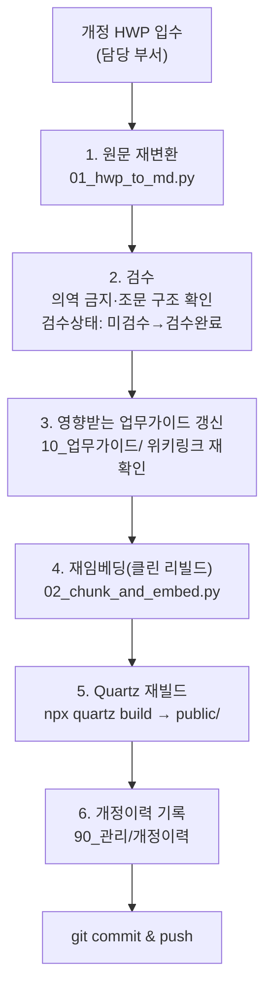
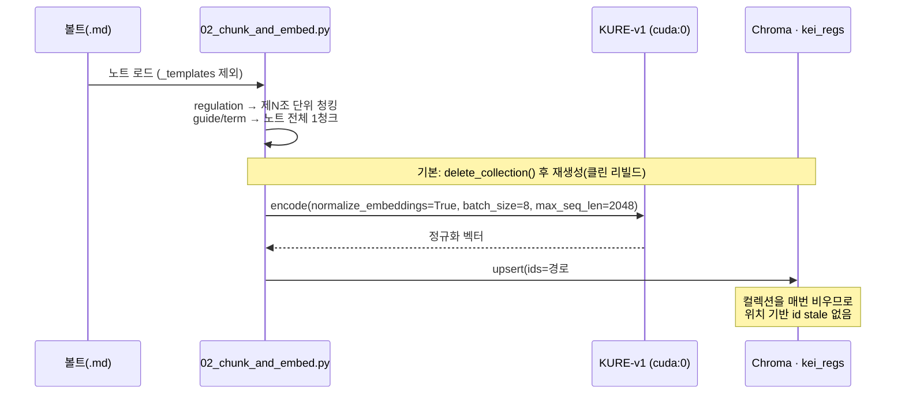
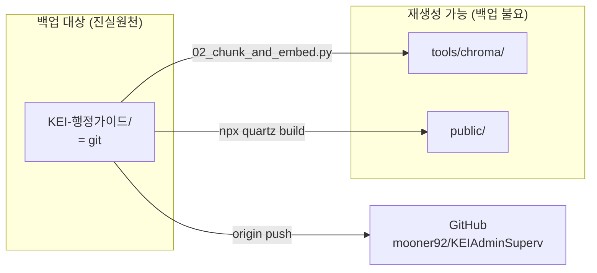
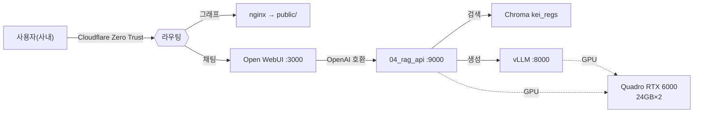

# 10. 운영·유지보수

> 시스템을 "만든 뒤"의 이야기다. 규정이 개정되면 어떻게 반영하고, 무엇을 백업하며, 무엇을 지켜보고, 깨지면 어디부터 보는가.
> 운영의 원칙은 하나다 — **단일 진실원천은 마크다운 볼트(`KEI-행정가이드/`)이고, 그 외 산출물(Chroma 인덱스·Quartz `public/`)은 전부 재생성 가능한 파생물이다.** 헷갈리면 이 문장으로 돌아온다.

---

## 10.1 운영 대상 한눈에

운영은 결국 두 화면을 살아 있게 유지하는 일이다.

| 구성요소 | 역할 | 진실원천인가 | 재생성 방법 |
| --- | --- | --- | --- |
| `KEI-행정가이드/` (볼트) | 마크다운 코퍼스 | ✅ **그렇다** | git에서 복원 (유일한 백업 대상) |
| Chroma 인덱스 (`tools/chroma/`) | 벡터 검색 DB, 컬렉션 `kei_regs` | ❌ 파생물 | `02_chunk_and_embed.py` 재실행 |
| Quartz `public/` | [뇌] 정적 그래프·검색 사이트 | ❌ 파생물 | `npx quartz build` |
| vLLM | [LLM] LLM 서빙(OpenAI 호환) | ❌ 외부/기존 서비스 | 프로세스 재기동 |
| `04_rag_api.py` | 통제형 RAG API (`kei-admin-rag`) | ❌ 코드 | uvicorn 재기동 |
| Open WebUI (Docker) | [LLM] 사용자 UI | ❌ 컨테이너 | compose 재기동 (대화이력은 볼륨) |
| nginx | Quartz 정적 서빙 + 라우팅 | ❌ 설정 | 설정 reload |

> [!note]
> 파생물은 백업하지 않아도 된다. 다만 **재생성 절차가 자동화·문서화되어 있어야** 한다 — 그게 이 문서다.

---

## 10.2 규정 개정 반영 런북

규정이 한 건 개정되면, 볼트→인덱스→두 화면까지 일관되게 흐르도록 아래 6단계를 순서대로 밟는다. 중간에 멈추면 [뇌]와 [LLM]이 서로 다른 사실을 말하게 되므로 **끝까지 한 번에** 진행한다.



### 단계별 절차

#### 1) 원문 재변환

개정된 HWP를 다시 마크다운으로 변환한다. 출력은 `20_규정원문/<분류>/<번호>_<제목>.md`이며, 같은 규정번호면 기존 파일을 덮어쓴다.

```bash
python tools/01_hwp_to_md.py --src <개정HWP폴더> --vault KEI-행정가이드
```

> [!warning]
> **원문층은 의역 금지.** 변환 결과는 HWP 문구를 보존하고, 깨진 표·별표와 명백한 변환 오타만 교정한다. 조문(제N조) 구조를 임의로 합치거나 나누지 않는다 — 청킹이 조문 단위라서 구조가 깨지면 검색 단위가 깨진다. 표·별표가 깨졌으면 §10.7 트러블슈팅의 LibreOffice+VLM 경로(표 3번)로 표만 재추출한다.

#### 2) 검수

변환 직후 프론트매터의 `검수상태`는 `미검수`다. 사람이 원문과 대조해 확인한 뒤에만 `검수완료`로 바꾼다.

- 개정일(`개정일`)·규정번호(`규정번호`)·규정명(`규정명`)이 실제 개정 내용과 일치하는가
- 변경된 조문(특히 금액·한도·기한이 들어간 조)이 원문 그대로인가
- 조문 분할 정규식이 새 구조에서도 제대로 끊었는가

> [!warning]
> 검수 전 산출물을 절대 [LLM]에 노출하지 않는다. `검수상태: 미검수` 노트가 인덱스에 들어가는 것 자체는 막지 않지만, 운영 정책상 **개정 반영은 검수 완료 후 한 호흡에** 끝낸다. 금액·한도·기한이 틀린 답은 행정·회계·감사 영역에서 실제 사고가 된다.

#### 3) 영향받는 업무가이드 갱신

개정된 조문을 인용하던 `10_업무가이드/` 노트를 찾아 갱신한다. 가이드는 항상 `[[규정명#제N조]]` 위키링크로 원문을 가리키므로, 조 번호가 바뀌었다면 링크와 본문 설명을 모두 손봐야 한다.

- 조문 번호가 이동했으면 위키링크 앵커(`#제N조`)를 수정한다.
- 가이드 프론트매터의 `최종검토일`을 갱신하고 `검토자`를 기록한다.
- 영향 범위를 모르면 [뇌] Quartz 그래프에서 해당 규정 노트의 백링크(이웃 노드)를 따라 추적한다 — 이게 그래프 화면이 운영에 주는 가장 실용적인 가치다.

> [!tip]
> "어떤 가이드가 이 조문을 참조하나"는 그래프의 백링크로, "어떤 청크가 인덱스에 들어가나"는 §10.4의 재임베딩으로 각각 확인한다. 둘은 같은 마크다운을 보는 서로 다른 렌즈다.

#### 4) 재임베딩 (02 · 클린 리빌드)

볼트를 다시 청킹·임베딩해 Chroma 컬렉션 `kei_regs`에 반영한다. **02는 기본이 클린 리빌드**다 — 컬렉션을 비우고 처음부터 다시 적재한다. id가 `경로#순번`(위치 기반)이라, 조문이 한 줄만 가감돼도 같은 논리 조문이 다른 id를 받아 stale 벡터가 남을 수 있는데, 전체 재생성이 이 문제를 원천 차단한다. 볼트가 진실원천이라 처음부터 다시 만들어도 부담이 없다(개발 머신 실측 3044청크 약 32초). 자세한 트리거·동작은 §10.4 참조.

```bash
python tools/02_chunk_and_embed.py --vault KEI-행정가이드 --db tools/chroma
# (예외) 컬렉션을 비우지 않고 덧붙이기만:  --no-reset
```

#### 5) Quartz 재빌드

[뇌] 정적 사이트를 다시 만들어 `public/`를 갱신한다. nginx는 `public/`를 서빙하므로 빌드 후 별도 reload 없이 즉시 반영되는 게 보통이지만, 캐시 설정에 따라 nginx reload가 필요할 수 있다.

```bash
npx quartz build        # → public/
# (확인) npx quartz build --serve   # 로컬 :8080 미리보기
```

#### 6) 개정이력 기록 & 커밋

`90_관리/`의 개정이력에 한 줄 남긴다 — 무엇이(규정번호·규정명), 언제(개정일), 누가 반영했고, 어떤 가이드가 영향받았는지. 그 뒤 작은 단위로 커밋·푸시한다.

```bash
git add KEI-행정가이드/
git commit -m "규정 개정 반영: <규정명> (<개정일>)"
git push origin <branch>
```

> [!todo] 확인 필요: 개정이력 노트의 정확한 경로/파일명
> `90_관리/` 안의 개정이력 노트 이름과 양식(테이블 컬럼)은 [03 콘텐츠 모델](03-content-model.md)의 `90_관리` 정의를 따른다. 실제 파일명이 확정되면 위 경로를 갱신한다.

---

## 10.3 개정 반영 체크리스트

복사해서 PR/이슈에 붙여 쓴다.

```markdown
- [ ] 1. 개정 HWP 재변환 (01) → 20_규정원문/<분류>/<번호>_<제목>.md
- [ ] 2. 원문 검수(의역 없음·조문 구조 유지) → 검수상태: 검수완료
- [ ] 3. 영향 업무가이드 위키링크/본문/최종검토일 갱신
- [ ] 4. 재임베딩 (02) — kei_regs 클린 리빌드(컬렉션 비우고 재생성)
- [ ] 5. Quartz 재빌드 (public/) + 필요시 nginx reload
- [ ] 6. 90_관리 개정이력 기록
- [ ] 7. git commit & push (작은 단위)
- [ ] 8. [LLM]에서 개정 조문 질의해 출처 [규정명 제N조]가 새 내용을 가리키는지 확인
```

---

## 10.4 재임베딩: 클린 리빌드 · 트리거 · 메모리 튜닝

### 언제 다시 임베딩하나 (트리거)

| 트리거 | 재임베딩 필요? | 비고 |
| --- | --- | --- |
| 규정 원문(`20_규정원문/`) 추가·개정·삭제 | ✅ 필수 | 개정 런북 4단계 |
| 업무가이드/용어집(`10_`·`30_`) 내용 변경 | ✅ 필수 | 가이드/용어는 노트 전체가 1청크 |
| 프론트매터만 수정(태그·검토일 등) | △ 권장 | 메타데이터가 검색 표시에 쓰이면 반영 |
| 임베딩 모델 교체(KURE-v1 ↔ bge-m3) | ✅ 전체 재생성 | 클린 리빌드면 자동 처리(§10.7 모델 불일치) |
| Chroma 손상/소실 | ✅ 전체 재생성 | 볼트만 있으면 언제든 복구 |

> [!note]
> 정기 크론 주기가 따로 있는 게 아니라 **변경 발생 시점이 곧 트리거**다. 규정 개정은 이벤트성이라 배치보다 런북이 맞다. 운영 인원이 늘어 정기 점검을 돌린다면 "주 1회 볼트 변경분 재임베딩" 정도가 합리적이지만, 그건 정책 결정 사항이다.

### 클린 리빌드가 기본인 이유 (id 위치 기반 stale 차단)

`02_chunk_and_embed.py`의 id는 `f"{c['path']}#{i}"` — **볼트 상대경로 + 청크 순번(위치)** 조합이다. 위치 기반이라, 조문을 한 줄만 추가·삭제해도 그 뒤 모든 청크의 순번이 밀려 **같은 논리적 조문이 다른 id**를 받는다. 단순 upsert만 하면 옛 id가 컬렉션 꼬리에 stale 벡터로 남아, 검색이 사라진 조문이나 옛 내용을 회수할 수 있다.

그래서 **02는 기본이 클린 리빌드**다. 실행 시 `delete_collection("kei_regs")`로 컬렉션을 비운 뒤 `get_or_create_collection(..., hnsw:space=cosine)`로 다시 만들고 전부 적재한다. 볼트가 진실원천이라 처음부터 다시 만들어도 안전하고, 개발 머신 실측 3044청크가 약 32초에 끝난다. stale·삭제 누락 문제를 한 번에 없애는 가장 단순하고 견고한 방식이다.

```bash
# 기본: 컬렉션을 비우고 전체 재생성(권장)
python tools/02_chunk_and_embed.py --vault KEI-행정가이드 --db tools/chroma

# 예외: 비우지 않고 덧붙이기만(증분 실험 등). stale 위험을 감수할 때만
python tools/02_chunk_and_embed.py --vault KEI-행정가이드 --db tools/chroma --no-reset
```

> [!warning]
> `--no-reset`은 위치 기반 id 특성상 **삭제 반영이 안 되고 stale 벡터가 남을 수 있다.** 개정·삭제가 섞였다면 `--no-reset`을 쓰지 말고 기본(클린 리빌드)으로 돌린다. `tools/chroma/`는 gitignore된 재생성 가능 파생물이라 통째로 지우고 다시 만들어도 무방하다.

### 실측 결과 (개발 머신, KURE-v1)

| 항목 | 값 | 비고 |
| --- | --- | --- |
| 총 청크 | **3044** | 조문청크 2933 + 머리말 111 |
| 문서 수 | 111 | 변환 성공분(§10.7 timeout 1건 제외) |
| 머리말 청크 | 111 | 첫 제N조 앞 규정명·제정/개정 이력·표 → 조=`""` 청크 |
| 임베딩 모델 | `nlpai-lab/KURE-v1` | XLM-RoBERTa(BGE-M3 계열), 컨텍스트 8192 |
| 디바이스 | `cuda:0` | 소요 약 32초 |
| 입력 한도 초과 | 41청크 | `max_seq_len 2048` 초과분은 임베딩 시 잘림(긴 조문/일부 머리말) → 향후 하위청킹 과제 |
| 컬렉션 | `kei_regs`, 3044 items | `hnsw:space=cosine` |

01 단계가 넣은 H1 제목·변환 경고 콜아웃은 임베딩 전에 제거해 노이즈를 줄인다. 메타데이터 키는 `규정명 · 규정번호 · 조 · 분류 · 개정일 · 검수상태 · type · path(볼트 상대경로)`. 청크 분할·스키마 세부는 [04 파이프라인](04-pipeline.md)을 따른다.



### GPU 메모리 OOM 튜닝 (batch / max_seq_len)

KURE-v1은 컨텍스트가 8192라, 긴 조문이 섞인 배치를 큰 batch로 돌리면 **CUDA OOM**이 난다. 실제로 개발 머신에서 `batch_size=64` + 긴 조문 조합이 OOM을 냈고, 아래 조합으로 해소했다.

| 노브 | 기본값 | 효과 | 트레이드오프 |
| --- | --- | --- | --- |
| `--batch-size` | **8** | 한 번에 GPU에 올리는 청크 수 ↓ → 피크 VRAM ↓ | 너무 작으면 처리량 ↓ |
| `--max-seq-len` | **2048** | 모델 입력 토큰 상한 ↓ → 긴 청크 메모리 ↓ | 초과 토큰 잘림(41청크 해당) / `0`=모델 기본 8192 |
| `PYTORCH_CUDA_ALLOC_CONF` | `expandable_segments:True` | 메모리 단편화 완화(스크립트가 자동 설정) | — |

```bash
# OOM이 나면 batch부터 줄이고, 그래도 나면 max_seq_len을 낮춘다
python tools/02_chunk_and_embed.py --vault KEI-행정가이드 --db tools/chroma \
  --batch-size 8 --max-seq-len 2048

# 여유 VRAM이 있으면 batch를 키워 처리량을 올려도 된다(사내 GPU: Quadro RTX 6000 24GB×2, 총 48GB)
# (먼저 nvidia-smi로 잔여 VRAM 확인, vLLM과 같은 GPU를 나눠 쓰면 보수적으로)
```

> [!warning]
> **임베딩 품질을 위해 batch/seq_len만 만지고 모델은 양자화하지 않는다.** VRAM이 부족하면 `--batch-size`를 먼저 줄이고, 그래도 OOM이면 `--max-seq-len`을 낮춘다. `max_seq_len`을 낮추면 그 길이를 넘는 청크는 임베딩 시 잘리므로(현행 41청크), 회수 품질과 메모리 사이의 트레이드오프임을 인지한다. 향후 긴 조문 하위청킹으로 근본 해소할 과제다.

---

## 10.5 백업

백업 정책은 §10.1의 "진실원천 vs 파생물" 구분에서 그대로 나온다.

| 대상 | 백업 방식 | 근거 |
| --- | --- | --- |
| **볼트 `KEI-행정가이드/`** | **git = 진실원천. origin(GitHub) + 사내 클론** | 모든 노트·개정이력·템플릿이 여기 있음 |
| Chroma `tools/chroma/` (약 44MB) | **백업 불요(선택)** | 볼트+02로 언제든 재생성. gitignore됨 |
| Quartz `public/` | 백업 불요 | `npx quartz build`로 재생성. gitignore됨 |
| Open WebUI 볼륨(대화이력·계정) | 선택 — Docker 볼륨 스냅샷 | 진실원천 아님. 감사·연속성 필요 시만 |
| `.env`·시크릿 | git 밖에서 별도 보관 | gitignore됨, 절대 커밋 금지 |



### 볼트 백업 = git 운영

- `origin = github.com/mooner92/KEIAdminSuperv` (collaborator: `CrownClownCrowd`)
- 한글 파일명을 쓰므로 `git config core.quotepath false`가 적용돼 있어야 한다 — 클론·복원한 환경에서도 반드시 확인한다.
- 작은 단위로 자주 커밋한다. 변환·생성 노트는 검수 전까지 `검수상태: 미검수`로 둔 채 커밋해도 되지만, 그 노트는 §10.2 정책에 따라 검수 완료 후 [LLM] 반영을 끝낸다.

> [!warning]
> `tools/chroma/`(약 44MB)·`public/`·`models/`·`.env`는 `.gitignore`에 들어 있다. 이들을 백업한다고 git에 강제로 추가하지 않는다 — 진실원천이 아니고(02로 재생성 가능), 용량만 키우며, 시크릿 유출 위험이 있다.

> [!todo] 확인 필요: 사내 추가 백업 대상
> 온프레미스 정책상 GitHub 외 사내 미러/오프라인 백업을 둘지, Open WebUI 대화이력을 감사 목적으로 보존할지는 [07 보안·거버넌스](07-security-governance.md)에서 결정한다.

---

## 10.6 모니터링

매일 보는 건 다섯 가지다: **vLLM · Open WebUI · 디스크 · GPU(Quadro RTX 6000) · nginx.** 모두 사내(`data05lx` 등) 망 안에서 확인하며, 어떤 화면도 인터넷에 노출하지 않는다.

| 대상 | 무엇을 보나 | 빠른 점검 | 빨간불 신호 |
| --- | --- | --- | --- |
| vLLM | OpenAI 호환 엔드포인트 생존 | `curl -s http://localhost:8000/v1/models` | 연결 거부 / 모델 목록 빔 |
| RAG API (`04`) | `kei-admin-rag` 응답·출처 주입 | `curl -s http://<서버IP>:9000/v1/models` | 500 / `x_retrieved` 빔 |
| Open WebUI | UI·로그인·모델 연결 | `docker ps` → `kei-webui` Up, 웹 접속 | 컨테이너 Exit / 모델 안 보임 |
| 디스크 | 모델 가중치·Chroma·로그 여유 | `df -h` | 임베딩/빌드 중 No space |
| GPU(Quadro RTX 6000) | VRAM·사용률·온도 | `nvidia-smi` | OOM / 프로세스 미점유 |
| nginx | Quartz 정적 서빙·라우팅 | `nginx -t` + `systemctl status nginx` | 502/504, config 오류 |

```bash
# GPU(Quadro RTX 6000) — vLLM·임베딩이 실제로 점유 중인지
nvidia-smi

# 디스크 — 모델·Chroma·로그가 차지하는 용량
df -h
du -sh tools/chroma KEI-행정가이드 public 2>/dev/null

# vLLM 생존 + 서빙 모델 확인
curl -s http://localhost:8000/v1/models | head

# Open WebUI / RAG API 컨테이너 상태
docker ps --format 'table {{.Names}}\t{{.Status}}\t{{.Ports}}'

# nginx 설정 검사 & 상태
nginx -t && systemctl status nginx --no-pager
```



> [!note]
> 두 화면 모두 Cloudflare Zero Trust 뒤(사내 전용)에 있다. 모니터링 엔드포인트(`8000`/`9000`/`8080`)는 디버그용이며 인터넷에 열지 않는다. `nvidia-smi`에 vLLM·임베딩 두 프로세스가 같은 Quadro RTX 6000을 나눠 쓰므로, 임베딩 배치를 돌릴 때 vLLM VRAM이 빠듯해질 수 있다 — OOM이 나면 §10.7 GPU 항목을 본다.

> [!todo] 확인 필요: 정식 모니터링 스택
> 현재는 수동 점검(curl/`nvidia-smi`/`df`) 기준이다. Prometheus/Grafana·로그 수집·알림(예: 디스크 80% 경고)을 둘지, 어떤 호스트(`data05lx` 외)에서 돌릴지는 [06 배포](06-deployment.md)·[08 로드맵](08-roadmap.md)에서 정한다.

---

## 10.7 트러블슈팅

증상 → 원인 → 조치 순으로 본다. 자주 밟는 함정 위주다.

| # | 증상 | 원인 | 조치 |
| --- | --- | --- | --- |
| 1 | Open WebUI에서 모델(`kei-admin-rag`)이 안 보이거나 "Connection refused" | 연결 URL을 `localhost`/`host.docker.internal`로 넣음 — 컨테이너 안에서는 자기 자신을 가리켜 호스트 API에 못 닿음 | **서버 실제 IP**로 Base URL 지정 (`http://<서버IP>:9000/v1`). compose의 컨테이너끼리는 서비스명(`kei-rag-api`)으로, 호스트 프로세스로 띄웠다면 `extra_hosts: host.docker.internal:host-gateway`가 있는지 확인 |
| 2 | 특정 HWP가 변환 결과에 안 나옴 | **암호화 HWP**·빈 본문, 또는 **파서 무한루프 timeout** → `01_hwp_to_md.py`가 skip | 암호화면 해제본을 받아 재변환. timeout 1건(여비업무처리기준및QnA개선)은 §10.7 "timeout 파일 fallback 절차"로 격리 처리. skip 로그를 확인해 누락 규정을 추적 |
| 3 | 표·별표가 깨져서 마크다운에 들어옴 | hwp-hwpx-parser가 복잡한 표·별표를 평탄화하지 못함 | LibreOffice + H2Orestart(`ebandal/H2Orestart` oxt) → `soffice --headless --convert-to pdf` → 해당 PDF 페이지를 VLM(**Qwen2.5-VL**)에 넘겨 **표만** 마크다운으로 재추출해 본문 끝 "## (부록) 표"에 보정. 원문 문구는 의역하지 않음 |
| 4 | RAG 답변이 엉뚱하거나 검색이 비어 옴(`x_retrieved` 빈약) | **02(임베딩)와 03/04(질의)의 임베딩 모델 불일치** — 한쪽은 KURE-v1, 다른 쪽은 bge-m3 | 양쪽 `EMBED_MODEL`을 **반드시 동일하게** 맞춘다(현행 `nlpai-lab/KURE-v1`). 모델을 바꿨다면 클린 리빌드로 **전체 재임베딩**(§10.4). 벡터 공간이 다르면 코사인 거리 자체가 무의미 |
| 5 | `kei_regs` 컬렉션 없음 / Chroma 조회 실패 | 02를 한 번도 안 돌렸거나 `--db` 경로 불일치, 또는 `tools/chroma/`가 지워짐(gitignore) | 03/04의 `--db`와 02의 `--db`가 같은 경로인지 확인 후 `02_chunk_and_embed.py` 재실행해 재생성. 볼트만 있으면 항상 복구됨 |
| 6 | [뇌] Quartz 전문검색에서 한글(CJK) 검색이 안 됨 | 검색 인덱스가 CJK 분절을 처리하도록 구성되지 않음 | Quartz 검색 설정에서 CJK/full-text 처리 옵션을 확인하고 재빌드. 한글 파일명·앵커가 깨지면 `git config core.quotepath false`도 함께 확인 |
| 7 | 02 실행 시 torch가 GPU를 못 잡음(`torch.cuda.is_available()`=False, CPU로 느리게 돎) | 기본 PyPI `torch` 휠이 **최신 CUDA(cu130)** 빌드 → 구형 드라이버(R535/CUDA 12.2)에서 CUDA 인식 실패 | 드라이버가 12.x면 **cu124 휠**을 설치한다(CUDA 12.x 마이너버전 호환). `nvidia-smi` 우상단 `CUDA Version`으로 드라이버가 지원하는 상한을 먼저 확인. §아래 "torch CUDA 함정" 참조 |

### timeout 파일 fallback 절차 (여비업무처리기준및QnA개선)

01 변환에서 **1개 파일이 timeout으로 스킵**됐다 — `여비업무처리기준및QnA개선(안)241230(1).hwp`. hwp-hwpx-parser가 이 파일에서 무한루프(100% CPU, 10시간 진행 없음)에 빠져, **파일당 하드 타임아웃(별도 프로세스)**으로 격리했다. 무한루프 자체가 한 건을 통째로 잡아먹지 않게 막은 안전장치이며, 이 1건만 아래 fallback으로 따로 변환한다.

```bash
# 0) 격리 동작 확인 — 01에 파일당 타임아웃(초)을 줘서 무한루프 파일을 자동 스킵
python tools/01_hwp_to_md.py --src <폴더> --vault KEI-행정가이드 --timeout 300

# 1) LibreOffice + H2Orestart(ebandal/H2Orestart oxt)로 PDF 변환
#    (H2Orestart가 .hwp/.hwpx를 LibreOffice가 읽을 수 있게 해 주는 확장)
soffice --headless --convert-to pdf "여비업무처리기준및QnA개선(안)241230(1).hwp"

# 2) 변환된 PDF 페이지를 VLM(Qwen2.5-VL)에 넘겨 본문·표를 마크다운으로 재추출
#    → 20_규정원문/<분류>/<번호>_<제목>.md 로 저장, 원문 문구는 의역하지 않음
```

> [!warning]
> fallback 산출물도 원문층 규칙을 그대로 따른다 — **의역 금지**, 조문(제N조) 구조 보존, `검수상태: 미검수`로 시작해 사람이 검수 완료 후에만 [LLM]에 반영(§10.2). VLM이 표·금액·한도를 옮길 때 특히 원문과 1:1로 대조한다. 이 1건이 변환되기 전까지는 임베딩 문서 수가 111(전체 112 중)임을 인지한다.

### torch CUDA 함정 (드라이버 ↔ 휠 CUDA 버전)

가장 먼저 밟는 환경 함정이다. 기본 `pip install torch`가 가져오는 휠은 **최신 CUDA(cu130)** 빌드라, 개발 머신의 구형 드라이버(R535 / CUDA 12.2)에서 `torch.cuda.is_available()`가 `False`로 나오고 임베딩이 조용히 CPU로 떨어진다. NVIDIA 드라이버는 자기 한도보다 높은 CUDA 런타임을 못 돌린다(상위호환만, 하위호환은 안 됨).

```bash
# 1) 드라이버가 지원하는 CUDA 상한 확인 (우상단 'CUDA Version')
nvidia-smi

# 2) 드라이버가 12.x면 cu124 휠 설치 (CUDA 12.x 마이너버전끼리 호환)
pip install torch --index-url https://download.pytorch.org/whl/cu124

# 3) 실제로 GPU를 잡는지 확인 — True / 디바이스명이 나와야 정상
python -c "import torch; print(torch.cuda.is_available(), torch.cuda.get_device_name(0) if torch.cuda.is_available() else '')"
```

> [!note]
> 실측 환경: GPU 2× Quadro RTX 6000(24GB, 총 48GB), 드라이버 R535/CUDA 12.2, Python 3.13, `torch 2.6.0+cu124`. 핵심은 **휠의 CUDA 버전 ≤ 드라이버가 지원하는 CUDA 버전**. 드라이버가 12.x인데 cu130 휠을 깔면 인식에 실패하므로 cu124로 맞춘다. 드라이버를 갱신·재설치했다면 그 뒤에도 `nvidia-smi`로 다시 확인한다.

### 추가 점검 메모

- **GPU OOM (임베딩):** 큰 batch(예: 64) + 긴 조문 조합에서 CUDA OOM이 난다. 해결은 `--batch-size 8` + `--max-seq-len 2048`(+ 스크립트가 자동 설정하는 `expandable_segments:True`) — 상세 노브·트레이드오프는 §10.4 "GPU 메모리 OOM 튜닝". 임베딩과 vLLM이 같은 GPU를 나눠 쓰면 한쪽이 OOM 날 수 있으니, 대용량 재임베딩은 vLLM 부하가 낮은 시간에 돌리고 `nvidia-smi`로 잔여 VRAM을 확인한다.
- **임베딩은 양자화하지 않는다.** 속도를 위해 임베딩 모델을 양자화하면 검색 품질이 떨어진다 — VRAM이 부족하면 `--batch-size`·`--max-seq-len`을 줄이지 모델을 건드리지 않는다.
- **가드레일 약화 금지:** 답변이 "모른다"고 너무 자주 한다고 해서 시스템 프롬프트의 *"[근거]에 없으면 '규정에서 확인되지 않습니다'"* 규칙을 풀지 않는다. 회수(retrieval) 품질을 올려야 할 신호이지, 가드레일을 끌 신호가 아니다. 답변 끝의 `[규정명 제N조]` 출처와 *"최종 판단은 원문과 담당 부서 확인 바랍니다."* 문구도 유지한다.

> [!warning]
> 4번(모델 불일치)과 5번(컬렉션 없음)이 운영 중 가장 잦은 RAG 장애다. **02·03·04의 `EMBED_MODEL`·`--db`는 항상 한 세트로 움직인다**는 점을 배포 시 못 박아 둔다. 자세한 RAG 설계 의도는 [05 RAG 설계](05-rag-design.md)와 [ADR-0001 임베딩 모델 선택](adr/0001-embedding-kure-v1.md)·[ADR-0003 통제형 RAG API](adr/0003-controlled-rag-api.md) 참조.

---

## 10.8 복구 시나리오 (Chroma 전소)

가장 흔한 "큰" 복구는 인덱스를 처음부터 다시 만드는 것이다. 볼트가 진실원천이라 절차는 짧다.

```bash
# 1) (선택) 손상된 인덱스 제거 — gitignore 대상이라 안전.
#    02가 기본으로 클린 리빌드(컬렉션 비우고 재생성)라 이 단계 없이도 인덱스는 새로 만들어진다.
rm -rf tools/chroma

# 2) 볼트에서 전체 재임베딩(클린 리빌드) → kei_regs 재생성
python tools/02_chunk_and_embed.py --vault KEI-행정가이드 --db tools/chroma

# 3) 회수만으로 동작 확인 (LLM 없이 검색·거리만 확인. 03/04의 EMBED_MODEL은 02와 동일해야 함)
python tools/03_rag_query.py --db tools/chroma --retrieve-only --q "예: 출장 신청은 어떻게 하나요?"

# 4) RAG API / Open WebUI 재기동 후 출처 표기 확인
```

> [!note]
> 위 질의 예시는 **명백한 예시**다. 실제 규정 조문 번호·금액·한도는 단정하지 않으며, 답변은 항상 `[규정명 제N조]` 출처와 면책 문구를 달고 나와야 정상이다.

---

## 관련 문서

- 인덱스: [docs/README.md](README.md)
- 함께 보기: [04 파이프라인](04-pipeline.md) · [05 RAG 설계](05-rag-design.md) · [06 배포](06-deployment.md) · [07 보안·거버넌스](07-security-governance.md)
- 루트: [../README.md](../README.md) · [../CLAUDE.md](../CLAUDE.md) · [../WORKPLAN.md](../WORKPLAN.md)
- 소스: [../tools/01_hwp_to_md.py](../tools/01_hwp_to_md.py) · [../tools/02_chunk_and_embed.py](../tools/02_chunk_and_embed.py) · [../tools/03_rag_query.py](../tools/03_rag_query.py) · [../tools/04_rag_api.py](../tools/04_rag_api.py)

| 이전 | 다음 |
| --- | --- |
| [← 09 기여 가이드](09-contributing.md) | [11 용어집 →](11-glossary.md) |

---

최종 수정: 2026-06-19
