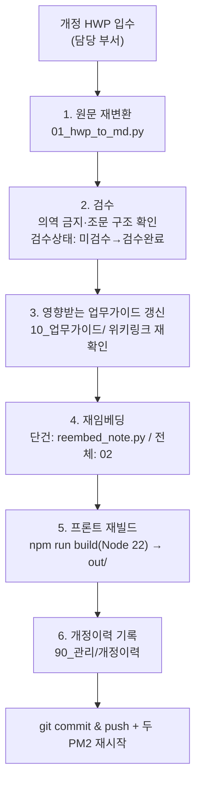
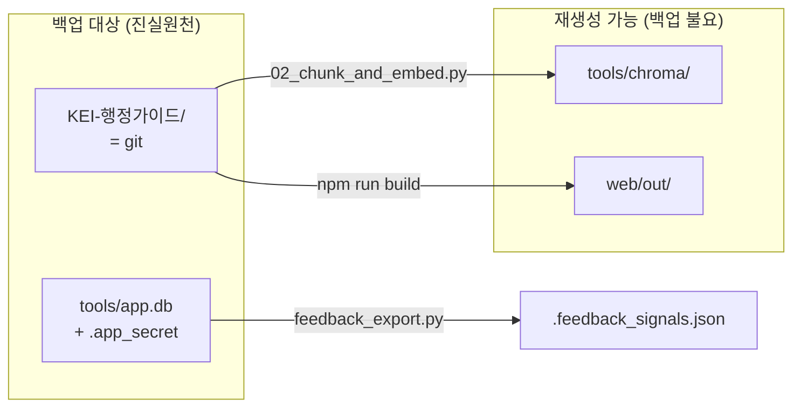

# 10. 운영·유지보수

> 시스템을 "만든 뒤"의 이야기다. 규정이 개정되면 어떻게 반영하고, 무엇을 백업하며, 무엇을 지켜보고, 깨지면 어디부터 보는가.
> 운영의 원칙은 하나다 — **단일 진실원천은 마크다운 볼트(`KEI-행정가이드/`)이고, 그 외 산출물(Chroma 인덱스·정적 사이트 `out/`)은 전부 재생성 가능한 파생물이다.** 헷갈리면 이 문장으로 돌아온다.

---

## 10.1 운영 대상 한눈에

운영은 결국 한 앱 안의 두 화면([뇌] 그래프/둘러보기/문서 + [LLM] RAG 채팅)을 살아 있게 유지하는 일이다. 두 화면은 한 개의 Next.js 14 + Toss Design System 앱(`web/`)에 통합돼 있다.

| 구성요소 | 역할 | 진실원천인가 | 재생성 방법 |
| --- | --- | --- | --- |
| `KEI-행정가이드/` (볼트) | 마크다운 코퍼스 | ✅ **그렇다** | git에서 복원 (백업 대상) |
| `tools/app.db` (SQLite) | 계정·채팅이력·피드백·플래그 | ✅ **그렇다(운영 상태)** | 재생성 불가 — 별도 백업(§10.5) |
| Chroma 인덱스 (`tools/chroma/`) | 벡터 검색 DB, 컬렉션 `kei_regs` | ❌ 파생물 | `02_chunk_and_embed.py` 재실행 |
| 정적 사이트 `web/out/` | [뇌]+[LLM] 통합 앱(빌드 산출물) | ❌ 파생물 | `npm run build`(nvm Node 22) |
| Ollama | [LLM] LLM 서빙(OpenAI 호환, `:11434`) | ❌ 외부/기존 서비스 | 프로세스 재기동 |
| `04_rag_api.py` (`kei-rag-api`) | 통제형 RAG API + `/app/*` 마운트 | ❌ 코드 | PM2 재기동 |
| `web/server.js` (`kei-guide`) | 정적 서빙 + `/api/rag/*` 프록시 | ❌ 코드 | PM2 재기동 |
| nginx + Cloudflare ZT | 사내 라우팅·노출 통제 | ❌ 설정 | 설정 reload |

> [!note]
> 파생물(`chroma/`·`out/`)은 백업하지 않아도 된다 — **재생성 절차가 자동화·문서화돼 있으면** 충분하다(그게 이 문서다). 단 `app.db`는 사용자가 만든 운영 상태(채팅·피드백)라 파생물이 아니다(§10.5).

> [!note]
> 서빙 실측 스택은 **Ollama**(OpenAI 호환 `127.0.0.1:11434/v1`, 모델 `Qwen2.5-14B-Instruct Q4_K_M` GGUF)다. vLLM은 대안 표기일 뿐 현재 돌고 있는 건 Ollama다. Open WebUI는 같은 RAG API를 쓰는 선택적 폴백이며 기본 채택 화면이 아니다(채팅은 `web/` 앱에 통합).

### PM2 프로세스 두 개

운영은 PM2 프로세스 둘로 돈다(정의: [../tools/ecosystem.config.js](../tools/ecosystem.config.js) · [../web/ecosystem.config.js](../web/ecosystem.config.js)).

| 프로세스 | 역할 | 포트 |
| --- | --- | --- |
| `kei-rag-api` | `04_rag_api.py`(uvicorn). OpenAI호환 `/v1/*` + 앱 `/app/*` + `init_db` | 127.0.0.1:9000 |
| `kei-guide` | `web/server.js`(의존성0 정적서버 + `/api/rag/*`→9000 프록시) | 0.0.0.0:3100 |

```bash
pm2 status                      # 두 프로세스 Up 확인
pm2 logs kei-rag-api            # RAG/앱 API 로그
pm2 restart kei-rag-api         # 모델 재로드(워밍업 포함)·DB 스키마 반영
pm2 reload kei-guide            # 프론트 무중단 재시작(빌드 산출물 갱신 후)
```

> [!warning]
> `kei-admin-rag`는 **PM2 프로세스명이 아니라 OpenAI 모델 id**(`RAG_MODEL_ID`)다. 프로세스는 `kei-rag-api`·`kei-guide` 둘뿐이다.

---

## 10.2 규정 개정 반영 런북

규정이 한 건 개정되면, 볼트→인덱스→두 화면까지 일관되게 흐르도록 아래 순서로 밟는다. 중간에 멈추면 [뇌]와 [LLM]이 서로 다른 사실을 말하게 되므로 **끝까지 한 번에** 진행한다.



### 단계별 절차

#### 1) 원문 재변환

개정된 HWP를 다시 마크다운으로 변환한다. 출력은 `20_규정원문/<분류>/<번호>_<제목>.md`이며, 같은 규정번호면 기존 파일을 덮어쓴다.

```bash
python tools/01_hwp_to_md.py --src <개정HWP폴더> --vault KEI-행정가이드
```

> [!warning]
> **원문층은 의역 금지.** 변환 결과는 HWP 문구를 보존하고, 깨진 표·별표와 명백한 변환 오타만 교정한다. 조문(제N조) 구조를 임의로 합치거나 나누지 않는다 — 청킹이 조문 단위라서 구조가 깨지면 검색 단위가 깨진다. 표·별표가 깨졌으면 §10.7 트러블슈팅의 LibreOffice+VLM 경로(표 3번)로 표만 재추출한다.

#### 2) 검수

변환 직후 프론트매터의 `검수상태`는 `미검수`다. 사람이 원문과 대조해 확인한 뒤에만 `검수완료`로 바꾼다.

- 개정일(`개정일`)·규정번호(`규정번호`)·규정명(`규정명`)이 실제 개정 내용과 일치하는가
- 변경된 조문(특히 금액·한도·기한이 들어간 조)이 원문 그대로인가
- 조문 분할 정규식이 새 구조에서도 제대로 끊었는가(별표/별지가 1급 청크로 분리되는가)

> [!tip]
> 무엇부터 검수할지는 검수 큐가 알려준다 — `review_queue.py`(읽기전용)가 유형·별표·미분류·피인용 + 👎피드백으로 미검수 우선순위 점수를 매긴다. 인앱 피드백을 반영하려면 먼저 `python tools/feedback_export.py`를 돌린다(§10.6). ⛔ **검수 '완료'는 사람만** 한다 — 어떤 자동화도 검수상태를 바꾸지 않는다.

> [!warning]
> 검수 전 산출물을 절대 [LLM]에 노출하지 않는다. 운영 정책상 **개정 반영은 검수 완료 후 한 호흡에** 끝낸다. 금액·한도·기한이 틀린 답은 행정·회계·감사 영역에서 실제 사고가 된다.

#### 3) 영향받는 업무가이드 갱신

개정된 조문을 인용하던 `10_업무가이드/` 노트를 찾아 갱신한다. 가이드는 항상 `[[규정명#제N조]]` 위키링크로 원문을 가리키므로, 조 번호가 바뀌었다면 링크와 본문 설명을 모두 손봐야 한다.

- 조문 번호가 이동했으면 위키링크 앵커(`#제N조`)를 수정한다.
- 가이드 프론트매터의 `최종검토일`을 갱신하고 `검토자`를 기록한다.
- 영향 범위를 모르면 [뇌] 그래프 화면(`/graph`)에서 해당 규정 노트의 백링크(이웃 노드)를 따라 추적한다 — 이게 그래프 화면이 운영에 주는 가장 실용적인 가치다.

#### 4) 재임베딩 (단건 우선, 필요 시 전체)

볼트 변경을 Chroma 컬렉션 `kei_regs`에 반영한다. **개정 한 건이면 단건 재임베딩**(`reembed_note.py`)이 빠르고 안전하다 — 검수 도구가 '검수완료' 직후 호출하는 경로다. 대규모 변경·삭제가 섞였거나 인덱스를 처음부터 정리하려면 **02 전체 리빌드**를 쓴다. 자세한 트리거·동작은 §10.4 참조.

```bash
# 단건: 그 노트의 기존 청크를 path로 전부 지우고 새로 적재(자동 Chroma 백업 → 롤백 경로 출력)
python tools/reembed_note.py --vault KEI-행정가이드 \
  --path 20_규정원문/<분류>/<번호>_<제목>.md
pm2 restart kei-rag-api   # 라이브 API가 같은 db를 열고 있으므로 반영하려면 재시작

# 전체(클린 리빌드): 컬렉션을 비우고 처음부터 다시 적재
python tools/02_chunk_and_embed.py --vault KEI-행정가이드 --db tools/chroma
pm2 restart kei-rag-api
```

> [!warning]
> 재임베딩 전 **Chroma 백업이 가드레일**이다. `reembed_note.py`는 기본으로 `<db>.bak.<날짜>`를 자동 생성하고 롤백 명령을 출력한다(`--skip-backup`은 사본 테스트 때만). 02 전체 리빌드 전에도 현 인덱스를 백업해 두면 회귀 비교/롤백이 쉽다. 안전 테스트는 사본(`--db tools/chroma.test`)에 대고 한다.

#### 5) 프론트 재빌드

[뇌]+[LLM] 통합 앱을 다시 만들어 `web/out/`를 갱신한다. 정적 export라 빌드 산출물을 `kei-guide`(server.js)가 서빙한다.

```bash
cd web && VAULT_DIR=/KEIAdminSuperv/KEI-행정가이드 npm run build   # → out/ (+ 드로어용 out/docdata/*.json)
pm2 reload kei-guide
```

> [!warning]
> 빌드는 **반드시 nvm Node 22**로 한다. 기본 node18에서는 docdata emit이 조용히 실패해 문서 드로어가 "문서를 불러오지 못했습니다"로 깨진다(`out/docdata/*.json` 미생성). 빌드 후 `out/docdata/`에 JSON이 생겼는지 확인한다.

#### 6) 개정이력 기록 & 커밋

`90_관리/`의 개정이력에 한 줄 남긴다 — 무엇이(규정번호·규정명), 언제(개정일), 누가 반영했고, 어떤 가이드가 영향받았는지. 그 뒤 작은 단위로 커밋·푸시한다.

```bash
git add KEI-행정가이드/
git commit -m "규정 개정 반영: <규정명> (<개정일>)"
git push origin <branch>
```

> [!warning]
> 공개 레포에는 **코드만** 올라간다. `KEI-행정가이드/`·`research_rule_files/`·`*.hwp`·`*.pdf`·`tools/chroma/`·`tools/app.db`·`.app_secret`·`.feedback_signals.json` 등은 모두 gitignore다. 볼트는 별도 사내 리모트/미러로만 보관한다(§10.5의 [!todo]).

> [!todo] 확인 필요: 개정이력 노트의 정확한 경로/파일명
> `90_관리/` 안의 개정이력 노트 이름과 양식(테이블 컬럼)은 [03 콘텐츠 모델](03-content-model.md)의 `90_관리` 정의를 따른다. 실제 파일명이 확정되면 위 경로를 갱신한다.

---

## 10.3 개정 반영 체크리스트

복사해서 PR/이슈에 붙여 쓴다.

```markdown
- [ ] 1. 개정 HWP 재변환 (01) → 20_규정원문/<분류>/<번호>_<제목>.md
- [ ] 2. 원문 검수(의역 없음·조문 구조 유지) → 검수상태: 검수완료
- [ ] 3. 영향 업무가이드 위키링크/본문/최종검토일 갱신
- [ ] 4. 재임베딩 — 단건 reembed_note.py(자동 백업) 또는 02 클린 리빌드 → pm2 restart kei-rag-api
- [ ] 5. 프론트 재빌드(nvm Node 22, VAULT_DIR 지정) → out/ + docdata 확인 → pm2 reload kei-guide
- [ ] 6. 90_관리 개정이력 기록
- [ ] 7. git commit & push (작은 단위)
- [ ] 8. (개정·평가셋 변경 시) eval before/after — bash eval/run.sh --tag before|after
- [ ] 9. [LLM] 채팅에서 개정 조문 질의해 근거 패널 출처 [규정명 제N조]가 새 내용을 가리키는지 확인
```

---

## 10.4 재임베딩: 클린 리빌드 · 트리거 · 메모리 튜닝

### 언제 다시 임베딩하나 (트리거)

| 트리거 | 재임베딩 필요? | 비고 |
| --- | --- | --- |
| 규정 원문(`20_규정원문/`) 추가·개정·삭제 | ✅ 필수 | 개정 런북 4단계. 한 건이면 `reembed_note.py` |
| 업무가이드/용어집/ERP(`10_`·`30_`·`40_`) 내용 변경 | ✅ 필수 | 가이드/ERP는 헤딩 단위, 용어는 노트 단위 청킹 |
| 프론트매터만 수정(태그·검토일 등) | △ 권장 | 메타데이터가 검색 표시에 쓰이면 반영 |
| 임베딩 모델 교체(KURE-v1 ↔ bge-m3) | ✅ 전체 재생성 | 클린 리빌드면 자동 처리(§10.7 모델 불일치) |
| 청킹 토글 변경(`CHUNK_BYEOLPYO`·`CHUNK_SUBSPLIT`) | ✅ 전체 재생성 | 청크 경계가 바뀌므로 02 전체로 |
| Chroma 손상/소실 | ✅ 전체 재생성 | 볼트만 있으면 언제든 복구(§10.8) |

> [!note]
> 정기 크론 주기가 따로 있는 게 아니라 **변경 발생 시점이 곧 트리거**다. 규정 개정은 이벤트성이라 배치보다 런북이 맞다. 운영 인원이 늘어 정기 점검을 돌린다면 "주 1회 볼트 변경분 재임베딩" 정도가 합리적이지만, 그건 정책 결정 사항이다.

### 단건 vs 전체

- **단건(`reembed_note.py`)**: 02의 청킹을 그대로 재사용해 전체 빌드와 100% 동일하게 자른다. `where={"path": rel}`로 그 노트의 기존 청크를 먼저 전부 삭제한 뒤 `경로#노트로컬순번`으로 다시 add 한다(다음 전체 리빌드 시 전역순번으로 정규화됨). 자동 백업이 기본이고, 라이브 반영은 `pm2 restart kei-rag-api`.
- **전체(`02_chunk_and_embed.py`, 클린 리빌드)**: 컬렉션을 비우고 처음부터 다시 적재. 삭제·대량 변경·토글 변경·모델 교체에 안전한 기본 경로.

### 클린 리빌드가 기본인 이유 (id 위치 기반 stale 차단)

`02_chunk_and_embed.py`의 id는 `f"{c['path']}#{i}"` — **볼트 상대경로 + 청크 순번(위치)** 조합이다. 위치 기반이라, 조문을 한 줄만 추가·삭제해도 그 뒤 모든 청크의 순번이 밀려 **같은 논리적 조문이 다른 id**를 받는다. 단순 upsert만 하면 옛 id가 컬렉션 꼬리에 stale 벡터로 남아, 검색이 사라진 조문이나 옛 내용을 회수할 수 있다.

그래서 **02는 기본이 클린 리빌드**다. 실행 시 컬렉션을 비운 뒤 `hnsw:space=cosine`로 다시 만들고 전부 적재한다. 볼트가 진실원천이라 처음부터 다시 만들어도 안전하다. (단건만 바뀌었을 때는 stale 위험 없이 빠르게 가도록 `reembed_note.py`가 path 메타로 옛 청크를 먼저 지운다.)

```bash
# 기본: 컬렉션을 비우고 전체 재생성(권장)
python tools/02_chunk_and_embed.py --vault KEI-행정가이드 --db tools/chroma

# 예외: 비우지 않고 덧붙이기만(증분 실험 등). stale 위험을 감수할 때만
python tools/02_chunk_and_embed.py --vault KEI-행정가이드 --db tools/chroma --no-reset
```

> [!warning]
> `--no-reset`은 위치 기반 id 특성상 **삭제 반영이 안 되고 stale 벡터가 남을 수 있다.** 개정·삭제가 섞였다면 `--no-reset`을 쓰지 말고 기본(클린 리빌드)으로 돌린다. `tools/chroma/`는 gitignore된 재생성 가능 파생물이라 통째로 지우고 다시 만들어도 무방하다.

### 청킹 단위와 토글

- 규정원문은 **제N조 단위**, 가이드/ERP는 **헤딩(`####`/`##`) 단위**, 용어는 노트 단위로 자른다(고정 길이 청킹 금지).
- **별표/별지 1급 청크**(`CHUNK_BYEOLPYO`, 기본 on): 별표/별지를 독립 청크로 분리(조=`별표 N`, `refs`=인용 조문). 표(별표/별지)는 하위분할하지 않는다.
- **긴 청크 하위분할**(`CHUNK_SUBSPLIT`, 기본 on): `max_seq_len`(2048) 초과 청크를 항(①②)→호(1./가.)→문단→줄 순으로 쪼개 뒷부분(금액·조건) 잘림을 막는다. 조 라벨·메타는 유지하고 하위 인덱스만 `부분` 메타로 표시. 토글을 바꾸면 청크 경계가 달라지므로 **02 전체 리빌드**가 필요하다.

청크 분할·스키마 세부는 [04 파이프라인](04-pipeline.md), 품질 트랙은 [12 품질강화](12-품질강화.md)를 따른다. 메타데이터 키는 `규정명 · 규정번호 · 조 · 분류 · 개정일 · 검수상태 · type · 별표 · refs · 부분 · path`.

### GPU 메모리 OOM 튜닝 (batch / max_seq_len)

KURE-v1은 컨텍스트가 길어, 긴 조문이 섞인 배치를 큰 batch로 돌리면 **CUDA OOM**이 난다. 실제로 개발 머신에서 `batch_size=64` + 긴 조문 조합이 OOM을 냈고, 아래 조합으로 해소했다.

| 노브 | 기본값 | 효과 | 트레이드오프 |
| --- | --- | --- | --- |
| `--batch-size` | **8** | 한 번에 GPU에 올리는 청크 수 ↓ → 피크 VRAM ↓ | 너무 작으면 처리량 ↓ |
| `--max-seq-len` | **2048** | 모델 입력 토큰 상한 ↓ → 긴 청크 메모리 ↓ | 초과분은 잘림(그래서 하위분할 토글로 보완) / `0`=모델 기본 |
| `PYTORCH_CUDA_ALLOC_CONF` | `expandable_segments:True` | 메모리 단편화 완화(스크립트가 자동 설정) | — |

```bash
# OOM이 나면 batch부터 줄이고, 그래도 나면 max_seq_len을 낮춘다
python tools/02_chunk_and_embed.py --vault KEI-행정가이드 --db tools/chroma \
  --batch-size 8 --max-seq-len 2048
```

> [!warning]
> **임베딩 품질을 위해 batch/seq_len만 만지고 모델은 양자화하지 않는다.** VRAM이 부족하면 `--batch-size`를 먼저 줄이고, 그래도 OOM이면 `--max-seq-len`을 낮춘다. GPU는 공유·변동적이므로(2×Quadro RTX 6000 24GB) **배치 전 `nvidia-smi`로 잔여 VRAM을 확인**한다 — CLAUDE.md의 GPU 줄은 항상 최신이 아니다. 대용량 재임베딩은 LLM 부하가 낮은 시간에 돌린다.

---

## 10.5 백업

백업 정책은 §10.1의 "진실원천 vs 파생물" 구분에서 그대로 나온다. **진실원천(볼트·`app.db`)만 백업하고, 파생물(`chroma/`·`out/`)은 백업하지 않는다.**

| 대상 | 백업 방식 | 근거 |
| --- | --- | --- |
| **볼트 `KEI-행정가이드/`** | **git = 진실원천**(사내 리모트/미러) | 모든 노트·개정이력·템플릿이 여기 있음. 공개 레포엔 안 올림(gitignore) |
| **`tools/app.db` (SQLite)** | **파일 스냅샷 백업 필수** | 계정·채팅이력·피드백·플래그(User/ChatSession/Message/Flag/FlagAudit/Feedback). 재생성 불가 |
| `tools/.app_secret` (JWT 서명키) | git 밖에서 안전 보관 | 분실 시 전체 세션 무효화. 0600, gitignore |
| Chroma `tools/chroma/` | **백업 불요(재임베딩 시만 임시 백업)** | 볼트+02로 언제든 재생성. gitignore됨 |
| 정적 사이트 `web/out/` | 백업 불요 | `npm run build`로 재생성. gitignore됨 |
| `.feedback_signals.json` | 백업 불요 | `feedback_export.py`로 app.db에서 재생성. gitignore됨 |



### app.db 백업 (운영 상태)

`app.db`는 사용자가 만든 운영 상태(가입 계정·채팅 기록·👍/👎 피드백·플래그 토글·감사)라 파생물이 아니다. SQLite는 WAL 모드(`app.db-wal`/`app.db-shm` 동반)이므로 안전하게 백업하려면 **온라인 백업 API**를 쓴다.

```bash
# 권장: WAL 일관성을 보장하는 온라인 백업(.backup)
sqlite3 tools/app.db ".backup 'tools/app.db.bak.$(date +%F)'"

# .app_secret(JWT 서명키)도 함께 안전 보관 — 분실 시 모든 로그인 세션이 무효화된다
```

> [!warning]
> `tools/chroma/`·`web/out/`·`tools/app.db`·`tools/.app_secret`·`.feedback_signals.json`·`research_rule_files/`·`*.hwp`·`*.pdf`는 모두 `.gitignore`에 들어 있다. 이들을 백업한다고 공개 git에 강제로 추가하지 않는다 — 데이터·시크릿 유출이고, 진실원천(볼트·app.db)은 사내 경로로만 보관한다.

> [!todo] 확인 필요: 사내 백업 위치·주기
> 볼트 사내 미러 호스트, `app.db`/`.app_secret` 스냅샷의 저장 위치와 보존 주기(예: 일 1회 N일 보관)는 [07 보안·거버넌스](07-security-governance.md)·[06 배포](06-deployment.md)에서 확정한다. 한글 파일명을 쓰므로 클론·복원 환경에서 `git config core.quotepath false` 적용을 반드시 확인한다.

---

## 10.6 모니터링

매일 보는 건 운영자 대시보드 한 화면 + 시스템 점검 몇 가지다. 모두 사내망 안에서 확인하며, 어떤 화면도 인터넷에 노출하지 않는다(Cloudflare Zero Trust 뒤).

### 운영자 대시보드 (`/admin`)

자기개선 루프의 눈이다 — 관리자만 접근(`current_admin`)하며, 데이터는 관리자 전용 `GET /app/stats`에서 온다.

- **활동·거부율**: 답변 중 "규정에서 확인되지 않습니다" 계열을 정규식(`확인되지 않|확인할 수 없|규정에서 확인`)으로 감지해 거부율 산출. 거부율이 높아지면 회수(retrieval) 품질·콘텐츠 갭 신호다(가드레일을 끌 신호가 아니다).
- **피드백**: 👍/👎 집계.
- **인기 질문·콘텐츠 갭**: 무엇을 자주 묻는지, 어디서 답을 못 하는지 → 검수 큐·콘텐츠 로드맵으로 환류.

> [!note]
> 🔒 개인정보: 서버사이드 RAG라 진짜 E2E 암호화는 불가하지만, ⓐ 관리자도 타인 채팅을 읽는 엔드포인트가 없고(`get_chat` 소유자 검증), ⓑ `/stats`·`/feedback`은 질문·답변 본문을 반환하지 않으며(규정 메타·집계만), ⓒ 인기질문/갭은 서로 다른 사용자 K명(기본 `STATS_MIN_USERS=3`) 이상인 항목만 k-익명 집계한다 — 누가 물었는지 드러나지 않는다.

### 인앱 피드백 → 검수 신호

채팅 답변의 👍/👎(+사유)는 `Feedback` 테이블에 쌓인다(사용자·메시지당 1건 upsert/toggle, 소유 격리). 이를 검수 우선순위로 환류하려면:

```bash
# app.db(읽기 전용) → tools/.feedback_signals.json (gitignore, 규정 스니펫 포함)
python tools/feedback_export.py
# review_queue.py 가 --feedback 으로 소비 → 👎 자주 받은 규정이 검수 큐 상단으로
python tools/review_queue.py --feedback tools/.feedback_signals.json
```

> [!warning]
> ⛔ 이 신호는 "무엇부터 다시 볼지" **순서만** 바꾼다. 검수상태(미검수→검수완료)를 자동으로 바꾸지 않는다 — 검수 '완료'는 사람만 한다. 상세 루프는 [14 피드백 루프](14-feedback-loop.md) 참조.

### 시스템 점검

| 대상 | 무엇을 보나 | 빠른 점검 | 빨간불 신호 |
| --- | --- | --- | --- |
| Ollama | OpenAI 호환 엔드포인트 생존 | `curl -s http://127.0.0.1:11434/v1/models` | 연결 거부 / 모델 목록 빔 |
| RAG API (`kei-rag-api`) | `/v1/*`·`/app/*` 응답·출처 주입 | `curl -s http://127.0.0.1:9000/v1/models` · `pm2 status` | 500 / `x_sources` 빔 / 프로세스 Down |
| 프론트 (`kei-guide`) | 정적 서빙·프록시 | `curl -s http://127.0.0.1:3100/api/rag/health` | 502 / 드로어 "문서를 불러오지 못했습니다" |
| 디스크 | 모델 가중치·Chroma·로그·app.db 여유 | `df -h` | 임베딩/빌드 중 No space |
| GPU(2×Quadro RTX 6000) | VRAM·사용률·온도 | `nvidia-smi` | OOM / 프로세스 미점유 |
| nginx | 정적 서빙·라우팅 | `nginx -t` + `systemctl status nginx` | 502/504, config 오류 |

```bash
# GPU — Ollama(LLM)·임베딩·리랭커가 실제로 점유 중인지 (공유·변동적이라 매번 확인)
nvidia-smi

# 디스크 — 모델·Chroma·로그·app.db 용량
df -h
du -sh tools/chroma KEI-행정가이드 web/out tools/app.db 2>/dev/null

# Ollama 생존 + 서빙 모델 확인
curl -s http://127.0.0.1:11434/v1/models | head

# PM2 프로세스 상태
pm2 status
```

> [!note]
> 모니터링 엔드포인트(`11434`/`9000`/`3100`)는 사내·디버그용이며 인터넷에 열지 않는다. RAG API는 기동 시 워밍업(임베딩 KURE-v1 로드 + LLM `keep_alive=-1` 상주)과 주기 keep-alive(`OLLAMA_PING_SECONDS` 기본 240s)로 콜드스타트를 막는다 — `pm2 restart kei-rag-api` 직후 첫 응답은 워밍업 때문에 잠깐 느릴 수 있다.

> [!todo] 확인 필요: 정식 모니터링 스택·호스트
> 현재는 대시보드 + 수동 점검(curl/`nvidia-smi`/`df`/`pm2`) 기준이다. Prometheus/Grafana·로그 수집·알림(예: 디스크 80% 경고)을 둘지, 어떤 사내 호스트에서 돌릴지는 [06 배포](06-deployment.md)·[08 로드맵](08-roadmap.md)에서 정한다.

---

## 10.7 기능 플래그 운영

deploy/release를 코드 한 벌로 분리한다 — 포트를 새로 열지 않고 기능을 켜고 끈다.

- 백엔드: 코드 레지스트리 `FLAG_REGISTRY` + SQLite `Flag`/`FlagAudit`. 공개 `GET /app/flags`는 비민감 불리언만 반환.
- 토글·감사는 **관리자 전용**(`current_admin`). 관리자는 `APP_ADMINS`(쉼표 구분 아이디)에 명시한 계정뿐이다. **fail-closed** — `APP_ADMINS` 미설정이면 아무도 관리자가 아니고(공개 register로 인한 권한상승 방지), 첫 가입자 부트스트랩은 없다.
- 프론트: 정적 export라 빌드에 박지 않고 `lib/flags.tsx`(`useFlag`)가 런타임 fetch(안전 기본값 + localStorage 캐시 + 폴백). 관리자 페이지 `/admin`에서 즉시 토글.

```bash
# 운영자 계정을 관리자로 지정(미지정이면 아무도 토글 불가) — ecosystem.config.js env로 박는다
# 예: APP_ADMINS="<운영자아이디>"  → pm2 restart kei-rag-api 로 반영
pm2 restart kei-rag-api
```

> [!warning]
> `APP_ADMINS`는 운영자 본인 계정으로 반드시 명시한다(미설정이면 플래그 토글이 잠긴 채 운영된다). 변경 후 `pm2 restart kei-rag-api`로 반영한다. 상세는 [13 기능 플래그](13-feature-flags.md) 참조.

---

## 10.8 레거시(v1.0.0) 동시 운영

새 버전마다 통째로 동결하는 대신 기능 플래그(§10.7)로 가는 게 기본 방향이지만, **플래그가 못 막는 '심층 롤백'(아키텍처 통째 회귀)의 안전망**으로 v1.0.0을 `.legacy-v1/`에 완전 격리해 둔다.

| 버전 | 위치 | 프론트 포트 | RAG API 포트 |
| --- | --- | --- | --- |
| 현행(dev `feat/0620`) | 루트(`web/`·`tools/`) | 3100 | 9000 |
| 레거시 v1.0.0(동결) | `.legacy-v1/` | 3101 | 9001 |

`.legacy-v1/`은 그 시점의 `app_api.py`·`04_rag_api.py`·`rag_core.py`·`server.js`·`out/`·`chroma/`·`app.db`를 자체 사본으로 갖는다(현행과 db·시크릿이 분리됨). 레거시를 띄울 때는 포트만 달리해 환경변수로 기동한다(`server.js`는 `PORT`/`RAG_PORT`, RAG API는 uvicorn `--port`).

> [!warning]
> 레거시는 **완전 격리**가 원칙이다 — 현행과 `chroma/`·`app.db`·`.app_secret`을 공유하지 않는다. 평소엔 내려두고, 현행에서 심층 결함이 확인됐을 때만 안전망으로 올린다. 새 버전마다 포트(3102…)를 추가로 열지 않는다 — 운영 포트는 3100/3101 둘로 충분하다([13 기능 플래그](13-feature-flags.md)).

> [!todo] 확인 필요: 레거시 기동 스크립트/PM2 등록
> `.legacy-v1/`을 3101/9001로 올리는 정식 절차(PM2 앱명·env 세트)가 별도 ecosystem 파일로 고정돼 있는지, 수동 기동인지는 [06 배포](06-deployment.md)에서 확정한다.

---

## 10.9 RAG 검색·생성 운영 노브

검색·생성 동작은 `rag_core.py`가 공용으로 담당하고, 환경변수로 운영 중 조절한다(기본값은 [../tools/ecosystem.config.js](../tools/ecosystem.config.js)).

| 환경변수 | 기본 | 효과 | 실패 시 |
| --- | --- | --- | --- |
| `RAG_RERANK` | on | 밀집 top-20 → `bge-reranker-v2-m3` 재점수 → top-5(strict Hit@1 0.600→0.829) | 밀집으로 우아하게 강등 |
| `RAG_RERANK_DEVICE` | `cuda:1` | 리랭커 배치 GPU. CPU는 ~14s라 부적합 | — |
| `RAG_QUERY_REWRITE` | on | 멀티턴 후속 질문을 독립 검색어로 재작성(검색어만 바뀜, 답변·근거는 불변) | 원 질문으로 강등 |
| `RAG_TOPK` | 5 | 근거로 넘기는 청크 수 | — |
| `RAG_SECTION_DIVERSITY` | off | 섹션 다양성 강제(측정상 이득 없어 opt-in) | — |

> [!warning]
> **가드레일 약화 금지.** 답변이 "모른다"고 자주 한다고 해서 *"[근거]에 없으면 '규정에서 확인되지 않습니다'"* 규칙이나 출처 `[규정명 제N조]`·면책 문구를 풀지 않는다 — 면책은 `_ensure_disclaimer`로 100% 보장된다. 거부율이 높으면 회수 품질을 올리거나(리랭커·재임베딩·콘텐츠 갭) 검수 큐로 환류할 신호이지, 가드레일을 끌 신호가 아니다. 하이브리드(BM25+RRF)는 평가상 이득이 없어 기본 off(opt-in 인프라만 보존). 상세 설계는 [05 RAG 설계](05-rag-design.md)·[12 품질강화](12-품질강화.md) 참조.

---

## 10.10 트러블슈팅

증상 → 원인 → 조치 순으로 본다. 자주 밟는 함정 위주다.

| # | 증상 | 원인 | 조치 |
| --- | --- | --- | --- |
| 1 | 채팅이 답을 못 받음 / 근거 패널 빔 | `kei-rag-api` Down, 또는 `kei-guide` 프록시가 9000에 못 닿음 | `pm2 status`로 두 프로세스 Up 확인 → `curl 127.0.0.1:9000/v1/models` → 프록시 헬스 `curl 127.0.0.1:3100/api/rag/health`. 쿠키 인증은 same-origin(server.js 프록시)만 통한다 |
| 2 | 문서 드로어가 "문서를 불러오지 못했습니다" | 빌드를 node18로 돌려 `out/docdata/*.json` 미생성 | **nvm Node 22**로 `VAULT_DIR=... npm run build` 재실행 → `out/docdata/`에 JSON 생겼는지 확인 → `pm2 reload kei-guide` |
| 3 | 특정 HWP가 변환 결과에 안 나옴 | **암호화 HWP**·빈 본문, 또는 **파서 무한루프 timeout** → `01_hwp_to_md.py`가 skip | 암호화면 해제본 재변환. timeout 파일은 §10.7→아래 "timeout 파일 fallback 절차"로 격리 처리. skip 로그로 누락 규정 추적 |
| 4 | 표·별표가 깨져서 마크다운에 들어옴 | hwp-hwpx-parser가 복잡한 표·별표를 평탄화 못함 | LibreOffice + H2Orestart(`ebandal/H2Orestart` oxt) → `soffice --headless --convert-to pdf` → 해당 PDF 페이지를 VLM(**Qwen2.5-VL**)에 넘겨 **표만** 마크다운으로 재추출. 원문 문구는 의역하지 않음 |
| 5 | RAG 답변이 엉뚱하거나 검색이 비어 옴(`x_sources` 빈약) | **02(임베딩)와 03/04(질의)의 임베딩 모델 불일치** — 한쪽 KURE-v1, 다른 쪽 bge-m3 | 양쪽 `EMBED_MODEL`을 **반드시 동일하게**(현행 `nlpai-lab/KURE-v1`). 모델을 바꿨다면 클린 리빌드로 **전체 재임베딩**(§10.4). 벡터 공간이 다르면 코사인 거리 자체가 무의미 |
| 6 | `kei_regs` 컬렉션 없음 / Chroma 조회 실패 | 02를 한 번도 안 돌렸거나 `--db`/`CHROMA_DIR` 경로 불일치, 또는 `tools/chroma/`가 지워짐(gitignore) | 02·03·04의 `--db`/`CHROMA_DIR`가 같은 경로인지 확인 후 02 재실행해 재생성. 볼트만 있으면 항상 복구됨(§10.11) |
| 7 | 02 실행 시 torch가 GPU를 못 잡음(`is_available()`=False, CPU로 느리게) | 기본 PyPI `torch` 휠이 **최신 CUDA(cu130)** 빌드 → 구형 드라이버(R535/CUDA 12.2)에서 CUDA 인식 실패 | 드라이버가 12.x면 **cu124 휠** 설치(CUDA 12.x 마이너 호환). `nvidia-smi` 우상단 `CUDA Version`으로 상한 확인. 아래 "torch CUDA 함정" 참조 |
| 8 | 플래그 토글이 잠겨 있음(/admin에서 토글 불가) | `APP_ADMINS` 미설정(fail-closed) 또는 본인 계정 미포함 | `APP_ADMINS`에 운영자 아이디를 넣고 `pm2 restart kei-rag-api`(§10.7) |

### timeout 파일 fallback 절차

01 변환에서 일부 파일이 hwp-hwpx-parser 무한루프(100% CPU, 진행 없음)에 빠질 수 있다. **파일당 하드 타임아웃(별도 프로세스)**으로 한 건이 전체 변환을 잡아먹지 않게 격리하고, 그 건만 아래 fallback으로 따로 변환한다.

```bash
# 0) 격리 동작 — 파일당 타임아웃(초)을 줘서 무한루프 파일을 자동 스킵
python tools/01_hwp_to_md.py --src <폴더> --vault KEI-행정가이드 --timeout 300

# 1) LibreOffice + H2Orestart(ebandal/H2Orestart oxt)로 PDF 변환
soffice --headless --convert-to pdf "<문제파일>.hwp"

# 2) 변환된 PDF 페이지를 VLM(Qwen2.5-VL)에 넘겨 본문·표를 마크다운으로 재추출
#    → 20_규정원문/<분류>/<번호>_<제목>.md 로 저장, 원문 문구는 의역하지 않음
```

> [!warning]
> fallback 산출물도 원문층 규칙을 그대로 따른다 — **의역 금지**, 조문(제N조) 구조 보존, `검수상태: 미검수`로 시작해 사람이 검수 완료 후에만 [LLM]에 반영(§10.2). VLM이 표·금액·한도를 옮길 때 특히 원문과 1:1로 대조한다.

### torch CUDA 함정 (드라이버 ↔ 휠 CUDA 버전)

가장 먼저 밟는 환경 함정이다. 기본 `pip install torch`가 가져오는 휠은 **최신 CUDA(cu130)** 빌드라, 구형 드라이버(R535 / CUDA 12.2)에서 `torch.cuda.is_available()`가 `False`로 나오고 임베딩이 조용히 CPU로 떨어진다. NVIDIA 드라이버는 자기 한도보다 높은 CUDA 런타임을 못 돌린다(상위호환만).

```bash
# 1) 드라이버가 지원하는 CUDA 상한 확인 (우상단 'CUDA Version')
nvidia-smi

# 2) 드라이버가 12.x면 cu124 휠 설치 (CUDA 12.x 마이너버전끼리 호환)
pip install torch --index-url https://download.pytorch.org/whl/cu124

# 3) 실제로 GPU를 잡는지 확인 — True / 디바이스명이 나와야 정상
python -c "import torch; print(torch.cuda.is_available(), torch.cuda.get_device_name(0) if torch.cuda.is_available() else '')"
```

> [!note]
> 핵심은 **휠의 CUDA 버전 ≤ 드라이버가 지원하는 CUDA 버전**. 드라이버가 12.x인데 cu130 휠을 깔면 인식에 실패하므로 cu124로 맞춘다. 드라이버를 갱신·재설치했다면 그 뒤에도 `nvidia-smi`로 다시 확인한다.

### 추가 점검 메모

- **GPU OOM (임베딩):** 큰 batch + 긴 조문 조합에서 CUDA OOM. 해결은 `--batch-size 8` + `--max-seq-len 2048`(+ 자동 `expandable_segments:True`) — 상세는 §10.4. 임베딩·LLM·리랭커가 GPU를 나눠 쓰므로 대용량 재임베딩은 LLM 부하가 낮은 시간에 돌리고 `nvidia-smi`로 잔여 VRAM을 확인한다.
- **임베딩은 양자화하지 않는다.** 속도를 위해 임베딩 모델을 양자화하면 검색 품질이 떨어진다 — VRAM이 부족하면 `--batch-size`·`--max-seq-len`을 줄이지 모델을 건드리지 않는다.
- **검증은 평가셋으로.** 검색 품질 회귀가 의심되면 같은 평가셋으로 before/after를 잰다: `bash eval/run.sh --tag before` → 변경 → `--tag after`(Hit/Recall/MRR, `--judge`로 충실도·거부율까지). 백엔드 단위 테스트는 `tools/test_feedback.py`·`tools/test_stats.py`(LLM 불필요), 프론트 실렌더는 `web/verify-*.mjs`(Playwright). 상세는 [12 품질강화](12-품질강화.md)·`eval/README.md`.

> [!warning]
> 5번(모델 불일치)과 6번(컬렉션 없음)이 운영 중 가장 잦은 RAG 장애다. **02·03·04의 `EMBED_MODEL`·`CHROMA_DIR`(`--db`)는 항상 한 세트로 움직인다.** 자세한 RAG 설계 의도는 [05 RAG 설계](05-rag-design.md)와 [ADR-0001 임베딩 모델 선택](adr/0001-embedding-kure-v1.md)·[ADR-0003 통제형 RAG API](adr/0003-controlled-rag-api.md) 참조.

---

## 10.11 복구 시나리오 (Chroma 전소)

가장 흔한 "큰" 복구는 인덱스를 처음부터 다시 만드는 것이다. 볼트가 진실원천이라 절차는 짧다.

```bash
# 1) (선택) 손상된 인덱스 제거 — gitignore 대상이라 안전.
#    02가 기본으로 클린 리빌드라 이 단계 없이도 인덱스는 새로 만들어진다.
rm -rf tools/chroma

# 2) 볼트에서 전체 재임베딩(클린 리빌드) → kei_regs 재생성
python tools/02_chunk_and_embed.py --vault KEI-행정가이드 --db tools/chroma

# 3) 회수만으로 동작 확인 (LLM 없이 검색·거리만. 03/04의 EMBED_MODEL은 02와 동일해야 함)
python tools/03_rag_query.py --db tools/chroma --q "예: 출장 신청은 어떻게 하나요?"

# 4) RAG API 재기동 후 채팅에서 출처 표기 확인
pm2 restart kei-rag-api
```

> [!note]
> 위 질의 예시는 **명백한 예시**다. 실제 규정 조문 번호·금액·한도는 단정하지 않으며, 답변은 항상 `[규정명 제N조]` 출처와 면책 문구를 달고 나와야 정상이다.

> [!note]
> `app.db`가 손상됐다면 §10.5의 스냅샷에서 복원한다(Chroma와 달리 재생성 불가). 복원 후 `pm2 restart kei-rag-api`로 `init_db`가 스키마를 확인하게 한다.

---

## 관련 문서

- 인덱스: [docs/README.md](README.md)
- 함께 보기: [04 파이프라인](04-pipeline.md) · [05 RAG 설계](05-rag-design.md) · [06 배포](06-deployment.md) · [07 보안·거버넌스](07-security-governance.md) · [12 품질강화](12-품질강화.md) · [13 기능 플래그](13-feature-flags.md) · [14 피드백 루프](14-feedback-loop.md)
- 루트: [../README.md](../README.md) · [../CLAUDE.md](../CLAUDE.md) · [../WORKPLAN.md](../WORKPLAN.md)
- 소스: [../tools/01_hwp_to_md.py](../tools/01_hwp_to_md.py) · [../tools/02_chunk_and_embed.py](../tools/02_chunk_and_embed.py) · [../tools/reembed_note.py](../tools/reembed_note.py) · [../tools/03_rag_query.py](../tools/03_rag_query.py) · [../tools/04_rag_api.py](../tools/04_rag_api.py) · [../tools/feedback_export.py](../tools/feedback_export.py) · [../tools/review_queue.py](../tools/review_queue.py)

| 이전 | 다음 |
| --- | --- |
| [← 09 기여 가이드](09-contributing.md) | [11 용어집 →](11-glossary.md) |

---

최종 수정: 2026-06-21
