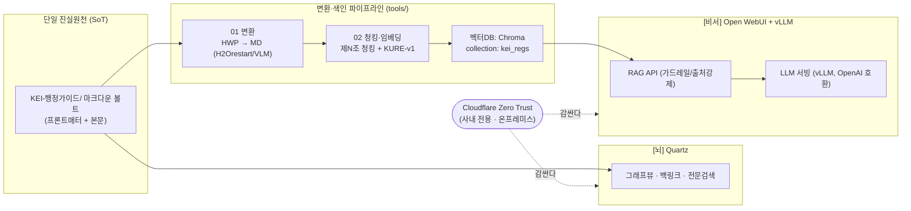

# 11. 용어집 (프로젝트)

> KEI 행정 가이드 / 행정 비서 시스템을 만들고 운영할 때 등장하는 기술·프로젝트 용어를 한곳에 모았다.
> 처음 보는 단어가 나오면 여기를 먼저 확인하면 된다.

이 문서는 **시스템(기술/아키텍처) 용어집**이다.
행정 업무에서 쓰이는 개념(예: 출장, 여비, 결재 등)을 정의하는 **행정 용어집**은 볼트 안의 `KEI-행정가이드/30_용어집/`(개념 1개 = 노트 1개)에 따로 존재한다.
즉, **이 문서는 "시스템을 만드는 사람"을 위한 용어**이고, `30_용어집`은 **"행정 업무를 처리하는 사람"을 위한 용어**다. 둘을 혼동하지 말 것.

---

## 한눈에 보는 그림

이 프로젝트는 **하나의 볼트, 두 개의 화면**으로 요약된다. 아래 용어들이 어디에 붙는지 먼저 감을 잡자.

---

## 용어 정의

| 용어 | 정의 | 비고 / 링크 |
| --- | --- | --- |
| **RAG** (Retrieval-Augmented Generation) | 질문과 관련된 문서 조각을 먼저 **검색(retrieve)** 해서 LLM에게 근거로 넘긴 뒤 답을 **생성(generate)** 하게 하는 방식. 모델이 기억에 의존해 지어내지 않고, 검색된 사내 규정을 근거로 답하게 만든다. | 본 프로젝트의 [비서] 핵심. → [05-rag-design.md](05-rag-design.md), [adr/0003-controlled-rag-api.md](adr/0003-controlled-rag-api.md) |
| **임베딩** (Embedding) | 텍스트를 의미가 담긴 고차원 벡터로 바꾸는 것. 의미가 비슷하면 벡터도 가깝다. 검색은 "질문 임베딩"과 "조문 임베딩"의 거리를 비교해 이뤄진다. | `normalize_embeddings=True`, 양자화 안 함. 모델은 `nlpai-lab/KURE-v1`. → [adr/0001-embedding-kure-v1.md](adr/0001-embedding-kure-v1.md) |
| **청킹** (Chunking) | 긴 문서를 검색·임베딩하기 좋은 작은 단위(청크)로 자르는 것. 청크가 곧 검색 결과의 최소 단위가 된다. | 본 프로젝트는 **고정 길이 청킹을 금지**한다. → [04-pipeline.md](04-pipeline.md), `../tools/02_chunk_and_embed.py` |
| **제N조 청킹** (Article-level chunking) | 규정 원문을 **조문 1개 = 청크 1개**로 자르는 본 프로젝트의 청킹 규칙. 정규식 `(?=^\s*제\s*\d+\s*조)`로 분할한다. 한 조 = 한 의미 단위이므로 출처를 `[규정명 제N조]`로 깔끔히 달 수 있다. | `02_chunk_and_embed.py`의 `regulation` 처리. → [adr/0002-article-level-chunking.md](adr/0002-article-level-chunking.md) |
| **벡터DB** (Vector Database) | 임베딩 벡터를 저장하고, 질의 벡터와 가까운 것을 빠르게 찾아주는 DB. | 본 프로젝트는 Chroma 사용. |
| **Chroma** | 본 프로젝트가 쓰는 벡터DB. `PersistentClient(path)`로 로컬 디스크에 저장, collection 이름은 **`kei_regs`**, 거리 측정은 메타 `hnsw:space=cosine`(코사인). | `tools/chroma/`는 `.gitignore` 대상. → `../tools/02_chunk_and_embed.py` |
| **vLLM** | LLM을 빠르게 서빙하는 추론 엔진. **OpenAI 호환 API**를 제공하므로 클라이언트가 OpenAI SDK 그대로 붙는다. 기본 주소 `http://localhost:8000/v1`. | 모델은 일반 instruct(`Qwen/Qwen2.5-14B-Instruct` 등). 코더/VL 모델 아님. → [06-deployment.md](06-deployment.md) |
| **OpenAI 호환 API** | OpenAI의 `/v1/models`, `/v1/chat/completions` 같은 엔드포인트 규격을 그대로 따르는 API. 덕분에 vLLM, 우리 RAG API, Open WebUI가 표준 인터페이스로 연결된다. | `api_key=EMPTY`로 호출(인증은 망/Zero Trust가 담당). → `../tools/04_rag_api.py` |
| **KURE-v1** (`nlpai-lab/KURE-v1`) | 본 프로젝트의 **기본 임베딩 모델**. 한국어 규정 검색 품질을 우선해 선택했다. 양자화하지 않고 사내 GPU에서 구동. | 02와 03/04의 임베딩 모델은 **반드시 동일**해야 함. → [adr/0001-embedding-kure-v1.md](adr/0001-embedding-kure-v1.md) |
| **BGE-M3** (`BAAI/bge-m3`) | 임베딩 모델 **대안**. KURE-v1 대비 검증이 필요할 때 비교 후보로 둔다. | 채택 모델을 바꾸면 색인을 다시 만들어야 함. → [adr/0001-embedding-kure-v1.md](adr/0001-embedding-kure-v1.md) |
| **Quartz** | 마크다운 볼트를 정적 사이트로 빌드하는 도구(v5, Node v22+). **[뇌]** 화면을 만든다 — 노드/링크 그래프뷰와 전문검색으로 사람이 직접 탐색. `build → public/ → nginx`. | 채팅이 아니라 "탐색"용. → [adr/0004-quartz-graph-site.md](adr/0004-quartz-graph-site.md), [06-deployment.md](06-deployment.md) |
| **백링크** (Backlink) | "이 노트를 링크한 다른 노트들"의 역방향 목록. 위키링크 `[[...]]`로 연결된 문서끼리 양방향 관계를 드러낸다. | Quartz가 자동 생성. 가이드↔규정 연결 탐색에 유용. |
| **그래프뷰** (Graph view) | 노트를 점, 링크를 선으로 그린 시각화. 규정·가이드·용어가 어떻게 얽혀 있는지 한눈에 보여준다. | **주의:** [비서]의 채팅은 이 그림을 읽지 않는다. 채팅은 텍스트+임베딩 검색으로 답한다. |
| **Cloudflare Zero Trust** | 사내 전용 접근을 강제하는 보안 경계. 두 화면([뇌]·[비서]) 모두 이 뒤에 둔다. 인증된 사내 사용자만 도달할 수 있게 한다. | 내부 규정이므로 어떤 화면도 인터넷에 공개하지 않는다. → [07-security-governance.md](07-security-governance.md), [adr/0005-on-prem-zero-trust.md](adr/0005-on-prem-zero-trust.md) |
| **H2Orestart** | LibreOffice에 HWP/HWPX 읽기를 추가하는 확장(`.oxt`). `hwp-hwpx-parser`로 표/별표가 깨질 때, LibreOffice로 PDF 변환하는 우회 경로에서 쓴다. | `ebandal/H2Orestart` 릴리스의 oxt를 `unopkg add`. → [04-pipeline.md](04-pipeline.md), `../deploy/setup_ubuntu_hwp.sh` |
| **VLM** (Vision-Language Model) | 이미지(PDF 페이지)를 보고 텍스트/표를 추출하는 멀티모달 모델. 표가 깨진 페이지를 PDF로 만들어 VLM에 넘겨 **표만 마크다운으로 재추출**하는 보조 경로에 사용. | 사용 모델: `Qwen2.5-VL`. 본 변환의 최후 수단. → [04-pipeline.md](04-pipeline.md) |
| **프론트매터** (Frontmatter) | 마크다운 파일 맨 위 `---` 사이에 두는 YAML 메타데이터. 노트의 종류(`type`)와 속성을 정의한다. | 스키마 3종: `regulation` / `guide` / `term`. → [03-content-model.md](03-content-model.md) |
| **검수상태** | `regulation` 프론트매터의 필드. 값은 **`미검수` 또는 `검수완료`**. 자동 변환·생성물은 사람이 확인하기 전까지 `미검수`로 남는다. | 변환 직후 기본값은 `미검수`. → [03-content-model.md](03-content-model.md), [09-contributing.md](09-contributing.md) |
| **단일 진실원천 (SoT)** (Source of Truth) | 사실의 유일한 출처. 본 프로젝트에서는 레포의 마크다운 볼트 `KEI-행정가이드/`가 SoT다. 그래프와 채팅은 **같은 볼트를 먹는** 두 화면일 뿐이다. | → [02-architecture.md](02-architecture.md), [03-content-model.md](03-content-model.md) |
| **가드레일** (Guardrail) | LLM이 지켜야 할 규칙을 시스템 프롬프트로 강제하는 것. 근거 없는 추측 금지, 출처 표기 강제, 면책 문구 부착 등. | 03/04 공통. **약화 금지.** → [05-rag-design.md](05-rag-design.md) |
| **환각** (Hallucination) | LLM이 근거 없이 그럴듯하게 지어내는 현상. 특히 **금액·한도·기한**에서 위험하다. RAG와 가드레일은 이를 막기 위한 장치다. | 근거에 없으면 "규정에서 확인되지 않습니다"로 답하게 한다. → [05-rag-design.md](05-rag-design.md) |
| **온프레미스** (On-premises) | 외부 클라우드가 아니라 사내 인프라(사내 GPU A40, 서버 예: `data05lx`)에서 직접 운영하는 방식. 데이터가 사내 망 밖으로 나가지 않는다. | 모델·임베딩 모두 사내 GPU 구동. → [06-deployment.md](06-deployment.md), [07-security-governance.md](07-security-governance.md) |
| **면책 문구** | RAG 답변 끝에 항상 붙이는 문장: **"최종 판단은 원문과 담당 부서 확인 바랍니다."** 비서의 답은 참고용이며 최종 근거는 원문임을 분명히 한다. | 가드레일 4번. → [05-rag-design.md](05-rag-design.md) |

> [!tip] 출처 표기 두 가지를 헷갈리지 말 것
> - **[뇌] Quartz(사람이 쓴 가이드)** 안에서는 위키링크 `[[규정명#제N조]]`로 원문을 가리킨다.
> - **[비서] RAG 답변** 끝에는 `[규정명 제N조]` 형식으로 사용한 출처를 모두 적고, 면책 문구를 덧붙인다.

> [!note] 같은 단어, 다른 자리
> "검색"이라는 말은 두 화면에서 다르게 쓰인다. [뇌] Quartz의 **전문검색**은 키워드 매칭이고, [비서]의 검색은 **임베딩 기반 의미 검색**이다.

---

## 모델·식별자 정식 표기

문서 곳곳에서 표기가 흔들리면 안 되는 고유명사를 모았다. 아래 표기를 **그대로** 사용한다.

| 항목 | 정식 표기 | 메모 |
| --- | --- | --- |
| 기본 임베딩 모델 | `nlpai-lab/KURE-v1` | 양자화 안 함, `normalize_embeddings=True` |
| 대안 임베딩 모델 | `BAAI/bge-m3` | 비교 후보 |
| 기본 LLM | `Qwen/Qwen2.5-14B-Instruct` | 일반 instruct (코더/VL 아님) |
| 표 재추출 VLM | `Qwen2.5-VL` | 변환 보조 경로 |
| 벡터 컬렉션명 | `kei_regs` | `hnsw:space=cosine` |
| RAG API 모델 ID | `kei-admin-rag` | Open WebUI 등록명 |
| 두 화면 표기 | **[뇌] Quartz** / **[비서] Open WebUI+vLLM** | 항상 이 형태로 |

> [!todo] 확인 필요: 한국어 특화 LLM 대안
> 기본 LLM의 한국어 특화 대안으로 EXAONE / Kanana 계열이 후보로 거론되었다. 실제 채택 모델의 정확한 모델 ID·버전은 도입 시점에 확정 후 본 표에 정식 표기로 추가한다.

---

## 관련 문서

| 구분 | 문서 |
| --- | --- |
| 인덱스 | [문서 인덱스](README.md) |
| 이전 | [10. 운영 (Operations)](10-operations.md) |
| 다음 | (마지막 문서) |

참고 루트 문서: [README](../README.md) · [CLAUDE.md](../CLAUDE.md) · [WORKPLAN.md](../WORKPLAN.md)

---

최종 수정: 2026-06-18
