# 73 — 화면 사용법

> 호롱(KEI 행정 가이드)의 모든 화면을 **움직이는 그림(GIF)** 으로 보여 주는 사용 안내서입니다.
> 대상: 이 서비스를 처음 쓰는 행정 담당자 · README를 보고 들어온 분.
> 기준일 2026-08-18 · 화면 22종.

## 무엇부터 보면 되나

- **처음 오셨나요** → [질문하기](#질문하기)와 [근거 조문 패널](#근거-조문-패널) 두 개만 보면 바로 쓸 수 있습니다. 그다음 [도움말](#도움말).
- **문서·서식을 찾으러 오셨나요** → [문서 찾기](#문서-찾기) → [문서 드로어](#문서-드로어) → [서식 찾기](#서식-찾기) 순서로 보세요.
- **관리자·규정 담당자신가요** → [품질 게시판](#품질-게시판) · [개정 영향 분석](#개정-영향-분석) · [관리자 — 기능 플래그](#관리자--기능-플래그).

## 이 문서를 읽는 법

화면 하나에 GIF 한 장이고, 각 항목은 **무엇을 하는 화면인지 → 어떻게 쓰는지(1·2·3) → 주의점** 순서입니다.
GIF 파일은 모두 `docs/img/gif/`에 있습니다.

### ⛔ 그림이 군데군데 흐린 이유

이 저장소는 **공개**이고, 볼트(사내 규정)는 공개 대상이 아닙니다(절대 규칙 5).
그래서 GIF를 만들 때 **규정 본문 · 금액/한도 · 기한 수치 · 품질 통계 · 지난 대화 · 계정**이 읽히는 영역을
첫 프레임부터 흐리게 처리했습니다.

- 흐린 곳은 **기능이 없는 게 아니라 내용을 가린 것**입니다. 실제 화면에서는 또렷하게 보입니다.
- 조작에 필요한 것(버튼·필터·입력창·탭·제목)은 전부 선명하게 남겼습니다. 사용법을 익히는 데는 지장이 없습니다.
- 가림 대상과 선택자는 `web/gifgen/scenes.mjs` 맨 위에 모여 있습니다.

---

# 1. 질문하기 (챗봇)

궁금한 것을 사람에게 묻듯 물어보는 화면입니다. 답에는 언제나 **근거 조문 출처**가 붙습니다.

## 질문하기

`/`

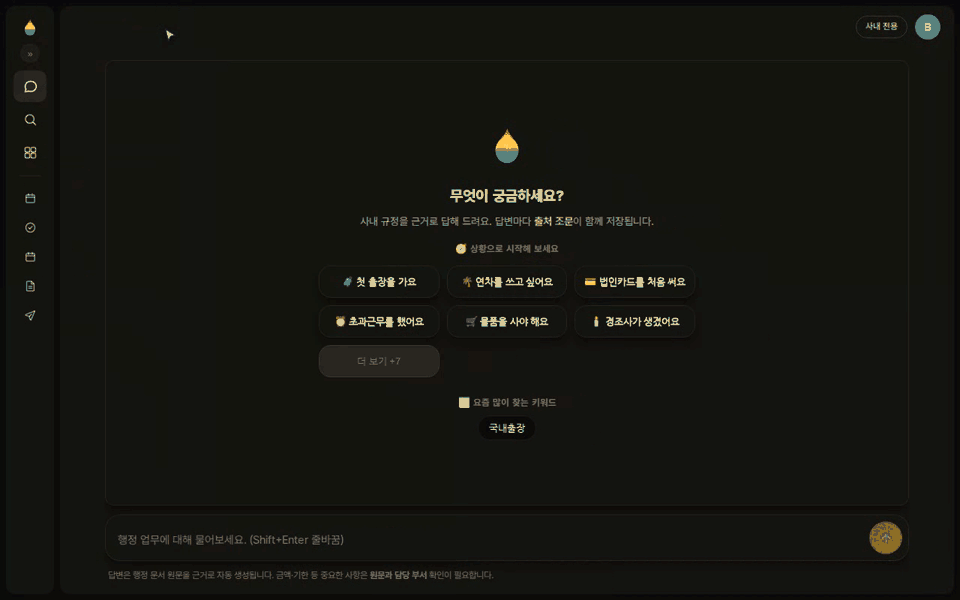

챗봇에게 행정 업무를 물어보는 기본 화면입니다. 사내 문서를 근거로만 답하고, 근거에 없으면 "규정에서 확인되지 않습니다"라고 답합니다.

1. 아래 입력창에 평소 말투로 질문을 씁니다(예: "출장 다녀와서 정산은 어떻게 하나요?").
2. Enter 또는 종이비행기 버튼을 누릅니다.
3. 무엇을 물어야 할지 모르겠으면 가운데 **상황 칩**("첫 출장을 가요" 같은)을 눌러 시작합니다.

> ⚠️ 주의 — 답변에 나온 **금액·기한은 그대로 쓰지 말고** 반드시 근거 원문을 열어 확인하세요.
> GIF는 보안상 답이 도착하기 직전까지만 담았습니다.

## 근거 조문 패널

`/`

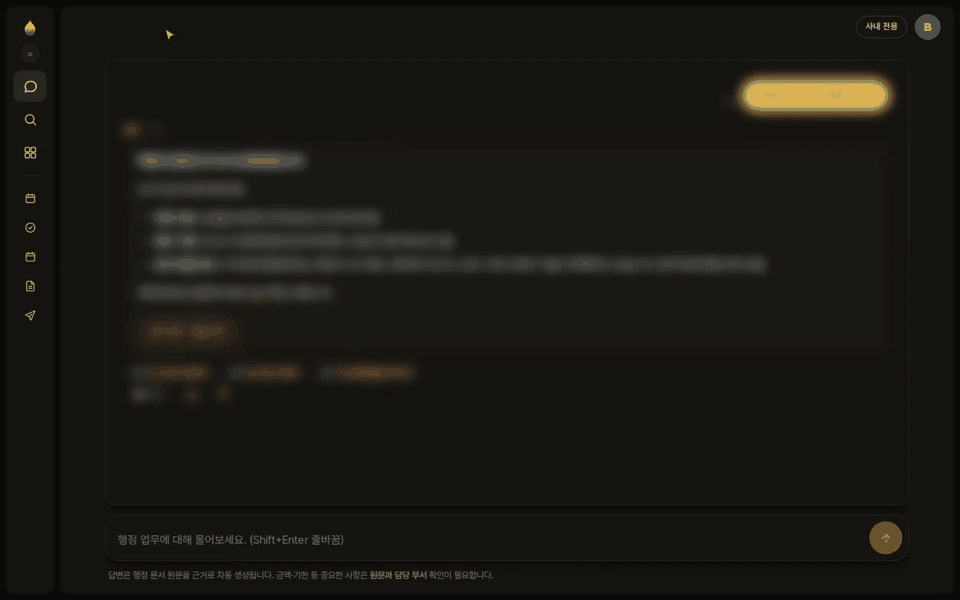

답변이 **어느 규정 어느 조문을 보고 만들어졌는지** 펼쳐 보는 패널입니다. 답이 미덥지 않을 때 가장 먼저 볼 곳입니다.

1. 답변 아래 `근거 N개 · 조문 보기`를 누르면 오른쪽에서 출처 카드가 열립니다.
2. 카드마다 규정명·조문·검수 상태가 붙어 있어, 얼마나 믿을 수 있는지 바로 보입니다.
3. 카드를 누르면 원문 위치로 곧장 이동합니다.

> ⚠️ 주의 — 근거가 질문과 무관해 보이면 그 답변은 믿지 마시고 [의견 보내기](#의견-보내기)로 알려 주세요.
> GIF에서 답변 본문과 조문 문장은 가렸습니다.

---

# 2. 문서 찾기

규정·가이드·용어집·시스템 문서와 서식을 찾아 읽고 내려받는 영역입니다. 한 화면에서 **문서 / 서식 / 그래프** 세 가지로 나뉩니다.

## 문서 찾기

`/browse/`

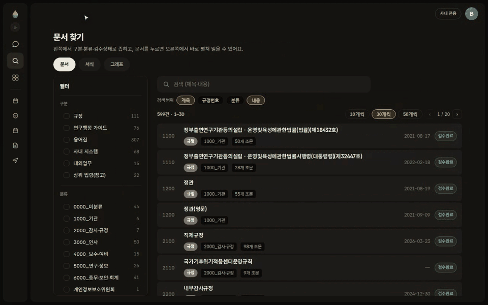

문서를 한 목록에서 찾는 화면입니다. 제목뿐 아니라 내용까지 검색합니다.

1. 위 검색창에 제목이나 규정번호를 넣습니다.
2. 왼쪽에서 **구분 · 분류 · 검수상태**로 좁힙니다(각 항목 옆 숫자가 남는 문서 수입니다).
3. `검수완료`만 켜면 사람이 확인을 마친 문서만 남습니다.

> ⚠️ 주의 — `미검수`는 변환 직후라 표가 깨져 있을 수 있습니다. 수치를 인용할 일이면 검수완료 문서에서 하세요.

## 문서 드로어

`/browse/`

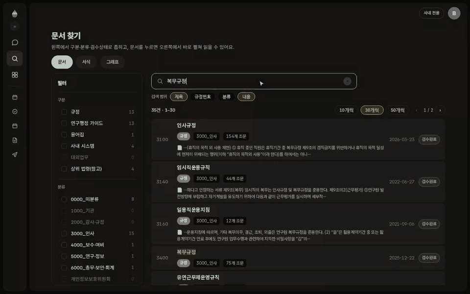

목록을 떠나지 않고 문서를 **오른쪽에 펼쳐 읽는** 방식입니다. 여러 문서를 비교하며 볼 때 편합니다.

1. 결과 줄을 누르면 드로어가 열립니다.
2. 위쪽 조문 칩으로 원하는 조문으로 바로 점프합니다.
3. `↗ 전체화면`을 누르면 읽던 위치를 유지한 채 문서 페이지로 넘어갑니다.

> ⚠️ 주의 — GIF는 문서 머리(제목·개정 이력)까지만 담았고 본문은 스크롤하지 않았습니다.

## 서식 찾기

`/browse/` → `서식` 탭

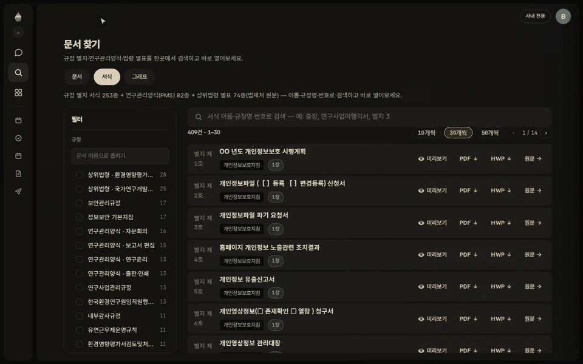

별지·양식을 이름으로 찾아 **미리 보고 내려받는** 화면입니다.

1. `서식` 탭으로 옮겨 업무 이름(예: 출장)으로 검색합니다.
2. `👁 미리보기`로 몇 장짜리인지, 어떤 칸을 채워야 하는지 먼저 확인합니다.
3. `PDF ↓` / `HWP ↓`로 받고, `원문 →`으로 근거 규정을 함께 엽니다.

> ⚠️ 주의 — 미리보기는 변환본입니다. 실제 제출 문서는 내려받은 **HWP 원본**으로 작성하세요.

## 관계 그래프

`/browse/` → `그래프` 탭

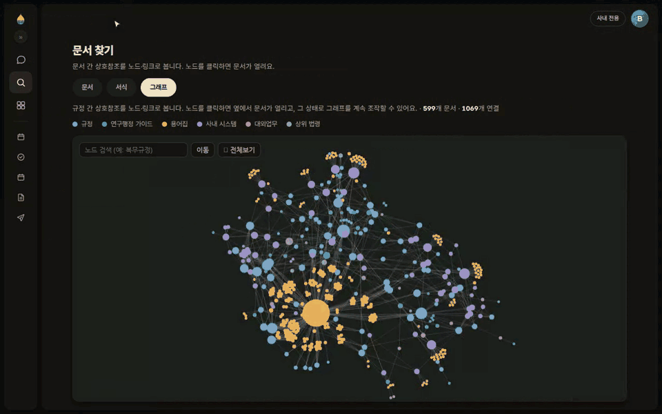

문서끼리 **어떻게 연결돼 있는지** 한눈에 보는 지도입니다. "이 규정과 엮인 게 또 뭐가 있지?"를 볼 때 씁니다.

1. `그래프` 탭을 엽니다. 점 하나가 문서 하나, 색은 구분(규정·가이드·용어집…)입니다.
2. 점을 누르면 그 문서와 이어진 문서만 남습니다.
3. 계속 눌러 가며 관계를 따라갑니다.

> ⚠️ 주의 — 이 그래프는 **보기용**입니다. 챗봇 검색은 이 그림을 쓰지 않습니다.

---

# 3. 업무 도구

"누구까지 결재받지", "며칠 안에 내야 하지" 같은 실무 질문을 **계산해서** 답해 주는 도구들입니다.
값을 지어내지 않고 규정에서 뽑아낸 표를 그대로 씁니다.

## 업무 도구 허브

`/now/`

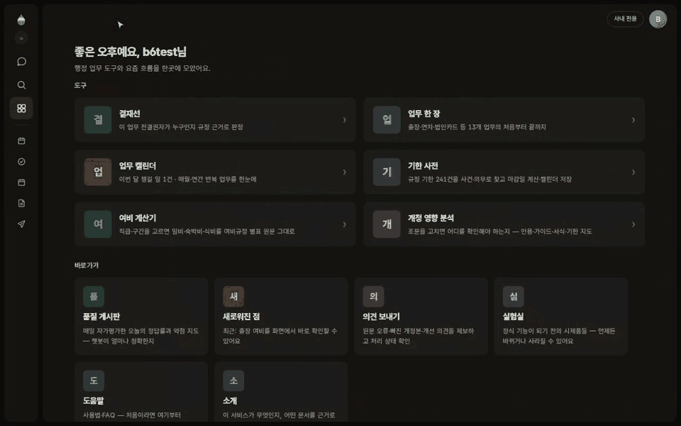

도구를 한곳에 모아 둔 입구입니다. 어디로 가야 할지 모를 때 여기서 고르세요.

1. 위쪽 큰 카드가 도구입니다(결재선 · 업무 한 장 · 캘린더 · 기한 사전 · 여비 계산기 · 개정 영향 분석).
2. 아래 작은 카드가 바로가기입니다(품질 게시판 · 새로워진 점 · 의견 보내기 · 실험실 · 도움말 · 소개).
3. 카드를 누르면 해당 화면으로 이동합니다.

> ⚠️ 주의 — 아래쪽 "요즘 흐름"은 실사용 통계라 GIF에서 가렸습니다.

## 업무 한 장

`/journey/`

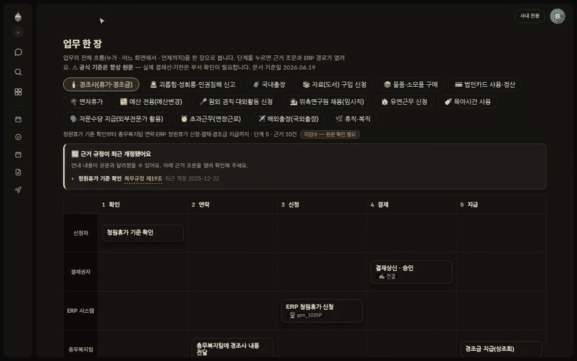

출장·연차·법인카드처럼 자주 하는 업무를 **처음부터 끝까지 한 장**으로 펴 놓은 화면입니다.

1. 위에서 업무를 고릅니다.
2. 신청 → 결재 → 정산 → 보고 순서로 단계가 깔립니다.
3. 단계를 누르면 근거 조문 · ERP 화면 · 필요 서식이 함께 나옵니다.

> ⚠️ 주의 — 사람이 손으로 만든 지도라 규정 개정보다 늦을 수 있습니다. 낡았을 가능성이 있으면 화면이 먼저 알려 줍니다.

## 결재선 판정기

`/approval/`

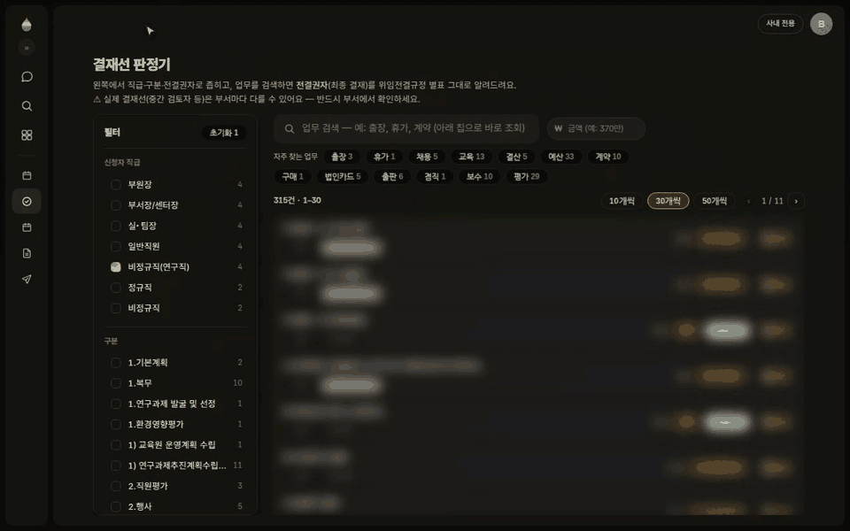

"이 문서, 누구까지 결재받아야 하나"를 위임전결규정 별표를 근거로 찾아 주는 화면입니다.

1. `출장`·`계약` 같은 업무 칩을 누르거나 검색해서 좁힙니다.
2. 금액이 걸린 일이면 금액을 넣어 한 번 더 좁힙니다.
3. 왼쪽에서 신청자 직급으로도 거를 수 있습니다.

> ⚠️ 주의 — 공식 전결 기준이지만 **부서 사정은 반영되지 않습니다.** 최종 확인은 담당 부서에 하세요.
> GIF에서 판정 결과 줄은 가렸습니다.

## 여비 계산기

`/travel/`

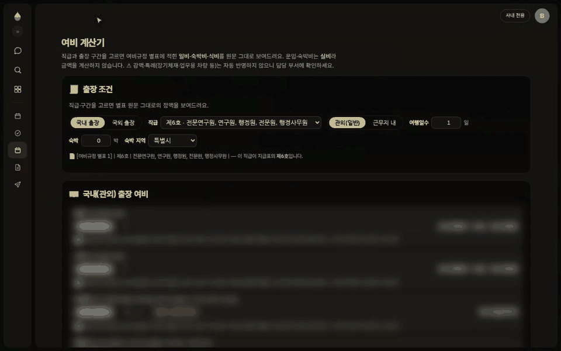

출장 조건을 고르면 **여비 규정 별표에 적힌 정액을 원문 그대로** 보여 주는 화면입니다.

1. `국내` / `국외`를 고릅니다.
2. 직급과 출장 유형을 고릅니다.
3. 여행일수·숙박 수를 넣으면 아래 표가 즉시 바뀝니다.

> ⚠️ 주의 — 곱셈(정액 × 일수)만 하고 규정에 없는 값은 만들지 않습니다. 운임·숙박처럼 실비인 항목은 `실비`라고만 표시합니다.
> GIF에서 금액 영역 전체를 가렸으니 **조작 순서만** 참고하세요.

## 기한 사전

`/deadlines/`

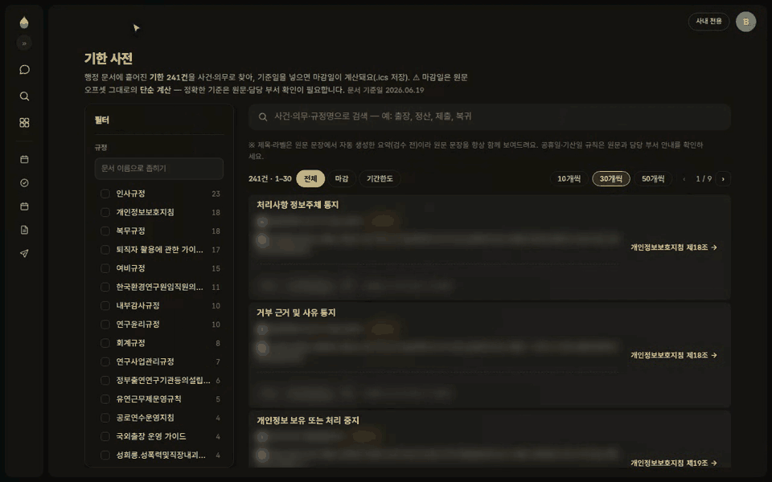

규정에 흩어진 **"며칠 이내"** 를 사건·의무 단위로 모아 둔 사전입니다.

1. `정산`·`제출` 같은 말로 검색합니다.
2. 위 `마감` / `기간한도` 탭으로 종류를 나눕니다.
3. 줄마다 기준일을 넣으면 마감일이 계산되고, 캘린더 파일(.ics)로 저장할 수 있습니다.

> ⚠️ 주의 — 기한 값은 원문 그대로이며 추측하지 않습니다. GIF에서는 기한 수치와 계산 결과를 가렸습니다.

## 업무 캘린더

`/calendar/`

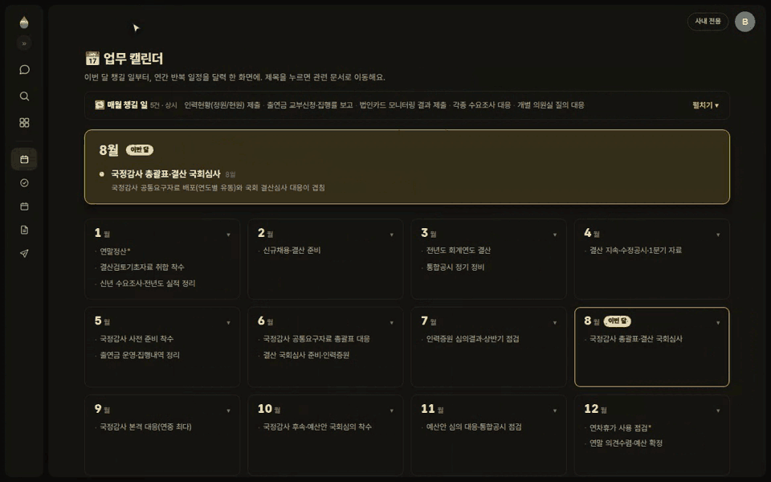

매월·매년 반복되는 행정 일을 달력으로 펼친 화면입니다.

1. 맨 위 **이번 달** 카드에서 지금 챙길 일을 봅니다.
2. `펼치기`로 매월 공통 업무를 엽니다.
3. 아래 12칸에서 다른 달을 눌러 미리 준비합니다.

> ⚠️ 주의 — 반복 업무 관측에 기반한 안내입니다. 공식 일정은 소관 부서 공지가 우선합니다.

## 개정 영향 분석

`/impact/`

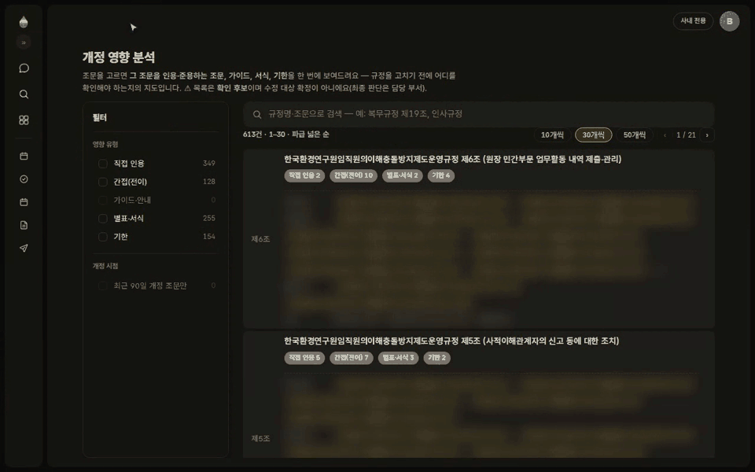

**조문 하나를 고치면 어디까지 손봐야 하는지** 짚어 주는 화면입니다. 규정 담당자용입니다.

1. 규정명이나 조문으로 검색합니다.
2. 왼쪽에서 영향 유형(직접 인용·간접·가이드·별표/서식·기한)을 골라 좁힙니다.
3. `최근 90일 개정 조문만`을 켜면 방금 바뀐 것만 남습니다.

> ⚠️ 주의 — GIF에서 파급 상세(인용 조문·기한)는 가렸습니다.

---

# 4. 운영·품질

챗봇을 **얼마나 믿을 수 있는지**, 무엇이 바뀌었는지, 틀린 걸 어떻게 알리는지에 관한 화면들입니다.

## 품질 게시판

`/quality/`

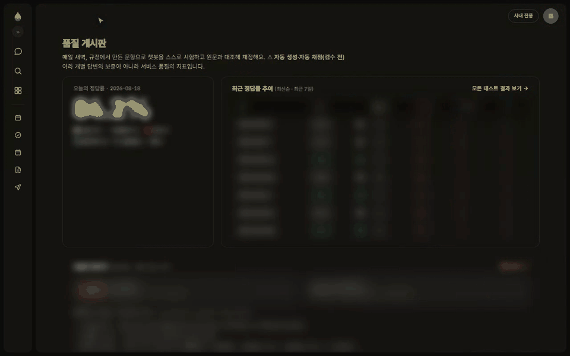

챗봇이 매일 스스로 시험을 보고 그 결과를 공개하는 화면입니다.

1. 위에서 오늘 정답률과 최근 추이를 봅니다.
2. `정답/오답/검토필요` 필터로 어디서 틀렸는지 봅니다.
3. `값형/절차형/조건형/거부형` 필터로 어떤 유형에 약한지 확인합니다.

> ⚠️ 주의 — 이 화면은 수치가 전부라 GIF에서 **숫자와 문항을 모두 가렸습니다.**
> 조작 방법만 참고하고, 실제 지표는 사내 화면에서 보세요.

## 새로워진 점

`/changelog/`

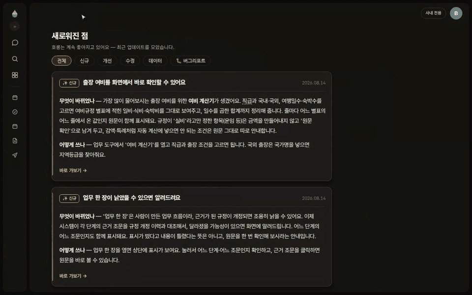

무엇이 언제 바뀌었는지 사용자 말로 적어 둔 변경 이력입니다.

1. 위 분류 탭(신규·개선·수정·데이터)으로 걸러 봅니다.
2. `바로 가보기 →`로 해당 화면에 곧장 갑니다.
3. 버그리포트 항목은 접힌 줄을 눌러 펼칩니다.

> ⚠️ 주의 — 여기에는 규정 값이 들어가지 않습니다. 기능 변화만 적습니다.

## 의견 보내기

`/feedback/`

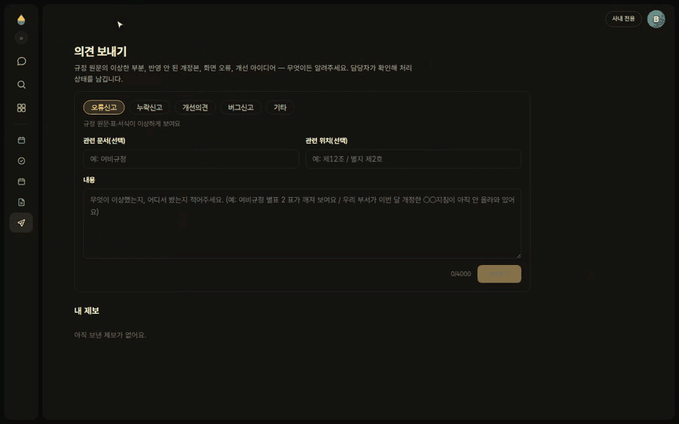

답이 틀렸거나 문서가 빠졌을 때 **고쳐 달라고 알리는** 창구입니다.

1. 유형(오류신고·누락신고·개선의견·버그신고·기타)을 고릅니다.
2. 관련 문서와 위치를 적고 내용을 씁니다.
3. 보낸 뒤에는 아래 "내 제보"에서 처리 상태와 담당자 메모를 확인합니다.

> ⚠️ 주의 — 어느 문서 어느 대목에서 봤는지 적어 주시면 훨씬 빨리 고쳐집니다.
> GIF는 실제로 제출하지 않고 작성까지만 담았습니다.

## 관리자 — 기능 플래그

`/admin/` → `🚩 기능 플래그`

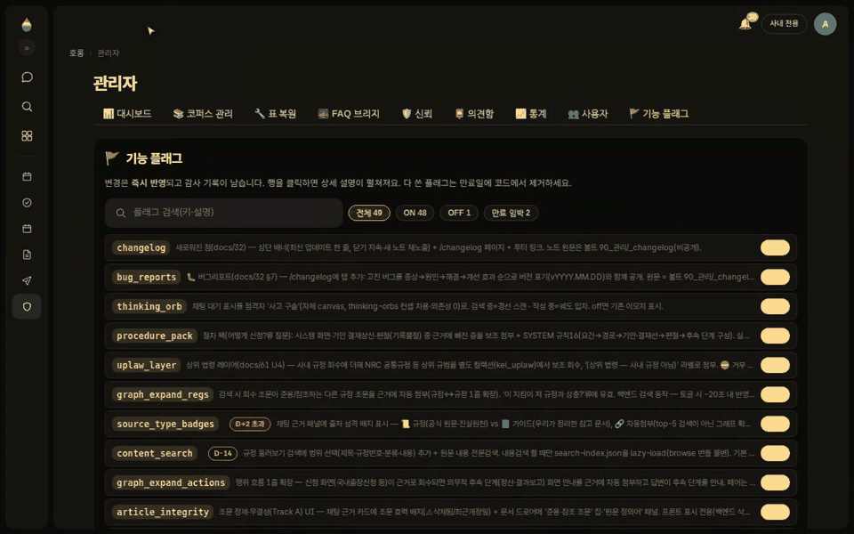

관리자가 **기능을 켜고 끄는** 화면입니다. 배포와 공개를 분리해 두어 새 기능을 껐다 켤 수 있습니다.

1. `🚩 기능 플래그` 탭을 엽니다.
2. 키 이름으로 검색합니다.
3. 오른쪽 스위치로 즉시 전환합니다. 변경은 감사 기록에 남습니다.

> ⚠️ 주의 — 관리자 계정만 들어갈 수 있습니다(`APP_ADMINS` 미설정이면 아무도 관리자가 아닙니다).
> 관리자 화면에는 대시보드·통계·사용자·의견함 탭도 있으나 **개인정보와 운영 통계가 있어 GIF로 남기지 않았습니다.**

## 실험실

`/lab/`

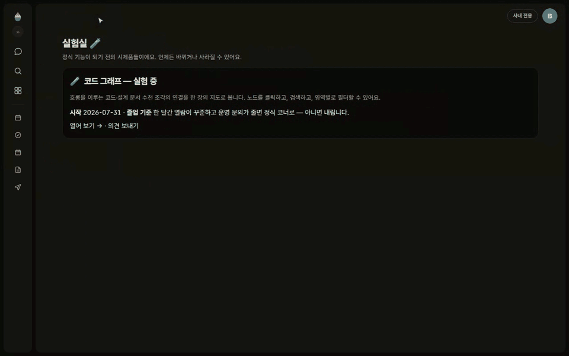

정식 기능이 되기 전의 시제품을 모아 둔 곳입니다. 언제든 바뀌거나 사라질 수 있습니다.

1. 카드의 `열어 보기 →`로 실험을 엽니다.
2. 실험마다 "무엇을 확인하려는 것인지"와 졸업 기준이 적혀 있으니 먼저 읽습니다.
3. 써 본 소감은 [의견 보내기](#의견-보내기)로 남깁니다.

> ⚠️ 주의 — 업무 판단의 근거로 쓰지 마세요.

---

# 5. 어디서나 쓰는 것

## 도움말

`/help/`

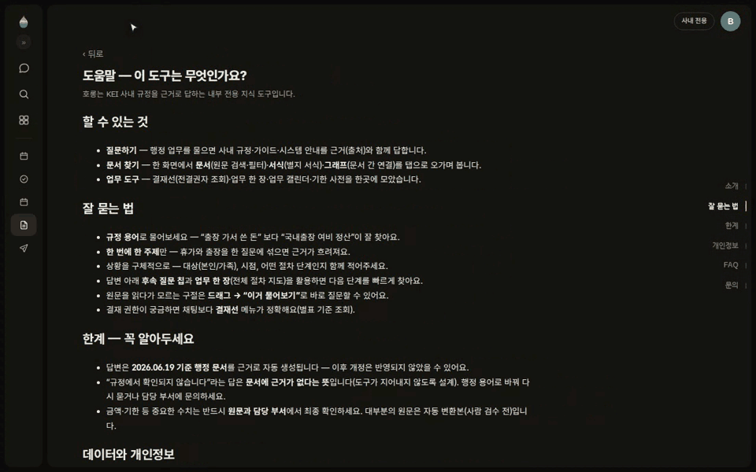

처음 쓰는 분이 가장 먼저 볼 곳입니다. 잘 묻는 법·한계·개인정보·FAQ가 한 페이지에 있습니다.

1. 위 목차 칩(소개·잘 묻는 법·한계·개인정보·FAQ·문의)으로 원하는 대목으로 건너뜁니다.
2. FAQ는 질문 줄을 누르면 답이 펼쳐집니다.
3. "규정에서 확인되지 않습니다"가 뜨는 이유와 대처도 여기 정리돼 있습니다.

## 소개

`/about/`

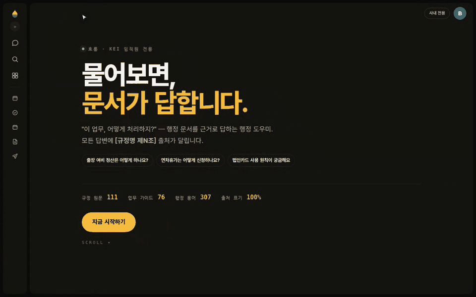

이 서비스가 무엇이고 어떤 문서를 근거로 답하는지 설명하는 페이지입니다.

1. 아래로 내리면 답변에 근거가 붙는 원칙이 나옵니다.
2. 이어서 모르면 모른다고 답하는 원칙, 코퍼스 규모가 차례로 나옵니다.
3. 처음 오신 분에게 링크로 건네기 좋은 화면입니다.

## 테마 전환 (라이트 ↔ 다크)

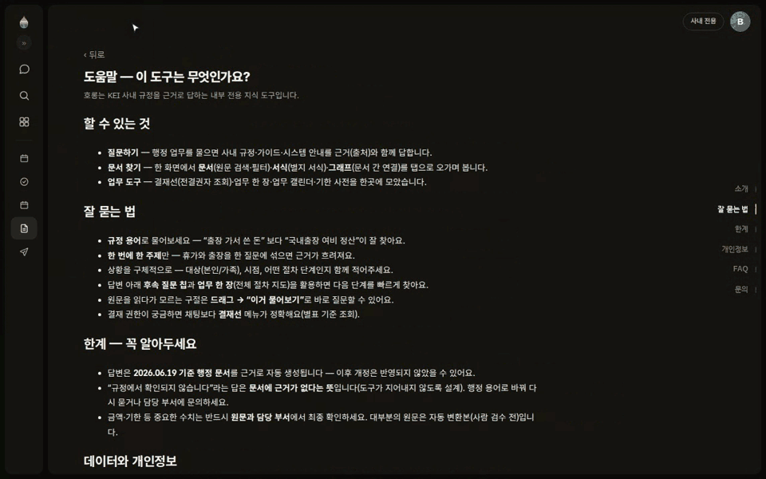

화면 밝기를 눈에 맞게 바꿉니다. 기본값은 **OS 설정을 따라갑니다.**

1. 오른쪽 위 **동그란 계정 아이콘**을 누릅니다.
2. 메뉴의 `테마`에서 라이트 / 다크 / 시스템을 고릅니다.
3. 고른 값은 이 브라우저에 기억됩니다.

> ⚠️ 주의 — 헤더에 별도 토글은 없습니다. 로그인 상태에서는 계정 메뉴 안에 있습니다.

## 모바일

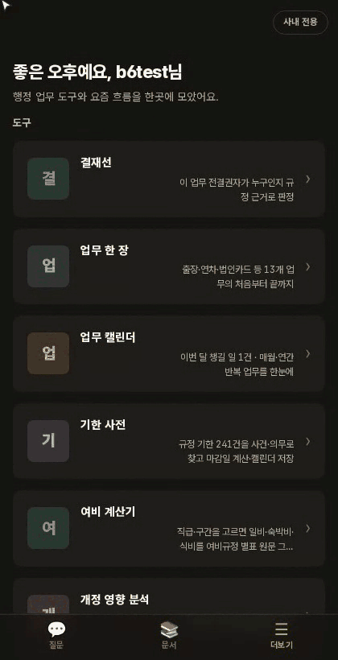

휴대폰에서는 화면 구성이 조금 달라집니다.

1. 아래쪽 탭바(질문·문서·더보기)로 옮겨 다닙니다.
2. 목록 화면에서는 `필터 열기 ▾`를 눌러야 좁히기 옵션이 나옵니다.
3. 질문 탭에서는 데스크톱과 같은 대화를 이어서 볼 수 있습니다.

> ⚠️ 주의 — GIF에서 대화 내용은 가렸습니다.

---

# 부록 — GIF를 다시 만들려면 (개발자용)

## 재생성

```bash
set -a; . tools/.test_credentials; set +a      # ⛔ 비밀번호는 env로만
cd web && node gifgen/scenes.mjs               # 전부
cd web && node gifgen/scenes.mjs 03 11         # 번호만 골라서
```

- 대본은 `web/gifgen/scenes.mjs`(Playwright), GIF 변환은 `web/gifgen/togif.py`입니다.
- dev 서버(3101)와 dev RAG API(9001)가 떠 있어야 합니다.
- 시스템에 `ffmpeg`가 없어도 됩니다. Playwright 번들 ffmpeg로 프레임을 뽑고 GIF 인코딩은 Pillow가 합니다.
- 검수용 컨택트 시트: `python3 web/gifgen/sheet.py <gif> <out.jpg>` —
  **공개 전 프레임을 눈으로 훑어 유출이 없는지 확인하는 용도**입니다. 새 GIF를 추가하면 반드시 돌립니다.

## 걸렸던 함정 4가지 (같은 실수 반복 금지)

1. **가림은 첫 페인트 전에 걸어야 한다.** 로드 뒤 `addStyleTag`로 걸면 그 사이 프레임에 원본이 그대로 찍힌다.
2. **CSS 모듈 접두는 대소문자를 가린다.** `quality_score`로 쓰면 실제 `Quality_score`에 안 걸려 가림이 **조용히 실패**한다. 반드시 파일명 표기 그대로.
3. **접두 매칭은 형제까지 먹는다.** `Quality_score`는 `Quality_scoreCard/Label`까지 흐린다. 값만 집으려면 `Quality_score__`처럼 끝의 `__`까지 붙인다.
4. **선택 동작에 `.catch()`만 걸면 30초 타임아웃이 통째로 녹화된다.** 먼저 `isVisible()`로 확인한다.

> 규칙 — 화면을 새로 추가하면 **그 화면의 민감 구역 선택자부터 정하고** 대본을 쓴다.
