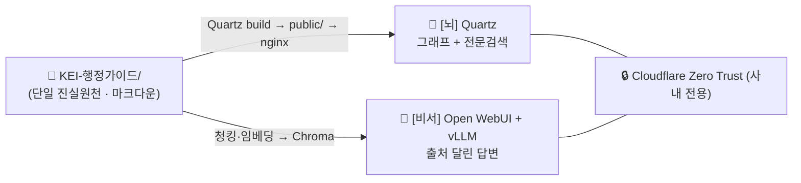
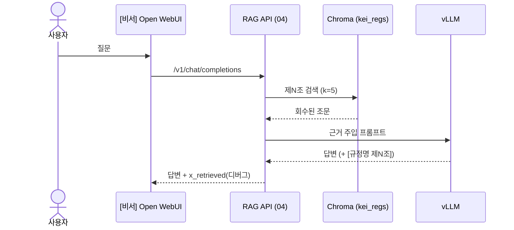

# 📚 설계 문서 인덱스 — KEI 행정 가이드 / 행정 비서

> `docs/`는 이 프로젝트의 **설계·계획 문서 묶음**입니다. "왜 이렇게 만드는가"와 "어떻게 만들고 운영하는가"를 한곳에 모았습니다.
> 시스템 한 줄 정의: KEI(한국환경연구원) 행정 초보가 "이 업무 어떻게 처리하지?"를 **사내 규정 근거로** 빠르게 해결하도록 돕는, 온프레미스 지식베이스 + 로컬 LLM 비서.

핵심 구조는 **하나의 볼트, 두 개의 화면**입니다. 단일 진실원천(Source of Truth)인 마크다운 볼트 `KEI-행정가이드/`를 두 화면이 공유합니다.

- **[뇌] Quartz** 정적 사이트 — 노드/링크 그래프 + 전문검색. 사람이 직접 탐색.
- **[비서] Open WebUI + vLLM** — 질문에 `[규정명 제N조]` 출처를 달아 답변. 행정 초보가 사용.



> [!note]
> 그래프와 채팅은 *같은 마크다운을 먹는 두 화면*입니다. 채팅은 그림(그래프)이 아니라 **텍스트 + 임베딩 검색**으로 답합니다.

---

## 🧭 독자별 추천 읽기 경로

문서는 번호 순(01→11)으로 읽어도 되지만, 역할에 따라 아래 경로를 권합니다.

### 👩‍💻 개발자 (파이프라인·RAG·배포를 만든다)

전체 그림 → 데이터 모델 → 만드는 순서로 읽습니다.

1. [01-overview.md](01-overview.md) — 문제·목표·전체 그림
2. [02-architecture.md](02-architecture.md) — 하나의 볼트, 두 개의 화면
3. [03-content-model.md](03-content-model.md) — 볼트 레이어·프론트매터 스키마
4. [04-pipeline.md](04-pipeline.md) — 변환 → 청킹 → 임베딩 (`01`~`02` 스크립트)
5. [05-rag-design.md](05-rag-design.md) — 검색·근거주입·가드레일 (`03`~`04` 스크립트)
6. [06-deployment.md](06-deployment.md) — Quartz / Open WebUI / RAG API 배포
7. [09-contributing.md](09-contributing.md) — 코드·커밋·검수 규약

> [!tip]
> 설계 의도("왜 KURE-v1인지", "왜 제N조 청킹인지")가 궁금하면 곧장 [adr/README.md](adr/README.md)로 가세요.

### 🛠️ 운영자 (서버·접근·일상 운영을 맡는다)

띄우고, 잠그고, 굴리는 순서로 읽습니다.

1. [02-architecture.md](02-architecture.md) — 구성요소·포트·데이터 흐름
2. [06-deployment.md](06-deployment.md) — 설치·기동·연결
3. [07-security-governance.md](07-security-governance.md) — Zero Trust·RBAC·내부 전용 원칙
4. [10-operations.md](10-operations.md) — 일상 운영·재색인·백업·장애 대응
5. [08-roadmap.md](08-roadmap.md) — 단계별 도입 계획

> [!warning]
> 운영자는 **절대 규칙 5**를 항상 염두에 두세요: 내부 규정 시스템이므로 **두 화면 모두 인터넷에 공개하지 않습니다.** 연결 URL에는 `localhost`/`host.docker.internal`이 아니라 서버 **실제 IP**를 씁니다.

### ✍️ 콘텐츠 작성자 (업무 가이드를 쓴다)

무엇을 어떤 형식으로 쓰는지부터 읽습니다.

1. [01-overview.md](01-overview.md) — 누구를 위해, 무엇을 만드나
2. [03-content-model.md](03-content-model.md) — `10_업무가이드`/`20_규정원문`/`30_용어집` 레이어와 프론트매터
3. [09-contributing.md](09-contributing.md) — 작성·링크·검수 워크플로
4. [11-glossary.md](11-glossary.md) — 용어 표기 기준

> [!warning]
> 작성자는 **절대 규칙 1~3**을 지킵니다.
> - 규정 내용(금액·한도·기한·조건)을 **추측해 쓰지 않습니다.** 원문이 없으면 `「TODO: 원문 확인」` placeholder를 둡니다.
> - 원문층 `20_규정원문/`은 **의역 금지** — 변환 문구를 보존하고 표/별표 깨짐과 오타만 교정합니다.
> - 모든 가이드는 근거를 `[[규정명#제N조]]` 위키링크로 답니다.

---

## 📄 문서 목록

| # | 제목 | 한 줄 설명 | 링크 |
|---|------|-----------|------|
| 01 | 개요 (Overview) | 문제·대상 사용자·목표·전체 그림 | [01-overview.md](01-overview.md) |
| 02 | 아키텍처 (Architecture) | 하나의 볼트, 두 개의 화면 · 구성요소 · 포트 | [02-architecture.md](02-architecture.md) |
| 03 | 콘텐츠 모델 (Content Model) | 볼트 레이어 구조 · 분류 체계 · 프론트매터 스키마 | [03-content-model.md](03-content-model.md) |
| 04 | 파이프라인 (Pipeline) | HWP 변환 → 제N조 청킹 → 임베딩 → Chroma | [04-pipeline.md](04-pipeline.md) |
| 05 | RAG 설계 (RAG Design) | 검색 → 근거주입 → 가드레일 → `[규정명 제N조]` 출처 | [05-rag-design.md](05-rag-design.md) |
| 06 | 배포 (Deployment) | Quartz · Open WebUI · RAG API 설치·기동·연결 | [06-deployment.md](06-deployment.md) |
| 07 | 보안·거버넌스 (Security & Governance) | Cloudflare Zero Trust · RBAC · 내부 전용 원칙 | [07-security-governance.md](07-security-governance.md) |
| 08 | 로드맵 (Roadmap) | 단계별 도입 계획과 마일스톤 | [08-roadmap.md](08-roadmap.md) |
| 09 | 기여 가이드 (Contributing) | 작성·코드·커밋·검수 워크플로 | [09-contributing.md](09-contributing.md) |
| 10 | 운영 (Operations) | 일상 운영 · 재색인 · 백업 · 장애 대응 | [10-operations.md](10-operations.md) |
| 11 | 용어집 (Glossary) | 프로젝트 용어 표기 기준 | [11-glossary.md](11-glossary.md) |

> [!todo]
> 확인 필요: 위 본문 파일(01~11)은 FILE MAP에 따라 계획된 경로입니다. 아직 작성되지 않은 문서가 있다면 작성 순서는 [08-roadmap.md](08-roadmap.md)와 [../WORKPLAN.md](../WORKPLAN.md)를 따릅니다.

---

## 🧱 아키텍처 결정 기록 (ADR)

설계의 "왜"는 ADR(Architecture Decision Record)에 기록합니다. 인덱스: [adr/README.md](adr/README.md).

| # | 제목 | 상태 | 링크 |
|---|------|------|------|
| 0001 | 임베딩 모델로 `nlpai-lab/KURE-v1` 채택 | Accepted | [adr/0001-embedding-kure-v1.md](adr/0001-embedding-kure-v1.md) |
| 0002 | 제N조 단위(조문 1개 = 청크 1개) 청킹 | Accepted | [adr/0002-article-level-chunking.md](adr/0002-article-level-chunking.md) |
| 0003 | 출처 통제용 자체 RAG API(`04_rag_api.py`) | Accepted | [adr/0003-controlled-rag-api.md](adr/0003-controlled-rag-api.md) |
| 0004 | [뇌] 그래프 사이트로 Quartz v5 채택 | Accepted | [adr/0004-quartz-graph-site.md](adr/0004-quartz-graph-site.md) |
| 0005 | 온프레미스 + Cloudflare Zero Trust 배포 | Accepted | [adr/0005-on-prem-zero-trust.md](adr/0005-on-prem-zero-trust.md) |

> [!todo]
> 확인 필요: 위 ADR 상태(Accepted/Proposed/Superseded)는 계획 기준값입니다. 실제 상태는 각 ADR 파일의 머리말과 [adr/README.md](adr/README.md)를 단일 출처로 삼아 갱신하세요.

---

## ✒️ 문서 작성 컨벤션 (표기 규약)

이 폴더의 모든 문서는 GitHub Flavored Markdown으로 작성하고 아래 규약을 따릅니다.

### 링크 규약

| 대상 | 표기 | 예시 |
|------|------|------|
| `docs/` 내부 문서 (같은 폴더) | 파일명만 (상대링크) | `[02-architecture.md](02-architecture.md)` |
| ADR 인덱스 | `adr/README.md` | `[adr/README.md](adr/README.md)` |
| ADR에서 상위 문서 참조 | `../<파일>` | `../02-architecture.md` |
| ADR에서 형제 ADR 참조 | 파일명만 | `0002-article-level-chunking.md` |
| 루트 파일 | `../<파일>` | `../README.md`, `../CLAUDE.md`, `../WORKPLAN.md` |
| 소스 코드 | `../tools/<파일>` | `../tools/02_chunk_and_embed.py` |
| 볼트 내부 콘텐츠 (예시) | `[[규정명#제N조]]` 위키링크 | `[[여비규정#제5조]]` *(형식 예시)* |

> [!note]
> 볼트 콘텐츠 간 연결은 Obsidian/Quartz가 인식하는 `[[규정명#제N조]]` 위키링크를 씁니다. `docs/`끼리의 설계 문서 링크는 표준 마크다운 상대링크입니다. 둘을 섞지 마세요.

### 다이어그램 (mermaid)

그림이 이해를 돕는 곳에는 정보 문자열이 `mermaid`인 펜스 코드블록을 씁니다. `flowchart`(구성요소·흐름), `sequenceDiagram`(요청·응답 순서), `gantt`(일정)를 활용합니다. 다이어그램은 mermaid 인라인을 기본으로 하며, 외부 이미지로 내보낸 다이어그램은 `docs/diagrams/`에 보관합니다.

````markdown

````

### 콜아웃

인용블록 콜아웃을 **절제해서** 사용합니다. 종류는 네 가지입니다.

> [!note]
> 보조 설명·맥락.

> [!tip]
> 권장 사항·요령.

> [!warning]
> 주의·위험·하지 말 것.

> [!todo]
> 미확정 사실. 형식: `> [!todo] 확인 필요: <무엇>`. KEI 고유 사실(규정 번호/제목/금액, 호스트명, 일정, 인원, GPU 수량 등)을 모를 때 추측 대신 사용합니다.

### 기타 표기

- **코드블록**에는 언어 힌트를 붙입니다: `bash`, `python`, `yaml`, `ini`.
- **이모지**는 섹션 강조용으로만 최소한으로 씁니다.
- **일관 표기:** 두 화면은 항상 **[뇌] Quartz** / **[비서] Open WebUI + vLLM**. 모델명은 정확히(`nlpai-lab/KURE-v1`, `BAAI/bge-m3`, `Qwen/Qwen2.5-14B-Instruct`, `Qwen2.5-VL`), 컬렉션명은 `kei_regs`.

### ⛔ 절대 규칙 준수

모든 문서는 본문과 예시에서 [../CLAUDE.md](../CLAUDE.md)의 절대 규칙을 지킵니다.

1. **규정 내용을 지어내지 않는다.** 금액·한도·기한·조건을 추측해 쓰지 않고, 원문이 없으면 `「TODO: 원문 확인」` placeholder를 둔다.
2. **원문층(`20_규정원문/`)은 의역 금지.** 이 원칙을 약화시키는 서술을 하지 않는다.
3. **모든 가이드/답변에 출처.** 가이드는 `[[규정명#제N조]]`, RAG 답변은 끝에 `[규정명 제N조]` + 면책 문구.
4. **RAG 가드레일을 약화시키지 않는다.** "근거에 없으면 '규정에서 확인되지 않습니다'"를 약화시키는 서술 금지.
5. **내부 전용.** 어떤 화면도 인터넷 공개를 권하지 않는다.

> [!note]
> 예시에 규정을 인용할 때는 **명백한 예시**임을 알 수 있게 일반적 표현을 쓰고, 실제 금액·조문 번호를 단정하지 않습니다.

---

## 관련 문서

- 📁 **문서 인덱스(현재 문서):** [docs/README.md](README.md)
- 🧱 **ADR 인덱스:** [adr/README.md](adr/README.md)
- 🏠 **프로젝트 루트 README:** [../README.md](../README.md)
- 🗺️ **작업 계획:** [../WORKPLAN.md](../WORKPLAN.md)
- 🤖 **Claude Code 컨텍스트:** [../CLAUDE.md](../CLAUDE.md)
- ▶️ **다음 문서:** [01-overview.md](01-overview.md)

---

최종 수정: 2026-06-18
