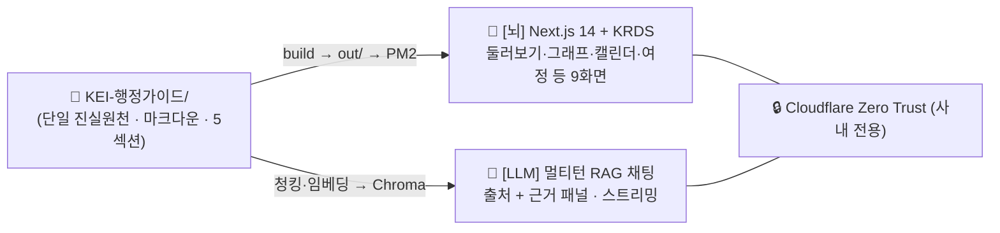
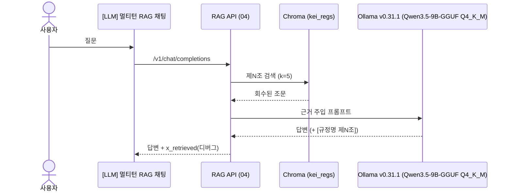

# 📚 설계 문서 인덱스 — KEI 행정 가이드 / 행정 LLM

> `docs/`는 이 프로젝트의 **설계·계획 문서 묶음**입니다. "왜 이렇게 만드는가"와 "어떻게 만들고 운영하는가"를 한곳에 모았습니다.
> 시스템 한 줄 정의: KEI(한국환경연구원) 행정 초보가 "이 업무 어떻게 처리하지?"를 **사내 규정 근거로** 빠르게 해결하도록 돕는, 온프레미스 지식베이스 + 로컬 LLM.

핵심 구조는 **하나의 볼트, 두 개의 화면**입니다. 단일 진실원천(Source of Truth)인 마크다운 볼트 `KEI-행정가이드/`를 두 화면이 공유합니다. 현재 볼트는 **5개 섹션 363문서**(규정집 111 · 연구행정 가이드 65 · 용어집 119 · 사내 시스템 54 · 대외업무 14 — docs/39·49)로 구성됩니다.

- **[뇌] Next.js 14(KRDS 기반 자체 토큰·Pretendard GOV)** 정적 사이트(`web/`) — 둘러보기·관계 그래프·결재선·업무 한 장·업무 캘린더·서식 찾기·추가 기능 허브·소개. (TDS는 라이선스 이슈로 제거 — docs/37.) 비로그인 '/'는 소개 슬라이드+로그인 시트의 **통합 랜딩**(docs/47), 콘텐츠는 **서버 로그인 게이트** 뒤(docs/44). 모바일은 채팅·조문 중심 GNB 3탭(docs/48).
- **[LLM] 멀티턴 RAG 채팅** — 질문에 `[규정명 제N조]` 출처를 달아 답변, 메시지별 근거 패널·스트리밍 응답. 행정 초보가 사용.


```mermaid
flowchart LR
    Vault["📁 KEI-행정가이드/<br/>(단일 진실원천 · 마크다운 · 5섹션)"]
    Vault -->|build → out/ → PM2| Brain["🧠 [뇌] Next.js 14 + KRDS<br/>둘러보기·그래프·캘린더·여정 등 9화면"]
    Vault -->|청킹·임베딩 → Chroma| Assistant["💬 [LLM] 멀티턴 RAG 채팅<br/>출처 + 근거 패널 · 스트리밍"]
    Brain --- ZeroTrust["🔒 Cloudflare Zero Trust (사내 전용)"]
    Assistant --- ZeroTrust
```

> [!note]
> 그래프와 채팅은 *같은 마크다운을 먹는 두 화면*입니다. 채팅은 그림(그래프)이 아니라 **텍스트 + 임베딩 검색**으로 답합니다.

---

## 🧭 독자별 추천 읽기 경로

문서는 번호 순(01→11)으로 읽어도 되지만, 역할에 따라 아래 경로를 권합니다.

### 👩‍💻 개발자 (파이프라인·RAG·배포를 만든다)

전체 그림 → 데이터 모델 → 만드는 순서로 읽습니다.

1. [01-overview.md](01-overview.md) — 문제·목표·전체 그림
2. [02-architecture.md](02-architecture.md) — 하나의 볼트, 두 개의 화면
3. [03-content-model.md](03-content-model.md) — 볼트 레이어·프론트매터 스키마
4. [04-pipeline.md](04-pipeline.md) — 변환 → 청킹 → 임베딩 (`01`~`02` 스크립트)
5. [05-rag-design.md](05-rag-design.md) — 검색·근거주입·가드레일·스트리밍 (`03`~`04` 스크립트)
6. [06-deployment.md](06-deployment.md) — [뇌] Next.js(KRDS) / [LLM] RAG API 배포
7. [09-contributing.md](09-contributing.md) — 코드·커밋·검수 규약

> [!tip]
> 설계 의도("왜 KURE-v1인지", "왜 제N조 청킹인지")가 궁금하면 곧장 [adr/README.md](adr/README.md)로 가세요.

### 🛠️ 운영자 (서버·접근·일상 운영을 맡는다)

띄우고, 잠그고, 굴리는 순서로 읽습니다.

1. [02-architecture.md](02-architecture.md) — 구성요소·포트·데이터 흐름
2. [06-deployment.md](06-deployment.md) — 설치·기동·연결
3. [07-security-governance.md](07-security-governance.md) — Zero Trust·RBAC·내부 전용 원칙
4. [10-operations.md](10-operations.md) — 일상 운영·재색인·백업·장애 대응
5. [08-roadmap.md](08-roadmap.md) — 단계별 도입 계획

> [!warning]
> 운영자는 **절대 규칙 5**를 항상 염두에 두세요: 내부 규정 시스템이므로 **두 화면 모두 인터넷에 공개하지 않습니다.** 연결 URL에는 `localhost`/`host.docker.internal`이 아니라 서버 **실제 IP**를 씁니다.

### ✍️ 콘텐츠 작성자 (업무 가이드를 쓴다)

무엇을 어떤 형식으로 쓰는지부터 읽습니다.

1. [01-overview.md](01-overview.md) — 누구를 위해, 무엇을 만드나
2. [03-content-model.md](03-content-model.md) — `10_업무가이드`/`20_규정원문`/`30_용어집`/`40_시스템` 레이어와 프론트매터
3. [09-contributing.md](09-contributing.md) — 작성·링크·검수 워크플로
4. [11-glossary.md](11-glossary.md) — 용어 표기 기준

> [!warning]
> 작성자는 **절대 규칙 1~3**을 지킵니다.
> - 규정 내용(금액·한도·기한·조건)을 **추측해 쓰지 않습니다.** 원문이 없으면 `「TODO: 원문 확인」` placeholder를 둡니다.
> - 원문층 `20_규정원문/`은 **의역 금지** — 변환 문구를 보존하고 표/별표 깨짐과 오타만 교정합니다.
> - 모든 가이드는 근거를 `[[규정명#제N조]]` 위키링크로 답니다.

---

## 📄 문서 목록

| # | 제목 | 한 줄 설명 | 링크 |
|---|------|-----------|------|
| 01 | 개요 (Overview) | 문제·대상 사용자·목표·전체 그림 | [01-overview.md](01-overview.md) |
| 02 | 아키텍처 (Architecture) | 하나의 볼트, 두 개의 화면 · 구성요소 · 포트 | [02-architecture.md](02-architecture.md) |
| 03 | 콘텐츠 모델 (Content Model) | 볼트 4섹션 레이어 구조 · 분류 체계 · 프론트매터 스키마 | [03-content-model.md](03-content-model.md) |
| 04 | 파이프라인 (Pipeline) | HWP/PDF/PPTX 변환 → 교차링크 → 청킹 → 임베딩 → Chroma | [04-pipeline.md](04-pipeline.md) |
| 05 | RAG 설계 (RAG Design) | 검색 → 근거주입 → 가드레일 → `[규정명 제N조]` 출처 · 스트리밍 | [05-rag-design.md](05-rag-design.md) |
| 06 | 배포 (Deployment) | [뇌] Next.js(KRDS) · [LLM] RAG API 설치·기동·연결 | [06-deployment.md](06-deployment.md) |
| 07 | 보안·거버넌스 (Security & Governance) | Cloudflare Zero Trust · RBAC · 내부 전용 원칙 | [07-security-governance.md](07-security-governance.md) |
| 08 | 로드맵 (Roadmap) | 단계별 도입 계획과 마일스톤 | [08-roadmap.md](08-roadmap.md) |
| 09 | 기여 가이드 (Contributing) | 작성·코드·커밋·검수 워크플로 | [09-contributing.md](09-contributing.md) |
| 10 | 운영 (Operations) | 일상 운영 · 재색인 · 백업 · 장애 대응 | [10-operations.md](10-operations.md) |
| 11 | 용어집 (Glossary) | 프로젝트 용어 표기 기준 | [11-glossary.md](11-glossary.md) |
| 12 | 품질 강화 (Quality) | 평가셋·검수·별표·리랭커 (P1.1~P1.4) · before/after 지표 | [12-품질강화.md](12-품질강화.md) |
| 13 | 기능 플래그 (Feature Flags) | deploy/release 분리 · 런타임 플래그 + 관리자 토글 + 감사로그 (**구현·매뉴얼**) | [13-feature-flags.md](13-feature-flags.md) |
| 14 | 답변 피드백 루프 (Feedback Loop) | 👍/👎(+사유) → `app.db` → 검수 큐 우선순위 환류 (**구현·매뉴얼**) | [14-feedback-loop.md](14-feedback-loop.md) |
| 16 | reasoning_effort A/B | Qwen3.5 사고 none vs low 측정 → `none` 유지 결론 (트러블슛·집계) | [16-reasoning-effort-AB.md](16-reasoning-effort-AB.md) |
| 17 | 서비스 확장 로드맵 | 시스템 계층 코퍼스 확장(전자결재·대외·웹디스크) 기반 + 다운스트림 기능 로드맵(계획) | [17-service-roadmap.md](17-service-roadmap.md) |

> [!todo]
> 확인 필요: 위 본문 파일(01~11)은 FILE MAP에 따라 계획된 경로입니다. 아직 작성되지 않은 문서가 있다면 작성 순서는 [08-roadmap.md](08-roadmap.md)와 [../WORKPLAN.md](../WORKPLAN.md)를 따릅니다.

---

## 📌 현재 진행 상태 (2026-07-16 기준)

| 영역 | 상태 | 요약 |
|------|------|------|
| 코퍼스 | ✅ 5섹션 | 규정집 111 · 연구행정 가이드 65 · **용어집 119**(88→119 규정 정의 추출, [49](49-용어집-확충-트렌딩.md)) · 사내 시스템 54 · 대외업무 14([39](39-대외업무-반입-스펙.md)). 임베딩 **4,830청크**. 검수완료 229/미검수 367(볼트 전체) |
| 파이프라인 | ✅ 가동 | 변환(`01`·`01c`·`01d`·`01f`·`01h` 정의추출→용어) → 교차링크(`01e`·`01g`·`01b`) → 청킹·임베딩(`02`) + 별지 PDF·감사(`01p`·`01q`, 재색인 훅이 01p 증분 실행 — [50](50-별지-정확도-다운로드.md)) |
| [LLM] RAG | ✅ 완성 | 로그인·멀티턴·메시지별 근거·스트리밍(SSE). 격리 Ollama v0.31.1+`Qwen3.5-9B-GGUF Q4_K_M`, KURE-v1, Chroma `kei_regs` |
| [뇌] 웹앱 | ✅ 9화면+KRDS | 채팅·둘러보기·그래프(5색)·결재선·업무 한 장 13종([25](25-업무한장.md))·업무 캘린더([43](43-캘린더-연간그리드.md))·서식 찾기([34](34-신뢰운영-서식찾기-스펙.md))·추가 기능 허브([41](41-메뉴정리-추가기능허브.md))·소개([36](36-브랜딩-소개페이지-계획.md)). KRDS 디자인 통일([37](37-KRDS-전환-계획.md))·용어 인라인 툴팁([45](45-용어-인라인-툴팁.md))·통합 랜딩(비로그인 '/'=소개+로그인 시트, [47](47-랜딩-로그인-통합.md))·모바일 채팅·조문 중심 개편(GNB 3탭, [48](48-모바일-개편.md))·트렌딩 키워드=용어집 등재어([49](49-용어집-확충-트렌딩.md))·서식찾기 페이지네이션+PDF↓/HWP↓([50](50-별지-정확도-다운로드.md)) |
| 운영 버전 | ✅ 분리 | dev 3101/9001(`feat/krds`, 정착 후보) · prod 3100/9000(동결). **보안**: 서버 로그인 게이트+CSP+레이트리밋+보안로그([44](44-보안-로그인게이트.md)) — 랜딩 외부 공개 대비 |
| 품질 강화 | ✅ P1.1~P1.5(VLM 제외) | 평가 하베스트+면책 가드레일 100%+검수 큐/도구. 별표 1급 청크(별표 0/4→4/4). **리랭커 적용 strict Hit@1 0.600→0.829·@5 1.000**(GPU1). 멀티턴 쿼리 재작성. 하이브리드는 이득無→off. 남음: P1.3 VLM 표복원(다운로드 승인 대기) ([12](12-품질강화.md)) |
| 피드백 루프 | ✅ 구현·검증 | 답변 👍/👎(+사유) → `app.db` → `feedback_export.py` → 검수 큐 우선순위 환류. 관리자 집계 API. 백엔드 16/16·Playwright 통과 ([14](14-feedback-loop.md)) |
| 금액 신뢰·기준일 | ✅ 구현·검증 | 금액·한도 답변 경고 + 근거 수치 `<mark>` 강조 + 검수상태 배지(재임베딩無). footer "📑 규정집 기준일 2026.06.19"(`lib/site.ts`). Playwright 통과 ([12](12-품질강화.md) P2.2) |
| 긴 청크 하위청킹 | ✅ 구현·검증 | `max_seq_len`(2048) 초과 청크 항/호/줄 분할(조 라벨 유지). 재색인 4345→4418. dense 회귀 0, A/B로 잘린 꼬리 미회수→1위 입증 ([12](12-품질강화.md) P2.3) |
| ERP·서식 연결 | ✅ 구현·검증 | 답변에 ERP 메뉴·경로(화면ID 포함) 안내 + 근거 🖥 ERP/📄 서식 칩(출처 `type`). 섹션 다양성은 측정상 무이득→opt-in ([12](12-품질강화.md) P2.4) |
| 운영자 대시보드 · 🔒 개인정보 | ✅ 구현·검증 | `/admin`에 활동·거부율(`REFUSAL_RE`)·👍/👎·인기질문·콘텐츠 갭(`GET /app/stats`, 관리자). 🔒 개인정보: 타인 채팅 열람 엔드포인트 없음·`/stats`·`/feedback`은 질문/답변 본문 미반환·인기질문/갭은 서로 다른 사용자 K명 이상(`STATS_MIN_USERS` 기본 3) k-익명 집계만. 백엔드 10/10·Playwright 통과 ([12](12-품질강화.md) P2.5) |
| 별지 정확도·다운로드 | ✅ 구현·검증 | `01p`(HWP→ODT 서체·줄간격 보정→PDF) — 규정 110건·별지 288건 분리 PDF+PNG+원본 HWP+manifest. `01q` A/B/C/D 감사. MD 복원 누적 179건(비전 전사·`byeolji-restored`·최종 A0). server.js `/forms-pdf/*` 직결(로그인 게이트 뒤)·폐지 서식 미제공 ([50](50-별지-정확도-다운로드.md)) |
| 검수 | ⏳ 전부 미검수 | 규정 미분류 28 번호 배정, 가이드/용어/ERP 자동초안 확정 대기 |

> [!note]
> 보안 불변: 원본·볼트·Chroma·`app.db`·`.app_secret`은 전부 gitignore. 커밋은 코드/문서만(public repo=코드만), 외부 노출은 Cloudflare Zero Trust 뒤.

---

## 🗂 기능·운영 문서 (12~50)

설계 본문(01~11) 이후의 **기능 스펙·운영 매뉴얼**입니다. 번호 = 작성 순서(시간순).

| 구간 | 문서 |
|---|---|
| 품질·신뢰 | [12 품질강화](12-품질강화.md) · [18 조문정제·무결성](18-조문정제-무결성.md) · [22 신뢰게이트](22-신뢰게이트.md) · [24 표검수·수치스토어](24-표검수-수치스토어.md) · [27 정합성감사](27-정합성감사.md) · [28 최신값단일화·형식복원](28-최신값단일화-형식복원.md) · [50 별지 정확도·다운로드](50-별지-정확도-다운로드.md) |
| 운영 루프 | [13 기능 플래그](13-feature-flags.md) · [14 피드백 루프](14-feedback-loop.md) · [20 코퍼스 관리](20-코퍼스-관리-설계.md) · [21 관리자 UX](21-관리자-UX-개편.md) · [33 아카이브 이전(보류)](33-아카이브-이전-계획.md) |
| LLM·평가 | [16 reasoning-effort A/B](16-reasoning-effort-AB.md) · [19 v1 출시 스펙](19-v1-출시-스펙.md) |
| 화면·기능 | [23 로우레벨 지렛대](23-로우레벨-지렛대.md) · [25 업무 한 장](25-업무한장.md) · [26 후속질문](26-후속질문-선택질문.md) · [29 이벤트탭·가입정책](29-이벤트탭-가입정책-아이디어.md) · [30 가입인증 매뉴얼](30-가입인증-사용자기능-매뉴얼.md) · [31 도움말 허브](31-도움말허브-FAQ-계획.md) · [32 업데이트 노트](32-업데이트노트-배너-계획.md) · [34 서식 찾기·신뢰운영](34-신뢰운영-서식찾기-스펙.md) · [35 이벤트탭·사용량](35-이벤트탭-사용량수집-스펙.md) · [40 캘린더·서식필터 UI](40-업무캘린더-서식필터-UI.md) · [41 추가 기능 허브](41-메뉴정리-추가기능허브.md) · [42 여정 4종](42-여정4종-노트링크.md) · [43 캘린더 연간그리드](43-캘린더-연간그리드.md) · [45 용어 인라인 툴팁](45-용어-인라인-툴팁.md) · [47 랜딩·로그인 통합](47-랜딩-로그인-통합.md) · [48 모바일 개편](48-모바일-개편.md) |
| 디자인·브랜딩 | [36 브랜딩·소개 페이지](36-브랜딩-소개페이지-계획.md) · [37 KRDS 전환](37-KRDS-전환-계획.md) · [46 랜딩 시네마틱 타이포](46-랜딩-시네마틱-타이포.md) · [design-system.md](design-system.md) |
| 콘텐츠 반입 | [39 대외업무 반입 스펙](39-대외업무-반입-스펙.md) · [49 용어집 확충·트렌딩](49-용어집-확충-트렌딩.md) |
| 보안 | [44 보안 명세 — 로그인 게이트·조치 매트릭스·공개 전 체크리스트](44-보안-로그인게이트.md) |
| 백로그 | [17 서비스 로드맵](17-service-roadmap.md) · [38 아이디어 풀](38-아이디어-풀.md) |

---

## 🧱 아키텍처 결정 기록 (ADR)

설계의 "왜"는 ADR(Architecture Decision Record)에 기록합니다. 인덱스: [adr/README.md](adr/README.md).

| # | 제목 | 상태 | 링크 |
|---|------|------|------|
| 0001 | 임베딩 모델로 `nlpai-lab/KURE-v1` 채택 | Accepted | [adr/0001-embedding-kure-v1.md](adr/0001-embedding-kure-v1.md) |
| 0002 | 제N조 단위(조문 1개 = 청크 1개) 청킹 | Accepted | [adr/0002-article-level-chunking.md](adr/0002-article-level-chunking.md) |
| 0003 | 출처 통제용 자체 RAG API(`04_rag_api.py`) | Accepted | [adr/0003-controlled-rag-api.md](adr/0003-controlled-rag-api.md) |
| 0004 | [뇌] 그래프 사이트로 Quartz v5 채택 (→ Next.js 14 + KRDS로 대체) | Superseded | [adr/0004-quartz-graph-site.md](adr/0004-quartz-graph-site.md) |
| 0005 | 온프레미스 + Cloudflare Zero Trust 배포 | Accepted | [adr/0005-on-prem-zero-trust.md](adr/0005-on-prem-zero-trust.md) |

> [!todo]
> 확인 필요: ADR 0004는 프로젝트 실제(Quartz → Next.js 14 + KRDS 대체)에 맞춰 위 표에서 **Superseded**로 둡니다. 다만 [adr/0004-quartz-graph-site.md](adr/0004-quartz-graph-site.md) 파일 머리말은 아직 "채택(Accepted)"으로 남아 있어 표와 어긋납니다 — ADR 파일 머리말을 단일 출처로 동기화하세요. 나머지 ADR 상태도 각 파일과 [adr/README.md](adr/README.md)를 기준으로 확인합니다.

---

## ✒️ 문서 작성 컨벤션 (표기 규약)

이 폴더의 모든 문서는 GitHub Flavored Markdown으로 작성하고 아래 규약을 따릅니다.

### 링크 규약

| 대상 | 표기 | 예시 |
|------|------|------|
| `docs/` 내부 문서 (같은 폴더) | 파일명만 (상대링크) | `[02-architecture.md](02-architecture.md)` |
| ADR 인덱스 | `adr/README.md` | `[adr/README.md](adr/README.md)` |
| ADR에서 상위 문서 참조 | `../<파일>` | `../02-architecture.md` |
| ADR에서 형제 ADR 참조 | 파일명만 | `0002-article-level-chunking.md` |
| 루트 파일 | `../<파일>` | `../README.md`, `../CLAUDE.md`, `../WORKPLAN.md` |
| 소스 코드 | `../tools/<파일>` | `../tools/02_chunk_and_embed.py` |
| 볼트 내부 콘텐츠 (예시) | `[[규정명#제N조]]` 위키링크 | `[[여비규정#제5조]]` *(형식 예시)* |

> [!note]
> 볼트 콘텐츠 간 연결은 Obsidian이 인식하는 `[[규정명#제N조]]` 위키링크를 씁니다. `docs/`끼리의 설계 문서 링크는 표준 마크다운 상대링크입니다. 둘을 섞지 마세요.

### 다이어그램 (mermaid)

그림이 이해를 돕는 곳에는 정보 문자열이 `mermaid`인 펜스 코드블록을 씁니다. `flowchart`(구성요소·흐름), `sequenceDiagram`(요청·응답 순서), `gantt`(일정)를 활용합니다. 다이어그램은 mermaid 인라인을 기본으로 하며, 외부 이미지로 내보낸 다이어그램은 `docs/diagrams/`에 보관합니다.

````markdown

```mermaid
sequenceDiagram
    actor 사용자
    participant UI as [LLM] 멀티턴 RAG 채팅
    participant RAG as RAG API (04)
    participant DB as Chroma (kei_regs)
    participant LLM as Ollama v0.31.1 (Qwen3.5-9B-GGUF Q4_K_M)
    사용자->>UI: 질문
    UI->>RAG: /v1/chat/completions
    RAG->>DB: 제N조 검색 (k=5)
    DB-->>RAG: 회수된 조문
    RAG->>LLM: 근거 주입 프롬프트
    LLM-->>RAG: 답변 (+ [규정명 제N조])
    RAG-->>UI: 답변 + x_retrieved(디버그)
```
````

### 콜아웃

인용블록 콜아웃을 **절제해서** 사용합니다. 종류는 네 가지입니다.

> [!note]
> 보조 설명·맥락.

> [!tip]
> 권장 사항·요령.

> [!warning]
> 주의·위험·하지 말 것.

> [!todo]
> 미확정 사실. 형식: `> [!todo] 확인 필요: <무엇>`. KEI 고유 사실(규정 번호/제목/금액, 호스트명, 일정, 인원, GPU 수량 등)을 모를 때 추측 대신 사용합니다.

### 기타 표기

- **코드블록**에는 언어 힌트를 붙입니다: `bash`, `python`, `yaml`, `ini`.
- **이모지**는 섹션 강조용으로만 최소한으로 씁니다.
- **일관 표기:** 두 화면은 항상 **[뇌] Next.js 14 + KRDS** / **[LLM] 멀티턴 RAG 채팅**. 모델명은 정확히(임베딩 `nlpai-lab/KURE-v1`(대안 `BAAI/bge-m3`), 표 깨짐 폴백 `Qwen2.5-VL`, LLM 서빙 `격리 Ollama v0.31.1` + `Qwen3.5-9B-GGUF Q4_K_M`(vLLM 아님)), 컬렉션명은 `kei_regs`.

### ⛔ 절대 규칙 준수

모든 문서는 본문과 예시에서 [../CLAUDE.md](../CLAUDE.md)의 절대 규칙을 지킵니다.

1. **규정 내용을 지어내지 않는다.** 금액·한도·기한·조건을 추측해 쓰지 않고, 원문이 없으면 `「TODO: 원문 확인」` placeholder를 둔다.
2. **원문층(`20_규정원문/`)은 의역 금지.** 이 원칙을 약화시키는 서술을 하지 않는다.
3. **모든 가이드/답변에 출처.** 가이드는 `[[규정명#제N조]]`, RAG 답변은 끝에 `[규정명 제N조]` + 면책 문구.
4. **RAG 가드레일을 약화시키지 않는다.** "근거에 없으면 '규정에서 확인되지 않습니다'"를 약화시키는 서술 금지.
5. **내부 전용.** 어떤 화면도 인터넷 공개를 권하지 않는다.

> [!note]
> 예시에 규정을 인용할 때는 **명백한 예시**임을 알 수 있게 일반적 표현을 쓰고, 실제 금액·조문 번호를 단정하지 않습니다.

---

## 관련 문서

- 📁 **문서 인덱스(현재 문서):** [docs/README.md](README.md)
- 🧱 **ADR 인덱스:** [adr/README.md](adr/README.md)
- 🏠 **프로젝트 루트 README:** [../README.md](../README.md)
- 🗺️ **작업 계획:** [../WORKPLAN.md](../WORKPLAN.md)
- 🤖 **Claude Code 컨텍스트:** [../CLAUDE.md](../CLAUDE.md)
- ▶️ **다음 문서:** [01-overview.md](01-overview.md)

---

최종 수정: 2026-07-16
