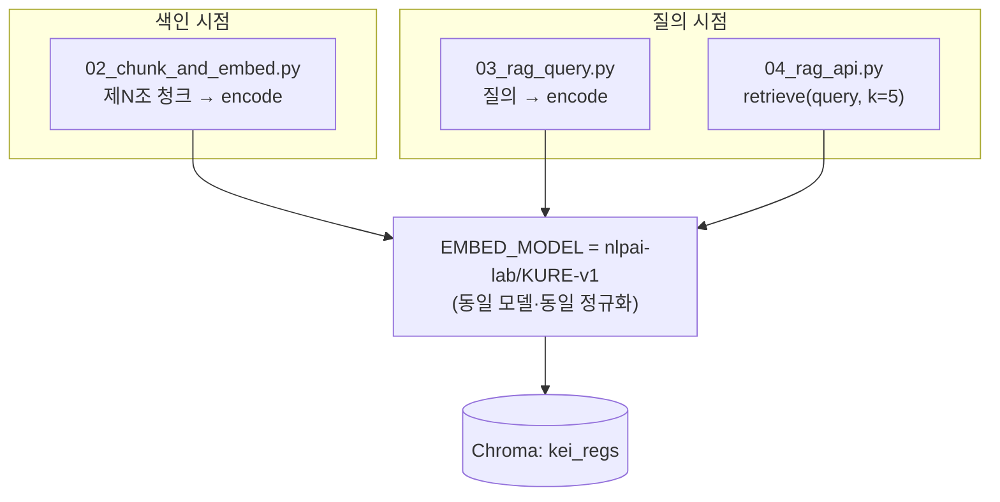

# ADR 0001 — 임베딩 모델: `nlpai-lab/KURE-v1`

> KEI 행정 규정 검색의 의미 검색(semantic search) 품질을 좌우하는 임베딩 모델을 결정한다.
> 한국어 행정 텍스트 특화 성능과, 파이프라인 전 단계(02→03/04)의 모델 일치 제약을 핵심 근거로 한다.

| 항목 | 내용 |
| --- | --- |
| 상태 | ✅ **채택 (Accepted)** |
| 결정일 | 2026-06-18 |
| 결정 모델 | `nlpai-lab/KURE-v1` |
| 검토 대안 | `BAAI/bge-m3` (다국어) |
| 영향 범위 | `../tools/02_chunk_and_embed.py`, `../tools/03_rag_query.py`, `../tools/04_rag_api.py`, `../deploy/docker-compose.yml` |
| 관련 ADR | [0002 — 조문 단위 청킹](0002-article-level-chunking.md), [0003 — 통제형 RAG API](0003-controlled-rag-api.md) |

---

## 1. 맥락 (Context)

[비서] Open WebUI + vLLM 화면은 **그림(그래프)이 아니라 텍스트 + 임베딩 검색**으로 답한다.
사용자가 "이 업무 어떻게 처리하지?"라고 물으면, 질문을 벡터로 임베딩해 Chroma 컬렉션
`kei_regs`에서 의미적으로 가까운 **제N조 단위 청크**를 회수하고, 그 근거만으로 답변을 생성한다.

따라서 회수(retrieval) 품질이 답변 품질의 상한을 결정한다. 잘못 회수하면 가드레일이 작동해
"규정에서 확인되지 않습니다"로 빠지거나, 엉뚱한 조문을 근거로 제시하게 된다.

이 시스템의 코퍼스는 다음과 같은 특성을 가진다.

- **한국어 행정·규정 문체.** `20_규정원문/`은 HWP에서 변환한 원문이며 의역하지 않는다. "제N조", "별표", "별지 제N호 서식" 같은 정형화된 행정 표현이 반복된다.
- **짧은 질의 ↔ 긴 조문.** 사용자 질의는 구어체 한국어 한두 문장인데, 회수 대상 청크는 한자어·법령체 문장이다. 질의-문서 간 어휘 격차(vocabulary mismatch)가 크다.
- **온프레미스 GPU(Quadro RTX 6000 24GB×2(총 48GB)) 구동.** 모델·임베딩 전부 사내에서 돌린다. 외부 임베딩 API는 사용하지 않는다.

```mermaid
flowchart LR
    Q["사용자 질의<br/>(구어체 한국어)"] -->|encode| E["임베딩 모델<br/>nlpai-lab/KURE-v1<br/>normalize=True"]
    V["20_규정원문/<br/>제N조 청크"] -->|encode (02)| E
    E -->|cosine 검색| C[("Chroma<br/>collection: kei_regs<br/>hnsw:space=cosine")]
    C -->|top-k 회수| L["[규정명 제N조] 근거 주입<br/>→ vLLM 답변"]
```

> [!note]
> 임베딩 모델 선택은 단독 결정이 아니다. **색인 시점(02)과 질의 시점(03/04)이 반드시 같은 모델·같은 정규화 방식**을 써야 벡터 공간이 일치한다. 이 ADR이 정하는 것은 "코퍼스를 어느 공간에 심을지"이며, 그 공간은 한 번 정하면 재색인 없이는 못 바꾼다.

---

## 2. 결정 (Decision)

KEI 행정 규정 코퍼스의 임베딩 모델로 **`nlpai-lab/KURE-v1`** 을 채택한다. 운용 규약은 다음과 같다.

| 결정 항목 | 값 | 비고 |
| --- | --- | --- |
| 임베딩 모델 | `nlpai-lab/KURE-v1` | 색인(02)·질의(03/04) 공통 |
| 양자화(quantization) | ❌ 적용하지 않음 | full precision 유지 |
| 정규화 | `normalize_embeddings=True` | encode 시 단위 벡터화 |
| 유사도 척도 | 코사인(cosine) | Chroma `hnsw:space=cosine` |
| 컬렉션 | `kei_regs` | `get_or_create_collection` |
| 실행 위치 | 사내 GPU(Quadro RTX 6000 24GB×2) | SentenceTransformer가 GPU 자동 사용 |

코드 상의 계약(모든 단계에서 동일):

```python
# tools/02_chunk_and_embed.py / 03 / 04 공통
EMBED_MODEL = "nlpai-lab/KURE-v1"   # 양자화 없음
emb = model.encode(texts, normalize_embeddings=True, batch_size=32)
# Chroma 컬렉션: metadata={"hnsw:space": "cosine"}, name="kei_regs"
```

> [!warning]
> **02와 03/04의 `EMBED_MODEL`은 한 글자도 달라선 안 된다.** 색인 모델과 질의 모델이 어긋나면 두 벡터가 다른 공간에 놓여 회수가 무의미해진다(에러 없이 조용히 망가진다). 모델·정규화·`hnsw:space`를 바꾸면 컬렉션을 **재색인**해야 한다.

`normalize_embeddings=True` + `hnsw:space=cosine` 조합으로 정규화된 벡터 위에서 코사인 거리를
계산해, 길이 편차의 영향을 제거하고 의미적 근접성만으로 회수한다.

---

## 3. 근거 (Rationale)

### 3.1 한국어 특화 성능

`nlpai-lab/KURE-v1`은 한국어 검색·임베딩을 목표로 만들어진 모델이다. 본 코퍼스는 다음 이유로
한국어 특화 임베딩의 이득이 큰 영역이다.

- 질의(구어체)와 문서(법령체) 사이의 한국어 어휘·표현 격차를 좁혀야 한다.
- 한자어·행정 용어(예: 일반적 표현으로 "여비", "출장", "복무" 같은 업무 영역)에서 동의·근접 표현을 같은 공간으로 모을수록 회수가 정확해진다.
- 코퍼스가 사실상 단일 언어(한국어)다. 다국어 범용성보다 한국어 한 언어에서의 회수 정확도가 우선이다.

> [!todo]
> 확인 필요: KURE-v1 vs bge-m3의 **본 코퍼스 기준 회수 정확도 정량 비교**. 동일 질의 세트로 top-k 회수 적중률(Recall@k)을 측정해 이 결정의 근거를 수치로 보강할 것. (현재는 한국어 특화 설계 + 단일 언어 코퍼스라는 정성 근거에 기반.)

### 3.2 파이프라인 전 구간의 모델 일치 필요

색인(02)과 질의(03/04)가 같은 공간을 공유해야 한다는 제약 때문에, 임베딩 모델은
**파이프라인 전체가 단일 모델로 묶이는 결정**이다. 한 번 정하면 전 단계에 전파된다.



선택지가 한국어 특화 모델과 다국어 모델 두 개라면, 단일 언어 코퍼스에서는 특화 모델이
일관되게 유리할 가능성이 높고, 전 구간이 한 모델로 묶이므로 **한 번 잘 고르는 것**이 중요하다.

### 3.3 양자화하지 않는 이유

회수 품질이 답변 품질의 상한이고, Quadro RTX 6000 GPU에서 full precision으로 충분히 구동 가능하므로,
검색 품질을 깎을 수 있는 양자화는 적용하지 않는다. (모델은 사내에서 한 번 적재해 상주시키며,
실시간 질의 부하는 LLM 생성 쪽이 지배적이다.)

---

## 4. 검토한 대안 (Alternatives)

| 모델 | 성격 | 본 프로젝트 관점 |
| --- | --- | --- |
| **`nlpai-lab/KURE-v1`** ✅ | 한국어 특화 | 단일 언어(한국어) 코퍼스 + 행정 문체에 적합. **채택.** |
| `BAAI/bge-m3` | 다국어(multilingual) | 강력한 범용 다국어 모델. 다국어가 필요 없는 단일 언어 코퍼스에서는 한국어 특화 모델 대비 이점이 작을 수 있음. **공식 대안(fallback).** |

`BAAI/bge-m3`는 다국어가 필요하거나, KURE-v1로 한국어 행정 질의에서 회수가 약하게 나오는
경우를 대비한 **fallback**으로 둔다. 단, 대안으로 전환하면 §2의 일치 제약에 따라
**컬렉션 전체 재색인이 필수**다.

> [!tip]
> 두 모델을 비교 검증할 때는 컬렉션을 분리하라(예: `kei_regs`(KURE) vs 별도 임시 컬렉션). 같은 컬렉션에 서로 다른 모델 벡터를 섞으면 공간이 오염된다.

---

## 5. 결과와 트레이드오프 (Consequences)

### 긍정

- 한국어 행정 질의-문서 격차에 맞춘 회수로, [규정명 제N조] 근거 정확도가 올라간다.
- 02/03/04가 단일 모델로 묶여 파이프라인 일관성이 단순·명확하다.
- 온프레미스 full precision 구동으로 외부 의존·데이터 유출이 없다.

### 제약 / 비용

- **모델 일치 락인(lock-in):** §2 제약 때문에, 모델·정규화·`hnsw:space`를 바꾸면 색인부터 다시 해야 한다. 운영 중 모델 교체 비용이 크다.
- **메모리:** 양자화하지 않으므로 모델이 GPU 메모리를 full precision으로 점유한다. Quadro RTX 6000 24GB×2(총 48GB)에서 임베딩 모델 + vLLM(예: `Qwen/Qwen2.5-14B-Instruct`) + (필요 시) 표 재추출용 `Qwen2.5-VL`이 같은 GPU 자원을 두고 경합할 수 있다. 참고: `Qwen2.5-14B-Instruct` fp16(약 28GB)은 RTX 6000 단일 24GB를 초과하므로 2장 텐서병렬(`tensor-parallel-size=2`) 또는 더 작은 instruct(7B/3B)·양자화 서빙이 필요하다. 임베딩(KURE-v1)은 1장으로 충분하다(실측).
- **배포 일치:** Open WebUI **내장** RAG를 쓰는 간편 경로에서는 `embeddings-tei` 컨테이너도 동일하게 `--model-id nlpai-lab/KURE-v1`로 떠야 한다. 다만 본 프로젝트의 권장/감사용 경로는 `../tools/04_rag_api.py`(통제형 RAG)이며 자세한 결정은 [0003](0003-controlled-rag-api.md) 참조.

> [!warning]
> 메모리·GPU 자원 배분(임베딩 + LLM + VLM 동시 상주 가능 여부)은 호스트 사양에 종속된다.

> [!todo]
> 확인 필요: 임베딩 모델 + vLLM(+ VLM) 동시 상주 시 메모리 예산. GPU는 `nvidia-smi`로 확정됨 — Quadro RTX 6000 24GB×2(총 48GB, 단일 통합 메모리 아님). 서버 호스트명은 `data05lx` 확인됨 — 그 외 호스트/IP는 미확정.

---

## 관련 문서

- 📚 **문서 인덱스:** [docs/README.md](../README.md) · **ADR 인덱스:** [adr/README.md](README.md)
- ⬆️ 상위 설계: [02 — 아키텍처](../02-architecture.md) · [05 — RAG 설계](../05-rag-design.md)
- 🔧 영향 소스: [`../tools/02_chunk_and_embed.py`](../../tools/02_chunk_and_embed.py) · [`../tools/03_rag_query.py`](../../tools/03_rag_query.py) · [`../tools/04_rag_api.py`](../../tools/04_rag_api.py)

| 이전 | 다음 |
| --- | --- |
| (ADR 인덱스) [adr/README.md](README.md) | [0002 — 조문 단위 청킹 →](0002-article-level-chunking.md) |

---

최종 수정: 2026-06-19
