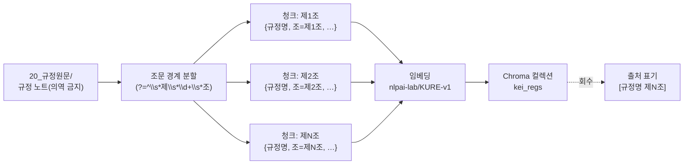

# ADR 0002 — 제N조 단위 청킹(조문 1개 = 청크 1개)

> 규정원문(`20_규정원문/`)을 벡터DB에 적재할 때 **고정 길이가 아니라 「제N조」 경계로 자른다**는 결정입니다.
> 청킹 단위는 검색 결과의 정확성과 [규정명 제N조] 출처 표기의 깔끔함을 좌우하는 가장 기초적인 선택입니다.

| 항목 | 값 |
|---|---|
| 번호 | ADR-0002 |
| 상태 | **채택(Accepted)** |
| 결정일 | 2026-06-18 |
| 영향 범위 | [../04-pipeline.md](../04-pipeline.md) · [../05-rag-design.md](../05-rag-design.md) · [`../tools/02_chunk_and_embed.py`](../../tools/02_chunk_and_embed.py) |
| 관련 ADR | [0001-embedding-kure-v1.md](0001-embedding-kure-v1.md) · [0003-controlled-rag-api.md](0003-controlled-rag-api.md) |

---

## 상태(Status)

**채택(Accepted)** — 프로젝트 초기 골격 단계에서 내린 핵심 결정이며, 시작일은 2026-06-18입니다. 이 결정을 뒤집을 때는 본문을 수정하지 말고 새 ADR을 추가한 뒤 이 문서를 `폐기됨`으로 표시하세요.

## 맥락(Context)

[비서] Open WebUI + vLLM 화면은 그림이 아니라 **텍스트 + 임베딩 검색**으로 답합니다. 사용자가 "이 업무 어떻게 처리하지?"라고 물으면, RAG API가 볼트의 규정 조각을 검색해 컨텍스트로 주입하고, 답변 끝에 `[규정명 제N조]` 형식으로 출처를 단 뒤 "최종 판단은 원문과 담당 부서 확인 바랍니다."를 덧붙입니다.

이 흐름이 신뢰받으려면 **검색 단위(청크)가 곧 인용 단위**여야 합니다. 검색해 회수한 조각이 정확히 하나의 조문이면, 그 조각의 출처를 「제N조」로 정확히 명시할 수 있습니다. 반대로 조각이 조문 경계와 무관하게 잘려 있으면 출처를 특정할 수 없고, 가드레일("근거에 없으면 규정에서 확인되지 않습니다")의 판정 자체가 흐려집니다.

행정 규정은 그 자체로 **조문 단위의 법적 완결 구조**를 갖습니다.

- 한국의 규정·내규는 `제1조(목적)`, `제2조(정의)`, `제3조(적용 범위)` … 처럼 **조(條) 단위로 하나의 완결된 규범**을 담습니다.
- 행정 담당자가 근거를 댈 때 쓰는 최소 인용 단위도 "제N조"입니다. 가이드(`10_업무가이드/`)도 본문에서 `[[규정명#제N조]]` 위키링크로 조문을 가리킵니다.
- 따라서 **검색·인용·작성**이 모두 같은 단위(제N조)를 공유하면, 시스템 전체가 하나의 좌표계 위에서 움직입니다.

> [!note]
> 이 결정은 **원문층 무손실 보존 원칙**과 짝을 이룹니다. `20_규정원문/`은 HWP에서 변환한 진실원천으로 **의역 금지**입니다. 청킹은 원문 텍스트를 **재작성·요약 없이 그대로** 조문 경계에서 나눌 뿐, 내용을 가공하지 않습니다.

## 결정(Decision)

`type: regulation` 노트는 **「제N조」 경계로 청킹한다. 조문 1개 = 청크 1개.** 고정 길이(예: N글자)·토큰 수 기반 청킹과 임의 슬라이딩 윈도우는 **사용하지 않는다.**

- 분할은 정규식 룩어헤드로 조문 시작 위치에서만 일어난다(텍스트를 소비하지 않고 경계만 찾는다).
  - [`../tools/02_chunk_and_embed.py`](../../tools/02_chunk_and_embed.py): `ARTICLE = re.compile(r"(?=^\s*제\s*\d+\s*조)", re.MULTILINE)`
- 각 조문 청크는 조 번호를 메타데이터로 보존한다. `제{n}조` 형태로 추출(`article_no`).
- `guide` / `term` 노트는 **노트 전체를 1청크**로 둔다(가치층·개념 노트는 통째로 의미를 가짐).
- `90_관리/_templates/`(템플릿)은 청킹 대상에서 제외한다.

청크 한 개의 (문서+메타데이터) 스키마는 다음과 같습니다(regulation 기준). 조문 본문 원문은 메타데이터가 아니라 **문서(`documents=`)** 로 적재되고, 아래 5개 키만 **메타데이터(`metadatas=`)** 로 보존됩니다.

- **문서(`documents`)**: 조문 본문 원문 그대로(`"제N조(…) …"`)

| 키 | 의미 | 예시(형식 설명용) |
|---|---|---|
| `규정명` | 프론트매터의 규정명/제목 | (실제 규정명은 볼트에서 채워짐) |
| `규정번호` | KEI 규정번호(1000~7999, 파일명 4자리) | (변환 시 파일명에서 추출) |
| `조` | 조 번호 | `제N조` |
| `type` | 노트 종류 | `regulation` |
| `path` | 원본 노트 경로 | `20_규정원문/<분류>/<번호>_<제목>.md` |

이 메타데이터가 그대로 검색 결과의 출처 표기(`[규정명 제N조]`)와 위키링크(`[[규정명#제N조]]`)로 이어집니다.

## 근거(Rationale)

1. **출처가 깔끔하다.** 청크 = 조문이므로, 회수된 조각마다 `규정명`과 `조`가 1:1로 붙습니다. RAG 답변은 별도 추정 없이 `[규정명 제N조]`를 그대로 출력할 수 있습니다(가드레일 3번 자동 충족).
2. **법적으로 완결된 단위.** 조문 하나에는 그 규범의 정의·조건·예외가 모여 있습니다. 조문 중간을 자른 조각은 "단서 조항"이나 "예외"만 잘려 나가 의미가 뒤집힐 수 있습니다. 조문 경계 청킹은 이 위험을 구조적으로 막습니다.
3. **감사 추적성(audit trail).** 어떤 답변이 어느 조문에서 나왔는지 청크 경계와 인용 단위가 같으므로 역추적이 단순합니다. 검수·이의 제기·갱신 시 "이 답은 제N조에서 왔다"가 자명합니다.
4. **세 층이 같은 좌표계를 쓴다.** 작성(가이드의 `[[규정명#제N조]]`), 검색(조문 청크), 답변(`[규정명 제N조]`)이 동일 단위를 공유해 전체 시스템이 일관됩니다.

## 대안(Alternatives)

| 대안 | 동작 | 채택하지 않은 이유 |
|---|---|---|
| **고정 길이 청킹** | N글자/N토큰마다 기계적으로 절단 | 조문 중간이 잘려 단서·예외가 분리됨 → 의미 왜곡. 출처가 "어느 조"인지 특정 불가 → `[규정명 제N조]` 표기 붕괴. |
| **슬라이딩 윈도우(겹침 청킹)** | 일정 길이를 겹쳐 가며 절단 | 같은 내용이 여러 청크에 중복 적재 → 검색 결과가 군더더기로 채워지고 회수 다양성 저하. 인용 단위가 여전히 조문과 불일치. |
| **문단/문장 단위 청킹** | 빈 줄·문장 부호로 분할 | 한 조문이 여러 조각으로 흩어져 법적 완결성이 깨짐. 출처를 조 단위로 묶어 표기하려면 후처리가 더 복잡해짐. |

> [!note]
> 고정 길이 청킹은 일반 문서 RAG의 기본값이지만, **법령형 텍스트**에는 맞지 않습니다. 이 프로젝트의 진실원천은 조문 구조를 명시적으로 갖춘 규정이므로, 그 구조를 그대로 청킹 경계로 쓰는 편이 단순하고 정확합니다.

## 결과(Consequences)

**좋아진 점**

- 검색 결과 = 인용 단위가 일치해 `[규정명 제N조]` 출처 표기가 자동으로 정확해집니다.
- 조문 단위라 답변이 "법적으로 완결된 근거"를 인용하게 되어 감사·검수가 쉽습니다.
- 청킹 로직이 단순(룩어헤드 정규식 1개)해 유지보수 부담이 낮습니다.

**감수할 점 / 주의**

- **매우 긴 조문.** 조문 하나가 수십 개 항·호를 포함해 임베딩 모델의 입력 한도를 넘기면, 한 청크가 모델 컨텍스트를 초과해 일부가 잘려 임베딩될 수 있습니다. 조문 단위를 유지하면서 "긴 조문은 항/호 단위 하위 청크로 분해하되 같은 `조` 메타데이터를 공유"하는 보강이 필요할 수 있습니다.
- **표·별표·부록.** 변환 단계(`01_hwp_to_md.py`)는 표를 본문 끝 `## (부록) 표`로 분리합니다. 이 부록 블록은 조문 경계에 잡히지 않아 별도 청킹 정책이 필요합니다(어느 조에 귀속시킬지, 표 자체를 한 청크로 둘지).
- **비표준 조문 표기.** `제 1 조`, `제1조의2`(가지번호), 부칙(附則) 등 변형 표기는 현재 정규식이 일부만 포착합니다. 회수 누락을 막으려면 패턴 보강과 회수 평가가 필요합니다.

> [!todo]
> 확인 필요: **긴 조문의 하위 청킹 임계값**(글자/토큰 기준)과, 초과 시 항/호 분해 규칙. 임베딩 모델([0001-embedding-kure-v1.md](0001-embedding-kure-v1.md), `nlpai-lab/KURE-v1`)의 실측 입력 한도를 기준으로 정합니다.

> [!todo]
> 확인 필요: **표/별표 부록(`## (부록) 표`) 청킹·귀속 정책.** 어느 조문에 매다는지, 표 1개를 1청크로 둘지, 회수 시 출처를 어떻게 표기할지(`[규정명 별표N]` 등). 변환 단계 처리는 [../04-pipeline.md](../04-pipeline.md) 참고.

> [!todo]
> 확인 필요: **가지번호·부칙·비표준 표기 대응.** `제N조의M`, 부칙, 공백 변형(`제 N 조`)에 대한 정규식 보강 및 회수 평가 절차.

> [!warning]
> 이 결정은 변환 품질에 의존합니다. HWP→Markdown 변환에서 조문 머리(`제N조`)가 깨지거나 표로 흡수되면 분할 자체가 어긋납니다. 변환물은 검수 전까지 프론트매터에 `검수상태: 미검수`를 유지하고, 청킹 결과의 조 회수 여부를 검수 항목에 포함하세요.

---

### 관련 문서

- ADR 인덱스: [README.md](README.md)
- 상위 설계 문서: [../03-content-model.md](../03-content-model.md) — 콘텐츠 모델/프론트매터 스키마 · [../04-pipeline.md](../04-pipeline.md) — 변환·청킹·임베딩 파이프라인
- 이전 ADR: [0001-embedding-kure-v1.md](0001-embedding-kure-v1.md) — 임베딩 모델로 KURE-v1 채택
- 다음 ADR: [0003-controlled-rag-api.md](0003-controlled-rag-api.md) — 통제형 RAG API를 직접 운영

최종 수정: 2026-06-18
