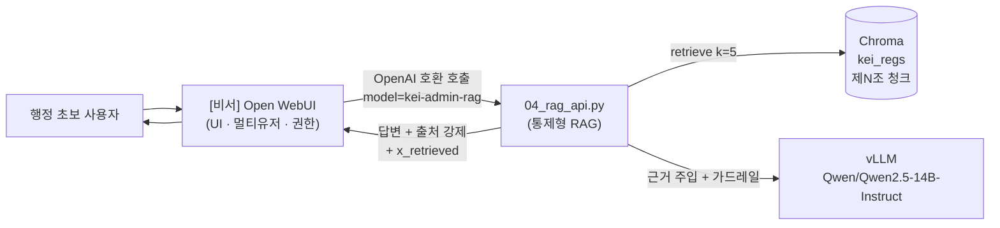
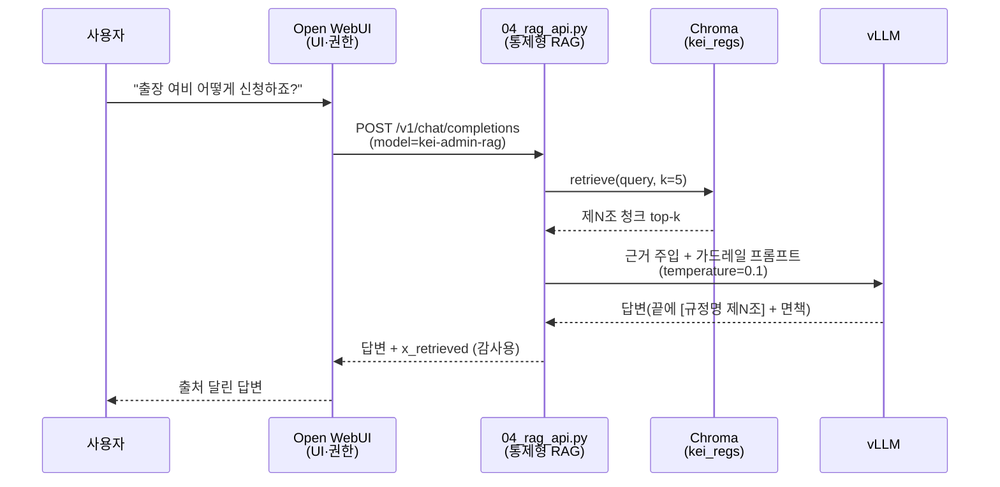

# ADR 0003 — 통제형 RAG API를 직접 운영 (`tools/04_rag_api.py`)

> [비서] Open WebUI + vLLM 화면의 답변 품질·출처 신뢰성을 어디서 통제할지 결정한다.
> Open WebUI **내장 RAG**에 맡기지 않고, `../tools/04_rag_api.py`를 **OpenAI 호환 모델**로 노출해
> 검색·근거 주입·`[규정명 제N조]` 출처 강제·가드레일을 우리가 직접 통제한다.

| 항목 | 내용 |
| --- | --- |
| 상태 | ✅ **채택 (Accepted)** |
| 결정일 | 2026-06-18 |
| 결정 | RAG 통제 로직을 자체 서비스(`04_rag_api.py`)에 두고, Open WebUI는 UI/권한만 담당 |
| 노출 형태 | OpenAI 호환 API, `MODEL_ID=kei-admin-rag` |
| 검토 대안 | Open WebUI **내장 RAG**(간편하나 통제 약함) |
| 영향 범위 | `../tools/04_rag_api.py`, `../tools/03_rag_query.py`, `../deploy/docker-compose.yml`, `../deploy/README.md` |
| 관련 ADR | [0001 — 임베딩 KURE-v1](0001-embedding-kure-v1.md), [0002 — 조문 단위 청킹](0002-article-level-chunking.md), [0005 — 온프레미스 Zero Trust](0005-on-prem-zero-trust.md) |

---

## 1. 맥락 (Context)

[비서] Open WebUI + vLLM 화면은 행정 초보(신입·전입자)가 "이 업무 어떻게 처리하지?"를 물으면
**사내 규정 근거**로 답하는 화면이다. 이 화면의 가치는 곧 **답변에 달린 출처의 신뢰성**이다.
근거 없이 그럴듯한 문장을 만들어내면(특히 금액·한도·기한) 행정 사고로 이어진다.

문제는 통제 지점이 두 곳으로 갈릴 수 있다는 데 있다.

- **Open WebUI 내장 RAG.** Open WebUI는 문서 업로드 → 자동 청킹 → 임베딩 → 검색을 자체적으로 제공한다. 켜기는 쉽지만, **청킹 단위와 출처 표기 방식을 우리가 통제하기 어렵다.** 내장 청커는 일반적으로 고정 길이·문자 수 기준으로 자르므로, 본 프로젝트가 [0002](0002-article-level-chunking.md)에서 정한 **제N조 단위(조문 1개 = 청크 1개)** 규칙과 어긋난다. 출처도 "문서명/페이지" 수준이지 `[규정명 제N조]` 형식을 보장하지 못한다.
- **자체 RAG 서비스.** 이미 `../tools/`에 변환 → 청킹·임베딩 → 질의 파이프라인(01→02→03)이 있고, `03_rag_query.py`에 검색·근거 주입·가드레일 프롬프트가 정의되어 있다. `04_rag_api.py`는 이 로직을 **OpenAI 호환 HTTP API**로 감싼 것이다.



> [!note]
> 이 결정의 본질은 "**RAG 통제 로직을 누가 소유하는가**"이다. 임베딩 모델([0001](0001-embedding-kure-v1.md))과 청킹 단위([0002](0002-article-level-chunking.md))를 우리가 통제하기로 한 이상, 그 두 결정이 실제로 답변에 반영되려면 검색·근거 주입·출처 표기도 같은 손 안에 있어야 한다. 통제 지점이 Open WebUI 내부로 넘어가면 0001·0002의 통제가 무의미해진다.

---

## 2. 결정 (Decision)

`../tools/04_rag_api.py`를 **OpenAI 호환 모델**(`MODEL_ID=kei-admin-rag`)로 노출하고,
**RAG 통제는 이 서비스가 전담**한다. **Open WebUI는 UI/멀티유저/권한(RBAC)만 담당**한다.

역할 분담을 명확히 한다.

| 책임 | 담당 | 비고 |
| --- | --- | --- |
| 사용자 인증·세션·멀티유저 | Open WebUI | `WEBUI_AUTH=true` |
| 권한/접근 제어(RBAC), SSO | Open WebUI + Cloudflare Zero Trust | [0005](0005-on-prem-zero-trust.md) |
| 대화 UI, 히스토리, 사용성 | Open WebUI | — |
| 질의 임베딩·벡터 검색(`retrieve`) | `04_rag_api.py` | `k=5`, 컬렉션 `kei_regs` |
| 제N조 청크 → 컨텍스트 구성·근거 주입 | `04_rag_api.py` | [0002](0002-article-level-chunking.md) |
| `[규정명 제N조]` 출처 강제 | `04_rag_api.py` | 가드레일(§3.2) |
| LLM 호출(vLLM) | `04_rag_api.py` → vLLM | `temperature=0.1` |
| 회수 근거 디버그(`x_retrieved`) | `04_rag_api.py` | 감사·검증용 |

`04_rag_api.py`가 노출하는 엔드포인트:

| 엔드포인트 | 용도 | 비고 |
| --- | --- | --- |
| `GET /v1/models` | 모델 목록(=`kei-admin-rag`) 반환 | Open WebUI가 연결 확인에 사용 |
| `POST /v1/chat/completions` | 검색 → 근거 주입 → vLLM 답변 | **비스트리밍 스켈레톤**, SSE는 향후 |

```python
# tools/04_rag_api.py (개념 골격)
# import 시점에 embed 모델 / chroma 클라이언트 / llm 클라이언트를 로딩한다.
MODEL_ID = "kei-admin-rag"

def retrieve(query, k=5):
    # 질의 임베딩(EMBED_MODEL은 02와 동일) → Chroma kei_regs에서 top-k 제N조 청크 회수
    ...

# /v1/chat/completions 응답에 디버그용으로 회수된 조 목록을 함께 싣는다.
# response["x_retrieved"] = [회수된 (규정명, 제N조) ...]
```

실행과 등록은 다음과 같다.

```bash
# 서버 호스트에서 직접 실행 (deploy/docker-compose.yml의 kei-rag-api 블록은 우선 주석 처리)
uvicorn 04_rag_api:app --host 0.0.0.0 --port 9000
```

Open WebUI 쪽 연결 설정(설정 > 연결 > OpenAI API):

| 항목 | 값 |
| --- | --- |
| Base URL | `http://<서버 실제 IP>:9000/v1` |
| API Key | `EMPTY` |
| 모델 | `kei-admin-rag` |

> [!warning]
> Base URL에 **`localhost`나 `host.docker.internal`을 쓰지 말 것.** Open WebUI는 컨테이너 안에서 도므로 컨테이너 입장의 `localhost`는 RAG API가 아니다. **서버의 실제 IP**를 쓴다. (자세한 배포 주의는 [../06-deployment.md](../06-deployment.md).)

---

## 3. 근거 (Rationale)

### 3.1 청킹·출처·가드레일을 한 곳에서 통제하기 위해

본 프로젝트의 RAG 품질은 세 가지 통제에 달려 있고, 이 셋은 분리할 수 없다.

| 통제 | 내용 | 어디서 |
| --- | --- | --- |
| 검색 | 제N조 단위 청크에서 의미 검색([0001](0001-embedding-kure-v1.md), [0002](0002-article-level-chunking.md)) | `04_rag_api.py` |
| 근거 주입 | 회수한 제N조를 `[규정명 제N조]` 블록으로 컨텍스트 구성(`---` 구분) | `04_rag_api.py` |
| 출처 강제 + 가드레일 | 답변 끝 `[규정명 제N조]` 표기 + 면책 문구, "근거에 없으면 지어내지 않기" | `04_rag_api.py` |

`03_rag_query.py`가 이미 "검색 → `[규정명 조]` 블록(`---` 구분)으로 컨텍스트 구성 →
OpenAI client(base=vLLM, `api_key=EMPTY`)로 `temperature=0.1` 채팅"을 구현해 둔 상태다.
`04_rag_api.py`는 같은 통제 로직을 HTTP로 노출할 뿐이라, **추가 통제권을 외부 도구에 넘기지 않고**
파이프라인 결정(0001·0002)을 그대로 답변까지 관통시킨다.

### 3.2 가드레일을 코드 소유로 두기 위해

03/04 공통 시스템 프롬프트의 가드레일은 다음 4개이며, **약화할 수 없다.**

> [!warning] 가드레일 (03/04 공통, 약화 금지)
> 1. **`[근거]`에 없는 내용(특히 금액·한도·기한)은 절대 지어내지 않고 "규정에서 확인되지 않습니다"라고 답한다.**
> 2. 신입도 이해하도록 쉽게, 단계로 설명한다.
> 3. 답변 끝에 사용한 출처를 `[규정명 제N조]` 형식으로 모두 표기한다.
> 4. 마지막에 "최종 판단은 원문과 담당 부서 확인 바랍니다."를 덧붙인다.

이 가드레일은 **우리 코드(시스템 프롬프트)에 박혀 있어야** 검증·버전 관리·재현이 가능하다.
내장 RAG에 맡기면 프롬프트 통제권이 도구의 설정 UI로 흩어져, "근거에 없으면 지어내지 않기"
같은 핵심 규칙을 보장하기 어렵다.

### 3.3 감사(audit) 가능성

응답에 `x_retrieved`(회수된 제N조 목록)를 디버그로 실어, **답변이 실제로 어떤 조문을
근거로 했는지** 추적할 수 있다. 출처가 틀렸을 때 "검색이 잘못 회수했는지" vs "LLM이
근거를 잘못 인용했는지"를 분리해 진단할 수 있어, 행정 문서 시스템에서 요구되는
**설명 가능성과 감사 추적**을 자체 서비스가 제공한다.



> [!note]
> 위 예시 질의는 동작을 보여주기 위한 **일반적 예시**이며, 특정 규정의 실제 조문 번호·금액·한도를 단정하지 않는다. 실제 답변의 출처는 회수된 제N조에 따라 결정된다.

---

## 4. 검토한 대안 (Alternatives)

| 대안 | 장점 | 단점 / 본 프로젝트 관점 |
| --- | --- | --- |
| **자체 통제형 RAG (`04_rag_api.py`)** ✅ | 청킹(제N조)·근거 주입·출처 강제·가드레일·감사(`x_retrieved`)를 모두 코드로 소유. 0001·0002 결정이 답변까지 관통. | 별도 서비스 운영 부담(uvicorn/컨테이너), 현재 비스트리밍. **채택.** |
| Open WebUI **내장 RAG** | 설정만으로 즉시 동작(간편). 별도 서비스 불필요. 스트리밍 등 UI 기능 내장. | **청킹 단위·출처 표기 통제가 약함.** 고정 길이 청킹이 제N조 규칙과 충돌, `[규정명 제N조]` 출처·가드레일 보장 어려움. 감사 추적 약함. |

내장 RAG 경로는 빠른 데모·검증용으로 **간편 경로**로 남겨 둘 수 있다. 이 경우
`../deploy/docker-compose.yml`의 `embeddings-tei`(`--model-id nlpai-lab/KURE-v1`)가 필요하다.
다만 본 프로젝트의 **권장/감사용 기본 경로는 통제형 RAG**다.

> [!tip]
> 두 경로의 배포 절차(간편 vs 권장/감사용)는 [../06-deployment.md](../06-deployment.md)와 `../deploy/README.md`에 정리되어 있다. RAG 검색·프롬프트 설계의 근거는 [../05-rag-design.md](../05-rag-design.md)를 본다.

---

## 5. 결과와 트레이드오프 (Consequences)

### 긍정

- 검색·근거 주입·`[규정명 제N조]` 출처 강제·가드레일·감사(`x_retrieved`)를 **한 코드베이스에서 통제**한다.
- 0001(임베딩)·0002(제N조 청킹) 결정이 답변까지 일관되게 반영된다.
- 가드레일이 버전 관리되어, "근거에 없으면 지어내지 않기"가 재현·검증 가능하다.
- Open WebUI는 UI/권한에 집중 → 책임 경계가 깨끗하다.

### 제약 / 비용

- **별도 서비스 운영.** RAG API를 별도로 띄워야 한다(우선 호스트에서 `uvicorn ... --port 9000`, 추후 `../deploy/docker-compose.yml`의 `kei-rag-api` 컨테이너 블록 활성화). Open WebUI·vLLM·(필요 시)임베딩과 함께 가동·모니터링할 컴포넌트가 하나 더 늘어난다.
- **비스트리밍.** 현재 `/v1/chat/completions`는 **비스트리밍 스켈레톤**이라 답변이 한 번에 온다. 긴 답변에서 체감 지연이 있을 수 있다. **SSE(스트리밍)는 향후 과제.**
- **연결 설정 함정.** Base URL에 실제 IP를 써야 한다(§2 경고). 컨테이너 네트워크에서 `localhost`/`host.docker.internal` 혼동이 흔하다.
- **모델 일치 의존.** `04_rag_api.py`의 `EMBED_MODEL`은 색인 단계(02)와 반드시 같아야 한다([0001](0001-embedding-kure-v1.md) §2). 어긋나면 회수가 조용히 망가진다.

> [!todo]
> 확인 필요: `/v1/chat/completions`의 **SSE 스트리밍** 구현 일정/담당. 로드맵은 [../08-roadmap.md](../08-roadmap.md) 참조.

> [!todo]
> 확인 필요: RAG API의 **운영 위치**(호스트 uvicorn vs `kei-rag-api` 컨테이너) 최종 결정과 해당 호스트/실제 IP. 확인된 호스트명은 예시 `data05lx`뿐이며, 그 외 호스트/IP는 미확정이다.

> [!warning]
> 두 화면(그래프·채팅)과 RAG API는 모두 **사내 전용**이다. Cloudflare Zero Trust 뒤에 두며, 어떤 화면도 인터넷에 공개하지 않는다. 네트워크·접근 통제 결정은 [0005](0005-on-prem-zero-trust.md)를 따른다.

---

## 관련 문서

- 📚 **문서 인덱스:** [docs/README.md](../README.md) · **ADR 인덱스:** [adr/README.md](README.md)
- ⬆️ 상위 설계: [02 — 아키텍처](../02-architecture.md) · [05 — RAG 설계](../05-rag-design.md) · [06 — 배포](../06-deployment.md)
- 🔧 영향 소스: [`../tools/04_rag_api.py`](../../tools/04_rag_api.py) · [`../tools/03_rag_query.py`](../../tools/03_rag_query.py) · [`../deploy/docker-compose.yml`](../../deploy/docker-compose.yml)

| 이전 | 다음 |
| --- | --- |
| [← 0002 — 조문 단위 청킹](0002-article-level-chunking.md) | [0004 — Quartz 그래프 사이트 →](0004-quartz-graph-site.md) |

---

최종 수정: 2026-06-18
