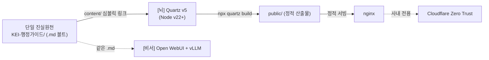
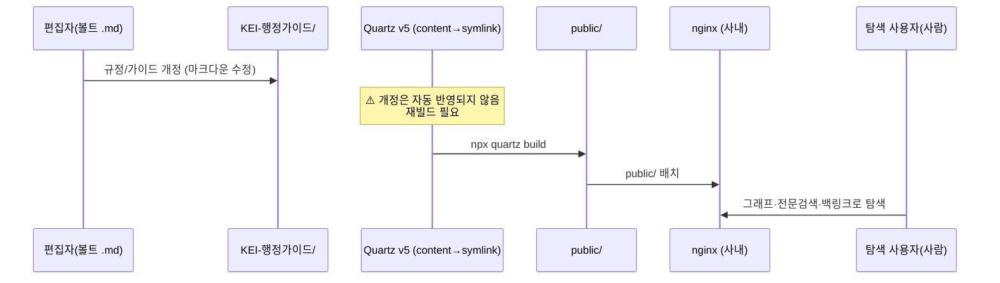
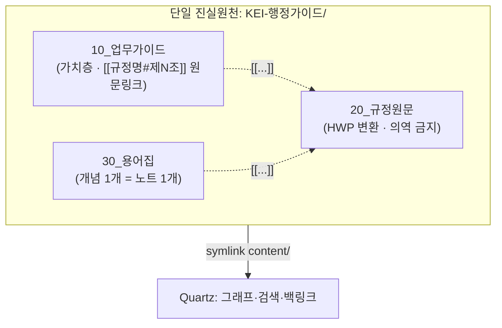

# ADR 0004 — 그래프 사이트: Quartz v5

> 사람이 규정·가이드를 **탐색**하는 [뇌] 화면을, 별도 CMS 없이 **마크다운 볼트에서 직접 정적 사이트(SSG)** 로 만든다.
> CJK 전문검색·노드 그래프·백링크를 기본 제공하고, 볼트(Source of Truth)를 그대로 먹는 도구로 **Quartz v5**를 채택한다.

| 항목 | 내용 |
| --- | --- |
| 상태 | ✅ **채택 (Accepted)** |
| 결정일 | 2026-06-18 |
| 결정 | **Quartz v5**(Node v22+), 볼트를 `content/`로 심볼릭 링크, `public/` → nginx |
| 검토 대안 | 다른 SSG(Hugo/Jekyll/Docusaurus 등), Obsidian Publish(외부 호스팅) |
| 영향 범위 | `../deploy/README.md`, `../deploy/docker-compose.yml`, nginx, Cloudflare Tunnel |
| 관련 ADR | [0003 — 통제형 RAG API](0003-controlled-rag-api.md), [0005 — 온프레미스 + Zero Trust](0005-on-prem-zero-trust.md) |

---

## 1. 맥락 (Context)

이 시스템은 **하나의 볼트, 두 개의 화면** 구조다. 단일 진실원천은 레포의 마크다운 볼트 `KEI-행정가이드/`이며, 두 화면은 **같은 마크다운을 먹는다**.

| 화면 | 도구 | 누가 / 무엇으로 |
| --- | --- | --- |
| **[뇌]** | Quartz v5 정적 사이트 | 사람이 **탐색** — 노드/링크 그래프 + 전문검색으로 규정·가이드를 둘러본다 |
| **[비서]** | Open WebUI + vLLM | 행정 초보가 **질문** — 텍스트 + 임베딩 검색으로 [규정명 제N조] 출처를 달아 답한다 |

[비서]가 "이 한 가지 업무를 어떻게 처리하지?"라는 **좁은 질문**에 답한다면, [뇌]는 "이 규정이 어떤 규정들과 엮여 있지?", "이 용어가 어느 가이드·조문에서 쓰이지?" 같은 **넓은 탐색**을 맡는다. 사람이 직접 문서 사이를 걸어다니며 맥락을 잡는 화면이 필요하다.

그 화면에 요구되는 핵심 능력은 다음과 같다.

- **한국어(CJK) 전문검색.** 사용자 노출 콘텐츠는 한국어이고 파일명도 한글이다. 검색이 CJK를 제대로 토크나이즈하지 못하면 [뇌]의 가치가 사라진다.
- **노드/링크 그래프 + 백링크.** 볼트는 이미 `[[규정명#제N조]]` 위키링크와 가이드↔규정 참조로 촘촘히 엮여 있다. 이 관계를 시각적 그래프와 역참조(backlink)로 드러내야 한다.
- **마크다운 직결.** 볼트가 SoT다. 별도 편집 UI나 DB로 콘텐츠를 복제하지 않고, **볼트의 `.md`를 그대로 입력**으로 받아야 이중 관리가 생기지 않는다.
- **온프레미스 + 사내 전용.** 빌드 산출물은 사내에서 호스팅하고, 인터넷에 공개하지 않는다(자세한 망 결정은 [0005](0005-on-prem-zero-trust.md)).



> [!note]
> [뇌]는 **그림으로 답하지 않는다.** 그래프는 사람이 탐색하는 시각화일 뿐이고, [비서]의 답변은 그래프가 아니라 **텍스트 + 임베딩 검색**(Chroma 컬렉션 `kei_regs`)에서 나온다. 두 화면은 같은 볼트를 먹지만 동작 방식이 다르다.

---

## 2. 결정 (Decision)

[뇌] 탐색 화면의 SSG로 **Quartz v5**를 채택한다. 운용 규약은 다음과 같다.

| 결정 항목 | 값 | 비고 |
| --- | --- | --- |
| SSG | **Quartz v5** | `jackyzha0/quartz` |
| 런타임 | **Node v22+** | Quartz v5 요구 사항 |
| 콘텐츠 입력 | 볼트를 `content/`로 **심볼릭 링크** | 복제하지 않음, 볼트가 SoT |
| 산출물 | `public/` | 정적 파일 |
| 서빙 | **nginx** | 기존 Cloudflare Tunnel 라우트 뒤 |
| 노출 범위 | **사내 전용** | 인터넷 공개 금지([0005](0005-on-prem-zero-trust.md)) |

빌드·서빙 흐름은 `../deploy/README.md`의 절차를 따른다(요약).

```bash
# 1) Quartz v5 가져오기 (Node v22+)
git clone https://github.com/jackyzha0/quartz
cd quartz
npm i
npx quartz create

# 2) 볼트를 content/로 심볼릭 링크 (복제 금지 — 볼트가 SoT)
ln -s /절대경로/KEI-행정가이드 content

# 3) 로컬 미리보기 (개발 중)
npx quartz build --serve          # http://localhost:8080

# 4) 배포용 정적 산출물 생성 → nginx가 서빙
npx quartz build                  # → public/
```



> [!warning]
> 연결/접근 URL에는 `localhost`나 `host.docker.internal`이 아니라 **서버의 실제 IP/호스트명**을 쓴다. (이 함정은 [비서] 쪽 Open WebUI ↔ RAG API 연결과 공통이다 — [0003](0003-controlled-rag-api.md) 참조.)

---

## 3. 근거 (Rationale)

### 3.1 CJK 전문검색·그래프·백링크를 **기본 제공**

[뇌]가 요구하는 세 가지 — CJK 전문검색, 노드/링크 그래프, 백링크 — 가 Quartz의 **기본 기능**이다. 일반 SSG에서 이 셋을 직접 붙이려면 검색 인덱스·그래프 렌더링·역참조 산출을 별도로 구현·통합해야 한다. Quartz는 위키링크 기반 PKM(개인 지식관리) 사이트를 겨냥해 만들어진 도구라 이 작업이 거의 사라진다.

| 요구 능력 | Quartz v5 | 비고 |
| --- | --- | --- |
| CJK(한국어) 전문검색 | 기본 | 한글 콘텐츠·한글 파일명 환경에서 핵심 |
| 노드/링크 그래프 | 기본 | `[[...]]` 관계를 시각화 |
| 백링크(역참조) | 기본 | "이 노트를 가리키는 노트" 자동 표시 |

### 3.2 마크다운 직결 = 볼트가 그대로 입력 (SoT 유지)

볼트의 `.md`를 `content/`로 **심볼릭 링크**하므로, 콘텐츠를 별도 저장소·편집 UI로 복제하지 않는다. 편집은 항상 볼트에서 일어나고, [뇌]는 그 볼트의 **뷰(view)** 일 뿐이다. 결과적으로 콘텐츠 진실원천이 단 하나로 유지된다 — 이는 본 프로젝트의 핵심 설계 원칙이다.

특히 원문층(`20_규정원문/`)은 **의역 금지** 원칙을 따른다. SSG가 마크다운을 직결로 렌더링하므로, 원문이 사이트에서 가공·요약되지 않고 **그대로 보인다**. 별도 CMS에 옮겨 적으며 원문이 변형될 여지가 없다.



> [!tip]
> 볼트는 이미 `[[규정명#제N조]]` 위키링크로 가이드↔규정↔용어를 엮어 두었다. Quartz는 이 링크를 **그래프 간선과 백링크**로 그대로 살려 준다. 즉 콘텐츠 모델([../03-content-model.md](../03-content-model.md))을 잘 지킬수록 [뇌]의 탐색 가치가 자동으로 커진다.

### 3.3 온프레미스 정적 호스팅과 잘 맞음

산출물이 순수 정적 파일(`public/`)이라 nginx로 단순 서빙하고, 기존 Cloudflare Tunnel 라우트 뒤에 사내 전용으로 둘 수 있다. 동적 백엔드·DB가 없어 운영 표면이 작고, 망 정책([0005](0005-on-prem-zero-trust.md))을 적용하기 쉽다.

---

## 4. 검토한 대안 (Alternatives)

| 대안 | 성격 | 본 프로젝트 관점 |
| --- | --- | --- |
| **Quartz v5** ✅ | 위키링크 PKM용 SSG | CJK 전문검색 + 그래프 + 백링크 기본, 마크다운 직결. **채택.** |
| 일반 SSG(Hugo/Jekyll/Docusaurus 등) | 범용 정적 사이트 생성기 | 빠르고 성숙하지만, 그래프·백링크·CJK 검색을 직접 구성·통합해야 함. [뇌]가 원하는 기능 셋이 기본 제공이 아님. |
| Obsidian Publish | 호스팅형 퍼블리시 서비스 | 볼트 직결·그래프는 우수하나 **외부 호스팅**이라 사내 전용·온프레미스 원칙과 충돌. |

> [!warning]
> **Obsidian Publish 같은 외부 호스팅은 채택하지 않는다.** 이 시스템의 어떤 화면도 인터넷에 공개하지 않으며, 내부 규정 콘텐츠가 사내 망 밖으로 나가는 호스팅은 [0005](0005-on-prem-zero-trust.md)의 온프레미스 원칙에 어긋난다. Quartz는 산출물을 **사내 nginx**에 두므로 데이터가 망 밖으로 나가지 않는다.

일반 SSG도 기술적으로는 가능하지만, [뇌]의 가치(그래프·백링크·CJK 검색)를 직접 구현·유지보수하는 비용이 들고, 그 과정에서 마크다운 직결성을 잃기 쉽다. Quartz는 이 셋을 기본으로 주면서 볼트를 그대로 입력으로 받는다는 점에서 본 용도에 가장 잘 들어맞는다.

---

## 5. 결과와 트레이드오프 (Consequences)

### 긍정

- 사람이 규정·가이드·용어 사이를 **그래프·백링크·전문검색**으로 자유롭게 탐색하는 [뇌] 화면이 생긴다.
- 콘텐츠를 복제하지 않고 **볼트를 심볼릭 링크**하므로 진실원천이 하나로 유지되고, 원문층 의역 금지 원칙이 사이트에서도 보존된다.
- 정적 산출물(`public/`) + nginx라 운영 표면이 작고 사내 전용 망 정책과 잘 맞는다.

### 제약 / 비용

- **개정 시 재빌드 필요.** 볼트의 `.md`를 고쳐도 사이트는 **자동으로 갱신되지 않는다.** `npx quartz build`로 `public/`을 다시 만들어야 변경이 반영된다. 규정 개정 빈도에 맞춘 재빌드 운영 절차가 필요하다(수동 또는 자동화).
- **Node v22+ 의존.** 호스트에 Node v22 이상 런타임이 있어야 빌드가 된다.
- **검수 상태와의 관계.** 변환·생성물은 검수 전 `검수상태: 미검수`를 유지한다. [뇌]가 볼트를 직결로 보여주므로, 사이트에도 **미검수 콘텐츠가 그대로 노출**될 수 있다. 사이트 표시·필터링 정책은 콘텐츠 모델·거버넌스를 따른다([../03-content-model.md](../03-content-model.md), [../07-security-governance.md](../07-security-governance.md)).

> [!todo]
> 확인 필요: 재빌드 트리거(예: 볼트 변경 시 webhook/CI로 `npx quartz build` 자동 실행 vs 정기 cron vs 수동). 자동화 여부와 주기는 아직 미정. 운영 절차는 [../10-operations.md](../10-operations.md)에서 확정한다.

> [!todo]
> 확인 필요: Quartz/nginx를 올릴 정확한 호스트와 포트, 그리고 Cloudflare 팀/도메인. 서버 호스트명은 예시로 `data05lx`(Ubuntu)만 확인됨 — 그 외 호스트/IP/도메인은 미확정.

> [!todo]
> 확인 필요: Quartz 및 의존 패키지의 **라이선스 종류**와 사내 사용 적합성 검토.

---

## 관련 문서

- 📚 **문서 인덱스:** [docs/README.md](../README.md) · **ADR 인덱스:** [adr/README.md](README.md)
- ⬆️ 상위 설계: [02 — 아키텍처](../02-architecture.md)(두 화면 / 하나의 볼트) · [06 — 배포](../06-deployment.md)(Quartz 빌드·nginx·Tunnel 절차)
- 🔗 함께 보기: [03 — 콘텐츠 모델](../03-content-model.md)(위키링크·검수상태) · [07 — 보안·거버넌스](../07-security-governance.md) · [10 — 운영](../10-operations.md)(재빌드)
- 🔧 배포 가이드: [`../deploy/README.md`](../../deploy/README.md) · [`../deploy/docker-compose.yml`](../../deploy/docker-compose.yml)

| 이전 | 다음 |
| --- | --- |
| [← 0003 — 통제형 RAG API](0003-controlled-rag-api.md) | [0005 — 온프레미스 + Zero Trust →](0005-on-prem-zero-trust.md) |

---

최종 수정: 2026-06-18
