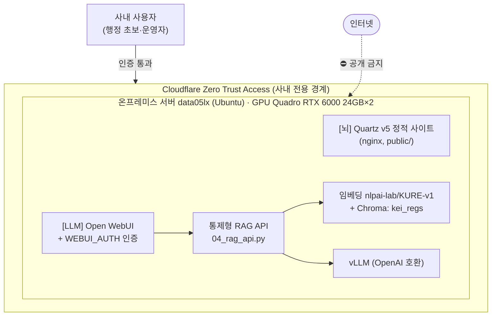
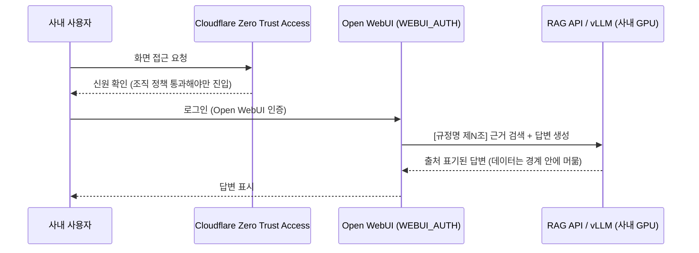

# ADR 0005 — 온프레미스 구동 + Cloudflare Zero Trust 경계

> KEI 행정 규정은 사내 전용 데이터다. 이 ADR은 시스템의 **배포·보안 경계**를 결정한다.
> 핵심 명제: 모델·임베딩·데이터는 사내 GPU(Quadro RTX 6000 24GB×2, 총 48GB)를 떠나지 않으며, 두 화면 모두 인터넷에 공개하지 않고 **Cloudflare Zero Trust Access 뒤 + Open WebUI 인증** 안쪽에서만 접근한다.

| 항목 | 내용 |
| --- | --- |
| 상태 | ✅ **채택 (Accepted)** |
| 결정일 | 2026-06-18 |
| 결정 | 모델·임베딩 전부 사내 GPU(Quadro RTX 6000 24GB×2) 구동 · 두 화면 모두 Cloudflare Zero Trust Access 뒤 + Open WebUI 인증 |
| 검토 대안 | 클라우드 LLM API / 클라우드 호스팅 |
| 영향 범위 | [`../deploy/docker-compose.yml`](../../deploy/docker-compose.yml), [`../deploy/README.md`](../../deploy/README.md), 운영 호스트 `data05lx`(Ubuntu) |
| 관련 ADR | [0003 — 통제형 RAG API](0003-controlled-rag-api.md), [0004 — Quartz 그래프 사이트](0004-quartz-graph-site.md) |
| 관련 설계 문서 | [07 — 보안·거버넌스](../07-security-governance.md), [06 — 배포](../06-deployment.md) |

---

## 1. 맥락 (Context)

KEI 행정 가이드/LLM이 다루는 데이터는 **한국환경연구원(KEI)의 사내 규정 원문과 그 가공물**이다. 이 코퍼스에는 두 가지 강한 제약이 따라온다.

- **데이터 비유출.** 규정 원문(`20_규정원문/`)과 그 임베딩, 사용자 질의·답변은 모두 내부 규정 데이터다. 이 데이터가 **망 밖(외부 클라우드·외부 API)으로 나가서는 안 된다.**
- **사내 전용 접근.** 이 시스템은 행정 초보(신입·전입자)가 사내에서 업무 처리를 돕는 내부 도구다. 일반 인터넷 사용자가 접근할 대상이 아니다.

여기에 프로젝트 전체를 관통하는 절대 규칙이 겹친다.

> [!warning]
> ⛔ **어떤 화면도 인터넷에 공개하지 않는다.** [뇌] Quartz 정적 사이트도, [LLM] Open WebUI도 공개 URL로 노출하지 않는다. 이는 협상 대상이 아니라 본 시스템의 전제다. 자세한 거버넌스는 [07 — 보안·거버넌스](../07-security-governance.md)를 본다.

즉 "어디서 추론을 돌릴 것인가(모델·임베딩 위치)"와 "누가 접근할 수 있는가(접근 경계)" 두 결정이 데이터 비유출이라는 하나의 요구로 묶인다. 이 ADR은 그 둘을 함께 정한다.

---

## 2. 결정 (Decision)

### 2.1 추론은 전부 사내 GPU(Quadro RTX 6000)에서

모델과 임베딩은 **외부 API를 일절 쓰지 않고 사내 GPU(Quadro RTX 6000 24GB×2)에서만** 구동한다.

| 구성요소 | 구동 위치 | 비고 |
| --- | --- | --- |
| 임베딩 `nlpai-lab/KURE-v1` | 사내 GPU(Quadro RTX 6000) | 양자화 없음, `normalize_embeddings=True` (ADR [0001](0001-embedding-kure-v1.md)) · 1장으로 충분(실측) |
| 벡터DB Chroma (`kei_regs`) | 사내 디스크 (`tools/chroma/`) | `PersistentClient`, `hnsw:space=cosine` |
| LLM 서빙 vLLM | 사내 GPU(Quadro RTX 6000) | OpenAI 호환, 기본 `http://localhost:8000/v1` · Qwen2.5-14B-Instruct fp16(약 28GB)은 단일 24GB 초과 → 2장 텐서병렬(`--tensor-parallel-size 2`) 또는 더 작은 instruct(7B/3B)·양자화 서빙 필요 |
| 통제형 RAG API `04_rag_api.py` | 사내 호스트 | `MODEL_ID=kei-admin-rag`, 포트 9000 |
| 표 재추출 VLM `Qwen2.5-VL` | 사내 GPU(Quadro RTX 6000) | 변환 단계에서 필요 시에만 |

데이터(규정 원문·임베딩·질의·답변)는 이 서버 경계 안에서만 흐른다. **온프레미스 구동이므로 데이터가 망 밖으로 나가지 않는다.**

### 2.2 접근 경계 = Cloudflare Zero Trust Access + Open WebUI 인증

두 화면 모두 인터넷에 공개하지 않고 **Cloudflare Zero Trust Access** 뒤에 둔다. 그 안에서 [LLM]은 추가로 **Open WebUI 자체 인증(`WEBUI_AUTH=true`)** 으로 한 겹 더 보호한다.

| 화면 | 1차 경계 | 2차 인증 |
| --- | --- | --- |
| [뇌] Quartz 정적 사이트 | Cloudflare Zero Trust Access | (정적 사이트, 별도 앱 인증 없음 — 경계가 곧 인증) |
| [LLM] Open WebUI + vLLM | Cloudflare Zero Trust Access | Open WebUI 인증 (`WEBUI_AUTH=true`) + RBAC/멀티유저 |

> [!warning]
> Open WebUI ↔ RAG API 연결 URL에는 **`localhost`/`host.docker.internal`이 아니라 서버 실제 IP**를 쓴다. 컨테이너 안에서 `localhost`는 컨테이너 자신을 가리키므로 연결이 깨진다. 설정: Open WebUI > 연결 > OpenAI API, Base URL=`http://<서버실제IP>:9000/v1`, API Key=`EMPTY`. (배포 절차는 [06 — 배포](../06-deployment.md) 참조.)

---

## 3. 근거 (Rationale)

### 3.1 데이터가 망 밖으로 나가지 않는다

모델·임베딩·LLM을 전부 사내 GPU에서 돌리면, 규정 원문도 사용자 질의도 외부 서버로 전송될 일이 없다. 외부 임베딩 API나 클라우드 LLM을 쓰면 코퍼스·질의가 외부로 흘러나가게 되는데, 사내 규정 데이터에는 허용되지 않는 경로다. 온프레미스 구동은 이 비유출 요구를 **구조적으로** 보장한다(정책으로 막는 게 아니라 애초에 나갈 통로가 없다).

### 3.2 인터넷 공개 금지(⛔)와 정합

이 시스템은 내부 전용이다. Cloudflare Zero Trust Access를 경계로 두면, 두 화면을 인터넷에 노출하지 않으면서도 사내 사용자가 신원 확인 후 접근하게 만들 수 있다. [LLM]은 그 위에 Open WebUI 인증/RBAC를 더해, "조직 경계 통과"와 "앱 사용자 인증"을 분리한 다층 방어를 구성한다.

### 3.3 통제형 RAG·그래프 결정과의 연결

본 프로젝트는 출처 표기와 청킹을 직접 통제하기 위해 통제형 RAG API를 운영하기로 했고(ADR [0003](0003-controlled-rag-api.md)), 탐색용 그래프 사이트로 Quartz를 채택했다(ADR [0004](0004-quartz-graph-site.md)). 두 결정 모두 **산출물이 사내에 머무는 것**을 전제한다. 이 ADR은 그 전제를 명문화한 경계 결정이다.

> [!note]
> RAG 가드레일은 경계와 무관하게 항상 유효하다. 답변은 [근거]에 없는 내용(특히 금액·한도·기한)을 지어내지 않고 "규정에서 확인되지 않습니다"라고 답하며, 끝에 `[규정명 제N조]` 출처와 "최종 판단은 원문과 담당 부서 확인 바랍니다." 면책 문구를 붙인다. 자세한 내용은 [0003](0003-controlled-rag-api.md)·[05 — RAG 설계](../05-rag-design.md)를 본다.

---

## 4. 검토한 대안 (Alternatives)

| 대안 | 내용 | 본 프로젝트 관점 |
| --- | --- | --- |
| **온프레미스 + Zero Trust** ✅ | 추론 전부 사내 GPU, 두 화면을 Cloudflare Zero Trust + Open WebUI 인증 뒤에 | 데이터 비유출·인터넷 공개 금지(⛔)를 구조적으로 만족. **채택.** |
| 클라우드 LLM API | OpenAI 등 외부 LLM/임베딩 API 호출 | 규정 원문·질의가 망 밖 외부 서버로 전송됨 → 데이터 비유출 위반. **기각.** |
| 클라우드 호스팅 | 두 화면을 외부 클라우드에 호스팅 | 데이터가 외부에 상주하고 인터넷 경로가 생김 → 공개 금지 원칙과 충돌. **기각.** |

클라우드 경로는 운영 부담(GPU 구매·관리)을 줄여 주지만, 사내 규정 데이터를 외부로 내보내는 순간 본 시스템의 전제(비유출·비공개)가 무너진다. 따라서 운영 부담을 감수하더라도 온프레미스를 택한다.

---

## 5. 결과와 트레이드오프 (Consequences)

### 긍정

- 규정 원문·임베딩·질의·답변이 사내 경계를 떠나지 않는다(데이터 비유출 보장).
- 두 화면 모두 인터넷에 공개되지 않으며, Zero Trust + Open WebUI 인증으로 다층 접근통제가 선다.
- 외부 API 의존이 없어 외부 장애·요금·약관 변화에 휘둘리지 않는다.

### 제약 / 비용

- **자체 GPU·운영 부담.** Quadro RTX 6000 24GB×2 GPU와 `data05lx`(Ubuntu) 호스트를 직접 운영·유지보수해야 한다. 모델 적재, vLLM·임베딩·RAG API 프로세스, Open WebUI 컨테이너, Quartz 빌드/nginx, Cloudflare 경계까지 운영 책임이 사내에 있다.
- **자원 경합.** 임베딩(`nlpai-lab/KURE-v1`) + vLLM(예: `Qwen/Qwen2.5-14B-Instruct`) + (변환 시) `Qwen2.5-VL`이 같은 GPU 자원을 두고 경합할 수 있다(메모리 예산은 ADR [0001](0001-embedding-kure-v1.md) 참조).
- **경계 운영.** Cloudflare Zero Trust 정책과 Open WebUI RBAC/사용자 관리를 사내에서 지속 관리해야 한다. 연결 URL 실수(`localhost`/`host.docker.internal`)는 흔한 장애 원인이다.

> [!todo]
> GPU 사양 확정: Quadro RTX 6000 **24GB×2(총 48GB, 단일 통합 메모리 아님)** — `nvidia-smi`로 확인됨. 확인 필요: `data05lx` 외 호스트명/IP. — 미확정.

> [!todo]
> 확인 필요: Cloudflare **팀(team)·도메인명**과 Zero Trust 접근 정책(허용 대상·SSO 연동 방식). — 미확정.

---

## 관련 문서

- 📚 **문서 인덱스:** [docs/README.md](../README.md) · **ADR 인덱스:** [adr/README.md](README.md)
- ⬆️ 상위 설계: [02 — 아키텍처](../02-architecture.md) · [06 — 배포](../06-deployment.md) · [07 — 보안·거버넌스](../07-security-governance.md)
- 🔗 관련 ADR: [0003 — 통제형 RAG API](0003-controlled-rag-api.md) · [0004 — Quartz 그래프 사이트](0004-quartz-graph-site.md)
- 🔧 영향 소스: [`../deploy/docker-compose.yml`](../../deploy/docker-compose.yml) · [`../deploy/README.md`](../../deploy/README.md)

| 이전 | 다음 |
| --- | --- |
| [← 0004 — Quartz 그래프 사이트](0004-quartz-graph-site.md) | (ADR 인덱스) [adr/README.md](README.md) |

---

최종 수정: 2026-06-19
