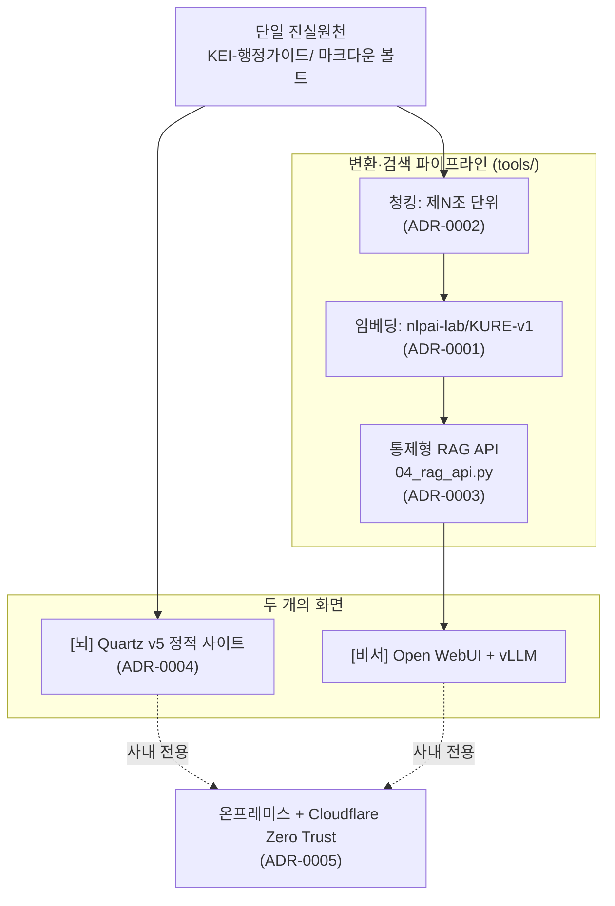

# ADR 인덱스 — 아키텍처 결정 기록

> KEI 행정 가이드 / 행정 비서 프로젝트의 주요 설계 결정을 한 곳에 모은 목록입니다.
> "왜 이렇게 만들었는가"를 나중에도 추적할 수 있도록, 결정이 내려진 맥락과 함께 기록합니다.

## ADR이란

**ADR(Architecture Decision Record)** 은 프로젝트에서 내린 **하나의 중요한 아키텍처 결정**을, 그 결정이 내려진 **맥락·근거·대안·결과와 함께 짧게 기록**한 문서입니다. "왜 KURE-v1을 임베딩 모델로 골랐지?", "왜 고정 길이 청킹이 아니라 제N조 단위로 자르지?" 같은 질문에 대한 답을, 코드 주석이나 누군가의 기억이 아니라 **버전 관리되는 문서**로 남깁니다.

ADR의 핵심 원칙:

- **하나의 ADR = 하나의 결정.** 여러 결정을 한 문서에 섞지 않습니다.
- **불변 기록.** 한번 채택된 ADR의 본문은 가급적 바꾸지 않습니다. 결정이 바뀌면 새 ADR을 추가하고 기존 ADR을 `폐기됨(Superseded)` 상태로 표시합니다.
- **결과까지 적는다.** 결정이 가져온 트레이드오프(좋아진 점·감수한 점)를 솔직하게 남깁니다.

## 이 프로젝트의 ADR 형식

각 ADR은 아래 항목을 갖습니다. 다만 **상태(Status)는 머리말 표(아래 ADR 목록)에 기재**하는 것을 기본으로 하며, 본문에 별도 "상태" 절을 두는 것은 선택입니다(예: 0002는 독립 절을 둠). 나머지 5개 절은 모든 ADR이 본문에 갖춥니다.

| 절 | 내용 |
|---|---|
| **상태(Status)** | `채택(Accepted)` / `제안(Proposed)` / `폐기됨(Superseded)` / `폐기(Deprecated)` — 머리말 표에 기재(별도 절은 선택) |
| **맥락(Context)** | 이 결정을 강제한 상황·제약(온프레미스, 한국어, GPU 한정 등) |
| **결정(Decision)** | 우리가 무엇을 하기로 했는가 (한두 문장으로 단정적으로) |
| **근거(Rationale)** | 그렇게 결정한 이유 |
| **대안(Alternatives)** | 검토했으나 채택하지 않은 선택지와 그 이유 |
| **결과(Consequences)** | 이 결정으로 생기는 좋은 점·감수할 점·후속 작업 |

> [!note]
> 현재 모든 ADR의 상태는 `채택(Accepted)`입니다. 프로젝트 초기 골격 단계에서 내린 핵심 결정들이며, 시작일은 2026-06-18입니다. 결정을 뒤집을 때는 본문을 수정하지 말고 **새 ADR(0006 이후)** 을 추가한 뒤 해당 ADR을 `폐기됨`으로 표시하세요.

## ADR 목록

| 번호 | 제목 | 상태 | 링크 |
|---|---|---|---|
| 0001 | 임베딩 모델로 KURE-v1 채택 | 채택 | [0001-embedding-kure-v1.md](0001-embedding-kure-v1.md) |
| 0002 | 제N조 단위 청킹(조문 단위 청크) | 채택 | [0002-article-level-chunking.md](0002-article-level-chunking.md) |
| 0003 | 통제형 RAG API를 직접 운영 | 채택 | [0003-controlled-rag-api.md](0003-controlled-rag-api.md) |
| 0004 | 그래프 사이트로 Quartz v5 채택 | 채택 | [0004-quartz-graph-site.md](0004-quartz-graph-site.md) |
| 0005 | 온프레미스 + Cloudflare Zero Trust | 채택 | [0005-on-prem-zero-trust.md](0005-on-prem-zero-trust.md) |

각 결정이 시스템의 어느 부분에 영향을 주는지 한눈에 보면 다음과 같습니다.

> [!tip]
> ADR을 처음 읽는다면 [0005-on-prem-zero-trust.md](0005-on-prem-zero-trust.md)(왜 온프레미스인가)부터 보고, 그다음 [0001](0001-embedding-kure-v1.md) → [0002](0002-article-level-chunking.md) → [0003](0003-controlled-rag-api.md) 순으로 검색·답변 품질을 떠받치는 결정들을 따라가면 흐름이 잘 잡힙니다.

## 새 ADR을 추가하려면

1. 다음 번호(`0006-...`)로 파일을 만들고 위 6개 절 형식을 따릅니다.
2. 위 **ADR 목록** 표에 한 줄 추가합니다.
3. 기존 결정을 대체하는 경우, 대체되는 ADR의 상태를 `폐기됨(Superseded by 0006)` 으로 바꾸고 본문 상단에서 새 ADR로 링크합니다(본문 내용 자체는 보존).
4. 작은 단위로 커밋합니다.

> [!todo]
> 확인 필요: ADR 폐기·대체 시 PR 리뷰를 누가 승인할지(승인자/리뷰 책임자)는 아직 정해지지 않았습니다. 협업 규약은 [../09-contributing.md](../09-contributing.md)를 참고하세요.

---

### 관련 문서

- 문서 인덱스: [../README.md](../README.md)
- 상위 설계 문서: [../02-architecture.md](../02-architecture.md) — 전체 아키텍처(두 화면 / 하나의 볼트)
- 다음(첫 ADR): [0001-embedding-kure-v1.md](0001-embedding-kure-v1.md)

최종 수정: 2026-06-18
